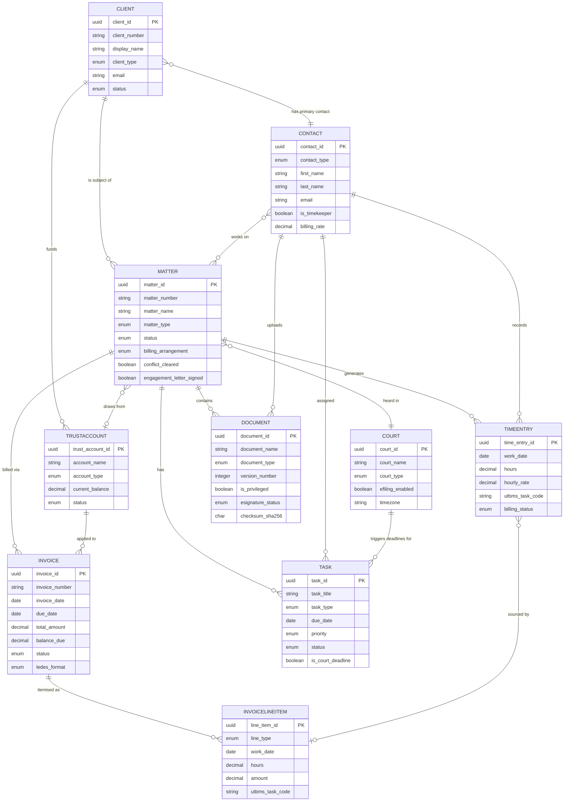

# Data Dictionary — Legal Case Management System

This document defines the canonical data model for the Legal Case Management System (LCMS).
It covers entity attributes, data types, constraints, and the business rules that govern
data quality and integrity across all platform modules: case intake, matter management,
document management, time and billing (LEDES/UTBMS), court calendar, client portal, and
IOLTA trust accounting.

---

## Core Entities

### Matter

The central aggregate in the LCMS. A matter represents a single legal engagement between
the firm and one or more clients. All time entries, invoices, documents, tasks, and court
deadlines are associated with a matter. The matter lifecycle drives revenue recognition,
trust accounting, and archival retention.

| Attribute | Type | Constraints | Description |
|---|---|---|---|
| matter_id | UUID | PK, NOT NULL | System-generated unique identifier |
| matter_number | VARCHAR(20) | UNIQUE, NOT NULL | Human-readable number e.g. 2024-LIT-00123 |
| matter_name | VARCHAR(255) | NOT NULL | Short descriptive title of the matter |
| matter_type | ENUM | NOT NULL | Litigation, Transactional, Advisory, Regulatory, Estate, IP, Criminal |
| status | ENUM | NOT NULL, DEFAULT 'Active' | Prospect, Open, Active, On Hold, Closed, Archived |
| client_id | UUID | FK → Client.client_id, NOT NULL | Primary billing client |
| responsible_attorney_id | UUID | FK → Contact.contact_id, NOT NULL | Lead attorney of record |
| billing_attorney_id | UUID | FK → Contact.contact_id, NOT NULL | Attorney responsible for invoicing |
| originating_attorney_id | UUID | FK → Contact.contact_id | Attorney who originated the business |
| practice_area | VARCHAR(100) | NOT NULL | e.g. Corporate, Family, IP, Criminal, Real Estate |
| jurisdiction | VARCHAR(100) | | Primary jurisdiction — state or country |
| court_id | UUID | FK → Court.court_id | Assigned court if litigation matter |
| docket_number | VARCHAR(100) | UNIQUE | Court-assigned docket or case number |
| date_opened | DATE | NOT NULL | Date matter was formally opened |
| date_closed | DATE | | Date matter was formally closed |
| conflict_cleared | BOOLEAN | NOT NULL, DEFAULT FALSE | Whether conflict-of-interest check passed |
| conflict_checked_by | UUID | FK → Contact.contact_id | Attorney who ran or approved conflict check |
| conflict_checked_at | TIMESTAMPTZ | | Timestamp of conflict check completion |
| engagement_letter_signed | BOOLEAN | NOT NULL, DEFAULT FALSE | Whether engagement letter is fully executed |
| billing_arrangement | ENUM | NOT NULL | Hourly, Flat Fee, Contingency, Retainer, Pro Bono, Blended |
| hourly_rate_override | DECIMAL(10,2) | CHECK > 0 | Matter-level rate override superseding contact default |
| retainer_amount | DECIMAL(12,2) | CHECK >= 0 | Initial retainer agreed in engagement letter |
| trust_account_id | UUID | FK → TrustAccount.trust_account_id | Linked IOLTA account |
| budget_amount | DECIMAL(12,2) | CHECK >= 0 | Agreed matter budget for utilisation tracking |
| description | TEXT | | Detailed matter scope and background notes |
| tags | VARCHAR(500) | | Comma-separated classification tags |
| created_at | TIMESTAMPTZ | NOT NULL, DEFAULT NOW() | Record creation timestamp (UTC) |
| updated_at | TIMESTAMPTZ | NOT NULL | Last modification timestamp (UTC) |
| deleted_at | TIMESTAMPTZ | | Soft-delete timestamp; NULL means active |
| created_by | UUID | FK → Contact.contact_id | User who created the record |

---

### Client

Represents a firm client — an individual person, corporation, trust, or other legal entity.
A client may have multiple matters over time. The client record is the root of the IOLTA
trust account relationship and the billing address hierarchy.

| Attribute | Type | Constraints | Description |
|---|---|---|---|
| client_id | UUID | PK, NOT NULL | System-generated unique identifier |
| client_number | VARCHAR(20) | UNIQUE, NOT NULL | Human-readable client ID e.g. CLI-00456 |
| display_name | VARCHAR(255) | NOT NULL | Name used in correspondence and on invoices |
| client_type | ENUM | NOT NULL | Individual, Corporation, Partnership, Trust, Government, Non-Profit |
| first_name | VARCHAR(100) | | Legal first name — individuals only |
| last_name | VARCHAR(100) | | Legal last name — individuals only |
| company_name | VARCHAR(255) | | Registered entity name — non-individuals |
| tax_id | VARCHAR(20) | | EIN or SSN for 1099 reporting — stored encrypted |
| primary_contact_id | UUID | FK → Contact.contact_id | Designated primary point of contact |
| billing_address_line1 | VARCHAR(255) | NOT NULL | Street address for invoicing |
| billing_address_line2 | VARCHAR(255) | | Suite, unit, or floor |
| billing_city | VARCHAR(100) | NOT NULL | City |
| billing_state | VARCHAR(50) | NOT NULL | State or province |
| billing_zip | VARCHAR(20) | NOT NULL | Postal code |
| billing_country | CHAR(2) | NOT NULL, DEFAULT 'US' | ISO 3166-1 alpha-2 country code |
| email | VARCHAR(255) | NOT NULL | Primary billing and correspondence email |
| phone | VARCHAR(30) | | Primary phone number |
| preferred_billing_format | ENUM | DEFAULT 'PDF' | PDF, LEDES1998B, LEDES2000, UTBMS, CSV |
| portal_access_enabled | BOOLEAN | NOT NULL, DEFAULT FALSE | Whether client has active portal login |
| portal_user_id | UUID | | Link to authentication system user record |
| referral_source | VARCHAR(255) | | How the client was acquired |
| status | ENUM | NOT NULL, DEFAULT 'Prospect' | Prospect, Active, Inactive, Blocked |
| date_engaged | DATE | | Date of first executed engagement letter |
| credit_limit | DECIMAL(12,2) | CHECK >= 0 | Maximum permitted outstanding AR balance |
| notes | TEXT | | Internal notes — not visible to client via portal |
| created_at | TIMESTAMPTZ | NOT NULL, DEFAULT NOW() | Record creation timestamp |
| updated_at | TIMESTAMPTZ | NOT NULL | Last modification timestamp |
| deleted_at | TIMESTAMPTZ | | Soft-delete timestamp |

---

### TimeEntry

Records billable and non-billable time spent by attorneys and staff on a matter. TimeEntry
is the authoritative source record for all fee line items on invoices. UTBMS task and
activity codes are required for LEDES-format billing.

| Attribute | Type | Constraints | Description |
|---|---|---|---|
| time_entry_id | UUID | PK, NOT NULL | System-generated unique identifier |
| matter_id | UUID | FK → Matter.matter_id, NOT NULL | Associated matter |
| timekeeper_id | UUID | FK → Contact.contact_id, NOT NULL | Attorney or staff who performed the work |
| work_date | DATE | NOT NULL | Calendar date the work was performed |
| hours | DECIMAL(6,2) | NOT NULL, CHECK >= 0 | Hours worked — supports tenths or quarter-hour |
| hourly_rate | DECIMAL(10,2) | NOT NULL, CHECK > 0 | Rate in effect at time of entry |
| billable_amount | DECIMAL(12,2) | COMPUTED: hours × hourly_rate | Gross billable value before write-down |
| write_down_amount | DECIMAL(12,2) | DEFAULT 0, CHECK >= 0 | Amount written off during pre-bill review |
| write_down_reason | VARCHAR(500) | | Required when write_down_amount > 0 |
| net_amount | DECIMAL(12,2) | COMPUTED: billable_amount − write_down_amount | Final billed amount |
| utbms_task_code | VARCHAR(10) | NOT NULL | UTBMS task code e.g. L110 for Case Assessment |
| utbms_activity_code | VARCHAR(10) | | UTBMS activity code e.g. A101 for Plan and Prepare |
| description | TEXT | NOT NULL, MIN LENGTH 10 | Narrative description of work performed |
| billing_status | ENUM | NOT NULL, DEFAULT 'Unbilled' | Unbilled, In Pre-Bill, Billed, Written-Off, No-Charge |
| invoice_id | UUID | FK → Invoice.invoice_id | Populated when included on a released invoice |
| is_billable | BOOLEAN | NOT NULL, DEFAULT TRUE | Whether entry is client-billable |
| entry_method | ENUM | DEFAULT 'Manual' | Manual, Timer, Imported, AI-Assisted |
| timer_start | TIMESTAMPTZ | | Start time if entered via built-in timer |
| timer_stop | TIMESTAMPTZ | | Stop time if entered via built-in timer |
| created_at | TIMESTAMPTZ | NOT NULL, DEFAULT NOW() | |
| updated_at | TIMESTAMPTZ | NOT NULL | |
| created_by | UUID | FK → Contact.contact_id | User account that created the entry |

---

### Invoice

Represents a single billing statement issued to a client. An invoice aggregates time and
expense entries for a matter within a billing period and produces a LEDES-compliant output.

| Attribute | Type | Constraints | Description |
|---|---|---|---|
| invoice_id | UUID | PK, NOT NULL | System-generated unique identifier |
| invoice_number | VARCHAR(30) | UNIQUE, NOT NULL | Sequential number e.g. INV-2024-00789 |
| matter_id | UUID | FK → Matter.matter_id, NOT NULL | Primary matter for this invoice |
| client_id | UUID | FK → Client.client_id, NOT NULL | Billing client |
| invoice_date | DATE | NOT NULL | Date the invoice was generated |
| due_date | DATE | NOT NULL | Payment due date — typically NET-30 from invoice_date |
| billing_period_start | DATE | NOT NULL | Start of time and expense period covered |
| billing_period_end | DATE | NOT NULL | End of time and expense period covered |
| subtotal_fees | DECIMAL(12,2) | NOT NULL, DEFAULT 0 | Sum of all fee line items |
| subtotal_expenses | DECIMAL(12,2) | NOT NULL, DEFAULT 0 | Sum of all expense line items |
| tax_amount | DECIMAL(12,2) | DEFAULT 0 | Applicable tax — jurisdiction-dependent |
| trust_applied | DECIMAL(12,2) | DEFAULT 0, CHECK >= 0 | Amount deducted from IOLTA trust account |
| total_amount | DECIMAL(12,2) | NOT NULL | subtotal_fees + subtotal_expenses + tax_amount − trust_applied |
| amount_paid | DECIMAL(12,2) | DEFAULT 0, CHECK >= 0 | Total payments received against this invoice |
| balance_due | DECIMAL(12,2) | COMPUTED: total_amount − amount_paid | Outstanding balance |
| status | ENUM | NOT NULL, DEFAULT 'Draft' | Draft, In Review, Approved, Sent, Partially Paid, Paid, Overdue, Written-Off, Voided |
| ledes_format | ENUM | DEFAULT 'LEDES1998B' | LEDES1998B, LEDES2000, eBillingHub |
| delivery_method | ENUM | DEFAULT 'Portal' | Portal, Email, Mail, EDI |
| attorney_approved_by | UUID | FK → Contact.contact_id | Attorney who signed off on pre-bill |
| attorney_approved_at | TIMESTAMPTZ | | Timestamp of attorney approval |
| partner_approved_by | UUID | FK → Contact.contact_id | Partner who approved final release |
| partner_approved_at | TIMESTAMPTZ | | Timestamp of partner approval |
| sent_at | TIMESTAMPTZ | | Timestamp when invoice was delivered to client |
| paid_at | TIMESTAMPTZ | | Timestamp when invoice reached fully paid status |
| notes | TEXT | | Internal billing notes — not visible to client |
| created_at | TIMESTAMPTZ | NOT NULL, DEFAULT NOW() | |
| updated_at | TIMESTAMPTZ | NOT NULL | |

---

### InvoiceLineItem

Individual line items on an invoice, each corresponding to a time entry or expense entry.
LEDES billing requires every fee line item to carry UTBMS task and activity codes.

| Attribute | Type | Constraints | Description |
|---|---|---|---|
| line_item_id | UUID | PK, NOT NULL | System-generated unique identifier |
| invoice_id | UUID | FK → Invoice.invoice_id, NOT NULL | Parent invoice |
| time_entry_id | UUID | FK → TimeEntry.time_entry_id | Source time entry — NULL for expense lines |
| expense_entry_id | UUID | FK → ExpenseEntry.expense_entry_id | Source expense entry — NULL for fee lines |
| line_type | ENUM | NOT NULL | Fee, Expense, Tax, Discount, Credit, Adjustment |
| description | TEXT | NOT NULL | Line description as rendered on the invoice |
| timekeeper_name | VARCHAR(255) | | Denormalised for invoice rendering — snapshot at generation |
| timekeeper_id_external | VARCHAR(100) | | LEDES timekeeper ID for electronic billing |
| work_date | DATE | NOT NULL | Date of service |
| hours | DECIMAL(6,2) | | Hours for fee lines; NULL for expense lines |
| rate | DECIMAL(10,2) | | Hourly rate for fee lines |
| quantity | DECIMAL(10,4) | DEFAULT 1 | Quantity for expense or flat-fee items |
| unit_cost | DECIMAL(10,2) | | Per-unit cost for expense items |
| amount | DECIMAL(12,2) | NOT NULL | Line item total |
| utbms_task_code | VARCHAR(10) | | Required for LEDES fee lines |
| utbms_activity_code | VARCHAR(10) | | Activity code per UTBMS taxonomy |
| utbms_expense_code | VARCHAR(10) | | Expense code e.g. E101 for Copying |
| sort_order | INTEGER | DEFAULT 0 | Display order on rendered invoice |
| created_at | TIMESTAMPTZ | NOT NULL, DEFAULT NOW() | |

---

### Document

Stores metadata for all files in the matter document management system. Binary content is
held in object storage; this table is the index and access-control layer.

| Attribute | Type | Constraints | Description |
|---|---|---|---|
| document_id | UUID | PK, NOT NULL | System-generated unique identifier |
| matter_id | UUID | FK → Matter.matter_id, NOT NULL | Associated matter |
| document_name | VARCHAR(500) | NOT NULL | Filename as stored in DMS |
| document_type | ENUM | NOT NULL | Pleading, Contract, Correspondence, Invoice, Evidence, Memo, Court Order, Template, Other |
| version_number | INTEGER | NOT NULL, DEFAULT 1, CHECK > 0 | Monotonically increasing version counter |
| is_latest_version | BOOLEAN | NOT NULL, DEFAULT TRUE | Flag marking the current active version |
| parent_document_id | UUID | FK → Document.document_id | Points to version 1 for all subsequent versions |
| storage_path | VARCHAR(1000) | NOT NULL | Object storage key or path |
| file_size_bytes | BIGINT | CHECK > 0 | File size in bytes |
| mime_type | VARCHAR(100) | | e.g. application/pdf, application/vnd.docx |
| checksum_sha256 | CHAR(64) | NOT NULL | SHA-256 hash for tamper detection |
| esignature_status | ENUM | DEFAULT 'NA' | NA, Pending, Sent, Signed, Declined, Expired, Withdrawn |
| esignature_envelope_id | VARCHAR(255) | | Provider-assigned envelope identifier |
| esignature_signed_at | TIMESTAMPTZ | | Timestamp of completed signature |
| is_privileged | BOOLEAN | NOT NULL, DEFAULT FALSE | Attorney-client privilege flag |
| is_confidential | BOOLEAN | NOT NULL, DEFAULT FALSE | Confidential work product designation |
| uploaded_by | UUID | FK → Contact.contact_id, NOT NULL | User who uploaded the file |
| created_at | TIMESTAMPTZ | NOT NULL, DEFAULT NOW() | Upload timestamp |
| updated_at | TIMESTAMPTZ | NOT NULL | |
| deleted_at | TIMESTAMPTZ | | Soft-delete timestamp |
| tags | VARCHAR(500) | | Space-separated searchable keyword tags |

---

### Task

Represents a discrete unit of work assigned to an attorney, paralegal, or support staff.
Tasks can model routine assignments, court filing obligations, or statute-of-limitations
deadlines, all within the same structure.

| Attribute | Type | Constraints | Description |
|---|---|---|---|
| task_id | UUID | PK, NOT NULL | System-generated unique identifier |
| matter_id | UUID | FK → Matter.matter_id, NOT NULL | Associated matter |
| task_title | VARCHAR(500) | NOT NULL | Short description of the task |
| task_type | ENUM | NOT NULL | Filing, Research, Drafting, Review, Court Appearance, Client Call, Administrative, Deadline |
| assigned_to | UUID | FK → Contact.contact_id, NOT NULL | Primary assignee |
| assigned_by | UUID | FK → Contact.contact_id, NOT NULL | Creator or delegating supervisor |
| due_date | DATE | NOT NULL | Task due date |
| due_time | TIME | | Specific time of day — required for court appearances |
| priority | ENUM | NOT NULL, DEFAULT 'Normal' | Low, Normal, High, Critical |
| status | ENUM | NOT NULL, DEFAULT 'Pending' | Pending, In Progress, Completed, Cancelled, Overdue |
| is_court_deadline | BOOLEAN | NOT NULL, DEFAULT FALSE | Flags task as a court deadline for escalation |
| deadline_rule_source | VARCHAR(255) | | Statute, rule, or order that generated this deadline |
| reminder_days_before | TEXT | | JSON array of reminder intervals e.g. [30,14,7,1] |
| completion_date | DATE | | Actual completion date — set when status = Completed |
| completion_note | TEXT | | Confirmation details e.g. filing reference number |
| notes | TEXT | | Task instructions or context |
| parent_task_id | UUID | FK → Task.task_id | For subtask hierarchies |
| document_id | UUID | FK → Document.document_id | Document produced or required by this task |
| created_at | TIMESTAMPTZ | NOT NULL, DEFAULT NOW() | |
| updated_at | TIMESTAMPTZ | NOT NULL | |

---

### Contact

Universal people and organisation directory. Used for attorneys, paralegals, support staff,
clients, opposing counsel, judges, expert witnesses, and other parties. Decouples identity
from role assignment.

| Attribute | Type | Constraints | Description |
|---|---|---|---|
| contact_id | UUID | PK, NOT NULL | System-generated unique identifier |
| contact_type | ENUM | NOT NULL | Attorney, Paralegal, Staff, Client, Opposing Counsel, Judge, Expert, Vendor, Court Personnel |
| first_name | VARCHAR(100) | NOT NULL | Legal first name |
| last_name | VARCHAR(100) | NOT NULL | Legal last name |
| display_name | VARCHAR(255) | | Overridable display name for UI — defaults to first + last |
| organization | VARCHAR(255) | | Firm, company, or court affiliation |
| bar_number | VARCHAR(50) | UNIQUE | State bar number — attorneys only |
| bar_state | CHAR(2) | | Primary admitting state — ISO 3166-2 subdivision code |
| bar_admission_date | DATE | | Date of bar admission |
| email | VARCHAR(255) | NOT NULL | Primary email address — used for notifications |
| phone_direct | VARCHAR(30) | | Direct office phone |
| phone_mobile | VARCHAR(30) | | Mobile number |
| address_line1 | VARCHAR(255) | | Street address |
| address_city | VARCHAR(100) | | City |
| address_state | VARCHAR(50) | | State or province |
| address_zip | VARCHAR(20) | | Postal code |
| billing_rate | DECIMAL(10,2) | CHECK > 0 | Default hourly billing rate — timekeepers only |
| cost_rate | DECIMAL(10,2) | CHECK > 0 | Internal cost rate for profitability analysis |
| is_timekeeper | BOOLEAN | NOT NULL, DEFAULT FALSE | Whether contact can record time entries |
| timekeeper_id_external | VARCHAR(100) | UNIQUE | External LEDES timekeeper ID |
| timekeeper_classification | ENUM | | Partner, Associate, Of Counsel, Paralegal, Law Clerk |
| is_active | BOOLEAN | NOT NULL, DEFAULT TRUE | Active status in the system |
| user_account_id | UUID | UNIQUE | Link to platform authentication user record |
| created_at | TIMESTAMPTZ | NOT NULL, DEFAULT NOW() | |
| updated_at | TIMESTAMPTZ | NOT NULL | |

---

### Court

Represents a court or tribunal where firm matters are filed or heard. Used for calendar
integration, e-filing API connections, and deadline rule computation.

| Attribute | Type | Constraints | Description |
|---|---|---|---|
| court_id | UUID | PK, NOT NULL | System-generated unique identifier |
| court_name | VARCHAR(255) | NOT NULL | Official name of the court |
| court_type | ENUM | NOT NULL | Federal District, Federal Circuit, State Trial, State Appellate, State Supreme, Administrative, Arbitration, Other |
| jurisdiction_state | CHAR(2) | | ISO 3166-2 state code for state courts |
| jurisdiction_federal_circuit | VARCHAR(20) | | Federal circuit identifier e.g. 9th Cir |
| division | VARCHAR(100) | | Division or department within the court |
| courthouse_address | VARCHAR(500) | | Physical mailing address |
| efiling_enabled | BOOLEAN | NOT NULL, DEFAULT FALSE | Whether e-filing integration is active |
| efiling_system | VARCHAR(100) | | Provider name e.g. PACER, Tyler Odyssey, CourtLink |
| efiling_court_code | VARCHAR(50) | | Provider-specific court code for API requests |
| clerk_email | VARCHAR(255) | | Clerk's office contact email |
| clerk_phone | VARCHAR(30) | | Clerk's office phone |
| local_rules_url | VARCHAR(500) | | URL to court's local rules document |
| timezone | VARCHAR(50) | NOT NULL, DEFAULT 'America/New_York' | Court local timezone for deadline calculation |
| created_at | TIMESTAMPTZ | NOT NULL, DEFAULT NOW() | |
| updated_at | TIMESTAMPTZ | NOT NULL | |

---

### TrustAccount

Represents an IOLTA (Interest on Lawyers' Trust Accounts) or client-specific escrow account
holding client funds. The current balance constraint is the most safety-critical rule in the
entire schema — it must never go negative.

| Attribute | Type | Constraints | Description |
|---|---|---|---|
| trust_account_id | UUID | PK, NOT NULL | System-generated unique identifier |
| account_name | VARCHAR(255) | NOT NULL | Trust account name e.g. ABC Law IOLTA — General |
| account_type | ENUM | NOT NULL | IOLTA, IOTA, Client-Specific Trust, Settlement Escrow |
| bank_name | VARCHAR(255) | NOT NULL | Financial institution name |
| bank_routing_number | CHAR(9) | NOT NULL | ABA routing number — stored encrypted |
| bank_account_number | VARCHAR(50) | NOT NULL | Bank account number — stored encrypted |
| client_id | UUID | FK → Client.client_id | For client-specific or matter-specific accounts |
| matter_id | UUID | FK → Matter.matter_id | For matter-specific trust accounts |
| current_balance | DECIMAL(14,4) | NOT NULL, DEFAULT 0, CHECK >= 0 | Current trust balance — MUST NEVER BE NEGATIVE |
| ledger_balance | DECIMAL(14,4) | NOT NULL, DEFAULT 0 | Sum of all posted ledger entries — used for reconciliation |
| last_reconciled_date | DATE | | Date of last three-way reconciliation |
| last_reconciled_by | UUID | FK → Contact.contact_id | User who performed last reconciliation |
| interest_rate | DECIMAL(6,4) | DEFAULT 0 | Annual interest rate for IOTA accounts |
| interest_recipient | VARCHAR(255) | DEFAULT 'State Bar Foundation' | Entity that receives earned interest |
| status | ENUM | NOT NULL, DEFAULT 'Active' | Active, Closed, Frozen, Under Review |
| created_at | TIMESTAMPTZ | NOT NULL, DEFAULT NOW() | |
| updated_at | TIMESTAMPTZ | NOT NULL | |

---

## Canonical Relationship Diagram

The following entity-relationship diagram shows the primary relationships between core
entities. Cardinalities use Mermaid `erDiagram` notation: `||` (exactly one), `o|` (zero
or one), `o{` (zero or many), `|{` (one or many).

---

## Data Quality Controls

### Mandatory Field Rules

All entities enforce NOT NULL constraints at the database level. The application layer
additionally validates the following business-mandatory fields before a record can be
saved or transitioned to an active state.

| Entity | Fields Required Before Active State | Enforcement |
|---|---|---|
| Matter | matter_name, client_id, responsible_attorney_id, billing_arrangement, conflict_cleared = TRUE, engagement_letter_signed = TRUE | Application + DB constraint |
| Client | display_name, client_type, email, billing_address_line1, billing_city, billing_state, billing_zip | Application + DB constraint |
| TimeEntry | matter_id, timekeeper_id, work_date, hours > 0, utbms_task_code, description length ≥ 10 | Application + DB constraint |
| Invoice | matter_id, client_id, invoice_date, due_date, billing_period_start, billing_period_end | Application + DB constraint |
| InvoiceLineItem | invoice_id, line_type, description, work_date, amount | Application + DB constraint |
| Document | matter_id, document_name, document_type, storage_path, checksum_sha256, uploaded_by | Application + DB constraint |
| Task | matter_id, task_title, task_type, assigned_to, assigned_by, due_date, priority | Application + DB constraint |
| Contact | contact_type, first_name, last_name, email | Application + DB constraint |
| TrustAccount | account_name, account_type, bank_name, bank_routing_number, bank_account_number, and one of client_id or matter_id | Application + DB constraint |

Billing-arrangement-specific rules:

- `Contingency` matters must have a signed contingency fee agreement document attached
  before the matter may be moved to `Active` status.
- `Flat Fee` matters must have `budget_amount` populated and approved by a partner.
- `Hourly` matters must have at least one Contact with `is_timekeeper = TRUE` assigned
  before any time entries can be created.

---

### Referential Integrity Rules

All foreign key relationships are enforced at the database level. Cascading behaviour is
defined per relationship to preserve data integrity across the matter lifecycle.

| Relationship | Constraint | On Delete | On Update |
|---|---|---|---|
| TimeEntry → Matter | RESTRICT — cannot delete matter with unbilled time entries | RESTRICT | CASCADE |
| Invoice → Matter | RESTRICT — cannot delete matter with open invoices | RESTRICT | CASCADE |
| Invoice → Client | RESTRICT — cannot delete client with outstanding invoices | RESTRICT | CASCADE |
| InvoiceLineItem → Invoice | CASCADE — line items are purged when invoice is voided | CASCADE | CASCADE |
| TimeEntry → Invoice | SET NULL — entry returns to Unbilled when invoice is voided | SET NULL | CASCADE |
| Document → Matter | SOFT DELETE — archived when matter is archived | Soft-delete | CASCADE |
| Task → Matter | SOFT DELETE — archived when matter is archived | Soft-delete | CASCADE |
| TrustAccount → Client | RESTRICT — cannot delete client with active trust account | RESTRICT | CASCADE |
| Contact → Matter (assignment) | RESTRICT — cannot deactivate contact with open matter assignments | RESTRICT | CASCADE |

All deletes in the system are **soft deletes** — a `deleted_at` timestamp is set and
records become invisible to normal queries. Physical removal from the database requires
a superuser command logged to the audit trail with a mandatory justification code. This
rule preserves the firm's document-retention obligations (typically 7 years post-matter-close).

---

### IOLTA Balance Rules

IOLTA trust accounting is governed by state bar rules derived from ABA Model Rule 1.15 and
state-specific IOLTA programme regulations. The following rules are enforced by the platform.

| Rule | Implementation Detail |
|---|---|
| No negative balance | `CHECK (current_balance >= 0)` DB constraint; application pre-validates every disbursement before executing the ledger write |
| Three-way reconciliation required | Ledger balance must equal bank statement balance must equal sum of client sub-ledger entries; any variance surfaces as a compliance alert |
| Disbursements require matter linkage | Every debit transaction on a trust account must reference a matter_id and client_id; orphan disbursements are blocked |
| Trust funds not commingled | Accounts with `account_type = IOLTA` are flagged; any attempt to route operational billing payments into a trust account is rejected at the application layer |
| Interest remittance automated | Monthly sweep job calculates accrued interest and generates a transfer record to the `interest_recipient` entity; the firm retains no interest on IOLTA funds |
| Client sub-ledger enforced | Each client holding funds in a pooled IOLTA account has a sub-ledger row whose balance contributes to `ledger_balance`; the sum of all active sub-ledgers must equal `current_balance` |
| Earned fees transferred promptly | When an invoice is marked Paid and trust funds were applied, the system generates an automated earned-fee transfer alert to move the amount from trust to the operating account |
| Minimum balance guard | Attempted disbursements leaving the trust balance below a configurable minimum trigger a secondary approval request before execution |

---

### Duplicate Detection

The following detection rules are applied on every INSERT and relevant UPDATE operation.
Detection runs synchronously for blocking rules and asynchronously for warning rules.

| Entity | Duplicate Signal | Detection Method | Action |
|---|---|---|---|
| Client | Same display_name AND same email | Exact email match + fuzzy name match (Levenshtein distance ≤ 2) | Warn user — require confirmation to proceed |
| Contact | Same email address | Exact match on normalised (lower-cased, trimmed) email | Block creation — surface existing record with merge option |
| Matter | Same client_id AND same docket_number | Exact match on both fields | Block creation — surface existing matter |
| TimeEntry | Same timekeeper_id + matter_id + work_date with overlapping billable window | Time-overlap check using hours and timer timestamps | Warn user — require confirmation |
| Document | Same matter_id AND same checksum_sha256 | Exact SHA-256 hash match | Block upload — display link to existing document |
| Invoice | Same matter_id AND overlapping billing_period_start / billing_period_end | Date range overlap query | Warn user — require partner override to proceed |
| TrustAccount | Same bank_account_number | Encrypted-value match | Block creation — requires superuser review |

---

### Audit Trail Requirements

Every data modification must generate an immutable audit record. The audit table is
append-only; no UPDATE or DELETE may be executed against it by any application role.

| Column | Type | Description |
|---|---|---|
| audit_id | UUID | Primary key — system-generated |
| table_name | VARCHAR(100) | Name of the modified table |
| record_id | UUID | Primary key of the modified record |
| operation | ENUM | INSERT, UPDATE, DELETE |
| changed_fields | JSONB | Key-value pairs of changed columns with `old` and `new` values |
| changed_by | UUID | Authenticated user who initiated the change |
| changed_at | TIMESTAMPTZ | System clock at time of change — always UTC |
| ip_address | INET | Client IP address of the originating request |
| session_id | VARCHAR(255) | Application session or JWT identifier |
| reason_code | VARCHAR(100) | Justification code for compliance-triggering changes |

The following field changes generate **heightened audit events** that are additionally
surfaced in the compliance dashboard and trigger email notification to the firm's
designated ethics partner:

| Table | Field or Transition | Trigger Reason |
|---|---|---|
| TrustAccount | Any change to current_balance | IOLTA compliance monitoring |
| Invoice | Status → Voided or Written-Off | Revenue reversal and write-off tracking |
| Invoice | trust_applied > 0 | Trust disbursement traceability |
| Matter | Status → Closed | Matter-close confirmation and retention timer start |
| Contact | billing_rate any change | Rate governance and billing accuracy |
| TimeEntry | write_down_amount > 0 | Write-down authorisation and profitability reporting |
| Document | is_privileged or is_confidential changed TRUE → FALSE | Privilege waiver risk |
| TrustAccount | Status → Frozen or Closed | Regulatory action traceability |

Audit records are retained for a minimum of **10 years** regardless of matter-close date,
in accordance with state bar records-retention requirements. Audit data is stored in a
separate append-only schema partition with read access restricted to compliance officers
and superusers.
