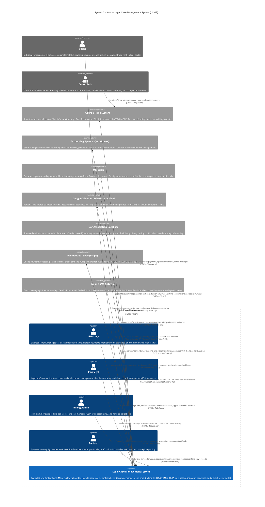
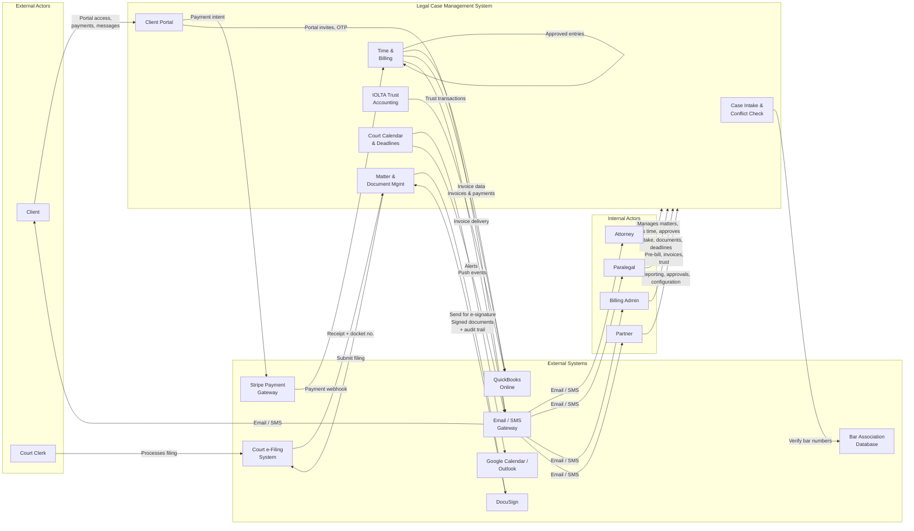

# System Context Diagram — Legal Case Management System

## Overview

This document presents the **C4 Level 1 (System Context)** diagram for the Legal Case Management System (LCMS). It shows the LCMS as a single software system in the center, surrounded by the human actors (users) who interact with it and the external systems it integrates with.

The C4 Context diagram answers: *Who uses the system? What external systems does it communicate with? What are the high-level responsibilities of the LCMS itself?*

---

## C4 Context Diagram

---

## Actors Reference Table

| Actor | Type | Role in LCMS |
|-------|------|--------------|
| **Attorney** | Internal User | Primary practitioner. Manages the full matter lifecycle from intake through closure. Logs billable time, drafts documents using templates, monitors and acknowledges deadline alerts, approves or overrides conflict check results, and communicates with clients via the portal. |
| **Paralegal** | Internal User | Supports attorneys with administrative and substantive legal work. Performs case intake data entry, uploads and organizes documents, tracks court deadlines, records expenses, and coordinates client portal access. |
| **Billing Admin** | Internal User | Owns the financial workflow. Reviews and approves pre-bill entries, generates invoices (PDF and LEDES 1998B), manages IOLTA trust ledgers (receipts and disbursements), processes client payments, runs A/R aging reports, and exports data to QuickBooks. |
| **Partner** | Internal User | Firm leadership. Approves matters with conflicts of interest, approves high-value invoices, reviews profitability and utilization reports, sets KPI targets for timekeepers, and manages firm-level configuration (roles, templates, billing rules). |
| **Client** | External User | Recipient of legal services. Accesses a firm-branded client portal to view matter status, download invoices, make online payments, upload requested documents, and exchange secure messages with the legal team. |
| **Court Clerk** | External User | Court administrative officer. Receives electronically filed documents through the court e-filing system and returns stamped copies, docket numbers, and filing confirmations. Does not interact with LCMS directly. |

---

## External Systems Reference Table

| System | Type | Provider / Standard | Integration Summary |
|--------|------|---------------------|---------------------|
| **Court e-Filing System** | External System | Tyler Technologies (File & ServeXpress), PACER / CM-ECF, state-specific e-filing portals | Receives finalized pleadings and motions submitted from LCMS. Returns filing receipts, docket numbers, and court-stamped copies that are stored back on the matter record. |
| **Accounting System (QuickBooks)** | External System | Intuit QuickBooks Online | Receives invoices, client payments, trust receipts, and trust disbursements via nightly sync. Maintains the firm's general ledger in alignment with LCMS billing records. |
| **DocuSign** | External System | DocuSign Inc. | Receives documents sent from LCMS for electronic signature. Returns fully executed documents with a cryptographic audit trail. Signing status is reflected in real time on the LCMS matter record. |
| **Google Calendar / Microsoft Outlook** | External System | Google Workspace API / Microsoft Graph API | Receives court deadlines, hearing dates, and task due dates pushed from LCMS. Updates and deletions are propagated in near real time. Attorneys opt in per calendar type. |
| **Bar Association Database** | External System | State Bar Associations (e.g., ABA, state-level APIs), Martindale-Hubbell | Queried to verify attorney bar numbers and confirm good standing during conflict checks, lateral hire assessments, and new attorney onboarding. Also used to validate adverse counsel bar numbers entered during intake. |
| **Payment Gateway (Stripe)** | External System | Stripe Inc. | Processes client payments made via the client portal (credit card: Visa, Mastercard, Amex; ACH bank transfer). Sends payment confirmation webhooks that LCMS uses to update invoice status and post payments to the client ledger. |
| **Email / SMS Gateway** | External System | SendGrid (email), Twilio (SMS) | Delivers all outbound system communications: court deadline alerts, invoice delivery, client portal invitations, MFA OTP codes, billing reminders, and system error notifications. |

---

## Key Integration Notes

### Court e-Filing System
- LCMS supports filing adapters for multiple e-filing providers. The specific adapter is configured per jurisdiction and court.
- Documents must pass a pre-flight validation (file format, size, PDF/A compliance) within LCMS before transmission.
- Filing receipts and court-stamped documents are automatically stored as new document versions on the matter.
- Failed filings generate an immediate alert to the responsible attorney and paralegal with the court-returned error message.
- LCMS maintains a filing log per matter showing submission timestamp, accepted timestamp, docket number, and filing status.

### Accounting System (QuickBooks)
- Integration uses QuickBooks Online REST API with OAuth 2.0 for secure firm-level authorization.
- Mapping table: LCMS Invoice → QBO Invoice; LCMS Payment → QBO Payment; LCMS Trust Receipt → QBO Journal Entry (IOLTA liability); LCMS Trust Disbursement → QBO Journal Entry.
- Nightly sync at 02:00 local time; on-demand sync available for urgent reconciliation.
- Records failing sync (e.g., duplicate QBO invoice number, unmapped account code) are flagged in LCMS with error detail; Billing Admin resolves and retriggers.
- QBO sync status field on each LCMS financial record: `Pending | Synced | Error | Excluded`.

### DocuSign
- LCMS creates a DocuSign envelope via REST API with the document and signer configuration (name, email, signing order, field placements).
- Signing status webhooks (DocuSign Connect) update the LCMS document record in real time: `Sent → Viewed → Signed → Completed | Declined | Expired`.
- Completed envelope PDF (with embedded DocuSign certificate of completion) is automatically retrieved and stored as a new document version tagged "Executed."
- Attorney is notified when a signer declines or the envelope expires; re-sending requires manual initiation.
- DocuSign templates can be linked to LCMS document templates to streamline field placement for recurring document types.

### Google Calendar / Microsoft Outlook
- Each attorney independently connects their calendar via OAuth 2.0 from their LCMS user settings.
- LCMS creates calendar events with: title = `[Matter No.] — [Deadline Type]`; description = matter name, court, notes; location = court address (if applicable).
- When a deadline is updated (date, time, notes) or deleted, LCMS updates or removes the corresponding calendar event.
- If OAuth token expires (default Google/Microsoft refresh token lifetime), LCMS flags the integration as disconnected and prompts the user to reconnect.
- Firm-wide calendar sync (pushing all attorneys' deadlines to a shared firm calendar) is available as an optional configuration requiring Google Workspace / Microsoft 365 admin credentials.

### Bar Association Database
- Queries are executed during: (1) Case Intake — adverse counsel bar number verification; (2) Conflict Check — adverse counsel identity validation; (3) Attorney Onboarding — firm attorney bar number and standing confirmation.
- Integration uses state bar REST APIs where available; batch file query (CSV) as a fallback for states without REST APIs.
- Results are cached for 24 hours to reduce API call volume; cache can be force-refreshed by Firm Administrator.
- Failed lookups (invalid bar number or API unavailable) are flagged on the matter record; the check is marked "Manual Verification Required."
- Attorney standing data (active, suspended, disbarred) is stored in the system but not used to block actions automatically — it surfaces as a warning requiring human review.

### Payment Gateway (Stripe)
- Stripe integration is configured per firm with the firm's own Stripe account (no co-mingling of funds through a platform account).
- Client portal payment page is rendered using Stripe Elements (PCI DSS Level 1 compliant); LCMS does not store raw card data.
- Supported payment methods: Visa, Mastercard, American Express, Discover, ACH (US bank accounts); additional methods configurable by region.
- Stripe webhooks (`payment_intent.succeeded`, `payment_intent.payment_failed`, `charge.refunded`) trigger automatic invoice updates in LCMS.
- Refunds initiated in LCMS generate a Stripe refund via API and create a corresponding credit memo on the matter.
- All Stripe transactions are linked to their LCMS invoice record and included in the QuickBooks nightly sync.

### Email / SMS Gateway
- Email is delivered via SendGrid using a firm-configured sending domain (DKIM/SPF/DMARC authenticated) for deliverability and brand consistency.
- All outbound email templates are managed within LCMS and support the firm's logo, colors, and contact footer.
- SMS is delivered via Twilio; recipients must opt in and provide a verified mobile number. Opt-out (STOP) responses from Twilio are processed and stored as a user preference.
- Delivery receipts and bounce events from SendGrid and Twilio are processed via webhooks and stored in the LCMS notification log.
- SendGrid is used for: deadline alerts, invoice delivery, billing reminders, client portal invitations, MFA OTP, and system error notifications.
- Twilio is used for: deadline SMS alerts (opt-in), MFA OTP via SMS (opt-in), and urgent overdue deadline escalations.

---

## Data Flow Summary

---

## Architectural Constraints and Assumptions

| Constraint | Detail |
|-----------|--------|
| **Multi-tenancy** | LCMS is a multi-tenant SaaS; each law firm is an isolated tenant with separate data storage, encryption keys, and audit logs. Cross-tenant data access is architecturally prevented. |
| **Data residency** | Firm data is stored in the region selected during onboarding (US, EU, or APAC). External API calls to third-party systems may cross regions; firms are notified of this in the DPA. |
| **Encryption** | Data in transit: TLS 1.3 minimum. Data at rest: AES-256. DocuSign and Stripe enforce their own encryption standards. |
| **Authentication** | LCMS uses OAuth 2.0 / OpenID Connect for internal user authentication with optional SAML 2.0 SSO integration (Okta, Azure AD, Google Workspace). |
| **API rate limits** | External API calls are subject to third-party rate limits. LCMS implements exponential back-off and queuing to handle rate limit responses gracefully. |
| **Offline resilience** | If an external system is unavailable, LCMS queues the outbound request and retries with exponential back-off. Dependent features (e.g., e-filing submission) display a warning but do not block unrelated work. |
| **Attorney-Client Privilege** | Communications and documents tagged as privileged are excluded from all external system exports and are never transmitted to third parties except DocuSign (for attorney-controlled signing workflows). |
