# Use Case Diagram — Legal Case Management System

## Overview

This document presents the complete use case model for the Legal Case Management System (LCMS). The system serves a mid-to-large law firm operating across multiple practice areas including litigation, corporate, real estate, and family law. All actors, use cases, subsystems, and inter-system relationships are captured below.

---

## Actor Definitions

### Primary Actors (Human)

| Actor | Role Description |
|---|---|
| **Attorney** | Licensed legal professional who opens matters, records time, drafts documents, files with courts, and manages client relationships. May be a partner, associate, or of-counsel. |
| **Paralegal** | Non-attorney legal professional who assists attorneys with document preparation, scheduling, deadline tracking, and client communication under attorney supervision. |
| **Client** | Individual or entity that retains the firm. Interacts with the system through a self-service Client Portal to view invoices, upload documents, and track matter status. |
| **Billing Specialist** | Staff member responsible for reviewing time entries, generating invoices, processing payments, reconciling trust accounts, and producing financial reports. |
| **Court Clerk** | External actor representing the court's administrative office. Receives e-filed documents, issues case numbers, and posts docket events. |
| **IT Admin** | Internal technical staff responsible for user provisioning, role management, system configuration, audit log review, and integration health monitoring. |
| **Managing Partner** | Senior attorney with administrative authority. Approves large trust disbursements, reviews profitability dashboards, and authorizes matter closures with outstanding balances. |

### External System Actors

| System | Purpose |
|---|---|
| **PACER / CM-ECF** | Federal court electronic case filing and docket retrieval system. |
| **DocuSign** | Electronic signature platform for engagement letters and settlement agreements. |
| **Accounting System** | General ledger and accounts receivable system (e.g., QuickBooks, Aderant). |
| **Bar Association Database** | State bar licensing database for attorney credential verification. |

---

## Use Case Diagram — Full System

```mermaid
flowchart TD
    %% Actors
    ATT([Attorney])
    PRL([Paralegal])
    CLT([Client])
    BLS([Billing Specialist])
    CRT([Court Clerk])
    ITA([IT Admin])
    MGP([Managing Partner])
    PACER([PACER / CM-ECF])
    DOCU([DocuSign])
    ACCT([Accounting System])
    BARD([Bar Association DB])

    %% ─────────────────────────────────────────────
    %% SUBSYSTEM: Case Management
    %% ─────────────────────────────────────────────
    subgraph CM["Case Management"]
        UC01[Initiate Case Intake]
        UC02[Run Conflict Check]
        UC03[Open Matter]
        UC04[Assign Legal Team]
        UC05[Update Matter Status]
        UC06[Close Matter]
        UC07[Reopen Matter]
        UC08[Generate Matter Report]
    end

    %% ─────────────────────────────────────────────
    %% SUBSYSTEM: Client Management
    %% ─────────────────────────────────────────────
    subgraph CLMGMT["Client Management"]
        UC09[Onboard New Client]
        UC10[Update Client Profile]
        UC11[Sign Engagement Letter]
        UC12[Enable Client Portal Access]
        UC13[View Matter Status via Portal]
        UC14[Upload Client Document via Portal]
    end

    %% ─────────────────────────────────────────────
    %% SUBSYSTEM: Document Management
    %% ─────────────────────────────────────────────
    subgraph DM["Document Management"]
        UC15[Upload Document]
        UC16[Version Document]
        UC17[Classify Document]
        UC18[Apply Bates Numbering]
        UC19[Mark Document Privileged]
        UC20[Create Privilege Log Entry]
        UC21[Share Document via Portal]
        UC22[Request E-Signature]
        UC23[Track Signature Status]
    end

    %% ─────────────────────────────────────────────
    %% SUBSYSTEM: Time and Billing
    %% ─────────────────────────────────────────────
    subgraph TB["Time and Billing"]
        UC24[Create Time Entry]
        UC25[Edit Time Entry]
        UC26[Approve Time Entry]
        UC27[Generate Invoice]
        UC28[Review and Adjust Invoice]
        UC29[Send Invoice to Client]
        UC30[Record Payment]
        UC31[Apply Trust Funds to Invoice]
        UC32[Export LEDES File]
        UC33[Write Off Balance]
    end

    %% ─────────────────────────────────────────────
    %% SUBSYSTEM: Trust Accounting
    %% ─────────────────────────────────────────────
    subgraph TA["Trust Accounting (IOLTA)"]
        UC34[Deposit Retainer to Trust]
        UC35[Disburse from Trust]
        UC36[Reconcile Trust Account]
        UC37[Generate Trust Statement]
        UC38[Approve Large Disbursement]
    end

    %% ─────────────────────────────────────────────
    %% SUBSYSTEM: Court Calendar and Deadlines
    %% ─────────────────────────────────────────────
    subgraph CC["Court Calendar and Deadlines"]
        UC39[Create Court Deadline]
        UC40[Import Docket from PACER]
        UC41[Set Deadline Reminders]
        UC42[Escalate Deadline]
        UC43[Acknowledge Deadline]
        UC44[Mark Deadline Completed]
        UC45[Submit E-Filing to Court]
        UC46[Receive Filing Confirmation]
    end

    %% ─────────────────────────────────────────────
    %% SUBSYSTEM: Compliance and Administration
    %% ─────────────────────────────────────────────
    subgraph COMP["Compliance and Administration"]
        UC47[Run Conflict Check Against Bar DB]
        UC48[Verify Attorney Bar Status]
        UC49[Audit Log Review]
        UC50[Manage User Roles and Permissions]
        UC51[Configure Billing Rate Tables]
        UC52[Generate Compliance Report]
    end

    %% ─────────────────────────────────────────────
    %% Actor → Use Case Associations
    %% ─────────────────────────────────────────────

    ATT --> UC01
    ATT --> UC03
    ATT --> UC04
    ATT --> UC05
    ATT --> UC06
    ATT --> UC15
    ATT --> UC19
    ATT --> UC20
    ATT --> UC22
    ATT --> UC24
    ATT --> UC25
    ATT --> UC39
    ATT --> UC43
    ATT --> UC45

    PRL --> UC01
    PRL --> UC10
    PRL --> UC15
    PRL --> UC16
    PRL --> UC17
    PRL --> UC18
    PRL --> UC24
    PRL --> UC39
    PRL --> UC41
    PRL --> UC44

    CLT --> UC13
    CLT --> UC14
    CLT --> UC11

    BLS --> UC26
    BLS --> UC27
    BLS --> UC28
    BLS --> UC29
    BLS --> UC30
    BLS --> UC31
    BLS --> UC32
    BLS --> UC33
    BLS --> UC36
    BLS --> UC37

    MGP --> UC38
    MGP --> UC06
    MGP --> UC08
    MGP --> UC52

    ITA --> UC49
    ITA --> UC50
    ITA --> UC51
    ITA --> UC12
    ITA --> UC48

    CRT --> UC46

    PACER --> UC40
    PACER --> UC46
    DOCU --> UC23
    ACCT --> UC30
    BARD --> UC47
```

---

## Include and Extend Relationships

The following relationships define how use cases compose and specialize each other within the LCMS.

### Include Relationships (Mandatory Invocation)

| Base Use Case | Included Use Case | Rationale |
|---|---|---|
| Open Matter (UC03) | Run Conflict Check (UC02) | A matter cannot be opened without a completed conflict check. The conflict check is always executed. |
| Run Conflict Check (UC02) | Run Conflict Check Against Bar DB (UC47) | The internal conflict check always cross-references the external Bar Association Database for adverse party relationships. |
| Create Time Entry (UC24) | Validate UTBMS Code (implicit) | Every billable time entry includes UTBMS code validation as a mandatory sub-step. |
| Generate Invoice (UC27) | Export LEDES File (UC32) | Invoices sent to insurance carriers and large corporate clients automatically trigger LEDES 1998B export. |
| Disburse from Trust (UC35) | Approve Large Disbursement (UC38) | All trust disbursements above $10,000 require managing partner approval, invoked automatically. |
| Submit E-Filing to Court (UC45) | Import Docket from PACER (UC40) | Post-filing, the system automatically retrieves the filed docket entry and confirmation from PACER. |

### Extend Relationships (Conditional Invocation)

| Base Use Case | Extending Use Case | Condition |
|---|---|---|
| Upload Document (UC15) | Apply Bates Numbering (UC18) | Extends when the document is classified as litigation production material. |
| Upload Document (UC15) | Mark Document Privileged (UC19) | Extends when the uploader selects attorney-client privilege or work product during upload. |
| Create Court Deadline (UC39) | Escalate Deadline (UC42) | Extends when the deadline due date falls within 7 calendar days of the current date. |
| Close Matter (UC06) | Write Off Balance (UC33) | Extends when the matter has a residual unbilled or unpaid balance that the attorney chooses to waive. |
| Generate Invoice (UC27) | Apply Trust Funds to Invoice (UC31) | Extends when the client's trust account has a positive balance at invoice generation time. |
| Onboard New Client (UC09) | Sign Engagement Letter (UC11) | Extends when the firm policy requires signed engagement letter before any matter can be created. |

---

## Subsystem Narratives

### Case Management Subsystem

The Case Management subsystem is the operational core of the LCMS. An **Attorney** or **Paralegal** initiates case intake by entering prospective client information, adverse parties, and the nature of the legal matter. The system immediately triggers an automated conflict check that searches existing clients, matters, adverse parties, and opposing counsel across the firm's entire matter database and the Bar Association Database. The conflict check result — clear, potential conflict, or actual conflict — is stored and reviewed by the responsible attorney before the matter is formally opened.

Once a matter is opened, the attorney assigns team members (associates, paralegals, co-counsel), defines the practice area, billing arrangement (hourly, flat-fee, contingency), and sets budget thresholds. Matter status transitions follow a defined lifecycle: `Intake → Active → Suspended → Closed`. Status changes trigger notifications to the assigned team and update the client portal in real time.

Matter closure is gated: the system enforces that all outstanding invoices are paid or written off, all court deadlines are resolved, and all open tasks are completed before the status transitions to `Closed`. The **Managing Partner** receives a closure approval request for matters exceeding a configurable revenue threshold.

### Client Management Subsystem

The Client Management subsystem governs the entire client relationship lifecycle from prospective engagement through active representation and post-matter archival. Client onboarding captures entity classification (individual, corporation, partnership, trust), tax identification, address, and conflict status. The system enforces uniqueness on tax ID and entity name to prevent duplicate client records.

The **Client Portal** is a secure, role-restricted interface that allows clients to view current matter status, download approved documents, upload requested materials, and view and pay invoices. Portal access is provisioned by IT Admin after the engagement letter is signed. Clients interact with the portal asynchronously; all client uploads are routed to the responsible attorney for review before they enter the matter's document repository.

### Document Management Subsystem

Documents in the LCMS are version-controlled and classified by type (pleading, correspondence, discovery, contract, evidence, internal memo, court order). Every document upload triggers an automated metadata extraction pass that captures file size, MIME type, author, and creation timestamp.

Privilege classification is a critical control. Documents marked as attorney-client privileged or work product are excluded from client portal sharing, discovery export sets, and any external system synchronization. A **Privilege Log** is automatically pre-populated when a document is marked privileged, capturing the document ID, privilege type, withheld flag, and basis statement. Bates numbering is applied sequentially within a matter's production set, with the system enforcing gap-free sequence integrity.

E-signature workflows are orchestrated through DocuSign. The attorney or paralegal initiates a signature request, the system sends the document to DocuSign with defined signatories, and the system polls DocuSign for status updates. Completion webhooks update the document's `signature_status` field and trigger a notification to the matter team.

### Time and Billing Subsystem

Time entries are the financial engine of the firm. Every billable entry must carry a UTBMS (Uniform Task-Based Management System) activity code, the responsible attorney ID, the matter ID, hours worked, and a narrative description. The billing rate applied is determined by a hierarchy: matter-level override rate → attorney-level rate → practice area rate → firm default rate.

The billing cycle runs on a configurable schedule (typically monthly or bi-weekly). The **Billing Specialist** reviews unbilled time entries, applies billing adjustments, and generates draft invoices. Draft invoices are reviewed by the responsible attorney before finalization. Final invoices are delivered to the client via secure portal and email, with LEDES export generated for e-billing clients.

Payment collection tracks invoice aging (current, 30, 60, 90+ days). Automatic reminders are sent at configurable intervals. Trust funds may be applied to open invoices with the client's prior authorization. Write-offs require attorney authorization and are recorded with a reason code for financial reporting.

### Court Calendar and Deadlines Subsystem

Court deadlines are the highest-risk item in legal practice. The system supports manual deadline creation, calculation-based deadline generation (e.g., response due 30 days after service), and automated docket import from PACER for federal matters. Each deadline carries the statute or rule reference, reminder intervals, escalation policy, and the assigned responsible attorney.

The escalation engine runs nightly. Deadlines within 7 days that have not been acknowledged trigger escalation events: the responsible attorney and supervising partner receive push notifications, email alerts, and the deadline appears in the system's dashboard as a critical priority item. Deadlines within 24 hours trigger an additional SMS alert. All deadline acknowledgments are timestamped and attributed to the acknowledging attorney.

E-filing to federal courts is executed through CM-ECF integration. The paralegal or attorney selects the document, selects the filing event type, and submits. The system transmits the filing, receives the NEF (Notice of Electronic Filing), parses the filing confirmation number, and stores it against the court deadline record.

### Compliance and Administration Subsystem

The compliance subsystem ensures that the firm operates within professional responsibility rules. Attorney bar status is verified against the state bar database during onboarding and on a quarterly automated refresh schedule. Any status change (suspension, disbarment, inactive status) triggers an alert to the Managing Partner and IT Admin.

All system actions that create, modify, or delete matter, client, financial, or document records are captured in an immutable audit log. IT Admin can query audit logs by user, action type, date range, and resource ID. Audit log entries are retained for seven years in compliance with state bar record-keeping rules.

---

## Summary Statistics

| Subsystem | Use Case Count | Primary Actor |
|---|---|---|
| Case Management | 8 | Attorney |
| Client Management | 6 | Attorney, Client |
| Document Management | 9 | Attorney, Paralegal |
| Time and Billing | 10 | Attorney, Billing Specialist |
| Trust Accounting | 5 | Billing Specialist, Managing Partner |
| Court Calendar and Deadlines | 8 | Attorney, Paralegal |
| Compliance and Administration | 6 | IT Admin, Managing Partner |
| **Total** | **52** | — |
