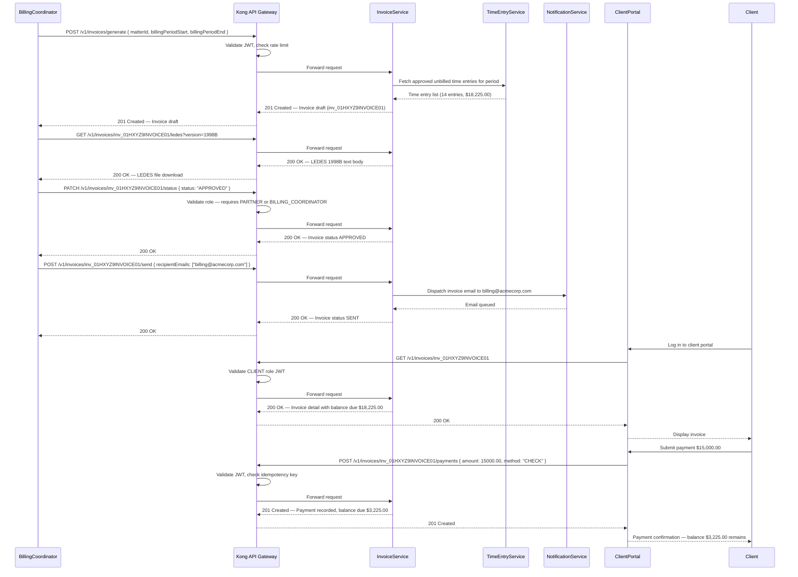

# API Design Specification — Legal Case Management System

| Property | Value |
|---|---|
| Document Title | API Design Specification — Legal Case Management System |
| System | Legal Case Management System |
| Version | 1.0.0 |
| Status | Approved |
| Owner | Architecture Team |
| Last Updated | 2025-01-15 |
| Base URL | https://api.lcms.firm.com/v1 |

---

## Overview

The LCMS API follows a RESTful architectural style. All endpoints are versioned under a URI path prefix (`/v1/`) to allow non-breaking evolution of the interface. Request and response bodies are encoded as `application/json` unless explicitly noted (e.g., multipart form uploads or LEDES plain-text exports).

**Authentication** is handled by Keycloak via OAuth2/OIDC. Every request must carry a JWT Bearer token in the `Authorization` header. Kong API Gateway sits in front of all services and is responsible for JWT signature validation, claims extraction, rate-limit enforcement, and request routing before traffic reaches any internal microservice.

**Idempotency** — All `POST` and `PATCH` operations that create or mutate persistent state must include an `X-Idempotency-Key` header (UUID v4). The server stores the key and its associated response for 24 hours. Replaying the same key within that window returns the cached response with HTTP 409 only if the previously stored result was a successful write; otherwise the original error is returned.

**Pagination** — Large collections use cursor-based pagination. Clients pass `page[cursor]` and `page[size]` (max 100). The response envelope always includes `pagination.cursor` (opaque base64 string), `pagination.hasMore`, and `pagination.total`.

**Partial Updates** — All `PATCH` endpoints follow JSON Merge Patch (RFC 7396). Only the fields supplied in the request body are modified; omitted fields retain their current values. Clients must include an `If-Match` header containing the current resource `ETag` to prevent lost-update conflicts.

---

## API Design Principles

### Versioning

URI path versioning is used exclusively. The current production version is `/v1/`. When a breaking change is introduced, a new prefix `/v2/` is deployed in parallel. Older versions are supported for a minimum of 12 months after a new major version is declared stable.

### Pagination

Cursor-based pagination is used for all collections that may exceed 100 records. The cursor is an opaque, base64-encoded pointer to the last record seen by the server. Clients must not attempt to decode or construct cursors manually.

**Response envelope:**
```json
{
  "data": [],
  "pagination": {
    "cursor": "eyJpZCI6IjU1MGU4NDAwLWUyOWItNDFkNC1hNzE2LTQ0NjY1NTQ0MDAwMCJ9",
    "hasMore": true,
    "total": 342
  }
}
```

### Error Format

All errors return a consistent envelope regardless of the HTTP status code:

```json
{
  "error": {
    "code": "MATTER_NOT_FOUND",
    "message": "Matter with ID 550e8400-e29b-41d4-a716-446655440000 does not exist.",
    "details": [],
    "requestId": "req_01HXYZ9ABCDE",
    "timestamp": "2025-01-15T14:23:10Z"
  }
}
```

`details` is an array of field-level validation objects: `{ "field": "hours", "issue": "Must be greater than 0" }`.

### Idempotency

The `X-Idempotency-Key` header must be a client-generated UUID v4. The server uses it to deduplicate retried requests. The header is required on:

- `POST /v1/matters`
- `POST /v1/matters/{matterId}/time-entries`
- `POST /v1/invoices/generate`
- `POST /v1/invoices/{invoiceId}/payments`
- `POST /v1/trust-accounts/{accountId}/transactions`

### Partial Updates

`PATCH` uses JSON Merge Patch (RFC 7396). To remove a field, pass `null` as its value. Nested objects are merged shallowly — to update a single nested key you must pass the full nested object or use a separate sub-resource endpoint.

### Field Selection

Any `GET` endpoint accepts a `?fields=` query parameter containing a comma-separated list of top-level field names. Only the listed fields are returned in each record, reducing payload size for high-frequency polling clients.

Example: `GET /v1/matters?fields=id,matterNumber,status,title`

### Filtering

Structured filters follow the format `filter[fieldName]=value`. Range filters use suffixes: `filter[workDate][gte]`, `filter[workDate][lte]`. Multiple values for the same field are passed as repeated query parameters.

Example: `GET /v1/matters?filter[status]=ACTIVE&filter[practiceArea]=LITIGATION`

### Sorting

The `sort` query parameter accepts a comma-separated list of field names. Prefix a field name with `-` for descending order.

Example: `GET /v1/matters?sort=-createdAt,title`

---

## Authentication and Authorization

### JWT/OAuth2 via Keycloak

All API clients authenticate against the firm's Keycloak realm (`lcms-firm`) using the Authorization Code or Client Credentials flow. The resulting JWT is passed in every request:

```
Authorization: Bearer <JWT>
```

**Relevant JWT claims:**

| Claim | Type | Description |
|---|---|---|
| `sub` | string (UUID) | Authenticated user's internal user ID |
| `firm_id` | string | Firm identifier; used for data isolation in multi-tenant deployments |
| `roles` | string[] | Array of role strings (e.g., `["ATTORNEY", "PARTNER"]`) |
| `exp` | number | Unix timestamp of token expiry |
| `email` | string | User's primary email address |

Kong validates the JWT signature against Keycloak's JWKS endpoint and rejects requests with expired or malformed tokens before they reach any downstream service.

### Role-Based Access Control

| Role | Permissions |
|---|---|
| `ATTORNEY` | Full CRUD on own assigned matters; read access to all matters in the firm; approve and reject time entries on own matters; review and comment on draft invoices |
| `PARALEGAL` | Create and edit matters (cannot close); create, edit, and submit time entries; upload and version documents; no billing approval rights |
| `BILLING_COORDINATOR` | Full CRUD on invoices and billing line items; generate LEDES exports; record payments; create and reconcile trust transactions; cannot close matters |
| `PARTNER` | All attorney permissions plus: approve invoices, approve trust disbursements, access firm-wide analytics endpoints, view all client matters |
| `CLIENT` | Read-only access to own matter status, documents shared by the firm, and own invoices; upload documents to a request; pay invoices via the client portal |
| `ADMIN` | Full system access including user management, firm configuration, audit log access, and all data operations |

### Kong Rate Limiting Configuration

Kong uses the Rate Limiting Advanced plugin with a sliding-window algorithm. Limits are applied per authenticated user identity (`consumer` in Kong terms, mapped from the JWT `sub` claim).

| Role | Requests / Minute | Requests / Hour | Burst |
|---|---|---|---|
| `ATTORNEY` / `PARALEGAL` | 120 | 3,000 | 20 |
| `CLIENT` | 30 | 500 | 5 |
| `ADMIN` | 300 | 10,000 | 50 |
| Integration (PACER / DocuSign callbacks) | 60 | 1,000 | 10 |

---

## Matters API

### GET /v1/matters

Retrieves a paginated list of matters visible to the authenticated user, subject to role-based filtering.

**Query Parameters:**

| Parameter | Type | Description |
|---|---|---|
| `filter[status]` | string | `ACTIVE`, `ON_HOLD`, `CLOSED`, `PENDING_CONFLICT_CHECK` |
| `filter[practiceArea]` | string | Practice area code, e.g., `LIT`, `CORP`, `RE` |
| `filter[responsibleAttorneyId]` | UUID | Filter to matters owned by a specific attorney |
| `filter[clientId]` | UUID | Filter to matters belonging to a specific client |
| `sort` | string | e.g., `-createdAt,title` |
| `page[cursor]` | string | Opaque pagination cursor |
| `page[size]` | integer | 1–100; default 25 |

**Response 200:**
```json
{
  "data": [
    {
      "id": "550e8400-e29b-41d4-a716-446655440000",
      "matterNumber": "LIT-2025-00142",
      "title": "Acme Corp v. Globex Industries — Patent Infringement",
      "status": "ACTIVE",
      "practiceArea": { "code": "LIT", "name": "Litigation" },
      "client": {
        "id": "a1b2c3d4-0000-4000-8000-000000000001",
        "displayName": "Acme Corporation"
      },
      "responsibleAttorney": {
        "id": "b2c3d4e5-0000-4000-8000-000000000002",
        "name": "Sarah J. Mitchell, Esq."
      },
      "openDate": "2025-01-10",
      "jurisdiction": "S.D.N.Y.",
      "billingType": "HOURLY",
      "budgetAmount": 250000.00,
      "createdAt": "2025-01-10T09:00:00Z"
    }
  ],
  "pagination": {
    "cursor": "eyJpZCI6IjU1MGU4NDAwLWUyOWItNDFkNC1hNzE2LTQ0NjY1NTQ0MDAwMCJ9",
    "hasMore": true,
    "total": 342
  }
}
```

---

### POST /v1/matters

Opens a new matter. Triggers an automated conflict-of-interest check against all active client and party records. If the check completes synchronously and no conflicts are found, the matter is created with `ACTIVE` status (HTTP 201). If the check is still processing, the matter is created with `PENDING_CONFLICT_CHECK` status and HTTP 202 is returned.

**Required Header:** `X-Idempotency-Key: <UUID v4>`

**Request Body:**
```json
{
  "clientId": "a1b2c3d4-0000-4000-8000-000000000001",
  "title": "Acme Corp v. Globex Industries — Patent Infringement",
  "practiceAreaCode": "LIT",
  "matterTypeId": "mt_001_patent_litigation",
  "responsibleAttorneyId": "b2c3d4e5-0000-4000-8000-000000000002",
  "billingType": "HOURLY",
  "hourlyRate": 450.00,
  "jurisdiction": "S.D.N.Y.",
  "budgetAmount": 250000.00,
  "opposingParties": [
    { "name": "Globex Industries, Inc.", "role": "DEFENDANT", "counselFirm": "Dewey & Associates LLP" }
  ],
  "notes": "Refer to engagement letter dated 2025-01-08."
}
```

**Response 201** — Matter created, conflict check passed.
**Response 202** — Matter created with `PENDING_CONFLICT_CHECK` status; poll `GET /v1/matters/{matterId}/conflict-check`.
**Response 409** — Idempotency key already used; returns the previously stored response.

---

### GET /v1/matters/{matterId}

Returns the full matter record including embedded summaries.

**Response 200:**
```json
{
  "id": "550e8400-e29b-41d4-a716-446655440000",
  "matterNumber": "LIT-2025-00142",
  "title": "Acme Corp v. Globex Industries — Patent Infringement",
  "status": "ACTIVE",
  "practiceArea": { "code": "LIT", "name": "Litigation" },
  "client": {
    "id": "a1b2c3d4-0000-4000-8000-000000000001",
    "displayName": "Acme Corporation",
    "primaryContact": "James R. Caldwell"
  },
  "responsibleAttorney": {
    "id": "b2c3d4e5-0000-4000-8000-000000000002",
    "name": "Sarah J. Mitchell, Esq.",
    "email": "smitchell@firm.com"
  },
  "parties": [
    { "contactId": "c3d4e5f6-0000-4000-8000-000000000003", "role": "DEFENDANT", "name": "Globex Industries, Inc.", "isPrimary": true }
  ],
  "openDate": "2025-01-10",
  "jurisdiction": "S.D.N.Y.",
  "billingType": "HOURLY",
  "hourlyRate": 450.00,
  "budgetAmount": 250000.00,
  "budgetConsumedPercent": 12.4,
  "openTasksCount": 7,
  "recentTimeEntriesCount": 14,
  "etag": "\"a1b2c3d4e5f6\"",
  "createdAt": "2025-01-10T09:00:00Z",
  "updatedAt": "2025-01-14T16:45:22Z"
}
```

**Response 404:**
```json
{
  "error": {
    "code": "MATTER_NOT_FOUND",
    "message": "Matter with ID 550e8400-e29b-41d4-a716-446655440000 does not exist.",
    "details": [],
    "requestId": "req_01HXYZ9ABCDE",
    "timestamp": "2025-01-15T14:23:10Z"
  }
}
```

---

### PATCH /v1/matters/{matterId}

Partially updates a matter using JSON Merge Patch. The `If-Match` header must be set to the current `ETag` value to prevent lost-update conflicts.

**Required Header:** `If-Match: "a1b2c3d4e5f6"`

**Request Body (example — update title and reassign attorney):**
```json
{
  "title": "Acme Corp v. Globex Industries — Patent Infringement (Amended Complaint)",
  "responsibleAttorneyId": "d4e5f6a7-0000-4000-8000-000000000004"
}
```

**Response 200** — Returns the updated matter object with new `ETag` in response header.

**Response 409** — Version conflict. The resource was modified by another request since the client last read it. The client must re-fetch the resource, apply its changes to the latest version, and retry with the updated `ETag`.

---

### PATCH /v1/matters/{matterId}/status

Transitions the matter to a new lifecycle status. Not all transitions are valid; the server enforces the state machine.

**Valid transitions:**
- `PENDING_CONFLICT_CHECK` → `ACTIVE` or `CONFLICT_DETECTED`
- `ACTIVE` → `ON_HOLD` or `CLOSED`
- `ON_HOLD` → `ACTIVE` or `CLOSED`

**Request Body:**
```json
{
  "status": "ON_HOLD",
  "reason": "Client requested suspension pending settlement negotiations."
}
```

**Response 200** — Returns the updated matter with new status.

**Response 422:**
```json
{
  "error": {
    "code": "INVALID_STATUS_TRANSITION",
    "message": "Cannot transition matter from CLOSED to ACTIVE. Closed matters cannot be reopened.",
    "details": [],
    "requestId": "req_01HXYZ9BCDEF",
    "timestamp": "2025-01-15T14:30:00Z"
  }
}
```

---

### GET /v1/matters/{matterId}/conflict-check

Returns the result of the most recent conflict-of-interest check for this matter.

**Response 200:**
```json
{
  "matterId": "550e8400-e29b-41d4-a716-446655440000",
  "checkStatus": "COMPLETED",
  "checkedAt": "2025-01-10T09:01:45Z",
  "hasConflicts": false,
  "conflicts": []
}
```

When conflicts exist, each entry in `conflicts` includes `conflictingMatterId`, `conflictingPartyName`, `relationshipType`, and `severity` (`HIGH`, `MEDIUM`, `LOW`).

---

### POST /v1/matters/{matterId}/parties

Adds a new party (contact) to a matter. Triggers an incremental conflict check for the new party.

**Request Body:**
```json
{
  "contactId": "e5f6a7b8-0000-4000-8000-000000000005",
  "role": "WITNESS",
  "isPrimary": false,
  "startDate": "2025-01-15"
}
```

**Response 201:**
```json
{
  "partyId": "f6a7b8c9-0000-4000-8000-000000000006",
  "matterId": "550e8400-e29b-41d4-a716-446655440000",
  "contactId": "e5f6a7b8-0000-4000-8000-000000000005",
  "role": "WITNESS",
  "isPrimary": false,
  "startDate": "2025-01-15",
  "createdAt": "2025-01-15T10:00:00Z"
}
```

---

## Time Entries API

### GET /v1/matters/{matterId}/time-entries

**Query Parameters:**

| Parameter | Type | Description |
|---|---|---|
| `filter[status]` | string | `DRAFT`, `SUBMITTED`, `APPROVED`, `BILLED`, `WRITTEN_OFF` |
| `filter[billable]` | boolean | `true` or `false` |
| `filter[workDate][gte]` | date | Inclusive lower bound (ISO 8601 date) |
| `filter[workDate][lte]` | date | Inclusive upper bound (ISO 8601 date) |
| `filter[userId]` | UUID | Filter to entries recorded by a specific user |
| `sort` | string | Default `-workDate` |

**Response 200:**
```json
{
  "data": [
    {
      "id": "te_01HXYZ1234567890",
      "workDate": "2025-01-14",
      "hours": 2.5,
      "rate": 450.00,
      "amount": 1125.00,
      "description": "Reviewed and analyzed opposing counsel's motion for summary judgment; drafted response outline.",
      "utbmsTaskCode": "L250",
      "utbmsActivityCode": "A103",
      "status": "SUBMITTED",
      "billable": true,
      "user": { "id": "b2c3d4e5-0000-4000-8000-000000000002", "name": "Sarah J. Mitchell, Esq." },
      "createdAt": "2025-01-14T18:30:00Z"
    }
  ],
  "pagination": { "cursor": "eyJ3b3JrRGF0ZSI6IjIwMjUtMDEtMTQifQ==", "hasMore": false, "total": 1 }
}
```

---

### POST /v1/matters/{matterId}/time-entries

Records a new time entry against a matter. The entry is created in `DRAFT` status unless `autoSubmit: true` is passed.

**Required Header:** `X-Idempotency-Key: <UUID v4>`

**Request Body:**
```json
{
  "workDate": "2025-01-14",
  "hours": 2.5,
  "description": "Reviewed and analyzed opposing counsel's motion for summary judgment; drafted response outline.",
  "utbmsTaskCode": "L250",
  "utbmsActivityCode": "A103",
  "billable": true,
  "autoSubmit": false
}
```

**Response 201:**
```json
{
  "id": "te_01HXYZ1234567890",
  "matterId": "550e8400-e29b-41d4-a716-446655440000",
  "workDate": "2025-01-14",
  "hours": 2.5,
  "rate": 450.00,
  "amount": 1125.00,
  "description": "Reviewed and analyzed opposing counsel's motion for summary judgment; drafted response outline.",
  "utbmsTaskCode": "L250",
  "utbmsActivityCode": "A103",
  "status": "DRAFT",
  "billable": true,
  "user": { "id": "b2c3d4e5-0000-4000-8000-000000000002", "name": "Sarah J. Mitchell, Esq." },
  "createdAt": "2025-01-14T18:30:00Z"
}
```

---

### PATCH /v1/matters/{matterId}/time-entries/{entryId}

Updates a time entry. Only entries in `DRAFT` or `SUBMITTED` status may be edited.

**Request Body:**
```json
{
  "hours": 3.0,
  "description": "Reviewed and analyzed opposing counsel's motion for summary judgment; drafted response outline and identified key case citations."
}
```

**Response 200** — Returns updated time entry with recalculated `amount`.

**Response 422:**
```json
{
  "error": {
    "code": "TIME_ENTRY_ALREADY_BILLED",
    "message": "Time entry te_01HXYZ1234567890 is included in a finalized invoice and cannot be modified.",
    "details": [],
    "requestId": "req_01HXYZ9CDEFG",
    "timestamp": "2025-01-15T15:00:00Z"
  }
}
```

---

### POST /v1/matters/{matterId}/time-entries/{entryId}/submit

Transitions a `DRAFT` time entry to `SUBMITTED` status, making it available for billing review.

**Response 200:**
```json
{
  "id": "te_01HXYZ1234567890",
  "status": "SUBMITTED",
  "submittedAt": "2025-01-15T09:00:00Z"
}
```

---

### POST /v1/matters/{matterId}/time-entries/bulk-import

Accepts a JSON array of time entry objects for asynchronous batch processing. Useful for importing entries from third-party timekeeping tools.

**Request Body:**
```json
{
  "entries": [
    {
      "workDate": "2025-01-13",
      "hours": 1.0,
      "description": "Client call — strategy discussion.",
      "utbmsTaskCode": "L120",
      "utbmsActivityCode": "A107",
      "billable": true,
      "externalId": "timesync-entry-9981"
    }
  ]
}
```

**Response 202:**
```json
{
  "jobId": "job_01HXYZ9ABCDE12345",
  "status": "QUEUED",
  "entryCount": 1,
  "pollUrl": "/v1/jobs/job_01HXYZ9ABCDE12345"
}
```

---

## Documents API

### POST /v1/matters/{matterId}/documents

Uploads a new document. Uses `multipart/form-data` encoding. The `file` part contains the binary file data. The `metadata` part contains a JSON object.

**Request Parts:**

| Part | Content-Type | Description |
|---|---|---|
| `file` | application/octet-stream | Document binary |
| `metadata` | application/json | Document metadata object |

**Metadata JSON:**
```json
{
  "title": "Motion for Summary Judgment — Draft v1",
  "documentType": "MOTION",
  "description": "First draft of plaintiff's motion for summary judgment.",
  "isPrivileged": false,
  "privilegeType": null
}
```

**Response 201:**
```json
{
  "id": "doc_01HXYZ9DOCUMENT01",
  "matterId": "550e8400-e29b-41d4-a716-446655440000",
  "title": "Motion for Summary Judgment — Draft v1",
  "documentType": "MOTION",
  "status": "DRAFT",
  "isPrivileged": false,
  "fileHash": "sha256:3b4c5d6e7f8a9b0c1d2e3f4a5b6c7d8e9f0a1b2c3d4e5f6a7b8c9d0e1f2a3b4",
  "storagePath": "s3://lcms-documents/matters/550e8400/documents/doc_01HXYZ9DOCUMENT01/v1",
  "fileSizeBytes": 245760,
  "mimeType": "application/vnd.openxmlformats-officedocument.wordprocessingml.document",
  "currentVersion": 1,
  "uploadedBy": { "id": "b2c3d4e5-0000-4000-8000-000000000002", "name": "Sarah J. Mitchell, Esq." },
  "createdAt": "2025-01-15T11:00:00Z"
}
```

---

### GET /v1/matters/{matterId}/documents

**Query Parameters:**

| Parameter | Type | Description |
|---|---|---|
| `filter[documentType]` | string | `MOTION`, `BRIEF`, `CONTRACT`, `CORRESPONDENCE`, `EXHIBIT`, `ORDER` |
| `filter[status]` | string | `DRAFT`, `UNDER_REVIEW`, `APPROVED`, `FILED` |
| `filter[isPrivileged]` | boolean | Filter to privileged or non-privileged documents |
| `search` | string | Full-text search against title and OCR content |

**Response 200** — Paginated array of document summary objects (same envelope as Matters API).

---

### GET /v1/documents/{documentId}

Returns the full document record including current version details and a summarized version history.

**Response 200:**
```json
{
  "id": "doc_01HXYZ9DOCUMENT01",
  "title": "Motion for Summary Judgment — Draft v1",
  "documentType": "MOTION",
  "status": "APPROVED",
  "isPrivileged": false,
  "currentVersion": 2,
  "versions": [
    { "version": 1, "uploadedBy": "Sarah J. Mitchell, Esq.", "uploadedAt": "2025-01-15T11:00:00Z", "fileSizeBytes": 245760 },
    { "version": 2, "uploadedBy": "Sarah J. Mitchell, Esq.", "uploadedAt": "2025-01-16T09:30:00Z", "fileSizeBytes": 261120, "changeDescription": "Incorporated partner review comments." }
  ],
  "batesRange": { "prefix": "ACME", "start": 1, "end": 87 },
  "createdAt": "2025-01-15T11:00:00Z",
  "updatedAt": "2025-01-16T09:30:00Z"
}
```

---

### GET /v1/documents/{documentId}/download

Returns an HTTP 302 redirect to a pre-signed AWS S3 URL for the current document version. The pre-signed URL expires after 15 minutes. Clients must follow the redirect to retrieve the file.

**Response 302:**
```
Location: https://lcms-documents.s3.amazonaws.com/matters/.../v2?X-Amz-Expires=900&X-Amz-Signature=...
```

---

### POST /v1/documents/{documentId}/versions

Uploads a new version of an existing document. Increments `currentVersion` and archives the previous version.

**Request Parts:** Same multipart structure as document upload. `metadata` JSON must include `changeDescription`.

**Response 201** — Returns the new `DocumentVersion` object with incremented version number.

---

### POST /v1/documents/{documentId}/file-with-court

Submits the document to the court's CM-ECF system via the PACER integration. The document must be in `APPROVED` status. Processing is asynchronous; the endpoint returns a pending `CourtFiling` record.

**Request Body:**
```json
{
  "court": "S.D.N.Y.",
  "caseNumber": "1:25-cv-00142",
  "filingType": "MOTION",
  "filingDescription": "Plaintiff's Motion for Summary Judgment"
}
```

**Response 202:**
```json
{
  "filingId": "cfiling_01HXYZ9FILING01",
  "documentId": "doc_01HXYZ9DOCUMENT01",
  "status": "PENDING_SUBMISSION",
  "court": "S.D.N.Y.",
  "caseNumber": "1:25-cv-00142",
  "filingType": "MOTION",
  "submittedAt": null,
  "confirmationNumber": null,
  "pollUrl": "/v1/court-filings/cfiling_01HXYZ9FILING01"
}
```

---

### GET /v1/matters/{matterId}/privilege-log

Returns all privileged documents for this matter formatted as a privilege log, suitable for production to opposing counsel.

**Response 200:**
```json
{
  "matterId": "550e8400-e29b-41d4-a716-446655440000",
  "generatedAt": "2025-01-15T14:00:00Z",
  "entries": [
    {
      "batesRange": "ACME000001–ACME000012",
      "documentDate": "2025-01-05",
      "author": "Sarah J. Mitchell, Esq.",
      "recipients": ["James R. Caldwell"],
      "documentType": "CORRESPONDENCE",
      "privilegeType": "ATTORNEY_CLIENT",
      "description": "Legal advice regarding patent claim scope and licensing strategy."
    }
  ]
}
```

---

### POST /v1/matters/{matterId}/bates-ranges

Reserves a contiguous range of Bates numbers for document stamping.

**Request Body:**
```json
{
  "prefix": "ACME",
  "startNumber": 1,
  "count": 5000
}
```

**Response 201:**
```json
{
  "batesRangeId": "br_01HXYZ9BATES001",
  "matterId": "550e8400-e29b-41d4-a716-446655440000",
  "prefix": "ACME",
  "startNumber": 1,
  "endNumber": 5000,
  "allocated": 0,
  "createdAt": "2025-01-15T10:00:00Z"
}
```

---

## Invoices API

### POST /v1/invoices/generate

Generates a draft invoice for all approved, unbilled time entries and expenses within the specified billing period for a matter.

**Required Header:** `X-Idempotency-Key: <UUID v4>`

**Request Body:**
```json
{
  "matterId": "550e8400-e29b-41d4-a716-446655440000",
  "billingPeriodStart": "2025-01-01",
  "billingPeriodEnd": "2025-01-31",
  "includeExpenses": true
}
```

**Response 201:**
```json
{
  "invoiceId": "inv_01HXYZ9INVOICE01",
  "invoiceNumber": "INV-2025-00089",
  "matterId": "550e8400-e29b-41d4-a716-446655440000",
  "status": "DRAFT",
  "billingPeriodStart": "2025-01-01",
  "billingPeriodEnd": "2025-01-31",
  "subtotal": 18225.00,
  "taxAmount": 0.00,
  "totalAmount": 18225.00,
  "lineItemCount": 14,
  "createdAt": "2025-01-31T17:00:00Z"
}
```

---

### GET /v1/invoices/{invoiceId}

Returns the full invoice including all line items, payment history, and outstanding balance.

**Response 200:**
```json
{
  "invoiceId": "inv_01HXYZ9INVOICE01",
  "invoiceNumber": "INV-2025-00089",
  "status": "APPROVED",
  "matter": { "id": "550e8400-e29b-41d4-a716-446655440000", "matterNumber": "LIT-2025-00142", "title": "Acme Corp v. Globex Industries — Patent Infringement" },
  "client": { "id": "a1b2c3d4-0000-4000-8000-000000000001", "displayName": "Acme Corporation" },
  "billingPeriodStart": "2025-01-01",
  "billingPeriodEnd": "2025-01-31",
  "lineItems": [
    { "lineItemId": "li_001", "date": "2025-01-14", "description": "MSJ review and response outline", "hours": 2.5, "rate": 450.00, "amount": 1125.00, "utbmsTaskCode": "L250", "utbmsActivityCode": "A103" }
  ],
  "subtotal": 18225.00,
  "taxAmount": 0.00,
  "totalAmount": 18225.00,
  "amountPaid": 15000.00,
  "balanceDue": 3225.00,
  "payments": [
    { "paymentId": "pmt_001", "amount": 15000.00, "paymentDate": "2025-02-05", "method": "CHECK", "referenceNumber": "CHK-4521" }
  ],
  "dueDate": "2025-03-02",
  "sentAt": "2025-02-01T09:00:00Z"
}
```

---

### GET /v1/invoices/{invoiceId}/ledes

Returns the invoice in LEDES (Legal Electronic Data Exchange Standard) format. The response body is plain text. Defaults to LEDES 1998B format.

**Query Parameters:**

| Parameter | Values | Description |
|---|---|---|
| `version` | `1998B`, `2.0` | LEDES format version; default `1998B` |

**Response 200:**
```
Content-Type: text/plain; charset=utf-8
Content-Disposition: attachment; filename="INV-2025-00089.ledes"

LEDES1998B
INVOICE_DATE|INVOICE_NUMBER|CLIENT_ID|LAW_FIRM_MATTER_ID|...
20250131|INV-2025-00089|ACME001|LIT-2025-00142|...
```

---

### POST /v1/invoices/{invoiceId}/send

Sends the invoice to the specified recipients by email and marks it as `SENT`.

**Request Body:**
```json
{
  "recipientEmails": ["billing@acmecorp.com", "jcaldwell@acmecorp.com"],
  "message": "Please find attached your invoice for legal services rendered in January 2025. Payment is due within 30 days."
}
```

**Response 200:**
```json
{
  "invoiceId": "inv_01HXYZ9INVOICE01",
  "status": "SENT",
  "sentAt": "2025-02-01T09:00:00Z",
  "recipients": ["billing@acmecorp.com", "jcaldwell@acmecorp.com"]
}
```

---

### POST /v1/invoices/{invoiceId}/payments

Records a payment against an invoice.

**Required Header:** `X-Idempotency-Key: <UUID v4>`

**Request Body:**
```json
{
  "amount": 15000.00,
  "paymentDate": "2025-02-05",
  "method": "CHECK",
  "referenceNumber": "CHK-4521",
  "notes": "Partial payment per client request."
}
```

**Response 201:**
```json
{
  "paymentId": "pmt_01HXYZ9PAYMENT01",
  "invoiceId": "inv_01HXYZ9INVOICE01",
  "amount": 15000.00,
  "paymentDate": "2025-02-05",
  "method": "CHECK",
  "referenceNumber": "CHK-4521",
  "updatedInvoiceBalance": 3225.00,
  "createdAt": "2025-02-05T14:00:00Z"
}
```

---

### PATCH /v1/invoices/{invoiceId}/status

Transitions an invoice to a new status. Partners may approve; billing coordinators may send and write off.

**Request Body:**
```json
{
  "status": "APPROVED"
}
```

**Response 200** — Returns updated invoice with new status.

**Response 422** — Invalid status transition (e.g., attempting to approve an already-paid invoice).

---

## Trust Accounts API

### GET /v1/trust-accounts/{accountId}

Returns current trust account details. IOLTA compliance flags are evaluated at read time.

**Response 200:**
```json
{
  "accountId": "ta_01HXYZ9TRUST0001",
  "accountNumber": "IOLTA-2024-0042",
  "displayName": "Firm IOLTA Operating Account",
  "status": "ACTIVE",
  "currentBalance": 127450.00,
  "currency": "USD",
  "ioltaCompliant": true,
  "lastReconciliationDate": "2024-12-31",
  "bank": { "name": "First National Bank", "routingNumber": "021000021", "accountNumber": "****4321" },
  "createdAt": "2024-01-01T00:00:00Z"
}
```

---

### POST /v1/trust-accounts/{accountId}/transactions

Records a trust account transaction. Deposits are applied immediately. Disbursements with amounts above the firm's approval threshold (configurable, default $10,000) are created in `PENDING_APPROVAL` status (HTTP 202) and require partner approval before funds are released.

**Required Header:** `X-Idempotency-Key: <UUID v4>` — This requirement is strictly enforced on trust transactions due to the financial nature of the operation.

**Request Body (deposit):**
```json
{
  "transactionType": "DEPOSIT",
  "matterId": "550e8400-e29b-41d4-a716-446655440000",
  "amount": 50000.00,
  "description": "Initial retainer deposit per engagement agreement dated 2025-01-08.",
  "payee": "Acme Corporation",
  "checkNumber": "CHK-1042",
  "depositDate": "2025-01-15"
}
```

**Response 201 (deposit applied):**
```json
{
  "transactionId": "txn_01HXYZ9TRUST_TXN01",
  "transactionType": "DEPOSIT",
  "status": "COMPLETED",
  "amount": 50000.00,
  "runningBalance": 177450.00,
  "description": "Initial retainer deposit per engagement agreement dated 2025-01-08.",
  "payee": "Acme Corporation",
  "checkNumber": "CHK-1042",
  "effectiveDate": "2025-01-15",
  "createdAt": "2025-01-15T13:00:00Z"
}
```

**Response 202 (disbursement pending approval):**
```json
{
  "transactionId": "txn_01HXYZ9TRUST_TXN02",
  "transactionType": "DISBURSEMENT",
  "status": "PENDING_APPROVAL",
  "amount": 25000.00,
  "approvalUrl": "/v1/trust-accounts/ta_01HXYZ9TRUST0001/transactions/txn_01HXYZ9TRUST_TXN02/approve"
}
```

---

### GET /v1/trust-accounts/{accountId}/ledger

Returns a paginated, chronological ledger of all transactions for this account.

**Query Parameters:**

| Parameter | Type | Description |
|---|---|---|
| `filter[dateFrom]` | date | Ledger entries on or after this date |
| `filter[dateTo]` | date | Ledger entries on or before this date |
| `filter[status]` | string | `COMPLETED`, `PENDING_APPROVAL`, `REVERSED` |
| `filter[matterId]` | UUID | Filter to transactions associated with a specific matter |

**Response 200:**
```json
{
  "data": [
    {
      "transactionId": "txn_01HXYZ9TRUST_TXN01",
      "effectiveDate": "2025-01-15",
      "transactionType": "DEPOSIT",
      "description": "Initial retainer deposit — Acme Corp.",
      "amount": 50000.00,
      "runningBalance": 177450.00,
      "status": "COMPLETED",
      "matterId": "550e8400-e29b-41d4-a716-446655440000",
      "matterNumber": "LIT-2025-00142"
    }
  ],
  "pagination": { "cursor": "eyJ0eG5JZCI6InR4bl8wMUh4WVo5VFJVU1RfVFhOMDEifQ==", "hasMore": false, "total": 1 }
}
```

---

### POST /v1/trust-accounts/{accountId}/reconcile

Initiates a reconciliation of the trust account ledger against a bank statement. Locks the account from new transactions during reconciliation.

**Request Body:**
```json
{
  "periodStart": "2025-01-01",
  "periodEnd": "2025-01-31",
  "bankStatementBalance": 177450.00
}
```

**Response 200:**
```json
{
  "reconciliationId": "rec_01HXYZ9RECON001",
  "status": "COMPLETED",
  "periodStart": "2025-01-01",
  "periodEnd": "2025-01-31",
  "bankStatementBalance": 177450.00,
  "ledgerBalance": 177450.00,
  "difference": 0.00,
  "isBalanced": true,
  "completedAt": "2025-01-31T18:00:00Z"
}
```

---

### GET /v1/matters/{matterId}/trust-summary

Returns the aggregated trust account position for a specific matter.

**Response 200:**
```json
{
  "matterId": "550e8400-e29b-41d4-a716-446655440000",
  "totalDeposited": 50000.00,
  "totalDisbursed": 0.00,
  "availableBalance": 50000.00,
  "pendingDisbursements": 0.00,
  "associatedAccountId": "ta_01HXYZ9TRUST0001",
  "lastTransactionDate": "2025-01-15"
}
```

---

## Error Catalog

| HTTP Status | Error Code | Description | Retryable |
|---|---|---|---|
| 400 | `VALIDATION_ERROR` | Request body failed schema validation; see `details` for field-level errors | No |
| 400 | `INVALID_UTBMS_CODE` | The UTBMS task or activity code is not recognized in the ABA code set | No |
| 400 | `INVALID_STATUS_TRANSITION` | The requested state transition is not permitted by the lifecycle state machine | No |
| 400 | `INVALID_BATES_RANGE` | Requested Bates range overlaps with an existing allocated range for this matter | No |
| 401 | `UNAUTHORIZED` | Missing or invalid JWT Bearer token; re-authenticate via Keycloak | No |
| 403 | `FORBIDDEN` | Authenticated user lacks the required role for this operation | No |
| 403 | `MATTER_ACCESS_DENIED` | User is not assigned to this matter and lacks the override role | No |
| 403 | `BILLING_APPROVAL_REQUIRED` | Operation requires a PARTNER or BILLING_COORDINATOR role | No |
| 404 | `MATTER_NOT_FOUND` | Matter with the specified ID does not exist or is not visible to this user | No |
| 404 | `DOCUMENT_NOT_FOUND` | Document with the specified ID does not exist | No |
| 404 | `TIME_ENTRY_NOT_FOUND` | Time entry with the specified ID does not exist on this matter | No |
| 404 | `TRUST_ACCOUNT_NOT_FOUND` | Trust account with the specified ID does not exist | No |
| 404 | `INVOICE_NOT_FOUND` | Invoice with the specified ID does not exist | No |
| 409 | `CONFLICT_DETECTED` | Matter intake is blocked: one or more conflicts of interest were identified | No |
| 409 | `IDEMPOTENCY_CONFLICT` | A request with this idempotency key has already been successfully processed | No |
| 409 | `VERSION_CONFLICT` | Optimistic locking failure — the resource was modified by another request; re-fetch and retry | Yes |
| 422 | `TIME_ENTRY_ALREADY_BILLED` | Time entry is included in a finalized invoice and cannot be modified or deleted | No |
| 422 | `INSUFFICIENT_TRUST_BALANCE` | Disbursement amount exceeds the available trust account balance for this matter | No |
| 422 | `MATTER_CLOSED` | The requested operation is not permitted on a matter in CLOSED status | No |
| 422 | `DOCUMENT_NOT_APPROVED` | Document must be in APPROVED status before it can be submitted for court filing | No |
| 422 | `INVOICE_ALREADY_PAID` | Invoice is fully paid and its status cannot be changed | No |
| 423 | `TRUST_ACCOUNT_LOCKED` | Trust account is locked for reconciliation; retry after reconciliation is completed | Yes (after unlock) |
| 429 | `RATE_LIMIT_EXCEEDED` | Too many requests for this role or IP; see `Retry-After` header for reset time | Yes (after reset window) |
| 500 | `INTERNAL_ERROR` | Unexpected server error; a correlation ID is included in the `requestId` field | Yes |
| 502 | `PACER_UNAVAILABLE` | The PACER/CM-ECF system is currently unavailable; retry after 5 minutes | Yes |
| 502 | `DOCUSIGN_UNAVAILABLE` | The DocuSign API is currently unavailable; retry with exponential backoff | Yes |
| 503 | `SERVICE_UNAVAILABLE` | Service temporarily unavailable; check the `Retry-After` response header | Yes |

---

## Rate Limiting and Throttling

### Kong Rate Limiting Plugin

Kong uses the **Rate Limiting Advanced** plugin with a **sliding window** algorithm. Limits are enforced per authenticated consumer identity (mapped from the JWT `sub` claim) and per IP address for unauthenticated pre-flight requests.

**Rate Limit Response Headers** (present on every response from Kong):

| Header | Description |
|---|---|
| `X-RateLimit-Limit` | The maximum number of requests permitted in the current window |
| `X-RateLimit-Remaining` | The number of requests remaining in the current window |
| `X-RateLimit-Reset` | Unix timestamp at which the current window resets |
| `Retry-After` | Seconds to wait before retrying (present only on 429 responses) |

When a request is throttled, Kong returns:
```json
{
  "error": {
    "code": "RATE_LIMIT_EXCEEDED",
    "message": "Rate limit of 120 requests per minute exceeded. Reset in 43 seconds.",
    "details": [],
    "requestId": "req_01HXYZ9KONG001",
    "timestamp": "2025-01-15T14:00:00Z"
  }
}
```

### Document Upload Limits

Document upload endpoints (`POST /v1/matters/{matterId}/documents`, `POST /v1/documents/{documentId}/versions`) are governed by separate, stricter limits enforced by a dedicated Kong route:

- **Maximum file size:** 10 MB per upload
- **Maximum uploads per hour:** 50 per user
- **Allowed MIME types:** `application/pdf`, `application/msword`, `application/vnd.openxmlformats-officedocument.wordprocessingml.document`, `image/tiff`, `image/jpeg`

Requests that exceed the file size limit or carry a disallowed MIME type receive HTTP 400 with `VALIDATION_ERROR` before the body is fully consumed, reducing bandwidth waste.

---

## Key API Flow — Invoice Generation and Delivery

The following sequence diagram illustrates the end-to-end lifecycle of an invoice from generation through client payment.


