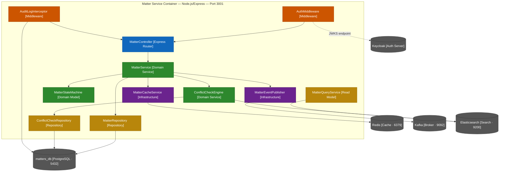
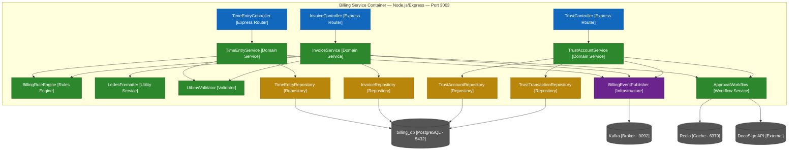
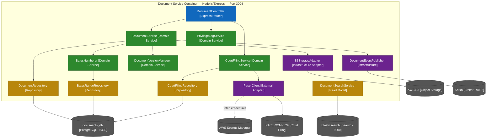

# C4 Level 3 Component Diagrams — Legal Case Management System

| Property | Value |
|---|---|
| Document Title | C4 Level 3 Component Diagrams — Legal Case Management System |
| System | Legal Case Management System |
| Version | 1.0.0 |
| Status | Approved |
| Owner | Architecture Team |
| Last Updated | 2025-01-15 |

---

## Overview

The C4 model provides four hierarchical levels of abstraction for communicating software architecture:

| Level | Name | Audience | Focus |
|---|---|---|---|
| 1 | System Context | Executives, non-technical stakeholders | How LCMS fits within the broader business ecosystem |
| 2 | Container | Developers, architects | Runtime deployable units (services, databases, queues) |
| 3 | Component | Developers working on a service | Internal structure of a single container |
| 4 | Code | Individual developers | Class and interface relationships within a component |

This document covers **Level 3 (Component)** for three core LCMS services: **Matter Service**, **Billing Service**, and **Document Service**. These services encapsulate the highest-complexity domains in the system and are the most frequently modified by engineering teams.

Each component maps directly to a TypeScript module, class, or small cohesive group of classes implementing a single responsibility. The diagrams capture both the internal composition of each container and the external dependencies those components reach across service boundaries. Understanding this structure is a prerequisite for onboarding engineers, conducting architectural review, and planning cross-cutting changes such as event schema migrations or database access-control updates.

Components are categorised by role:

- **Express Router** — HTTP boundary; validates DTOs, extracts auth context, maps to HTTP status codes
- **Domain Service** — Encapsulates business rules and orchestrates domain objects; no direct I/O
- **Domain Model** — Pure in-process state machine or value object; no infrastructure dependencies
- **Repository** — Persistence abstraction; all SQL lives here; returns domain objects, not raw rows
- **Read Model** — Optimised query path over Elasticsearch; never mutates state
- **Infrastructure Adapter** — Wraps a third-party client (Kafka producer, ioredis, AWS SDK)
- **Middleware** — Cross-cutting request pipeline concern (auth, audit logging)

---

## C4 Level 3 — Matter Service Components

### Container Context

The Matter Service is the system-of-record for legal matters (cases). It runs as a Node.js/Express container inside a Kubernetes `Deployment` with three replicas, exposes a REST API on **port 3001** behind the Kong API Gateway, and owns its own isolated **matters_db** PostgreSQL database. It caches read-heavy matter detail payloads in **Redis**, publishes domain events to **Kafka**, and queries **Elasticsearch** for full-text conflict-of-interest searches. Token validation is delegated to **Keycloak** via JWKS endpoint discovery.

State transitions — such as moving a matter from `INTAKE` to `CONFLICT_CHECK`, `ACTIVE`, or `CLOSED` — are the central concern of this service. All transitions are governed by an explicit state machine, and every mutation is captured by an immutable audit log.

### Component Diagram

### Component Responsibilities

| Component | Responsibilities | Technology | Port/Protocol |
|---|---|---|---|
| MatterController | Route `/v1/matters/*`, validate request DTOs, extract JWT auth context, map service results to HTTP responses and error codes | Express Router, class-validator, class-transformer | HTTP/3001 |
| MatterService | Create/update/close matters, enforce business rules (no billing on closed matters, conflict check required before activation), coordinate with ConflictCheckEngine and MatterStateMachine | TypeScript class | In-process |
| ConflictCheckEngine | Search Elasticsearch for party name matches, adverse-party overlaps, and related-matter conflicts; produce a `ConflictCheckResult` with matched entities and risk score | TypeScript, Elasticsearch client | HTTP/9200 |
| MatterStateMachine | Validate and apply state transitions (`INTAKE → CONFLICT_CHECK → ACTIVE → CLOSED`), throw `DomainError` on invalid transitions, emit `MatterTransitionEvent` | TypeScript class | In-process |
| MatterRepository | CRUD on `matters` table, optimistic locking via `version` column, state history persisted to JSONB column, find-by-client-id and find-by-status queries | TypeORM, pg | TCP/5432 |
| ConflictCheckRepository | Persist and retrieve `ConflictCheckRecord` entities, link conflict results to matter by foreign key, support time-bound lookups for periodic re-checks | TypeORM, pg | TCP/5432 |
| MatterQueryService | Elasticsearch query builder for list/search endpoints; supports filter by status, attorney, date range, full-text on matter name and client name; never mutates state | TypeScript, Elasticsearch client | HTTP/9200 |
| MatterEventPublisher | Serialize domain events to Avro schema, publish to Kafka topics (`matter.created`, `matter.status_changed`, `matter.closed`); idempotent via Kafka transactional producer | KafkaJS, Confluent Schema Registry | TCP/9092 |
| MatterCacheService | Cache matter detail payloads with 5-minute TTL, cache `ConflictCheckResult` for 1 hour, invalidate on update events, use Redis `SETNX` for distributed lock during creation | ioredis | TCP/6379 |
| AuthMiddleware | Validate JWT signature against Keycloak JWKS endpoint, extract `firm_id`, `userId`, and `roles` claims, set typed `RequestContext` object on Express `req` | jsonwebtoken, jwks-rsa | N/A |
| AuditLogInterceptor | After every mutating request: write an immutable record to `audit_logs` capturing actor ID, entity type/ID, HTTP method, before-state, after-state diff, and ISO 8601 timestamp; no UPDATE or DELETE ever issued against this table | TypeORM | TCP/5432 |

---

## C4 Level 3 — Billing Service Components

### Container Context

The Billing Service manages the financial lifecycle of legal work: time entry capture, invoice generation, trust account (IOLTA) management, and LEDES export. It runs as a Node.js/Express container on **port 3003**, owns an isolated **billing_db** PostgreSQL database, and shares the **Redis** instance for short-lived approval-state locks. It publishes billing events to **Kafka** and integrates with **DocuSign** for electronic invoice approval signatures. Billing calculations are highly rule-driven — rates, increments, budget caps, and write-off policies are enforced centrally in the BillingRuleEngine so that no controller or repository contains business logic.

IOLTA (Interest on Lawyers' Trust Accounts) compliance requirements impose strict constraints on the TrustAccountService: balances must never go negative, concurrent disbursements must be handled atomically, and dual-control approval is mandatory for disbursements above a configurable threshold.

### Component Diagram

### Component Responsibilities

| Component | Responsibilities | Technology | Key Methods |
|---|---|---|---|
| TimeEntryController | Handle `/v1/matters/{id}/time-entries` CRUD, bulk import endpoint for CSV/LEDES import, submit and approve actions | Express | `createTimeEntry`, `submitTimeEntry`, `approveTimeEntry`, `bulkImport` |
| InvoiceController | Handle `/v1/invoices` generation, LEDES export download, payment recording, write-off, DocuSign send | Express | `generateInvoice`, `exportLedes`, `recordPayment`, `sendForSignature` |
| TrustController | Handle `/v1/trust/accounts` deposits, disbursement initiation, approval, and monthly reconciliation | Express | `deposit`, `initiateDisbursement`, `reconcile`, `getBalance` |
| TimeEntryService | Validate UTBMS codes via UtbmsValidator, apply billing rules via BillingRuleEngine, enforce matter is not CLOSED before accepting entries, manage entry lifecycle (draft → submitted → approved → billed) | TypeScript | `createEntry`, `submitEntry`, `approveEntry`, `writeOff` |
| InvoiceService | Aggregate all approved time entries in billing period, apply adjustments, invoke LedesFormatter for export, coordinate DocuSign approval workflow via ApprovalWorkflow | TypeScript | `generateInvoice`, `exportLedes`, `recordPayment`, `writeOff` |
| TrustAccountService | IOLTA-compliant deposit and disbursement processing, atomic balance updates with PostgreSQL advisory locks, dual-control approval enforcement, monthly reconciliation report generation, overdraft prevention | TypeScript | `deposit`, `initiateDisbursement`, `approveDisbursement`, `reconcile` |
| BillingRuleEngine | Apply minimum time increment (0.1 hr), resolve hourly rates from billing agreement or default rate card, enforce budget cap warnings at 90% and hard stops at 100%, apply automatic write-off rules per firm policy configuration | TypeScript | `applyRules`, `checkBudgetCap`, `applyRateOverride`, `computeAmount` |
| LedesFormatter | Format invoice header and line items per LEDES 1998B and LEDES 2.0 specifications, validate required fields, verify output checksum, encode as UTF-8 | TypeScript | `formatLedes1998B`, `formatLedes2`, `validateOutput`, `computeChecksum` |
| UtbmsValidator | Validate task codes (L1xx–L5xx phase codes) and activity codes (A1xx) against the embedded UTBMS catalog, return code descriptions and phase labels for display | TypeScript | `validateTaskCode`, `validateActivityCode`, `getDescription`, `listPhases` |
| ApprovalWorkflow | Route approval requests to the appropriate approver (billing partner for disbursements above $5,000; billing coordinator otherwise), track approval status in Redis with 48-hour TTL, trigger DocuSign for invoice signature, escalate on timeout | TypeScript | `requestApproval`, `approve`, `reject`, `escalate`, `getStatus` |
| TimeEntryRepository | Persist and query `time_entries` table, support batch insert for bulk import, find-by-matter-and-period queries, optimistic locking, rollup queries for invoice aggregation | TypeORM, pg | `save`, `findByMatterAndPeriod`, `batchInsert`, `aggregateByMatter` |
| InvoiceRepository | Persist `invoices` and `invoice_line_items`, support status-based queries, link to time entries, store LEDES export payload as BYTEA | TypeORM, pg | `save`, `findByClient`, `findByStatus`, `attachLedesPayload` |
| TrustAccountRepository | Persist `trust_accounts` records, enforce single active account per client-matter pair, support balance queries with row-level locking | TypeORM, pg | `save`, `findByMatter`, `findWithLock`, `getBalance` |
| TrustTransactionRepository | Append-only transaction log for every deposit and disbursement, support reconciliation period queries, never allow UPDATE or DELETE | TypeORM, pg | `appendDeposit`, `appendDisbursement`, `findByPeriod`, `reconcile` |
| BillingEventPublisher | Publish Avro-serialised billing domain events to Kafka: `billing.time_entry.submitted`, `billing.invoice.generated`, `billing.trust.disbursement_completed` | KafkaJS | `publishTimeEntryEvent`, `publishInvoiceEvent`, `publishTrustEvent` |

---

## C4 Level 3 — Document Service Components

### Container Context

The Document Service manages the full lifecycle of legal documents: upload, versioning, Bates numbering for discovery productions, privilege assertion and log generation, and electronic court filing via the federal **PACER/CM-ECF** system. It runs as a Node.js/Express container on **port 3004**, uses **documents_db** (PostgreSQL) for metadata, **AWS S3** for binary storage with Glacier lifecycle tiering, and **Elasticsearch** for full-text document search. Binary files never pass through the service layer unencrypted — all client downloads are served via 15-minute pre-signed S3 URLs.

Court filing is a two-phase process: the `CourtFilingService` validates document readiness and invokes `PacerClient`, which authenticates with PACER credentials stored in **AWS Secrets Manager** and submits via the CM-ECF SOAP/REST interface. The returned Notice of Electronic Filing (NEF) is parsed to extract new docket deadlines, which are forwarded to the Calendar Service via Kafka.

### Component Diagram

### Component Responsibilities

| Component | Responsibilities | Technology | Key Methods |
|---|---|---|---|
| DocumentController | Handle multipart file upload (Multer), download redirect to pre-signed URL, version retrieval, court filing initiation, privilege assertion, and privilege log download | Express, Multer | `uploadDocument`, `downloadDocument`, `fileWithCourt`, `assertPrivilege`, `getPrivilegeLog` |
| DocumentService | Orchestrate document lifecycle: stream upload to S3StorageAdapter, save metadata to DocumentRepository, trigger BatesNumberer for discovery documents, coordinate version management, enforce privilege rules on download | TypeScript, AWS SDK | `createDocument`, `createVersion`, `markPrivileged`, `getDownloadUrl`, `deleteDocument` |
| BatesNumberer | Assign sequential Bates numbers to documents in a production set; manage alphanumeric prefix and zero-padded number ranges; prevent gaps and overlaps between concurrent assignments using a PostgreSQL sequence | TypeScript | `assignBatesRange`, `getNextRange`, `validateAssignment`, `formatBatesNumber` |
| PrivilegeLogService | Track attorney-client privilege and work-product doctrine assertions against specific documents, generate privilege log in court-required format (document description, author, date, privilege basis), manage redaction flags per page | TypeScript | `assertPrivilege`, `generatePrivilegeLog`, `markForRedaction`, `listPrivilegedDocuments` |
| CourtFilingService | Validate document is in `APPROVED` status, extract CM-ECF filing metadata from document attributes, invoke PacerClient, persist `CourtFiling` record, parse returned NEF XML for docket number and new deadlines, publish `document.filed.with_court` event | TypeScript | `initiateFilingFlow`, `processFilingConfirmation`, `extractDeadlines`, `getFilingStatus` |
| DocumentVersionManager | Create new document versions linked to the canonical document ID, maintain version chain with sequential version numbers, retrieve specific version by number, compute and compare SHA-256 checksums between versions | TypeScript | `createVersion`, `getVersion`, `getVersionHistory`, `diffVersions`, `getLatestVersion` |
| PacerClient | Retrieve PACER credentials from AWS Secrets Manager on startup, authenticate with PACER login endpoint and cache session cookie, submit document binaries via CM-ECF SOAP/REST interface, poll for filing confirmation, record PACER access fees in `pacer_fee_log` | Axios, xml2js | `authenticate`, `submitDocument`, `getFilingStatus`, `getPacerFees`, `parseNef` |
| S3StorageAdapter | Stream document binary uploads to S3 with server-side AES-256 encryption, generate pre-signed GET URLs with 15-minute expiry for secure client downloads, apply S3 lifecycle policies (Intelligent-Tiering for 7 years, Glacier Deep Archive thereafter), delete objects with tombstone marker | AWS SDK v3 | `upload`, `getPresignedUrl`, `moveToGlacier`, `deleteObject`, `headObject` |
| DocumentRepository | Persist and query `documents` table metadata (S3 key, checksum, content type, matter ID, uploaded by, privilege status), soft-delete with `deleted_at` timestamp, find-by-matter queries with pagination | TypeORM, pg | `save`, `findByMatter`, `findById`, `softDelete`, `findByBatesNumber` |
| BatesRangeRepository | Persist `bates_ranges` allocation records linking prefix, start number, end number, and matter production ID; lock row for sequential allocation to prevent concurrent range overlap | TypeORM, pg | `allocateRange`, `findByProduction`, `findByPrefix`, `getLastAllocated` |
| CourtFilingRepository | Persist `court_filings` records including CM-ECF docket number, NEF receipt, filing timestamp, PACER fee amount, and associated document ID; support status queries and audit retrieval | TypeORM, pg | `save`, `findByDocument`, `findByMatter`, `updateStatus` |
| DocumentSearchService | Full-text Elasticsearch queries over document names, content (extracted text), matter association, date range, and privilege status; powers the document search endpoint; never mutates state | TypeScript, Elasticsearch client | `searchByMatter`, `fullTextSearch`, `filterByPrivilege`, `searchByBatesRange` |
| DocumentEventPublisher | Publish Avro-serialised document domain events to Kafka: `document.uploaded`, `document.version_created`, `document.filed.with_court`, `document.privilege_asserted` | KafkaJS | `publishUploadEvent`, `publishFilingEvent`, `publishPrivilegeEvent` |

---

## Component Responsibility Table (Consolidated)

The following table provides a cross-service view of all components, their owning service, primary responsibilities, infrastructure dependencies, and the interfaces they expose to peer components within the same container.

| Component | Service | Responsibilities | Dependencies | Interfaces Exposed |
|---|---|---|---|---|
| MatterController | Matter | HTTP boundary for matter CRUD, state transition triggers, search | MatterService, AuthMiddleware | REST `/v1/matters/*` |
| MatterService | Matter | Business rule orchestration, matter lifecycle management | MatterRepository, MatterStateMachine, MatterEventPublisher, ConflictCheckEngine, MatterCacheService | `createMatter()`, `transitionStatus()`, `closeMatter()` |
| ConflictCheckEngine | Matter | Elasticsearch conflict-of-interest search, risk scoring | Elasticsearch, ConflictCheckRepository | `runConflictCheck()`, `getCheckResult()` |
| MatterStateMachine | Matter | State transition validation and enforcement | None (pure domain) | `transition()`, `canTransition()`, `getCurrentState()` |
| MatterRepository | Matter | Matter persistence, optimistic locking, state history JSONB | PostgreSQL (matters_db) | `findById()`, `save()`, `findByStatus()`, `findByClient()` |
| ConflictCheckRepository | Matter | Conflict check result persistence, historical lookup | PostgreSQL (matters_db) | `save()`, `findByMatter()`, `findRecent()` |
| MatterQueryService | Matter | Elasticsearch read path for matter list/search | Elasticsearch | `search()`, `filterByStatus()`, `findByAttorney()` |
| MatterEventPublisher | Matter | Kafka domain event publication (matter lifecycle) | Kafka, Schema Registry | `publish()` |
| MatterCacheService | Matter | Matter detail cache, conflict result cache, distributed lock | Redis | `get()`, `set()`, `invalidate()`, `lock()` |
| AuthMiddleware | Matter | JWT validation, claim extraction, request context population | Keycloak (JWKS) | `validateToken()` (middleware pipeline) |
| AuditLogInterceptor | Matter | Immutable audit record write on every mutation | PostgreSQL (matters_db) | Express middleware `after()` hook |
| TimeEntryController | Billing | Time entry CRUD, bulk import, submit/approve routing | TimeEntryService | REST `/v1/matters/{id}/time-entries/*` |
| InvoiceController | Billing | Invoice generation, LEDES export, payment recording | InvoiceService | REST `/v1/invoices/*` |
| TrustController | Billing | IOLTA deposit/disbursement, reconciliation | TrustAccountService | REST `/v1/trust/*` |
| TimeEntryService | Billing | Entry lifecycle, UTBMS validation, billing rule application | TimeEntryRepository, BillingRuleEngine, UtbmsValidator, BillingEventPublisher | `createEntry()`, `submitEntry()`, `approveEntry()` |
| InvoiceService | Billing | Invoice generation, LEDES formatting, DocuSign coordination | InvoiceRepository, LedesFormatter, ApprovalWorkflow, BillingEventPublisher | `generateInvoice()`, `exportLedes()`, `recordPayment()` |
| TrustAccountService | Billing | IOLTA compliance, balance integrity, dual-control approval | TrustAccountRepository, TrustTransactionRepository, ApprovalWorkflow, BillingEventPublisher | `deposit()`, `initiateDisbursement()`, `reconcile()` |
| BillingRuleEngine | Billing | Rate resolution, increment enforcement, budget cap, write-off rules | None (pure domain, reads config) | `applyRules()`, `checkBudgetCap()`, `applyRateOverride()` |
| LedesFormatter | Billing | LEDES 1998B and 2.0 format generation, checksum validation | None (pure utility) | `formatLedes1998B()`, `formatLedes2()`, `validateOutput()` |
| UtbmsValidator | Billing | UTBMS task and activity code validation against catalog | None (embedded catalog) | `validateTaskCode()`, `validateActivityCode()`, `getDescription()` |
| ApprovalWorkflow | Billing | Approval routing, threshold-based escalation, DocuSign integration, timeout handling | Redis, DocuSign API | `requestApproval()`, `approve()`, `reject()`, `escalate()` |
| BillingEventPublisher | Billing | Kafka event publication (time entry, invoice, trust events) | Kafka, Schema Registry | `publishTimeEntryEvent()`, `publishInvoiceEvent()`, `publishTrustEvent()` |
| DocumentController | Document | File upload, download redirect, court filing, privilege management | DocumentService, CourtFilingService, PrivilegeLogService | REST `/v1/documents/*` |
| DocumentService | Document | Document lifecycle orchestration, S3 upload, metadata persistence | DocumentRepository, S3StorageAdapter, BatesNumberer, DocumentVersionManager, DocumentEventPublisher | `createDocument()`, `createVersion()`, `getDownloadUrl()` |
| BatesNumberer | Document | Sequential Bates number assignment, range management, overlap prevention | BatesRangeRepository | `assignBatesRange()`, `getNextRange()`, `formatBatesNumber()` |
| PrivilegeLogService | Document | Privilege assertion tracking, log generation, redaction flags | DocumentRepository | `assertPrivilege()`, `generatePrivilegeLog()`, `markForRedaction()` |
| CourtFilingService | Document | CM-ECF filing orchestration, NEF parsing, deadline extraction | CourtFilingRepository, PacerClient, DocumentEventPublisher | `initiateFilingFlow()`, `processFilingConfirmation()` |
| DocumentVersionManager | Document | Version chain management, checksum verification, version history | DocumentRepository | `createVersion()`, `getVersion()`, `diffVersions()` |
| PacerClient | Document | PACER authentication, CM-ECF submission, fee recording | AWS Secrets Manager, PACER/CM-ECF | `authenticate()`, `submitDocument()`, `getPacerFees()` |
| S3StorageAdapter | Document | Binary upload/download, pre-signed URL generation, Glacier lifecycle | AWS S3 | `upload()`, `getPresignedUrl()`, `moveToGlacier()` |
| DocumentRepository | Document | Document metadata persistence, soft-delete, Bates number index | PostgreSQL (documents_db) | `save()`, `findByMatter()`, `findByBatesNumber()` |
| DocumentSearchService | Document | Elasticsearch full-text document search (read-only) | Elasticsearch | `searchByMatter()`, `fullTextSearch()`, `filterByPrivilege()` |
| DocumentEventPublisher | Document | Kafka event publication (upload, filing, privilege events) | Kafka, Schema Registry | `publishUploadEvent()`, `publishFilingEvent()` |

---

## Inter-Service Communication

### Synchronous Communication (REST)

All synchronous calls between services flow through the internal Kubernetes service mesh (Istio). Circuit breakers are implemented using the `opossum` library in each calling service.

| Caller Service | Target Service | Endpoint | Purpose | Timeout | Circuit Breaker |
|---|---|---|---|---|---|
| MatterService | ClientService | `GET /v1/clients/{id}` | Validate client exists and is in good standing during matter intake | 3 s | Open after 5 failures in 60 s; half-open probe every 30 s |
| MatterService | ConflictCheckService | `POST /v1/conflict-checks` | Initiate comprehensive conflict-of-interest check at matter intake | 10 s | Open after 3 failures in 60 s; extended timeout accounts for Elasticsearch query time |
| BillingService | MatterService | `GET /v1/matters/{id}` | Validate matter is in ACTIVE status before accepting a new time entry | 3 s | Open after 5 failures in 60 s; cached fallback serves last-known status |
| DocumentService | CalendarService | `POST /v1/calendar/deadlines` | Create court deadlines extracted from a filed document's NEF | 3 s | Open after 5 failures in 60 s; events also published to Kafka as fallback |
| TrustService | AccountingAdapter | `POST /v1/accounting/transactions` | Synchronously sync completed disbursement to the external accounting ledger | 5 s | Open after 3 failures in 30 s; failed syncs queued in Kafka dead-letter topic |

### Asynchronous Communication (Kafka)

All Kafka topics use Avro schemas registered in Confluent Schema Registry. Consumer groups use at-least-once delivery; consumers must be idempotent using the `eventId` field.

| Topic | Publisher | Consumers | Event Schema | Purpose |
|---|---|---|---|---|
| `matter.intake.submitted` | MatterService | ConflictCheckService, NotificationService | `{ eventId, matterId, clientName, opposingParties[], practiceArea, timestamp }` | Trigger automated conflict check and notify intake team of new submission |
| `matter.status.changed` | MatterService | BillingService, CalendarService, NotificationService | `{ eventId, matterId, fromStatus, toStatus, changedBy, reason, timestamp }` | Cross-service matter status synchronisation; BillingService rejects new time entries on CLOSED |
| `billing.time_entry.submitted` | BillingService | NotificationService | `{ eventId, entryId, matterId, userId, hours, amount, utbmsTaskCode, timestamp }` | Notify assigned billing coordinator that a time entry awaits review |
| `billing.invoice.generated` | BillingService | NotificationService, AnalyticsService | `{ eventId, invoiceId, matterId, clientId, totalAmount, billingPeriod, timestamp }` | Drive invoice-ready notifications to client portal and feed billing analytics pipeline |
| `document.filed.with_court` | DocumentService | CalendarService, NotificationService | `{ eventId, documentId, matterId, courtFilingId, docketNumber, filedAt, extractedDeadlines[] }` | Create docket deadlines in CalendarService and notify responsible attorneys |
| `trust.disbursement.completed` | TrustService | AccountingService, NotificationService, AuditService | `{ eventId, transactionId, accountId, amount, payee, approvedBy, approvedAt, timestamp }` | Trigger accounting ledger sync, client trust account notification, and compliance audit trail |

---

## Component Test Strategy

Tests are co-located with source files in `*.spec.ts` files. Integration tests requiring a live database or Elasticsearch instance use `testcontainers` to spin up ephemeral Docker containers within the Jest test runner. Mocked external clients (S3, PACER, DocuSign) use `jest.mock` with factory functions defined in `__mocks__/` directories.

| Component | Test Type | Test Scope | Tools | Key Test Cases |
|---|---|---|---|---|
| MatterController | Unit + Integration | HTTP request handling, DTO validation, auth context extraction | Jest, Supertest | Valid `POST /v1/matters` creates matter and returns 201; missing required `clientId` returns 400 with field error; bearer token absent returns 401; conflict detected returns 202 with `conflictCheckId`; closed matter PATCH returns 409 |
| MatterService | Unit | Business logic, state machine coordination, event publishing | Jest | Cannot transition `CLOSED → CONFLICT_CHECK` — throws `DomainError`; conflict check result stored on matter before activation; `MatterEventPublisher.publish` called exactly once per status change; cache invalidated on update |
| ConflictCheckEngine | Unit + Integration | Elasticsearch query accuracy, false-positive rate | Jest, testcontainers (Elasticsearch) | Exact name match detected; adverse-party overlap detected across separate matters; hyphenated name variant matched; partial first-name-only search does not produce false positive; empty result returned for new client |
| BillingRuleEngine | Unit | Rule application logic, rate resolution, increment rounding | Jest | Entry of 0.09 hr rounded up to 0.1 hr minimum increment; budget warning event emitted at 90% of cap; rate override from billing agreement supersedes default rate card; write-off rule applied automatically when entry age exceeds firm policy threshold |
| LedesFormatter | Unit | LEDES 1998B format compliance, output integrity | Jest | Output matches LEDES 1998B line format specification character-for-character; all required header fields present; checksum field validates against computed value; output encodes as valid UTF-8; invoice with zero line items produces valid empty LEDES file |
| TrustAccountService | Unit + Integration | IOLTA compliance, balance integrity, concurrency | Jest, testcontainers (PostgreSQL) | Disbursement that would cause overdraft throws `InsufficientFundsError` and rolls back; two concurrent disbursements processed atomically — no double-spend; disbursement of $6,000 requires partner approval; disbursement of $2,000 routed to billing coordinator; monthly reconciliation total matches sum of transactions |
| PacerClient | Unit (mocked) + E2E (staging) | PACER API integration, credential retrieval, NEF parsing | Jest, nock | Credentials fetched from Secrets Manager on cold start; SOAP envelope formatted per CM-ECF specification; `getFilingStatus` polls until terminal state; NEF XML parsed correctly for docket number and deadline dates; PACER access fees recorded in `pacer_fee_log` |
| S3StorageAdapter | Unit (mocked) + Integration | S3 operations, pre-signed URL TTL, lifecycle policy | Jest, aws-sdk-mock | Upload sets `ServerSideEncryption: AES256` and correct bucket/key path; pre-signed URL expires at exactly 900 seconds (15 minutes); `moveToGlacier` applies `GLACIER` storage class via copy-and-delete; `headObject` returns correct content-type and file size metadata |
| MatterRepository | Integration | PostgreSQL queries, optimistic locking, JSONB state history | Jest, testcontainers (PostgreSQL) | Concurrent saves with same `version` — second save throws `OptimisticLockVersionMismatchError`; state history JSONB appended (not overwritten) on each status transition; `EXPLAIN ANALYZE` output confirms index scan on `status` and `client_id` columns; soft-delete does not appear in `findByStatus` results |
| AuditLogInterceptor | Unit | Audit record completeness, immutability guarantee | Jest | Every mutating HTTP method (`POST`, `PATCH`, `DELETE`) writes exactly one audit record; before-state and after-state both captured in diff format; actor `userId` and `firmId` recorded from JWT context; no `UPDATE` or `DELETE` SQL ever issued against `audit_logs` table (verified via query spy) |
| DocumentVersionManager | Unit | Version chain integrity, checksum comparison | Jest | First upload creates version 1; re-upload creates version 2 with link to version 1; `getVersion(1)` returns original document after version 2 exists; `diffVersions(1, 2)` returns changed checksum; retrieving non-existent version throws `DocumentVersionNotFoundError` |
| BatesNumberer | Unit + Integration | Sequential allocation, concurrent range safety | Jest, testcontainers (PostgreSQL) | First allocation for production returns range `PROD-0001 – PROD-0050`; second allocation continues from `PROD-0051`; two concurrent `assignBatesRange` calls for the same production return non-overlapping ranges (verified with parallel Promise.all); range with prefix not yet used initialises from 1 |
