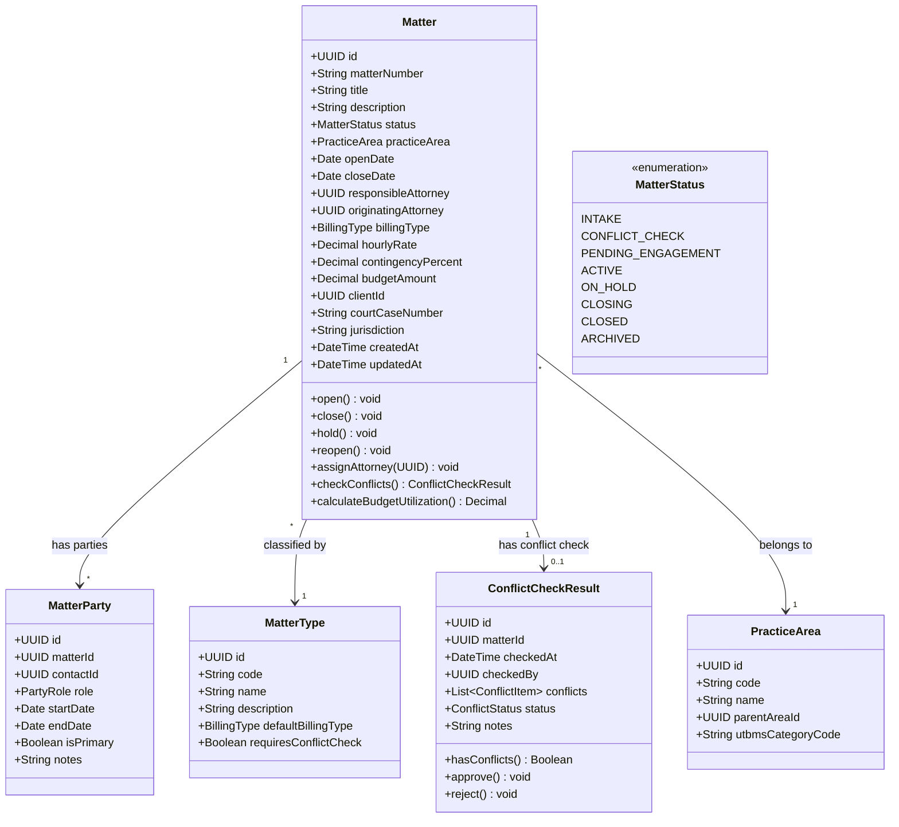
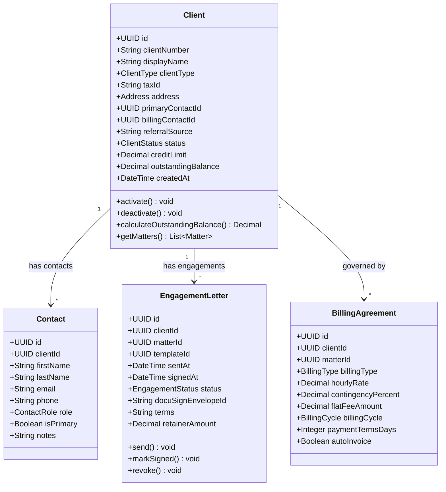
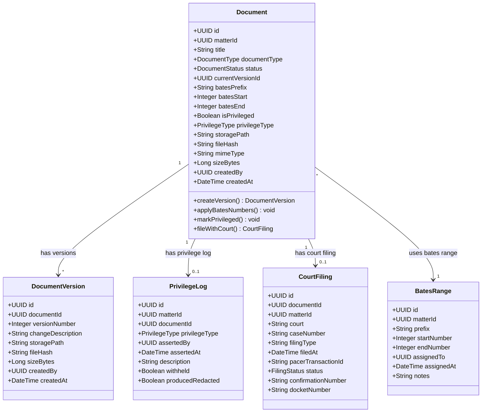
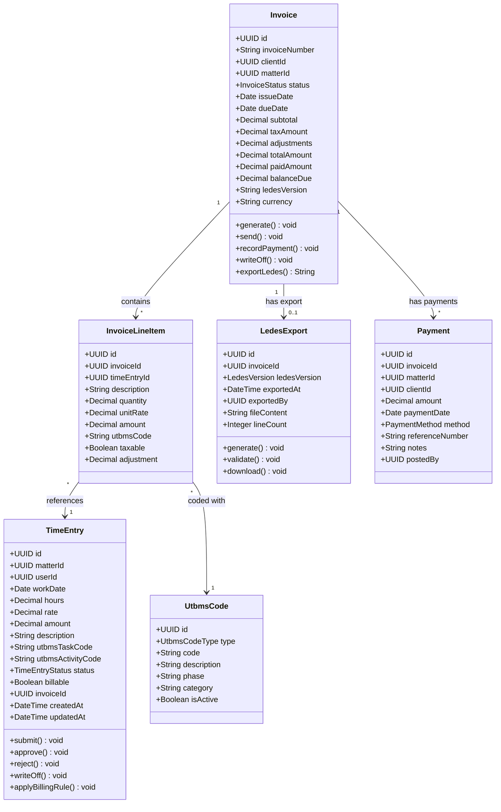
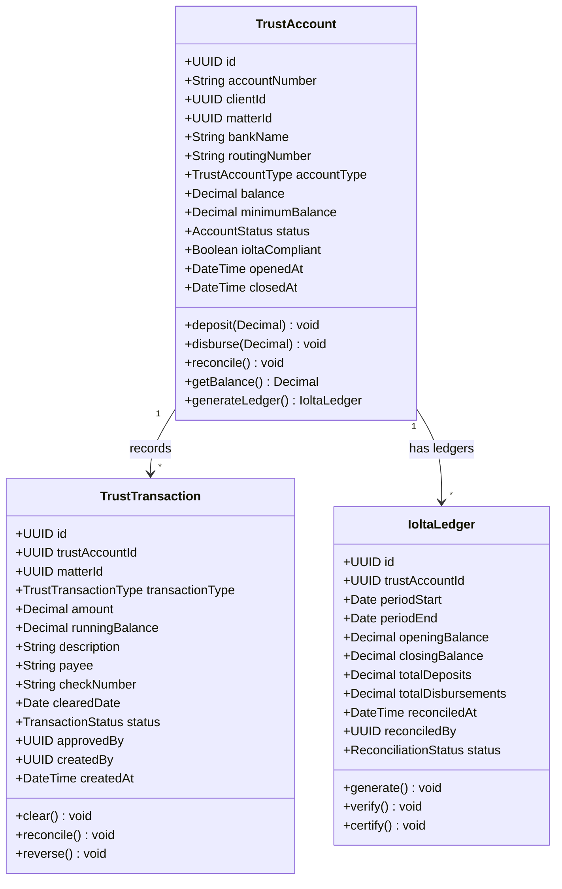
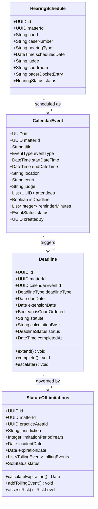

# Class Diagram — Legal Case Management System

| Property | Value |
|---|---|
| Document Title | Class Diagram — Legal Case Management System |
| System | Legal Case Management System |
| Version | 1.0.0 |
| Status | Approved |
| Owner | Architecture Team |
| Last Updated | 2025-01-15 |

---

## Overview

The Legal Case Management System (LCMS) is designed using a layered, domain-driven object-oriented architecture in which each class corresponds to a bounded context within one of six core microservices: Matter Service, Client Service, Document Service, Billing Service, Trust Accounting Service, and Calendar Service. Classes are implemented as TypeScript `class` constructs decorated with TypeORM entity annotations, and each microservice owns its domain models, repositories, and application services exclusively. Cross-service references are represented as UUID foreign keys rather than object references, preserving service autonomy and preventing distributed coupling at the database level.

The class hierarchy is intentionally shallow—deep inheritance chains are replaced by composition, interface contracts, and domain events. Shared domain vocabulary such as `BillingType`, `PracticeArea`, and `Address` are published as value objects in the `@lcms/domain-shared` internal npm package consumed by all services. State transitions on aggregate roots (e.g., `Matter.status`, `Invoice.status`, `TrustTransaction.status`) are enforced through typed state-machine methods (`open()`, `close()`, `submit()`) that emit typed domain events to Kafka topics, ensuring that downstream services—including the billing pipeline and notification service—react to lifecycle changes without synchronous inter-service calls.

Persistence is handled exclusively through the Repository pattern: each aggregate root has a dedicated TypeORM repository class backed by PostgreSQL with `NUMERIC(19,4)` columns for all monetary values. Read-optimised projections for full-text case search, client lookup, and document discovery are materialised in Elasticsearch. Redis provides distributed locking during conflict-of-interest checks and caches frequently accessed reference data such as `UtbmsCode` tables and `PracticeArea` hierarchies. All monetary values in application code are represented as the `Money` value object wrapping `Decimal.js` to prevent floating-point arithmetic errors in billing calculations.

---

## 1. Matter Management Classes

The Matter Management module anchors the LCMS domain. A `Matter` record represents a single active legal engagement and is the primary organisational unit around which documents, time entries, deadlines, billing, and trust funds are structured. The `ConflictCheckResult` aggregate is produced by the conflict-of-interest screening workflow executed automatically on matter intake, blocking progression to `ACTIVE` status until cleared. `MatterParty` captures every individual tied to a matter—clients, adverse parties, co-counsel, and expert witnesses—each in a distinct, typed role.

---

## 2. Client Classes

The Client module manages the firm's complete client roster and governs the intake-to-engagement lifecycle. A `Client` record is created during initial intake and progresses through status transitions as engagement letters are executed and matters are activated. `BillingAgreement` captures the negotiated fee arrangement for each specific matter engagement, which may differ per matter even for the same client, and drives billing behaviour in the Billing Service. `EngagementLetter` integrates with DocuSign to manage electronic signature workflows and records the retainer amount and fee terms agreed at the outset.

---

## 3. Document Classes

The Document module manages the complete lifecycle of legal documents from initial creation through court filing and production. Version control is a first-class domain concept: every save produces an immutable `DocumentVersion`, and `currentVersionId` always references the authoritative version. The Bates numbering subsystem assigns sequentially numbered labels across document pages for litigation discovery production sets, with `BatesRange` enforcing uniqueness and auditability per matter. `PrivilegeLog` supports attorney-client privilege assertions and work-product protection tracking during e-discovery review workflows, and `CourtFiling` integrates with PACER for federal electronic filings.

---

## 4. Billing Classes

The Billing module covers the full revenue cycle from time capture through invoice generation, LEDES export, and payment application. `TimeEntry` records are the atomic unit of billable work and are linked to UTBMS task and activity codes for e-billing compliance with insurance carriers and corporate legal departments. `LedesExport` produces industry-standard LEDES 1998B and LEDES 2.0 formatted files for client e-billing portals such as Tymetrix 360, Legal Tracker, and BrightFlag. The `LedesExportFactory` selects the correct format version based on the `BillingAgreement.ledesVersion` configured per client, and `UtbmsCode` records are cached in Redis and refreshed nightly from the UTBMS code set registry.

---

## 5. Trust Accounting Classes

The Trust Accounting module implements IOLTA (Interest on Lawyers' Trust Accounts) compliant ledger management in conformance with state bar rules. Trust accounts are strictly segregated from operating accounts and are subject to annual bar association audit requirements. Every deposit and disbursement is recorded as an immutable `TrustTransaction` with a running balance computed at write time using a database-level serialisable transaction, preventing race conditions on concurrent disbursements. Monthly `IoltaLedger` reconciliations are generated by the system, verified against bank statements, and certified by the supervising attorney before the period is locked. The system enforces a minimum balance policy to prevent inadvertent overdrafts below the required reserve threshold.

---

## 6. Calendar and Deadline Classes

The Calendar and Deadline module manages court-imposed and firm-imposed deadlines, statute of limitations tracking, and hearing schedules. `StatuteOfLimitations` is a critical risk-management entity: expiration dates are calculated automatically from the incident date and jurisdiction-specific limitation periods stored in the `PracticeArea` reference data. Tolling events—such as the defendant's minority, bankruptcy automatic stays, and discovery-rule tolling—are recorded as `TollingEvent` value objects that extend the expiration date accordingly. The `assessRisk()` method returns a `RiskLevel` enum used by the notification service to determine escalation urgency as the expiration date approaches.

---

## Design Patterns Used

| Pattern | Applied To | Implementation Description | Benefit |
|---|---|---|---|
| Repository Pattern | All data access classes (`MatterRepository`, `ClientRepository`, `InvoiceRepository`, `TrustTransactionRepository`, etc.) | Abstract generic base class with typed CRUD and specification-based query methods; PostgreSQL/TypeORM concrete implementations injected via NestJS IoC container | Decouples domain logic from persistence technology; enables unit testing with in-memory mock repositories without a live database |
| Factory Pattern | Document creation, LEDES export generation, engagement letter templating | `DocumentFactory.create(type, metadata)`, `LedesExportFactory.forVersion(version)`, `EngagementLetterFactory.fromTemplate(templateId)` | Encapsulates object creation complexity and variant selection; supports LEDES 1998B and LEDES 2.0 formats through a unified interface |
| Observer Pattern | Matter lifecycle events, billing pipeline triggers, deadline escalations | `EventBus` backed by Kafka topics; aggregate roots publish typed domain events (`MatterOpenedEvent`, `InvoiceGeneratedEvent`, `DeadlineApproachingEvent`) on every state transition | Loose coupling between microservices; enables reliable audit logging, notification dispatch, and Elasticsearch projection updates without synchronous inter-service calls |
| Strategy Pattern | Billing rule engine, conflict-check algorithms, document classification rules | `IBillingStrategy` interface with `HourlyBillingStrategy`, `ContingencyBillingStrategy`, and `FlatFeeBillingStrategy` implementations; `IConflictCheckStrategy` with configurable party-relationship match algorithms | Runtime-switchable behaviour based on `BillingAgreement.billingType`; new fee models can be added without modifying the billing engine core |
| Unit of Work | Atomic multi-entity operations (time entry submission + invoice line-item creation, trust disbursement + transaction ledger update) | TypeORM `QueryRunner` wrapped in a `UnitOfWork` class; transaction boundaries enforced at the application-service layer via a custom `@Transactional()` decorator | Guarantees atomicity across multiple repository writes within a single PostgreSQL transaction; prevents partial-state inconsistencies in financial operations |
| Value Object | Monetary amounts, `Address`, `BatesLabel`, UTBMS code combinations | Immutable TypeScript classes with structural equality via `equals()` method; `Money` wraps `Decimal.js` with a currency code enforced at construction; `Address` validated against postal standards on instantiation | Domain-accurate representation of concepts with no persistent identity; prevents accidental mutation; enables safe value comparison without UUID-based lookups |
| CQRS | Reporting queries vs. transactional commands across all six services | Read models served from Elasticsearch projections updated via Kafka consumers; write commands routed through NestJS command handlers and aggregate root state machines | Optimised read performance for complex cross-matter reports and dashboards; prevents heavy analytical queries from contending with OLTP writes on PostgreSQL |
| Decorator | Permission enforcement, audit trail logging, rate limiting, cache population | `@RequirePermission('matter:write')`, `@AuditLog()`, `@CacheResult(ttl)`, `@Throttle()` NestJS method decorators applied to controller and service layer methods | Cross-cutting concerns applied declaratively; domain logic remains uncluttered by security, observability, or caching boilerplate |

---

## Class Naming Conventions

The LCMS TypeScript codebase follows a consistent set of naming conventions across all six microservices to maintain readability, enforce architectural boundaries, and ensure compatibility with NestJS, TypeORM, and the internal code-generation toolchain.

**Interfaces** are prefixed with `I` to distinguish them from concrete implementations. All repository contracts, service contracts, strategy definitions, and event-handler interfaces follow this convention. Examples: `IMatterRepository`, `IBillingStrategy`, `IConflictCheckService`, `IDocumentStorageProvider`.

**Data Transfer Objects** carry the `Dto` suffix and are used exclusively at the HTTP API boundary for controller input validation and response serialisation. They are annotated with `class-validator` and `class-transformer` decorators and must never appear in the domain or persistence layers. Examples: `CreateMatterDto`, `UpdateInvoiceDto`, `TimeEntrySubmitDto`, `TrustDisbursementRequestDto`.

**TypeORM Entity classes** carry the `Entity` suffix to distinguish persistence models from domain models in services where the two are intentionally separated. Entity classes carry ORM column annotations; domain classes carry none. Examples: `MatterEntity`, `InvoiceEntity`, `TrustTransactionEntity`. Domain model classes use plain names with no suffix: `Matter`, `Invoice`, `TrustTransaction`.

**Enumerations** are defined as TypeScript `const enum` at the domain layer and as standard `enum` at the persistence and DTO layers. Member names use SCREAMING_SNAKE_CASE to match the PostgreSQL `CHECK` constraint string values stored in the database. Examples: `MatterStatus.ACTIVE`, `InvoiceStatus.SENT`, `TrustTransactionType.RETAINER_DEPOSIT`, `DeadlineStatus.APPROACHING`.

**Domain Event classes** carry the `Event` suffix and extend the shared `DomainEvent` base class from `@lcms/domain-shared`. They are serialised to JSON and published to Kafka with a schema registered in the Confluent Schema Registry. Examples: `MatterOpenedEvent`, `InvoiceGeneratedEvent`, `TrustDisbursementApprovedEvent`, `DeadlineEscalatedEvent`.

**Repository implementation classes** carry the `Repository` suffix, are decorated with NestJS `@Injectable()`, and explicitly declare which `I*Repository` interface they implement. Examples: `MatterRepository implements IMatterRepository`, `InvoiceRepository implements IInvoiceRepository`.

**Value Object classes** carry no special suffix but reside in the `domain/value-objects/` directory within each service and are declared with all properties marked `readonly`. They expose a static `of()` factory method and an `equals(other)` method. Examples: `Money`, `Address`, `BatesLabel`, `Jurisdiction`, `UtbmsCodePair`.

**Command and Query handler classes** follow the CQRS naming convention enforced by the `@nestjs/cqrs` module. Commands are suffixed with `Command` and their handlers with `Handler`; queries follow the same pattern. Examples: `OpenMatterCommand` / `OpenMatterHandler`, `GetMatterByIdQuery` / `GetMatterByIdHandler`, `GenerateInvoiceCommand` / `GenerateInvoiceHandler`.

**Exception classes** are suffixed with `Exception` and extend a typed `DomainException` hierarchy that maps to HTTP status codes via a global NestJS exception filter. Each service owns its exception namespace to support Kong API Gateway error-mapping policies and structured error logging in CloudWatch. Examples: `MatterNotFoundException`, `ConflictCheckRequiredException`, `InsufficientTrustFundsException`, `BatesRangeExhaustedException`, `EngagementLetterNotSignedException`.
