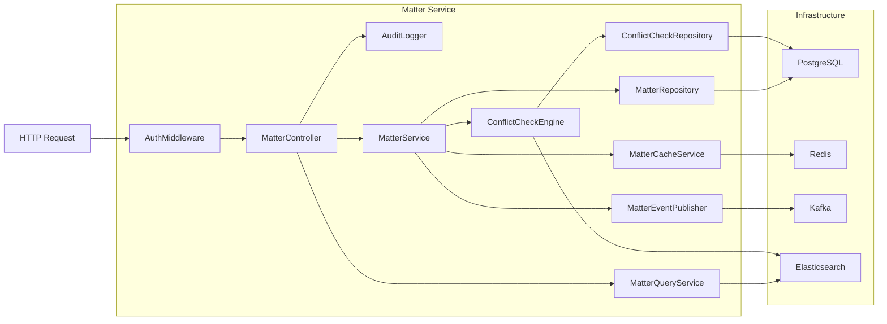
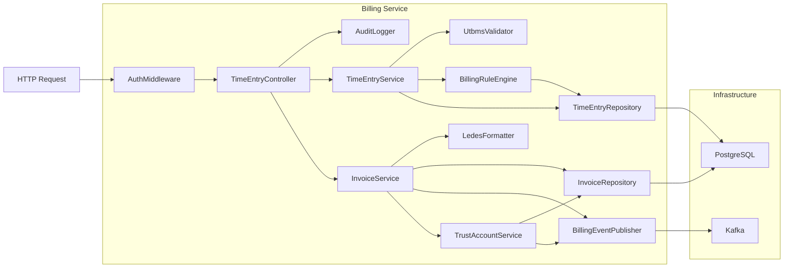
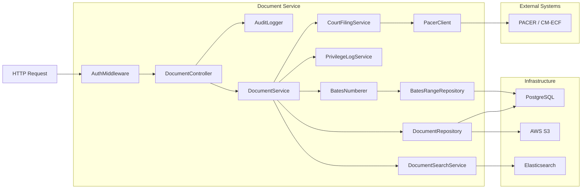
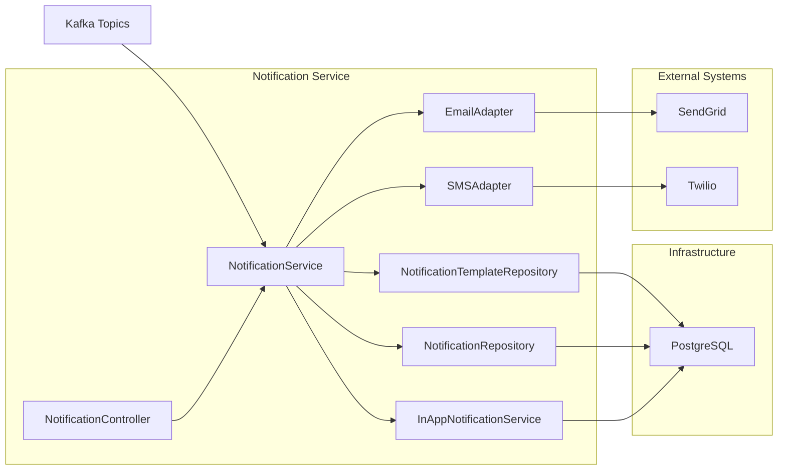
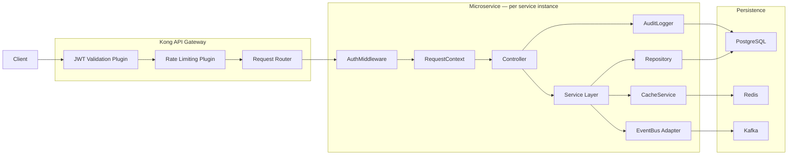
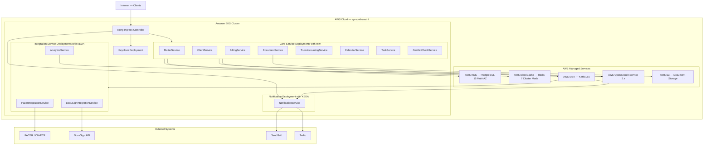

# Component Diagram — Legal Case Management System

| Property       | Value                                               |
|----------------|-----------------------------------------------------|
| Document Title | Component Diagram — Legal Case Management System    |
| System         | Legal Case Management System                        |
| Version        | 1.0.0                                               |
| Status         | Approved                                            |
| Owner          | Architecture Team                                   |
| Last Updated   | 2025-01-15                                          |

---

## Overview

The Legal Case Management System (LCMS) is organized as a suite of domain-aligned microservices deployed to Amazon EKS. Each microservice owns its domain boundary, its own PostgreSQL schema, and publishes domain events to Kafka topics consumed by downstream services. No microservice reaches into another service's database; all cross-service data access is mediated by versioned REST APIs or asynchronous event streams. This boundary discipline prevents data coupling and allows each service to evolve, scale, and be deployed independently.

Internally, every microservice follows a consistent three-layer structure. The **Controller** layer (Express.js) handles HTTP request parsing, input validation via `class-validator`, response serialization, and HTTP error mapping. The **Service** layer encodes domain logic, enforces business invariants, and orchestrates calls to repositories, external adapters, and the event publisher. The **Repository** layer wraps TypeORM entities and provides a typed persistence interface backed by PostgreSQL; read-heavy and search-intensive operations are supplemented by Elasticsearch query services and Redis-backed cache lookups.

Cross-cutting concerns are implemented as reusable components shared across all services. `AuthMiddleware` validates Keycloak-issued JWT tokens and populates a `RequestContext` with the authenticated user ID, roles, and `firm_id` claim. `AuditLogger` records every state-changing operation to an immutable audit log table before the response is returned. The `EventBus` adapter wraps KafkaJS with Avro schema validation, automatic retry with exponential backoff, and dead-letter queue routing for undeliverable messages. The `CacheService` implements the cache-aside pattern against Redis with namespace-prefixed keys and TTL-based expiry.

Integration with the broader legal technology ecosystem is encapsulated in dedicated adapter components. `PacerClient` handles authentication and SOAP/REST submission to the federal PACER/CM-ECF system. `DocuSignIntegrationService` manages envelope creation, recipient routing, and webhook event processing for electronic signatures. Billing export utilities — `LedesFormatter` and `UtbmsValidator` — implement the LEDES 1998B and 2.0 interchange formats and the UTBMS code catalog required by corporate legal departments and insurance carriers for electronic billing compliance.

Kong API Gateway serves as the single ingress point for all client traffic. It handles TLS termination, enforces per-API-key rate limits, validates JWT signatures against Keycloak's JWKS endpoint, and routes requests to the appropriate upstream Kubernetes service. Keycloak manages the full identity lifecycle including user federation, role-based access control, multi-factor authentication, and token issuance under the OAuth 2.0 authorization code flow with PKCE.

---

## System-Level Component Diagram

The diagram below shows all system components organized by tier. Arrows indicate the direction of dependency or data flow.

```mermaid
flowchart TD
    subgraph ClientTier["Client Tier"]
        WebApp["WebApp — React"]
        MobileApp["MobileApp — React Native"]
    end

    subgraph GatewayTier["API Gateway"]
        Kong["Kong API Gateway"]
    end

    subgraph AuthTier["Authentication"]
        Keycloak["Keycloak — OAuth2 / OIDC"]
    end

    subgraph CoreSvcs["Core Microservices"]
        MatterSvc["MatterService"]
        ClientSvc["ClientService"]
        BillingSvc["BillingService"]
        DocumentSvc["DocumentService"]
        TrustSvc["TrustAccountingService"]
        CalendarSvc["CalendarService"]
        TaskSvc["TaskService"]
        NotifSvc["NotificationService"]
        ConflictSvc["ConflictCheckService"]
    end

    subgraph IntSvcs["Integration Services"]
        PacerIntSvc["PacerIntegrationService"]
        DocuSignIntSvc["DocuSignIntegrationService"]
        AnalyticsSvc["AnalyticsService"]
    end

    subgraph Infra["Infrastructure"]
        PGCluster["PostgreSQL Clusters"]
        RedisCluster["Redis Cluster"]
        KafkaCluster["Kafka Cluster"]
        ESCluster["Elasticsearch Cluster"]
    end

    subgraph ExtSys["External Systems"]
        PACER["PACER / CM-ECF"]
        DocuSignAPI["DocuSign API"]
        AWSS3["AWS S3"]
        SendGridExt["SendGrid"]
    end

    WebApp --> Kong
    MobileApp --> Kong
    Kong --> Keycloak
    Kong --> MatterSvc
    Kong --> ClientSvc
    Kong --> BillingSvc
    Kong --> DocumentSvc
    Kong --> TrustSvc
    Kong --> CalendarSvc
    Kong --> TaskSvc
    Kong --> NotifSvc
    Kong --> ConflictSvc
    MatterSvc --> PGCluster
    MatterSvc --> RedisCluster
    MatterSvc --> KafkaCluster
    MatterSvc --> ESCluster
    ClientSvc --> PGCluster
    ClientSvc --> KafkaCluster
    BillingSvc --> PGCluster
    BillingSvc --> RedisCluster
    BillingSvc --> KafkaCluster
    DocumentSvc --> PGCluster
    DocumentSvc --> AWSS3
    DocumentSvc --> ESCluster
    DocumentSvc --> KafkaCluster
    TrustSvc --> PGCluster
    TrustSvc --> KafkaCluster
    CalendarSvc --> PGCluster
    CalendarSvc --> RedisCluster
    TaskSvc --> PGCluster
    ConflictSvc --> ESCluster
    ConflictSvc --> PGCluster
    KafkaCluster --> NotifSvc
    KafkaCluster --> PacerIntSvc
    KafkaCluster --> DocuSignIntSvc
    KafkaCluster --> AnalyticsSvc
    NotifSvc --> SendGridExt
    PacerIntSvc --> PACER
    DocuSignIntSvc --> DocuSignAPI
    AnalyticsSvc --> ESCluster
```

---

## Matter Service Components

The Matter Service is the central bounded context of the LCMS. It owns the `Matter` aggregate, enforces matter lifecycle state transitions (Intake → Open → Active → Closing → Closed → Archived), and runs automated conflict-of-interest checks on every new matter and party addition. It integrates with Elasticsearch for full-text matter search and with the Kafka event bus to notify downstream services of lifecycle changes.

### Component Description

| Component              | Type             | Responsibility                                                                      | Technology                     |
|------------------------|------------------|-------------------------------------------------------------------------------------|--------------------------------|
| MatterController       | HTTP Controller  | Handles HTTP requests for matter CRUD and lifecycle operations                      | Express.js, class-validator    |
| MatterService          | Domain Service   | Orchestrates matter business logic, enforces lifecycle state machine rules          | TypeScript                     |
| ConflictCheckEngine    | Domain Service   | Performs automated conflict-of-interest checks against client and opposing-party database | TypeScript, Elasticsearch  |
| MatterRepository       | Repository       | PostgreSQL persistence for the Matter aggregate and related entities                | TypeORM, PostgreSQL            |
| MatterEventPublisher   | Event Publisher  | Publishes domain events to Kafka on matter state changes                            | KafkaJS                        |
| ConflictCheckRepository | Repository      | Persists and queries conflict check results and waiver records                      | TypeORM                        |
| MatterQueryService     | Read Model       | Optimized read queries with Elasticsearch full-text and faceted search integration  | Elasticsearch client           |
| MatterCacheService     | Cache            | Redis caching for frequently accessed matter detail and summary records             | ioredis                        |

### Internal Architecture

---

## Billing Service Components

The Billing Service manages the full billing lifecycle: time entry capture, pre-bill review, invoice generation, LEDES export, trust account disbursement, and payment recording. It implements the UTBMS task and activity code validation required by insurance carrier and corporate client billing guidelines, and provides IOLTA trust account management to satisfy state bar compliance obligations.

### Component Description

| Component             | Type            | Responsibility                                                                          | Technology              |
|-----------------------|-----------------|-----------------------------------------------------------------------------------------|-------------------------|
| TimeEntryController   | HTTP Controller | CRUD operations for time entries including bulk import from CSV                         | Express.js              |
| TimeEntryService      | Domain Service  | Validates entries, applies minimum time increment rules, manages time entry lifecycle   | TypeScript              |
| InvoiceService        | Domain Service  | Invoice generation, pre-bill review workflow, LEDES export, payment recording           | TypeScript              |
| LedesFormatter        | Utility         | Serializes invoice data per LEDES 1998B and LEDES 2.0 specification                    | TypeScript              |
| UtbmsValidator        | Validator       | Validates UTBMS task and activity codes against the firm's configured code catalog      | TypeScript              |
| BillingRuleEngine     | Rules Engine    | Applies firm-level billing rules: minimum increment rounding, rate overrides, write-off policies | TypeScript       |
| TrustAccountService   | Domain Service  | IOLTA trust account deposits, client disbursements, and three-way reconciliation        | TypeScript              |
| InvoiceRepository     | Repository      | PostgreSQL persistence for the Invoice aggregate                                        | TypeORM                 |
| TimeEntryRepository   | Repository      | Time entry persistence with matter-partition-aware queries for large datasets           | TypeORM                 |
| BillingEventPublisher | Event Publisher | Publishes billing domain events including invoice-finalized and payment-received        | KafkaJS                 |

### Internal Architecture

---

## Document Service Components

The Document Service manages the complete document lifecycle within the LCMS: upload, version control, privilege classification, Bates numbering, and court filing. It stores document metadata in PostgreSQL and binary content in AWS S3 with per-matter prefix-based bucket policies. Full-text search is powered by Elasticsearch with incremental indexing on upload. The service orchestrates court filings through the PACER/CM-ECF integration.

### Component Description

| Component              | Type             | Responsibility                                                                      | Technology                 |
|------------------------|------------------|-------------------------------------------------------------------------------------|----------------------------|
| DocumentController     | HTTP Controller  | Document upload, download, metadata retrieval, version management, and court filing | Express.js, Multer         |
| DocumentService        | Domain Service   | Document lifecycle management, version control, privilege classification tracking   | TypeScript                 |
| BatesNumberer          | Utility          | Sequential Bates number assignment and range tracking per matter                    | TypeScript                 |
| PrivilegeLogService    | Domain Service   | Attorney-client privilege and work-product doctrine privilege log management        | TypeScript                 |
| CourtFilingService     | Domain Service   | Orchestrates the court document filing workflow including pre-filing validation     | TypeScript                 |
| PacerClient            | External Adapter | Authenticates and submits documents to PACER/CM-ECF via HTTPS                      | Axios, PACER API           |
| DocumentRepository     | Repository       | PostgreSQL for document metadata and AWS S3 SDK for binary content storage         | TypeORM, AWS SDK v3        |
| DocumentSearchService  | Read Model       | Elasticsearch full-text and metadata search for documents across matters            | Elasticsearch client       |
| BatesRangeRepository   | Repository       | Persists and queries assigned Bates number ranges to ensure global uniqueness       | TypeORM                    |

### Internal Architecture

---

## Notification Service Components

The Notification Service is an event-driven consumer that listens to domain events from all other services and delivers notifications through the appropriate channel — email, SMS, or in-app. It maintains a template catalog allowing firm administrators to customize notification content per event type, and stores a delivery record for every notification for auditability. No other service calls the Notification Service directly; all triggering is asynchronous via Kafka events.

### Component Description

| Component                      | Type             | Responsibility                                                                  | Technology              |
|--------------------------------|------------------|---------------------------------------------------------------------------------|-------------------------|
| NotificationController         | HTTP Controller  | Admin endpoints for template management and notification status queries         | Express.js              |
| NotificationService            | Domain Service   | Consumes Kafka events, selects channel and template, orchestrates delivery      | TypeScript, KafkaJS     |
| EmailAdapter                   | External Adapter | Sends transactional email via SendGrid API v3 with template variable injection  | Axios, SendGrid API     |
| SMSAdapter                     | External Adapter | Sends SMS notifications via Twilio REST API for court deadline alerts           | Axios, Twilio API       |
| InAppNotificationService       | Domain Service   | Persists and serves in-app notifications to the React frontend via REST         | TypeScript              |
| NotificationTemplateRepository | Repository       | PostgreSQL persistence for notification templates with per-event-type versioning | TypeORM                |
| NotificationRepository         | Repository       | Stores delivery records including status, channel, recipient, and timestamp     | TypeORM                 |

### Internal Architecture

---

## Cross-Cutting Components

Cross-cutting components are implemented once and composed into every microservice. They are distributed as internal shared packages within the LCMS monorepo under `packages/shared`. Each microservice explicitly imports and registers these components; no magic auto-wiring is used, keeping dependencies explicit and testable.

### AuthMiddleware

`AuthMiddleware` is an Express.js middleware function applied to all authenticated routes. It extracts the `Authorization: Bearer <token>` header, verifies the JWT signature against Keycloak's JWKS endpoint (cached in Redis with a 5-minute TTL to avoid per-request JWKS fetches), and validates the `iss`, `aud`, `exp`, and `firm_id` claims. On successful validation it attaches a typed `RequestContext` object — containing `userId`, `roles`, `firmId`, and `sessionId` — to the Express `Request` object. Any downstream controller or service layer component reads identity information exclusively from `RequestContext`, never from raw headers. Requests with missing, malformed, or expired tokens receive a `401 Unauthorized` response before reaching the controller.

Although Kong validates the JWT signature at the gateway level, each service repeats this check for defense-in-depth. This ensures that even if a service is accidentally exposed without Kong (e.g., during local development or a misconfigured ingress rule), all endpoints remain protected.

### AuditLogger

`AuditLogger` produces an immutable audit trail for every state-changing HTTP operation and every domain event published. It writes a record to the `audit_logs` PostgreSQL table containing: `actor_id`, `actor_email`, `firm_id`, `action` (a structured string such as `matter.status.updated`), `entity_type`, `entity_id`, `before_state` (JSON snapshot), `after_state` (JSON snapshot), `ip_address`, `user_agent`, and `occurred_at` (UTC timestamp). The table has no `UPDATE` or `DELETE` grants in the application role; rows are insert-only. Audit log writes are synchronous and occur within the same database transaction as the state change they record, guaranteeing consistency. The `AuditLogger` cannot be disabled or bypassed at runtime; any attempt to skip it in a code path causes a compile-time type error through the TypeScript interface contract.

### EventBus Adapter

The `EventBus` adapter wraps the KafkaJS producer and consumer with a consistent, schema-validated interface. Producers serialize messages using the Confluent Schema Registry and Avro; attempting to publish a message whose shape does not match the registered Avro schema throws synchronously before the network call. Topic naming follows the convention `{service}.{entity}.{event_past_tense}` — for example, `matter.matter.status-updated` or `billing.invoice.finalized`. Consumer groups are named `{service}-consumer` per service. The adapter implements retry with exponential backoff (initial delay 100 ms, max delay 30 s, max attempts 10) for transient broker errors, and routes permanently undeliverable messages to a `{topic}.dlq` dead-letter topic for out-of-band inspection and replay.

### CacheService

`CacheService` wraps the `ioredis` client and implements the cache-aside (lazy-loading) pattern. All cache keys follow the namespace format `lcms:{service}:{entity_type}:{entity_id}` to prevent key collisions across services sharing an ElastiCache cluster. Default TTL is 300 seconds (5 minutes) and is configurable per entity type via the service configuration file. Cache invalidation is event-driven: services subscribe to their own domain events on the `EventBus` and call `CacheService.invalidate()` on receipt of any write event, ensuring that stale entries are evicted within the Kafka consumer processing latency (typically under 500 ms). `CacheService` never throws on cache miss or connection error; it returns `null` on miss or degraded Redis connectivity, allowing the caller to fall through to the source-of-truth database query.

### Cross-Cutting Request Lifecycle

---

## Component Interaction Matrix

The table below lists all significant inter-component dependencies across the system. Interface Type describes the invocation mechanism; Protocol/Technology describes the underlying transport.

| Component                    | Depends On                                                                | Interface Type        | Protocol / Technology                    |
|------------------------------|---------------------------------------------------------------------------|-----------------------|------------------------------------------|
| MatterController             | MatterService, MatterQueryService, AuthMiddleware, AuditLogger           | Function call         | In-process TypeScript                    |
| MatterService                | MatterRepository, ConflictCheckEngine, MatterEventPublisher, MatterCacheService | Function call   | In-process TypeScript                    |
| ConflictCheckEngine          | Elasticsearch, ConflictCheckRepository                                    | Search query          | HTTP REST — Elasticsearch client         |
| ConflictCheckRepository      | PostgreSQL                                                                | Database query        | TCP — TypeORM / pg driver                |
| MatterRepository             | PostgreSQL                                                                | Database query        | TCP — TypeORM / pg driver                |
| MatterEventPublisher         | Kafka                                                                     | Message publish       | TCP — KafkaJS                            |
| MatterCacheService           | Redis                                                                     | Cache read/write      | TCP — ioredis                            |
| MatterQueryService           | Elasticsearch                                                             | Search query          | HTTP REST — Elasticsearch client         |
| TimeEntryController          | TimeEntryService, InvoiceService, AuthMiddleware, AuditLogger             | Function call         | In-process TypeScript                    |
| TimeEntryService             | TimeEntryRepository, UtbmsValidator, BillingRuleEngine                    | Function call         | In-process TypeScript                    |
| InvoiceService               | InvoiceRepository, LedesFormatter, TrustAccountService, BillingEventPublisher | Function call    | In-process TypeScript                    |
| BillingRuleEngine            | TimeEntryRepository                                                       | Database query        | In-process TypeScript                    |
| UtbmsValidator               | PostgreSQL (utbms_codes catalog table)                                    | Database query        | TCP — TypeORM / pg driver                |
| TrustAccountService          | InvoiceRepository, BillingEventPublisher                                  | Function call         | In-process TypeScript                    |
| BillingEventPublisher        | Kafka                                                                     | Message publish       | TCP — KafkaJS                            |
| DocumentController           | DocumentService, AuthMiddleware, AuditLogger                              | Function call         | In-process TypeScript                    |
| DocumentService              | DocumentRepository, BatesNumberer, PrivilegeLogService, CourtFilingService, DocumentSearchService | Function call | In-process TypeScript       |
| DocumentRepository           | PostgreSQL, AWS S3                                                        | DB + object storage   | TCP (TypeORM) + HTTPS (AWS SDK v3)       |
| DocumentSearchService        | Elasticsearch                                                             | Search query          | HTTP REST — Elasticsearch client         |
| BatesNumberer                | BatesRangeRepository                                                      | Database query        | In-process TypeScript                    |
| BatesRangeRepository         | PostgreSQL                                                                | Database query        | TCP — TypeORM / pg driver                |
| CourtFilingService           | PacerClient                                                               | Function call         | In-process TypeScript                    |
| PacerClient                  | PACER / CM-ECF                                                            | Court filing          | HTTPS — PACER REST / SOAP API            |
| NotificationService          | Kafka, EmailAdapter, SMSAdapter, InAppNotificationService, NotificationTemplateRepository, NotificationRepository | Event consumption + function call | TCP (KafkaJS) + In-process |
| EmailAdapter                 | SendGrid                                                                  | Email delivery        | HTTPS — SendGrid API v3                  |
| SMSAdapter                   | Twilio                                                                    | SMS delivery          | HTTPS — Twilio REST API                  |
| InAppNotificationService     | PostgreSQL                                                                | Database write        | TCP — TypeORM / pg driver                |
| NotificationTemplateRepository | PostgreSQL                                                              | Database query        | TCP — TypeORM / pg driver                |
| AuthMiddleware               | Keycloak JWKS endpoint, Redis (JWKS cache)                                | JWT validation        | HTTPS (OIDC) + TCP (ioredis)             |
| AuditLogger                  | PostgreSQL (audit_logs table)                                             | Database insert       | TCP — TypeORM / pg driver                |
| EventBus Adapter             | Kafka, Confluent Schema Registry                                          | Message broker        | TCP — KafkaJS + HTTPS (Schema Registry) |
| CacheService                 | Redis                                                                     | Cache read/write      | TCP — ioredis                            |
| Kong API Gateway             | Keycloak JWKS endpoint                                                    | Token validation      | HTTPS — OAuth2 / OIDC                    |

---

## Deployment Architecture

Each microservice is packaged as a Docker image and deployed as a Kubernetes `Deployment` resource with a Horizontal Pod Autoscaler (HPA) configured on CPU utilization (target: 65%) and custom Kafka consumer-lag metrics (via KEDA) for the Notification and Integration services. All stateful infrastructure — PostgreSQL, Redis, Kafka, and Elasticsearch — is provisioned as AWS managed services to eliminate self-managed operational burden. AWS RDS Multi-AZ PostgreSQL clusters provide automatic failover with RPO under 1 minute. AWS ElastiCache Redis (cluster mode enabled) provides sharded, replicated caching. AWS MSK provides a managed Kafka cluster with three broker nodes distributed across availability zones. AWS OpenSearch Service hosts the Elasticsearch-compatible search indices.

### Kubernetes Resource Summary

| Service                    | Deployment Replicas (min/max) | HPA Metric              | Resource Request (CPU/Mem) | Resource Limit (CPU/Mem) |
|----------------------------|-----------------------------|-------------------------|----------------------------|--------------------------|
| MatterService              | 2 / 10                      | CPU 65%                 | 250m / 512Mi               | 1000m / 1Gi              |
| ClientService              | 2 / 8                       | CPU 65%                 | 250m / 512Mi               | 1000m / 1Gi              |
| BillingService             | 2 / 8                       | CPU 65%                 | 500m / 1Gi                 | 2000m / 2Gi              |
| DocumentService            | 2 / 12                      | CPU 65%                 | 500m / 1Gi                 | 2000m / 2Gi              |
| TrustAccountingService     | 2 / 6                       | CPU 65%                 | 250m / 512Mi               | 1000m / 1Gi              |
| CalendarService            | 2 / 6                       | CPU 65%                 | 250m / 256Mi               | 500m / 512Mi             |
| TaskService                | 2 / 6                       | CPU 65%                 | 250m / 256Mi               | 500m / 512Mi             |
| ConflictCheckService       | 2 / 8                       | CPU 65%                 | 500m / 1Gi                 | 2000m / 2Gi              |
| NotificationService        | 2 / 20                      | Kafka consumer lag      | 250m / 512Mi               | 1000m / 1Gi              |
| PacerIntegrationService    | 1 / 4                       | Kafka consumer lag      | 250m / 512Mi               | 1000m / 1Gi              |
| DocuSignIntegrationService | 1 / 4                       | Kafka consumer lag      | 250m / 256Mi               | 500m / 512Mi             |
| AnalyticsService           | 1 / 6                       | Kafka consumer lag      | 500m / 1Gi                 | 2000m / 2Gi              |
| Keycloak                   | 2 / 4                       | CPU 70%                 | 500m / 1Gi                 | 2000m / 2Gi              |
