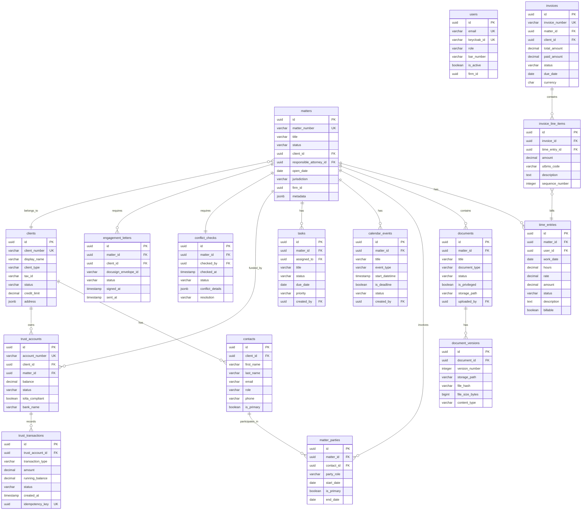

# ERD and Database Schema — Legal Case Management System

| Property       | Value                                                  |
| -------------- | ------------------------------------------------------ |
| Document Title | ERD and Database Schema — Legal Case Management System |
| System         | Legal Case Management System                           |
| Version        | 1.0.0                                                  |
| Status         | Approved                                               |
| Owner          | Architecture Team                                      |
| Last Updated   | 2025-01-15                                             |

---

## Overview

The Legal Case Management System (LCMS) database architecture follows a microservices database-per-service pattern, with each bounded context owning its persistence layer exclusively. The core domain services — Matter Management, Billing, Document Management, Trust Accounting, and Calendar & Tasks — each maintain a dedicated PostgreSQL 15 schema, preventing cross-service coupling at the data layer. Inter-service reads are handled through asynchronous event streaming via Apache Kafka, with each consumer service maintaining a materialised read-side projection of only the data it needs from foreign domains. This eliminates cross-schema JOINs in production and ensures that schema changes in one service do not cascade as breaking changes across others.

All primary keys use UUID v4 values generated by PostgreSQL's `gen_random_uuid()` function (available natively from PostgreSQL 13+), ensuring globally unique identifiers that support safe external exposure in REST and GraphQL APIs, conflict-free distributed ID generation, and seamless cross-environment data merging. JSONB columns are used throughout for flexible, schema-optional metadata — including `address`, `state_history`, and `conflict_details` — enabling structured querying via GIN indexes and PostgreSQL's `@>` containment and `#>>` path operators without requiring schema migrations for every new metadata attribute. JSONB is intentionally constrained to non-queryable or infrequently queried fields; all filter-critical attributes are promoted to typed columns.

Row-level security (RLS) is enabled on all tenant-scoped tables to enforce firm-level data isolation at the PostgreSQL engine layer, providing a defence-in-depth control beneath the application-level tenancy checks. A `firm_id UUID NOT NULL` column is present on every tenant-scoped table, and the `app.firm_id` session variable is injected by the PgBouncer connection pool from the authenticated Keycloak JWT claim before any query executes. The TimescaleDB extension converts the `time_entries` and `trust_transactions` tables into hypertables automatically partitioned by `work_date` and `created_at` respectively, enabling sub-second aggregation queries for billing dashboards and financial compliance reports across multi-year time-series datasets without manual partition management.

---

## ERD Diagram



---

## Database Schema

### `matters` Table

```sql
CREATE TYPE matter_status_enum AS ENUM (
  'INTAKE',
  'CONFLICT_CHECK',
  'ACTIVE',
  'ON_HOLD',
  'PENDING_CLOSE',
  'CLOSED',
  'ARCHIVED'
);

CREATE TYPE billing_type_enum AS ENUM (
  'HOURLY',
  'FLAT_FEE',
  'CONTINGENCY',
  'RETAINER',
  'HYBRID',
  'PRO_BONO'
);

CREATE TABLE matters (
  id                        UUID               NOT NULL DEFAULT gen_random_uuid(),
  firm_id                   UUID               NOT NULL,
  matter_number             VARCHAR(20)        NOT NULL,
  title                     VARCHAR(500)       NOT NULL,
  description               TEXT,
  status                    matter_status_enum NOT NULL DEFAULT 'INTAKE',
  practice_area_code        VARCHAR(20),
  matter_type_id            UUID,
  client_id                 UUID               NOT NULL,
  responsible_attorney_id   UUID               NOT NULL,
  originating_attorney_id   UUID,
  billing_type              billing_type_enum,
  hourly_rate               DECIMAL(10,2),
  contingency_percent       DECIMAL(5,4),
  budget_amount             DECIMAL(12,2),
  court_case_number         VARCHAR(100),
  jurisdiction              VARCHAR(100),
  open_date                 DATE,
  close_date                DATE,
  state_history             JSONB              NOT NULL DEFAULT '[]',
  metadata                  JSONB              NOT NULL DEFAULT '{}',
  version                   INTEGER            NOT NULL DEFAULT 1,
  created_by                UUID,
  created_at                TIMESTAMPTZ        NOT NULL DEFAULT NOW(),
  updated_at                TIMESTAMPTZ        NOT NULL DEFAULT NOW(),
  CONSTRAINT matters_pkey                       PRIMARY KEY (id),
  CONSTRAINT matters_firm_matter_number_unique  UNIQUE (firm_id, matter_number),
  CONSTRAINT matters_client_id_fkey             FOREIGN KEY (client_id)
                                                  REFERENCES clients (id) ON DELETE RESTRICT,
  CONSTRAINT matters_responsible_attorney_fkey  FOREIGN KEY (responsible_attorney_id)
                                                  REFERENCES users (id) ON DELETE RESTRICT
);

CREATE INDEX idx_matters_client_id             ON matters (client_id);
CREATE INDEX idx_matters_status                ON matters (status);
CREATE INDEX idx_matters_responsible_attorney  ON matters (responsible_attorney_id);
CREATE UNIQUE INDEX idx_matters_matter_number  ON matters (firm_id, matter_number);
CREATE INDEX idx_matters_open_date             ON matters USING BRIN (open_date);
CREATE INDEX idx_matters_active                ON matters (status)
  WHERE status NOT IN ('CLOSED', 'ARCHIVED');
CREATE INDEX idx_matters_metadata_gin          ON matters USING GIN (metadata);

ALTER TABLE matters ENABLE ROW LEVEL SECURITY;
CREATE POLICY firm_isolation ON matters
  USING (firm_id = current_setting('app.firm_id')::UUID);
```

---

### `clients` Table

```sql
CREATE TYPE client_type_enum AS ENUM (
  'INDIVIDUAL',
  'CORPORATION',
  'PARTNERSHIP',
  'GOVERNMENT',
  'NON_PROFIT'
);

CREATE TYPE client_status_enum AS ENUM (
  'PROSPECT',
  'ACTIVE',
  'INACTIVE',
  'FORMER',
  'BLOCKED'
);

CREATE TABLE clients (
  id                   UUID               NOT NULL DEFAULT gen_random_uuid(),
  firm_id              UUID               NOT NULL,
  client_number        VARCHAR(20)        NOT NULL,
  display_name         VARCHAR(500)       NOT NULL,
  client_type          client_type_enum   NOT NULL,
  tax_id               VARCHAR(30),
  address              JSONB,
  phone                VARCHAR(30),
  email                VARCHAR(255),
  status               client_status_enum NOT NULL DEFAULT 'ACTIVE',
  credit_limit         DECIMAL(12,2),
  outstanding_balance  DECIMAL(12,2)      NOT NULL DEFAULT 0,
  referral_source      VARCHAR(200),
  primary_contact_id   UUID,
  billing_contact_id   UUID,
  metadata             JSONB              NOT NULL DEFAULT '{}',
  version              INTEGER            NOT NULL DEFAULT 1,
  created_at           TIMESTAMPTZ        NOT NULL DEFAULT NOW(),
  updated_at           TIMESTAMPTZ        NOT NULL DEFAULT NOW(),
  CONSTRAINT clients_pkey                       PRIMARY KEY (id),
  CONSTRAINT clients_firm_client_number_unique  UNIQUE (firm_id, client_number)
);

CREATE INDEX idx_clients_firm_id      ON clients (firm_id);
CREATE INDEX idx_clients_status       ON clients (status);
CREATE INDEX idx_clients_display_name ON clients (firm_id, display_name);

ALTER TABLE clients ENABLE ROW LEVEL SECURITY;
CREATE POLICY firm_isolation ON clients
  USING (firm_id = current_setting('app.firm_id')::UUID);
```

---

### `time_entries` Table

```sql
CREATE TYPE time_entry_status_enum AS ENUM (
  'DRAFT',
  'SUBMITTED',
  'APPROVED',
  'INVOICED',
  'VOID'
);

CREATE TABLE time_entries (
  id                   UUID                   NOT NULL DEFAULT gen_random_uuid(),
  matter_id            UUID                   NOT NULL,
  user_id              UUID                   NOT NULL,
  work_date            DATE                   NOT NULL,
  hours                DECIMAL(6,2)           NOT NULL,
  rate                 DECIMAL(10,2)          NOT NULL,
  amount               DECIMAL(12,2)          GENERATED ALWAYS AS (hours * rate) STORED,
  description          TEXT                   NOT NULL,
  utbms_task_code      VARCHAR(10),
  utbms_activity_code  VARCHAR(10),
  status               time_entry_status_enum NOT NULL DEFAULT 'DRAFT',
  billable             BOOLEAN                NOT NULL DEFAULT TRUE,
  invoice_id           UUID,
  adjustment_amount    DECIMAL(12,2),
  adjustment_reason    TEXT,
  version              INTEGER                NOT NULL DEFAULT 1,
  created_by           UUID,
  created_at           TIMESTAMPTZ            NOT NULL DEFAULT NOW(),
  updated_at           TIMESTAMPTZ            NOT NULL DEFAULT NOW(),
  CONSTRAINT time_entries_pkey             PRIMARY KEY (id),
  CONSTRAINT time_entries_hours_range      CHECK (hours > 0 AND hours <= 24),
  CONSTRAINT time_entries_work_date_past   CHECK (work_date <= CURRENT_DATE),
  CONSTRAINT time_entries_matter_id_fkey   FOREIGN KEY (matter_id)
                                             REFERENCES matters (id) ON DELETE RESTRICT,
  CONSTRAINT time_entries_user_id_fkey     FOREIGN KEY (user_id)
                                             REFERENCES users (id) ON DELETE RESTRICT,
  CONSTRAINT time_entries_invoice_id_fkey  FOREIGN KEY (invoice_id)
                                             REFERENCES invoices (id) ON DELETE SET NULL
);

CREATE INDEX idx_time_entries_matter_id         ON time_entries (matter_id);
CREATE INDEX idx_time_entries_user_id           ON time_entries (user_id);
CREATE INDEX idx_time_entries_work_date         ON time_entries USING BRIN (work_date);
CREATE INDEX idx_time_entries_status            ON time_entries (status);
CREATE INDEX idx_time_entries_invoice_id        ON time_entries (invoice_id);
CREATE INDEX idx_time_entries_matter_work_date  ON time_entries (matter_id, work_date DESC);
```

---

### `invoices` Table

```sql
CREATE TYPE invoice_status_enum AS ENUM (
  'DRAFT',
  'SENT',
  'PARTIAL',
  'PAID',
  'OVERDUE',
  'VOID',
  'DISPUTED'
);

CREATE TABLE invoices (
  id                    UUID                NOT NULL DEFAULT gen_random_uuid(),
  invoice_number        VARCHAR(30)         NOT NULL,
  client_id             UUID                NOT NULL,
  matter_id             UUID                NOT NULL,
  status                invoice_status_enum NOT NULL DEFAULT 'DRAFT',
  issue_date            DATE,
  due_date              DATE,
  billing_period_start  DATE,
  billing_period_end    DATE,
  subtotal              DECIMAL(12,2)       NOT NULL DEFAULT 0,
  tax_amount            DECIMAL(12,2)       NOT NULL DEFAULT 0,
  adjustments           DECIMAL(12,2)       NOT NULL DEFAULT 0,
  total_amount          DECIMAL(12,2)       NOT NULL DEFAULT 0,
  paid_amount           DECIMAL(12,2)       NOT NULL DEFAULT 0,
  balance_due           DECIMAL(12,2)       GENERATED ALWAYS AS (total_amount - paid_amount) STORED,
  ledes_version         VARCHAR(10),
  ledes_content         TEXT,
  currency              CHAR(3)             NOT NULL DEFAULT 'USD',
  notes                 TEXT,
  version               INTEGER             NOT NULL DEFAULT 1,
  created_at            TIMESTAMPTZ         NOT NULL DEFAULT NOW(),
  updated_at            TIMESTAMPTZ         NOT NULL DEFAULT NOW(),
  CONSTRAINT invoices_pkey                  PRIMARY KEY (id),
  CONSTRAINT invoices_invoice_number_unique UNIQUE (invoice_number),
  CONSTRAINT invoices_client_id_fkey        FOREIGN KEY (client_id)
                                              REFERENCES clients (id) ON DELETE RESTRICT,
  CONSTRAINT invoices_matter_id_fkey        FOREIGN KEY (matter_id)
                                              REFERENCES matters (id) ON DELETE RESTRICT
);

CREATE INDEX idx_invoices_client_id          ON invoices (client_id);
CREATE INDEX idx_invoices_matter_id          ON invoices (matter_id);
CREATE INDEX idx_invoices_status_due_date    ON invoices (status, due_date)
  WHERE status NOT IN ('PAID', 'VOID');
```

---

### `trust_accounts` Table

```sql
CREATE TYPE trust_account_type_enum AS ENUM (
  'IOLTA',
  'NON_IOLTA',
  'ESCROW',
  'SETTLEMENT'
);

CREATE TYPE trust_account_status_enum AS ENUM (
  'ACTIVE',
  'FROZEN',
  'CLOSED',
  'PENDING_CLOSURE'
);

CREATE TABLE trust_accounts (
  id                     UUID                      NOT NULL DEFAULT gen_random_uuid(),
  account_number         VARCHAR(30)               NOT NULL,
  client_id              UUID                      NOT NULL,
  matter_id              UUID,
  bank_name              VARCHAR(200)              NOT NULL,
  routing_number         VARCHAR(9),
  bank_account_encrypted TEXT,
  account_type           trust_account_type_enum   NOT NULL DEFAULT 'IOLTA',
  balance                DECIMAL(14,2)             NOT NULL DEFAULT 0,
  minimum_balance        DECIMAL(14,2)             NOT NULL DEFAULT 0,
  status                 trust_account_status_enum NOT NULL DEFAULT 'ACTIVE',
  iolta_compliant        BOOLEAN                   NOT NULL DEFAULT TRUE,
  opened_at              DATE,
  closed_at              DATE,
  metadata               JSONB                     NOT NULL DEFAULT '{}',
  version                INTEGER                   NOT NULL DEFAULT 1,
  created_at             TIMESTAMPTZ               NOT NULL DEFAULT NOW(),
  updated_at             TIMESTAMPTZ               NOT NULL DEFAULT NOW(),
  CONSTRAINT trust_accounts_pkey               PRIMARY KEY (id),
  CONSTRAINT trust_accounts_account_number_key UNIQUE (account_number),
  CONSTRAINT trust_accounts_balance_nonneg     CHECK (balance >= 0),
  CONSTRAINT trust_accounts_client_id_fkey     FOREIGN KEY (client_id)
                                                  REFERENCES clients (id) ON DELETE RESTRICT,
  CONSTRAINT trust_accounts_matter_id_fkey     FOREIGN KEY (matter_id)
                                                  REFERENCES matters (id) ON DELETE SET NULL
);

CREATE INDEX idx_trust_accounts_client_id  ON trust_accounts (client_id);
CREATE INDEX idx_trust_accounts_matter_id  ON trust_accounts (matter_id);
CREATE INDEX idx_trust_accounts_status     ON trust_accounts (status)
  WHERE status = 'ACTIVE';
```

---

### `trust_transactions` Table

```sql
CREATE TYPE trust_transaction_type_enum AS ENUM (
  'DEPOSIT',
  'DISBURSEMENT',
  'TRANSFER',
  'ADJUSTMENT',
  'INTEREST',
  'BANK_FEE'
);

CREATE TYPE trust_transaction_status_enum AS ENUM (
  'PENDING',
  'CLEARED',
  'VOID',
  'DISPUTED'
);

CREATE TABLE trust_transactions (
  id                UUID                          NOT NULL DEFAULT gen_random_uuid(),
  trust_account_id  UUID                          NOT NULL,
  matter_id         UUID,
  transaction_type  trust_transaction_type_enum   NOT NULL,
  amount            DECIMAL(14,2)                 NOT NULL,
  running_balance   DECIMAL(14,2)                 NOT NULL,
  description       TEXT                          NOT NULL,
  payee             VARCHAR(300),
  check_number      VARCHAR(20),
  cleared_date      DATE,
  status            trust_transaction_status_enum NOT NULL DEFAULT 'PENDING',
  approved_by       UUID,
  approval_notes    TEXT,
  created_by        UUID                          NOT NULL,
  created_at        TIMESTAMPTZ                   NOT NULL DEFAULT NOW(),
  idempotency_key   UUID                          NOT NULL,
  CONSTRAINT trust_transactions_pkey                  PRIMARY KEY (id),
  CONSTRAINT trust_transactions_idempotency_key_uniq  UNIQUE (idempotency_key),
  CONSTRAINT trust_transactions_amount_positive       CHECK (amount > 0),
  CONSTRAINT trust_transactions_account_id_fkey       FOREIGN KEY (trust_account_id)
                                                         REFERENCES trust_accounts (id) ON DELETE RESTRICT,
  CONSTRAINT trust_transactions_matter_id_fkey        FOREIGN KEY (matter_id)
                                                         REFERENCES matters (id) ON DELETE SET NULL
);

CREATE INDEX idx_trust_transactions_account_id       ON trust_transactions (trust_account_id);
CREATE INDEX idx_trust_transactions_account_created  ON trust_transactions (trust_account_id, created_at DESC);
CREATE INDEX idx_trust_transactions_status           ON trust_transactions (status)
  WHERE status IN ('PENDING', 'DISPUTED');
```

---

## Indexing Strategy

| Table               | Index Name                              | Columns                                                                   | Type            | Purpose                                             |
| ------------------- | --------------------------------------- | ------------------------------------------------------------------------- | --------------- | --------------------------------------------------- |
| `matters`           | `idx_matters_client_id`                 | `(client_id)`                                                             | B-Tree          | FK lookup — all matters for a client                |
| `matters`           | `idx_matters_status`                    | `(status)`                                                                | B-Tree          | Filter matters by lifecycle status                  |
| `matters`           | `idx_matters_responsible_attorney`      | `(responsible_attorney_id)`                                               | B-Tree          | FK lookup — workload per attorney                   |
| `matters`           | `idx_matters_matter_number`             | `(firm_id, matter_number)`                                                | Unique B-Tree   | Exact matter number lookup within firm              |
| `matters`           | `idx_matters_open_date`                 | `(open_date)`                                                             | BRIN            | Date range scans over large matter history          |
| `matters`           | `idx_matters_active`                    | `(status) WHERE status NOT IN ('CLOSED','ARCHIVED')`                      | Partial B-Tree  | Active matter queries — excludes closed records     |
| `matters`           | `idx_matters_metadata_gin`              | `(metadata)`                                                              | GIN             | JSONB containment and path queries on metadata      |
| `matters`           | `idx_matters_fts`                       | `to_tsvector('english', title \|\| ' ' \|\| COALESCE(description, ''))`   | GIN             | Full-text search across matter title and description|
| `clients`           | `idx_clients_status`                    | `(status)`                                                                | B-Tree          | Active client list filter                           |
| `clients`           | `idx_clients_display_name`              | `(firm_id, display_name)`                                                 | B-Tree          | Client search by name within firm                   |
| `time_entries`      | `idx_time_entries_matter_id`            | `(matter_id)`                                                             | B-Tree          | FK lookup — all entries for a matter                |
| `time_entries`      | `idx_time_entries_user_id`              | `(user_id)`                                                               | B-Tree          | FK lookup — all entries for a timekeeper            |
| `time_entries`      | `idx_time_entries_work_date`            | `(work_date)`                                                             | BRIN            | Date range scans on time-series work date data      |
| `time_entries`      | `idx_time_entries_status`               | `(status)`                                                                | B-Tree          | Filter draft, submitted, approved entries           |
| `time_entries`      | `idx_time_entries_invoice_id`           | `(invoice_id)`                                                            | B-Tree          | FK lookup — entries billed on an invoice            |
| `time_entries`      | `idx_time_entries_matter_work_date`     | `(matter_id, work_date DESC)`                                             | B-Tree          | Chronological entry lookup per matter               |
| `invoices`          | `idx_invoices_client_id`               | `(client_id)`                                                             | B-Tree          | FK lookup — all invoices for a client               |
| `invoices`          | `idx_invoices_matter_id`               | `(matter_id)`                                                             | B-Tree          | FK lookup — all invoices for a matter               |
| `invoices`          | `idx_invoices_status_due_date`         | `(status, due_date) WHERE status NOT IN ('PAID','VOID')`                  | Partial B-Tree  | Outstanding invoice collection queries              |
| `documents`         | `idx_documents_matter_id`              | `(matter_id)`                                                             | B-Tree          | FK lookup — all documents attached to a matter      |
| `documents`         | `idx_documents_fts`                    | `to_tsvector('english', title \|\| ' ' \|\| COALESCE(description, ''))`   | GIN             | Full-text document search                           |
| `documents`         | `idx_documents_privileged`             | `(matter_id, is_privileged)`                                              | B-Tree          | Quickly isolate privileged documents per matter     |
| `trust_accounts`    | `idx_trust_accounts_client_id`         | `(client_id)`                                                             | B-Tree          | FK lookup — accounts owned by a client              |
| `trust_transactions`| `idx_trust_transactions_account_id`    | `(trust_account_id)`                                                      | B-Tree          | FK lookup — all transactions on an account          |
| `trust_transactions`| `idx_trust_transactions_account_created`| `(trust_account_id, created_at DESC)`                                    | B-Tree          | Ledger chronological queries for statement generation|
| `calendar_events`   | `idx_calendar_events_matter_id`        | `(matter_id)`                                                             | B-Tree          | FK lookup — all events linked to a matter           |
| `calendar_events`   | `idx_calendar_events_start_datetime`   | `(start_datetime)`                                                        | B-Tree          | Schedule range queries and deadline retrieval       |
| `tasks`             | `idx_tasks_assigned_to_status`         | `(assigned_to, status) WHERE status != 'DONE'`                            | Partial B-Tree  | Open task list per user                             |
| `conflict_checks`   | `idx_conflict_checks_matter_id`        | `(matter_id)`                                                             | Unique B-Tree   | One conflict check record per matter enforcement    |
| `conflict_checks`   | `idx_conflict_checks_details_gin`      | `(conflict_details)`                                                      | GIN             | JSONB search within conflict details                |

---

## Partitioning Strategy

### `time_entries` — Range Partitioning by `work_date`

Time entries are the highest-volume write table in the system, with law firms logging tens of thousands of entries per year. The table is range-partitioned quarterly on `work_date`. Each quarterly partition is stored in its own physical segment, enabling PostgreSQL's partition pruning to skip irrelevant segments during billing period queries and Elasticsearch sync jobs. Older partitions are automatically moved to cheaper AWS S3-backed tablespaces via the pg_partman extension's retention policy.

```sql
CREATE TABLE time_entries (
  id                   UUID                   NOT NULL DEFAULT gen_random_uuid(),
  matter_id            UUID                   NOT NULL,
  user_id              UUID                   NOT NULL,
  work_date            DATE                   NOT NULL,
  hours                DECIMAL(6,2)           NOT NULL,
  rate                 DECIMAL(10,2)          NOT NULL,
  amount               DECIMAL(12,2)          GENERATED ALWAYS AS (hours * rate) STORED,
  description          TEXT                   NOT NULL,
  status               time_entry_status_enum NOT NULL DEFAULT 'DRAFT',
  billable             BOOLEAN                NOT NULL DEFAULT TRUE,
  invoice_id           UUID,
  created_at           TIMESTAMPTZ            NOT NULL DEFAULT NOW(),
  updated_at           TIMESTAMPTZ            NOT NULL DEFAULT NOW()
) PARTITION BY RANGE (work_date);

CREATE TABLE time_entries_2024_q1 PARTITION OF time_entries
  FOR VALUES FROM ('2024-01-01') TO ('2024-04-01');

CREATE TABLE time_entries_2024_q2 PARTITION OF time_entries
  FOR VALUES FROM ('2024-04-01') TO ('2024-07-01');

CREATE TABLE time_entries_2024_q3 PARTITION OF time_entries
  FOR VALUES FROM ('2024-07-01') TO ('2024-10-01');

CREATE TABLE time_entries_2024_q4 PARTITION OF time_entries
  FOR VALUES FROM ('2024-10-01') TO ('2025-01-01');

CREATE TABLE time_entries_2025_q1 PARTITION OF time_entries
  FOR VALUES FROM ('2025-01-01') TO ('2025-04-01');
```

### `audit_logs` — Range Partitioning by `created_at`

The audit log table captures every state-changing event across all services and grows at approximately 5 million rows per month for a mid-size deployment. Monthly range partitions allow rapid detach and archival of old audit data without locking the parent table. The `pg_partman` background worker creates future partitions automatically on a rolling 3-month lookahead schedule.

```sql
CREATE TABLE audit_logs (
  id           UUID        NOT NULL DEFAULT gen_random_uuid(),
  firm_id      UUID        NOT NULL,
  entity_type  VARCHAR(60) NOT NULL,
  entity_id    UUID        NOT NULL,
  action       VARCHAR(30) NOT NULL,
  actor_id     UUID        NOT NULL,
  old_values   JSONB,
  new_values   JSONB,
  ip_address   INET,
  created_at   TIMESTAMPTZ NOT NULL DEFAULT NOW()
) PARTITION BY RANGE (created_at);

CREATE TABLE audit_logs_2025_01 PARTITION OF audit_logs
  FOR VALUES FROM ('2025-01-01') TO ('2025-02-01');

CREATE TABLE audit_logs_2025_02 PARTITION OF audit_logs
  FOR VALUES FROM ('2025-02-01') TO ('2025-03-01');

CREATE TABLE audit_logs_2025_03 PARTITION OF audit_logs
  FOR VALUES FROM ('2025-03-01') TO ('2025-04-01');
```

### `documents` — List Partitioning by `status`

Documents are partitioned by status to optimise the most common access patterns: active documents in drafting and review are queried far more frequently than archived or voided documents. Separating them into list partitions ensures that hot-path matter document fetches do not perform I/O on the cold archive partition.

```sql
CREATE TABLE documents (
  id             UUID        NOT NULL DEFAULT gen_random_uuid(),
  matter_id      UUID        NOT NULL,
  title          VARCHAR(500) NOT NULL,
  document_type  VARCHAR(60),
  status         VARCHAR(30) NOT NULL,
  is_privileged  BOOLEAN     NOT NULL DEFAULT FALSE,
  storage_path   TEXT        NOT NULL,
  created_at     TIMESTAMPTZ NOT NULL DEFAULT NOW()
) PARTITION BY LIST (status);

CREATE TABLE documents_active PARTITION OF documents
  FOR VALUES IN ('DRAFT', 'UNDER_REVIEW', 'APPROVED', 'EXECUTED');

CREATE TABLE documents_archived PARTITION OF documents
  FOR VALUES IN ('ARCHIVED', 'SUPERSEDED', 'VOID');
```

---

## Data Migration Considerations

### Schema Versioning with Flyway

All database schema changes are managed through Flyway, following the versioned migration naming convention `V{version}__{description}.sql` (e.g., `V1__init_schema.sql`, `V2__add_trust_accounts.sql`, `V14__add_conflict_check_resolution_column.sql`). Repeatable migrations using the `R__` prefix are reserved for views, stored procedures, and RLS policies that must be re-applied after every deployment. Migration scripts are stored in `src/main/resources/db/migration/` within each microservice repository and executed as part of the Kubernetes init container before the application pod starts, guaranteeing that the schema is always current before serving traffic.

### Zero-Downtime Migrations: Expand-Contract Pattern

Structural changes to high-traffic tables such as `time_entries` and `invoices` follow the expand-contract pattern to avoid table locks in production. The pattern proceeds across three separate deployments:

1. **Expand** — Add the new column as nullable with no constraints: `ALTER TABLE matters ADD COLUMN conflict_waived_at TIMESTAMPTZ;`. This is instantaneous in PostgreSQL 11+ and requires no table rewrite.
2. **Backfill** — Populate existing rows in batches of 5,000 using a scheduled migration job to avoid replication lag spikes: `UPDATE matters SET conflict_waived_at = updated_at WHERE conflict_waived_at IS NULL AND id > $cursor ORDER BY id LIMIT 5000;`.
3. **Contract** — Once backfill is confirmed complete and the old code path is removed, apply the constraint: `ALTER TABLE matters ALTER COLUMN conflict_waived_at SET NOT NULL;` or drop the old column if it has been superseded.

This approach ensures that the old application version and the new version can operate concurrently against the same schema during a rolling Kubernetes deployment without either crashing.

### Trust Account Balance Recalculation

During migration from a legacy system, trust account balances must be reconciled rather than trusted from the source data. The recalculation script replays all imported `trust_transactions` records in `created_at` ascending order per account, recomputes `running_balance` incrementally, and compares the final computed balance against the legacy system's closing balance. Any account with a discrepancy greater than $0.01 is flagged in the `migration_discrepancies` table for manual review by the trust accounting team before the cutover date. The recalculation runs inside a single serialisable transaction per account to prevent partial writes.

### Legacy LEDES Billing Data Import

Historical invoices from the legacy billing system are exported in LEDES98B format and parsed by a dedicated Node.js import service. Each LEDES line item is mapped to an `invoice_line_items` row, and the raw LEDES file content is stored verbatim in the `invoices.ledes_content` TEXT column to preserve the original record for bar association audit requirements. UTBMS task and activity codes extracted from the LEDES fields are normalised into `time_entries.utbms_task_code` and `time_entries.utbms_activity_code`. Duplicate detection uses a SHA-256 hash of `(firm_id, invoice_number, line_sequence)` stored in a `legacy_import_log` table to make re-runs of the import job idempotent.

### GDPR and Data Retention

All personal data tables implement soft deletion via a `deleted_at TIMESTAMPTZ` column. Application-layer queries append `WHERE deleted_at IS NULL` universally; a partial index on `(id) WHERE deleted_at IS NULL` ensures these filtered queries remain performant. Hard deletion of expired records is performed by a nightly AWS Lambda function that executes purge queries for rows where `deleted_at < NOW() - INTERVAL '7 years'` (the statutory retention period for legal billing records in most jurisdictions). The purge job writes a deletion certificate — including row count, table name, and execution timestamp — to an append-only `purge_audit_log` table before committing each batch, satisfying GDPR Article 17 accountability requirements. Client contact data subject to a Subject Access Request (SAR) is exported via a dedicated read-only Elasticsearch query against the `contacts` index, which is kept in sync via the Kafka `contacts.updated` and `contacts.deleted` event topics.
