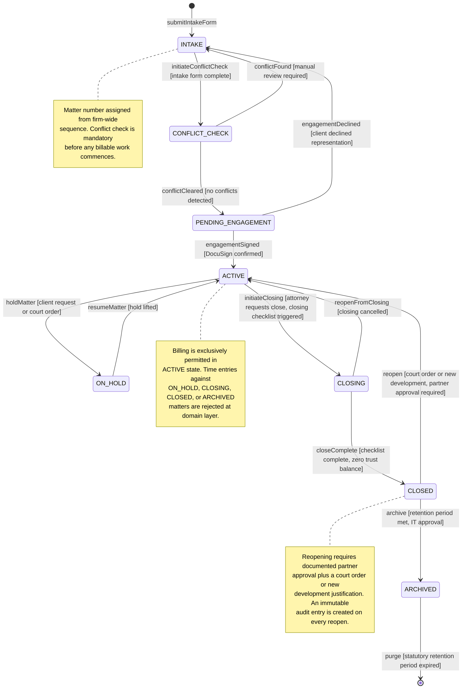
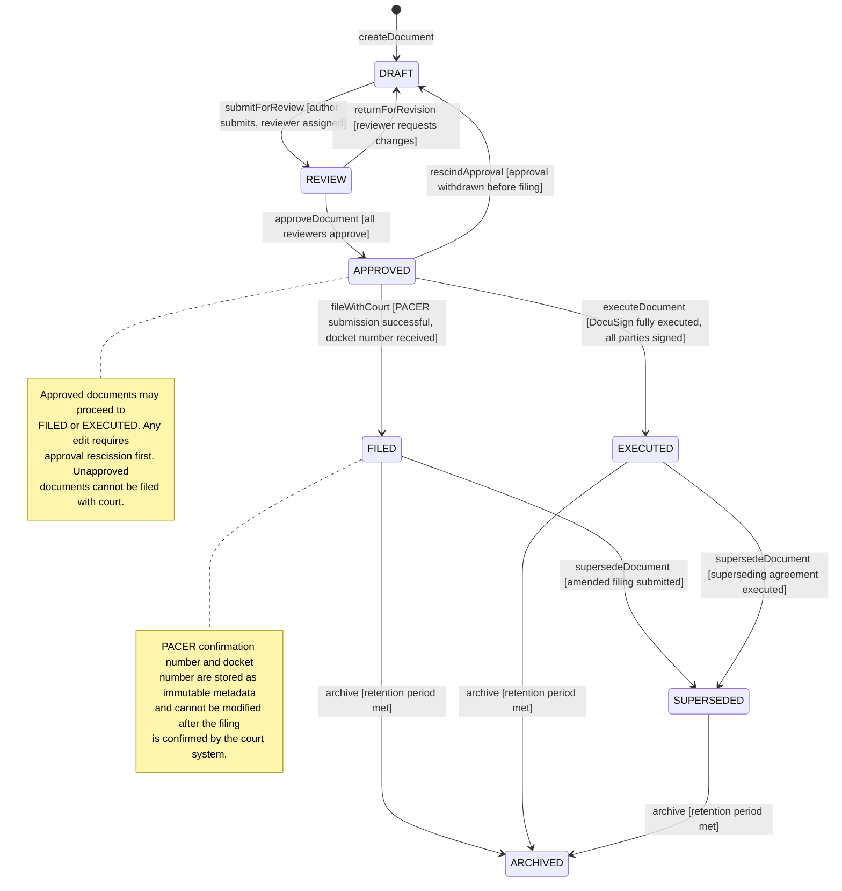
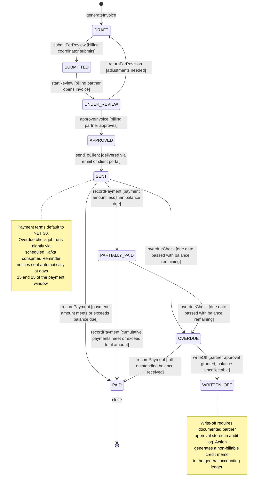
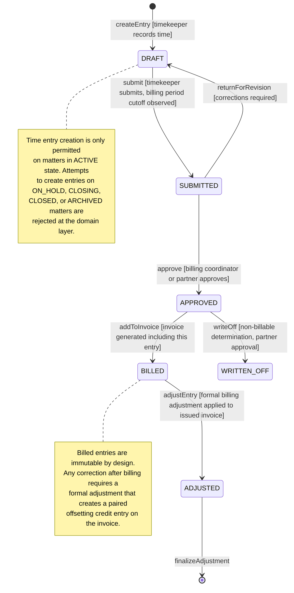
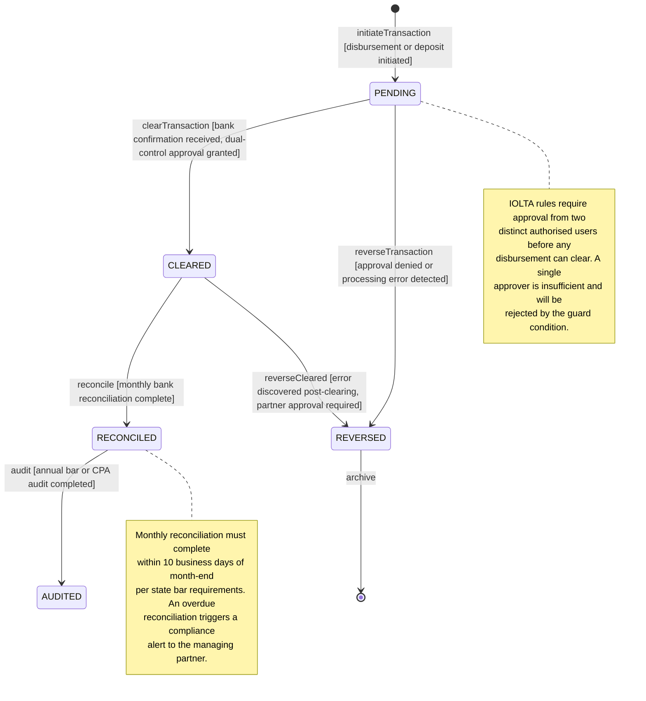

# State Machine Diagrams — Legal Case Management System

| Property       | Value                                                        |
| -------------- | ------------------------------------------------------------ |
| Document Title | State Machine Diagrams — Legal Case Management System        |
| System         | Legal Case Management System                                 |
| Version        | 1.0.0                                                        |
| Status         | Approved                                                     |
| Owner          | Architecture Team                                            |
| Last Updated   | 2025-01-15                                                   |

---

## Overview

State machines form the authoritative behavioral contract for every core domain entity in the Legal Case Management System (LCMS). By encoding permissible states and guarded transitions directly in the domain model — rather than relying on fragile application-layer conditionals — the system provides five critical guarantees fundamental to operating a law firm safely and ethically.

**Legal Workflow Integrity.** A matter cannot receive billable time entries unless it is in the `ACTIVE` state. A document cannot be filed with a court unless it has been approved. An invoice cannot be sent to a client until it has passed billing-partner review. These rules are enforced at the domain-model layer and cannot be bypassed by any API consumer, background job, or administrative override without explicit partner-level approval captured in the audit trail.

**Ethical Compliance.** Bar association rules prohibit billing clients for work performed after a matter is closed or while the matter is on hold. The state machine makes these violations structurally impossible: the `TimeEntry` domain object rejects creation if the parent matter's state is not `ACTIVE`. Attempting to submit a time entry against a `CLOSED` or `ON_HOLD` matter throws a `DomainError` with code `GUARD_FAILED` before any database write occurs.

**Trust Accounting Safety.** IOLTA and IOLA regulations require dual-control approval and full reconciliation of all trust account transactions. The `TrustAccountTransaction` state machine enforces that no transaction reaches `CLEARED` without documented approval from two distinct authorised users, and that all cleared transactions pass through `RECONCILED` before they are considered audit-ready.

**Immutable Audit Trail.** Every state transition is appended to the `state_history` JSONB column on the entity row, recording the acting user ID, the event name, the source state, the target state, and a UTC timestamp. This log is append-only and never modified after insertion, providing a tamper-evident audit trail for malpractice defence, bar association audits, and civil e-discovery obligations.

**Concurrency Safety.** An optimistic locking mechanism using a `version` integer column on each stateful entity prevents two concurrent processes from executing conflicting transitions on the same record. Any transition that reads a stale version is rejected with a `ConcurrentModificationError`, and the caller is expected to reload and retry.

All state machines are implemented as TypeScript classes in the `@lcms/domain` package. State is persisted in PostgreSQL. Side-effects such as notifications, document archival, search index updates, and billing ledger entries are delivered via Kafka events emitted synchronously within the same database transaction boundary and consumed by downstream microservices.

---

## 1. Matter Lifecycle State Machine

### States Description

| State                | Description                                                                                       | Entry Actions                                                                                           | Exit Actions                                                                         |
| -------------------- | ------------------------------------------------------------------------------------------------- | ------------------------------------------------------------------------------------------------------- | ------------------------------------------------------------------------------------ |
| `INTAKE`             | Matter intake form submitted; awaiting conflict-of-interest check clearance                       | Assign sequential matter intake number; notify intake coordinator via email; set `intake_submitted_at`  | Initiate automated conflict-check scan against party and opposing-counsel databases  |
| `CONFLICT_CHECK`     | Automated and manual conflict-of-interest review in progress                                      | Log `conflict_check_started_at`; lock matter editing; assign conflict review to responsible partner     | Record `conflict_check_completed_at`; write outcome to `conflict_check_result`       |
| `PENDING_ENGAGEMENT` | Conflict cleared; awaiting client signature on engagement letter                                  | Send engagement letter package via DocuSign to all required signatories; notify originating attorney    | Record `engagement_letter_signed_at`; create billing matter in practice ledger       |
| `ACTIVE`             | Engagement confirmed; active legal work commenced                                                 | Enable time entry creation; enable document filing; enable billing cycle; notify assigned attorneys     | Initiate closing checklist workflow; disable new time entry creation pending review  |
| `ON_HOLD`            | Matter temporarily suspended by client request or court order                                     | Suspend all billing; disable new time entry creation; notify matter team and billing coordinator        | Resume billing capability; notify matter team; record `hold_ended_at`               |
| `CLOSING`            | Closing checklist in progress: file review, final billing run, trust accounting reconciliation    | Generate final invoice for unbilled time; reconcile trust account; assign checklist to attorneys        | Confirm trust account balance is zero; confirm all documents archived                |
| `CLOSED`             | All work complete; final bill rendered; trust funds fully distributed                             | Archive all matter documents to S3; generate matter closing report; remove from active work queues      | For reopening: create audit log entry capturing partner approval and stated reason   |
| `ARCHIVED`           | Matter records transferred to long-term archive per firm retention policy                         | Move document store to S3 Glacier storage class; remove from Elasticsearch active index; set `archived_at` | N/A — terminal; purge only after statutory retention period expires              |

### State Transition Diagram



### Transition Rules

| From State           | Event                  | Guard Condition                                                                                                          | Actions                                                                          | To State             |
| -------------------- | ---------------------- | ------------------------------------------------------------------------------------------------------------------------ | -------------------------------------------------------------------------------- | -------------------- |
| —                    | `submitIntakeForm`     | `intakeForm.isComplete === true`                                                                                         | Assign intake number; notify coordinator; set `intake_submitted_at`              | `INTAKE`             |
| `INTAKE`             | `initiateConflictCheck` | `matter.intakeForm.allRequiredFieldsFilled === true`                                                                   | Start conflict scan; lock editing; log `conflict_check_started_at`               | `CONFLICT_CHECK`     |
| `CONFLICT_CHECK`     | `conflictFound`        | `conflictCheck.hasConflict === true`                                                                                     | Notify partner; flag matter; unlock editing for correction                       | `INTAKE`             |
| `CONFLICT_CHECK`     | `conflictCleared`      | `conflictCheck.status === 'CLEARED'`                                                                                     | Record completion timestamp; send engagement letter via DocuSign                 | `PENDING_ENGAGEMENT` |
| `PENDING_ENGAGEMENT` | `engagementSigned`     | `engagementLetter.signedAt !== null && engagementLetter.allPartiesSigned === true`                                       | Enable billing and time entry; notify team; create matter ledger entry           | `ACTIVE`             |
| `PENDING_ENGAGEMENT` | `engagementDeclined`   | `engagementLetter.declinedAt !== null`                                                                                   | Log declination reason; archive draft matter; notify originating attorney        | `INTAKE`             |
| `ACTIVE`             | `holdMatter`           | `holdRequest.authorizedBy !== null && holdRequest.reason !== null`                                                       | Suspend billing; disable time entry; set `hold_started_at`; notify team         | `ON_HOLD`            |
| `ON_HOLD`            | `resumeMatter`         | `holdRelease.authorizedBy !== null && holdRelease.reason !== null`                                                       | Re-enable billing and time entry; set `hold_ended_at`; notify team               | `ACTIVE`             |
| `ACTIVE`             | `initiateClosing`      | `matter.hasNoOpenDisbursements === true && closingChecklist.created === true`                                             | Disable new time entries; generate final invoice; assign checklist items         | `CLOSING`            |
| `CLOSING`            | `reopenFromClosing`    | `partner.hasApproved === true && reopenReason.provided === true`                                                         | Re-enable time entry; cancel closing checklist; log partner approval             | `ACTIVE`             |
| `CLOSING`            | `closeComplete`        | `closingChecklist.allItemsComplete === true && trustAccount.balance === 0`                                               | Archive documents; generate closing report; set `closed_at`                     | `CLOSED`             |
| `CLOSED`             | `reopen`               | `partner.hasApproved === true && (courtOrder.exists === true \|\| newDevelopment.documented === true)`                   | Create audit log entry; re-enable time entry and billing; notify team            | `ACTIVE`             |
| `CLOSED`             | `archive`              | `retentionPolicy.periodMet === true && itApproval.granted === true`                                                      | Move documents to S3 Glacier; remove from Elasticsearch active index             | `ARCHIVED`           |
| `ARCHIVED`           | `purge`                | `retentionPolicy.statutoryPeriodExpired === true && dataGovernance.approvalGranted === true`                             | Permanently delete documents; issue destruction certificate; notify records team | `[*]`                |

---

## 2. Document Lifecycle State Machine

### States Description

| State        | Description                                                                                             | Entry Actions                                                                                        | Exit Actions                                                                       |
| ------------ | ------------------------------------------------------------------------------------------------------- | ---------------------------------------------------------------------------------------------------- | ---------------------------------------------------------------------------------- |
| `DRAFT`      | Document being authored; not yet submitted for review                                                   | Create document record; assign document ID; set `created_at`; enable editing for author              | Validate document completeness; confirm at least one reviewer is assigned          |
| `REVIEW`     | Document submitted to one or more reviewers for approval                                                | Lock document editing for non-reviewers; notify all assigned reviewers; log `review_submitted_at`    | Record each reviewer's decision; log `review_completed_at`                         |
| `APPROVED`   | All required reviewers have approved; document ready for filing or execution                            | Set `approved_at`; notify document author; enable filing and execution action buttons                | For rescission: log rescission reason and rescinding approver; unlock editing      |
| `FILED`      | Document submitted to court via PACER or equivalent electronic filing system                            | Store PACER confirmation number and docket number as immutable metadata; set `filed_at`              | For supersession: retain original with superseded flag; link to successor document |
| `EXECUTED`   | Document fully executed by all required parties via DocuSign or wet ink signature                       | Store DocuSign envelope ID and all individual signature timestamps; set `executed_at`                | For supersession: retain original with superseded flag; link to successor document |
| `SUPERSEDED` | Document replaced by an amended court filing or a superseding executed agreement                        | Record `superseded_at`; link `successor_document_id`; preserve document for audit trail              | Document moves to `ARCHIVED` only after applicable retention period is met         |
| `ARCHIVED`   | Document moved to long-term archive per matter or firm retention schedule                               | Move file blob to S3 Glacier storage class; remove from Elasticsearch active index; set `archived_at` | N/A — terminal state within this state machine                                    |

### State Transition Diagram



### Transition Rules

| From State   | Event               | Guard Condition                                                                                         | Actions                                                                            | To State     |
| ------------ | ------------------- | ------------------------------------------------------------------------------------------------------- | ---------------------------------------------------------------------------------- | ------------ |
| —            | `createDocument`    | `matter.state === 'ACTIVE'`                                                                             | Assign document ID; set author and matter reference; create version 1              | `DRAFT`      |
| `DRAFT`      | `submitForReview`   | `document.requiredFieldsComplete === true && document.reviewers.length > 0`                             | Notify reviewers; lock author editing; set `review_submitted_at`                   | `REVIEW`     |
| `REVIEW`     | `returnForRevision` | `reviewer.isAssigned === true && revisionNotes.provided === true`                                       | Notify author with notes; unlock editing; log reviewer decision                    | `DRAFT`      |
| `REVIEW`     | `approveDocument`   | `document.reviewers.allApproved === true`                                                               | Set `approved_at`; notify author; enable filing and execution actions              | `APPROVED`   |
| `APPROVED`   | `fileWithCourt`     | `courtFiling.confirmationNumber !== null && courtFiling.docketNumber !== null`                          | Store docket number as immutable; notify matter team; set `filed_at`               | `FILED`      |
| `APPROVED`   | `executeDocument`   | `docuSign.envelopeStatus === 'COMPLETED' && docuSign.allPartiesSigned === true`                         | Store envelope ID; record all signature timestamps; set `executed_at`              | `EXECUTED`   |
| `APPROVED`   | `rescindApproval`   | `rescindingApprover.isOriginalApprover === true && rescissionReason.provided === true`                  | Log rescission details; notify reviewer and author; unlock editing                 | `DRAFT`      |
| `FILED`      | `supersedeDocument` | `successorDocument.state === 'FILED' && successorDocument.id !== null`                                  | Set `superseded_at`; store `successor_document_id`; notify matter team             | `SUPERSEDED` |
| `EXECUTED`   | `supersedeDocument` | `successorDocument.state === 'EXECUTED' && successorDocument.id !== null`                               | Set `superseded_at`; store `successor_document_id`; notify matter team             | `SUPERSEDED` |
| `FILED`      | `archive`           | `retentionPolicy.periodMet === true`                                                                    | Move blob to S3 Glacier; remove from Elasticsearch active index; set `archived_at` | `ARCHIVED`   |
| `EXECUTED`   | `archive`           | `retentionPolicy.periodMet === true`                                                                    | Move blob to S3 Glacier; remove from Elasticsearch active index; set `archived_at` | `ARCHIVED`   |
| `SUPERSEDED` | `archive`           | `retentionPolicy.periodMet === true`                                                                    | Move blob to S3 Glacier; remove from Elasticsearch active index; set `archived_at` | `ARCHIVED`   |

---

## 3. Invoice Lifecycle State Machine

### States Description

| State            | Description                                                                                        | Entry Actions                                                                                              | Exit Actions                                                                         |
| ---------------- | -------------------------------------------------------------------------------------------------- | ---------------------------------------------------------------------------------------------------------- | ------------------------------------------------------------------------------------ |
| `DRAFT`          | Invoice being assembled from approved time entries and disbursements                               | Create invoice record; populate from approved time entries; assign invoice number; set `created_at`        | Validate all line items; confirm billing coordinator is assigned                     |
| `SUBMITTED`      | Invoice submitted to billing partner for review                                                    | Notify billing partner; lock line-item editing; set `submitted_at`                                         | Log reviewer assignment and review start time                                        |
| `UNDER_REVIEW`   | Billing partner actively reviewing invoice line items and narratives                               | Set `review_started_at`; enable partner annotation and line-item adjustment tools                          | Log review decision and all annotation notes                                         |
| `APPROVED`       | Billing partner has approved the invoice; ready for client delivery                                | Set `approved_at`; generate PDF invoice; prepare delivery package for client                               | Log delivery method, recipient, and timestamp                                        |
| `SENT`           | Invoice delivered to client via email or client portal                                             | Set `sent_at`; record delivery method; begin payment-due countdown per agreed terms                        | Log payment receipt details or overdue trigger event                                 |
| `PARTIALLY_PAID` | One or more payments received but total outstanding balance is not yet fully satisfied             | Record partial payment amount; update `balance_due`; send payment acknowledgement to client                | Log final payment closing or overdue escalation                                      |
| `PAID`           | Invoice fully satisfied; total payments equal or exceed the invoice amount                         | Set `paid_at`; generate payment receipt; close invoice from active billing queue                           | N/A — terminal paid state                                                            |
| `OVERDUE`        | Invoice is past its due date with a non-zero outstanding balance                                   | Generate overdue notice to client; notify billing coordinator and billing partner; set `overdue_since`     | Log final payment receipt or write-off decision with partner approval                |
| `WRITTEN_OFF`    | Invoice balance determined uncollectable; written off with documented partner approval             | Set `written_off_at`; record approving partner ID; generate write-off memo; notify general accounting     | N/A — terminal written-off state                                                     |

### State Transition Diagram



### Transition Rules

| From State       | Event              | Guard Condition                                                                                             | Actions                                                                           | To State         |
| ---------------- | ------------------ | ----------------------------------------------------------------------------------------------------------- | --------------------------------------------------------------------------------- | ---------------- |
| —                | `generateInvoice`  | `matter.state === 'ACTIVE' \|\| matter.state === 'CLOSING'`                                                 | Populate from approved entries; assign invoice number; set `created_at`           | `DRAFT`          |
| `DRAFT`          | `submitForReview`  | `invoice.lineItems.length > 0 && invoice.billingCoordinator !== null`                                       | Notify billing partner; lock line items; set `submitted_at`                       | `SUBMITTED`      |
| `SUBMITTED`      | `startReview`      | `billingPartner.hasOpened === true`                                                                         | Set `review_started_at`; enable annotation and adjustment tools                   | `UNDER_REVIEW`   |
| `UNDER_REVIEW`   | `returnForRevision` | `reviewer.adjustmentNotes !== null`                                                                        | Notify billing coordinator; unlock line items; log revision reason                | `DRAFT`          |
| `UNDER_REVIEW`   | `approveInvoice`   | `billingPartner.hasApproved === true && invoice.lineItems.noPendingDisputes === true`                        | Set `approved_at`; generate PDF invoice; prepare delivery package                 | `APPROVED`       |
| `APPROVED`       | `sendToClient`     | `client.deliveryPreference !== null && client.contactEmail !== null`                                        | Deliver via preferred channel; set `sent_at`; start due-date countdown            | `SENT`           |
| `SENT`           | `recordPayment`    | `payment.amount < invoice.balanceDue`                                                                       | Record payment; update `balance_due`; send acknowledgement to client              | `PARTIALLY_PAID` |
| `SENT`           | `recordPayment`    | `payment.amount >= invoice.balanceDue`                                                                      | Record payment; set `paid_at`; generate receipt                                   | `PAID`           |
| `PARTIALLY_PAID` | `recordPayment`    | `cumulativePayments >= invoice.totalAmount`                                                                 | Record final payment; set `paid_at`; generate full receipt                        | `PAID`           |
| `SENT`           | `overdueCheck`     | `Date.now() > invoice.dueDate && invoice.balanceDue > 0`                                                    | Generate overdue notice; notify coordinator and partner; set `overdue_since`      | `OVERDUE`        |
| `PARTIALLY_PAID` | `overdueCheck`     | `Date.now() > invoice.dueDate && invoice.balanceDue > 0`                                                    | Generate overdue notice; notify coordinator and partner; set `overdue_since`      | `OVERDUE`        |
| `OVERDUE`        | `recordPayment`    | `payment.amount >= invoice.balanceDue`                                                                      | Record payment; clear overdue flag; set `paid_at`; generate receipt               | `PAID`           |
| `OVERDUE`        | `writeOff`         | `partner.hasApproved === true && writeOff.reason !== null`                                                  | Set `written_off_at`; log partner approval; generate write-off memo               | `WRITTEN_OFF`    |

---

## 4. Time Entry Lifecycle State Machine

### States Description

| State         | Description                                                                                          | Entry Actions                                                                                            | Exit Actions                                                                         |
| ------------- | ---------------------------------------------------------------------------------------------------- | -------------------------------------------------------------------------------------------------------- | ------------------------------------------------------------------------------------ |
| `DRAFT`       | Time entry created by timekeeper; not yet submitted for billing review                               | Assign time entry ID; set `created_at`; validate parent matter is in `ACTIVE` state; associate billing code | Validate hours greater than zero and narrative meets minimum length requirement   |
| `SUBMITTED`   | Time entry submitted to billing queue for coordinator review and invoice inclusion                   | Set `submitted_at`; notify billing coordinator; lock entry editing for timekeeper                        | Log approval decision or revision request details                                    |
| `APPROVED`    | Time entry reviewed and approved; eligible for inclusion in a client invoice                         | Set `approved_at`; flag entry as ready for invoicing; update timekeeper productivity metrics             | Flag as billed when included in invoice; or log write-off approval                  |
| `BILLED`      | Time entry included in a generated invoice and delivered to client                                   | Record `invoice_id` reference; set `billed_at`; mark entry as immutable in the domain layer              | Any correction requires a formal billing adjustment request                          |
| `ADJUSTED`    | Formal billing adjustment applied to a billed time entry after invoice issuance                      | Create linked paired credit or debit adjustment entry; record `adjusted_at`; notify billing coordinator  | Finalise adjustment and permanently close the adjustment workflow                   |
| `WRITTEN_OFF` | Time entry determined non-billable; written off with documented partner approval                     | Record `written_off_at`; capture partner approval ID and reason code; update non-billable statistics     | N/A — terminal state; no further transitions permitted                               |

### State Transition Diagram



### Transition Rules

| From State    | Event               | Guard Condition                                                                                          | Actions                                                                              | To State      |
| ------------- | ------------------- | -------------------------------------------------------------------------------------------------------- | ------------------------------------------------------------------------------------ | ------------- |
| —             | `createEntry`       | `matter.state === 'ACTIVE' && timekeeper.isAssignedToMatter === true`                                    | Assign entry ID; validate billing code; set `created_at`                             | `DRAFT`       |
| `DRAFT`       | `submit`            | `entry.hours > 0 && entry.narrative.length >= 10 && billingPeriod.isOpen === true`                       | Set `submitted_at`; notify billing coordinator; lock editing                         | `SUBMITTED`   |
| `SUBMITTED`   | `approve`           | `reviewer.hasApprovalPermission === true && entry.billingCode.isValid === true`                          | Set `approved_at`; flag as ready for invoicing                                       | `APPROVED`    |
| `SUBMITTED`   | `returnForRevision` | `reviewer.correctionNotes !== null`                                                                      | Notify timekeeper with notes; unlock editing; log correction request                 | `DRAFT`       |
| `APPROVED`    | `addToInvoice`      | `invoice.state === 'DRAFT' && entry.approved_at !== null`                                                | Record `invoice_id`; set `billed_at`; mark entry immutable in domain layer           | `BILLED`      |
| `BILLED`      | `adjustEntry`       | `adjustmentRequest.authorizedBy !== null && adjustmentRequest.reason !== null`                           | Create paired credit entry; set `adjusted_at`; notify billing coordinator            | `ADJUSTED`    |
| `APPROVED`    | `writeOff`          | `partner.hasApproved === true && writeOff.reasonCode !== null`                                           | Record `written_off_at`; log partner approval; update non-billable statistics        | `WRITTEN_OFF` |

---

## 5. Trust Account Transaction Lifecycle

### States Description

| State         | Description                                                                                              | Entry Actions                                                                                                   | Exit Actions                                                                                      |
| ------------- | -------------------------------------------------------------------------------------------------------- | --------------------------------------------------------------------------------------------------------------- | ------------------------------------------------------------------------------------------------- |
| `PENDING`     | Transaction initiated; awaiting mandatory dual-control approval before funds movement is authorised     | Create transaction record; assign transaction ID; notify both designated approvers; set `initiated_at`          | Record both approvals with timestamps and distinct approver user IDs                             |
| `CLEARED`     | Bank has confirmed the transaction; dual-control approval was granted and funds have moved               | Set `cleared_at`; record bank confirmation reference number; update trust account running balance ledger        | Record reconciliation completion date and reconciler user ID                                     |
| `RECONCILED`  | Transaction included in a completed monthly bank reconciliation statement                                | Set `reconciled_at`; link to reconciliation report document ID; confirm computed balance matches bank statement  | Record audit completion date and auditor professional credentials                                |
| `AUDITED`     | Transaction reviewed, verified, and signed off in an annual bar association or CPA trust audit           | Set `audited_at`; record auditor name, bar number or CPA license, and formal audit report reference             | N/A — highest assurance state; no further transitions except error reversal                       |
| `REVERSED`    | Transaction reversed due to denied approval, detected processing error, or post-clearing correction     | Set `reversed_at`; record reversal reason and authorising partner user ID; create an offsetting transaction     | Archive reversal record; notify trust accounting team; update running balance to remove original  |

### State Transition Diagram



### Transition Rules

| From State    | Event                | Guard Condition                                                                                                              | Actions                                                                                 | To State      |
| ------------- | -------------------- | ---------------------------------------------------------------------------------------------------------------------------- | --------------------------------------------------------------------------------------- | ------------- |
| —             | `initiateTransaction` | `trustAccount.isActive === true && initiator.hasTrustPermission === true`                                                   | Create record; notify designated approvers; set `initiated_at`                          | `PENDING`     |
| `PENDING`     | `clearTransaction`   | `bankConfirmation.reference !== null && approvals.count >= 2 && approvals.allDistinctApprovers === true`                     | Set `cleared_at`; update running balance; record bank reference number                  | `CLEARED`     |
| `PENDING`     | `reverseTransaction` | `approvals.anyDenied === true \|\| processingError.detected === true`                                                        | Set `reversed_at`; record reason; create offsetting transaction; notify team            | `REVERSED`    |
| `CLEARED`     | `reconcile`          | `bankReconciliation.completedAt !== null && bankReconciliation.computedBalance === bankReconciliation.statementBalance`      | Set `reconciled_at`; link to reconciliation report document                             | `RECONCILED`  |
| `RECONCILED`  | `audit`              | `auditReport.signedOff === true && auditor.credentials !== null && auditReport.reference !== null`                           | Set `audited_at`; record auditor identity and report reference                          | `AUDITED`     |
| `CLEARED`     | `reverseCleared`     | `partner.hasApproved === true && errorDescription.documented === true`                                                       | Set `reversed_at`; create offsetting transaction; update balance; notify team           | `REVERSED`    |

---

## State Transition Rules Summary

The following table consolidates the most critical compliance-enforcing transitions across all LCMS state machines. These rows represent the hard legal and ethical boundaries that the system must never permit to be bypassed, covering prohibited billing on closed matters, prohibited disbursement from trust without dual-control approval, and prohibited court filing of unapproved documents.

| State Machine   | From State           | Event                  | Guard Condition                                                                                            | Action                                                          | To State             |
| --------------- | -------------------- | ---------------------- | ---------------------------------------------------------------------------------------------------------- | --------------------------------------------------------------- | -------------------- |
| Matter          | `CONFLICT_CHECK`     | `conflictCleared`      | `conflictCheck.status === 'CLEARED'`                                                                       | Record timestamp; send engagement letter via DocuSign           | `PENDING_ENGAGEMENT` |
| Matter          | `PENDING_ENGAGEMENT` | `engagementSigned`     | `engagementLetter.signedAt !== null && engagementLetter.allPartiesSigned === true`                         | Enable billing and time entry; create matter ledger             | `ACTIVE`             |
| Matter          | `ACTIVE`             | `holdMatter`           | `holdRequest.authorizedBy !== null`                                                                        | Suspend billing; disable time entries; notify team              | `ON_HOLD`            |
| Matter          | `ON_HOLD`            | `resumeMatter`         | `holdRelease.authorizedBy !== null && holdRelease.reason !== null`                                         | Restore billing and time entry access; notify team              | `ACTIVE`             |
| Matter          | `CLOSING`            | `closeComplete`        | `closingChecklist.allItemsComplete === true && trustAccount.balance === 0`                                 | Archive docs; generate closing report; set `closed_at`          | `CLOSED`             |
| Matter          | `CLOSED`             | `reopen`               | `partner.hasApproved === true && courtOrder.exists === true`                                               | Create immutable audit entry; re-enable billing                 | `ACTIVE`             |
| Matter          | `CLOSED`             | `archive`              | `retentionPolicy.periodMet === true && itApproval.granted === true`                                        | Move to S3 Glacier; remove from active Elasticsearch index      | `ARCHIVED`           |
| Document        | `DRAFT`              | `submitForReview`      | `document.requiredFieldsComplete === true && reviewers.assigned === true`                                  | Notify reviewers; lock author editing; set submit timestamp     | `REVIEW`             |
| Document        | `REVIEW`             | `approveDocument`      | `document.reviewers.allApproved === true`                                                                  | Set `approved_at`; enable filing and execution actions          | `APPROVED`           |
| Document        | `APPROVED`           | `fileWithCourt`        | `courtFiling.confirmationNumber !== null && courtFiling.docketNumber !== null`                             | Store immutable docket number; notify matter team               | `FILED`              |
| Document        | `APPROVED`           | `rescindApproval`      | `rescissionReason.provided === true`                                                                       | Log rescission; unlock editing; notify reviewer and author      | `DRAFT`              |
| Document        | `FILED`              | `supersedeDocument`    | `successorDocument.state === 'FILED'`                                                                      | Set `superseded_at`; link successor document reference          | `SUPERSEDED`         |
| Invoice         | `UNDER_REVIEW`       | `approveInvoice`       | `billingPartner.hasApproved === true && invoice.lineItems.noPendingDisputes === true`                       | Set `approved_at`; generate PDF invoice                         | `APPROVED`           |
| Invoice         | `SENT`               | `overdueCheck`         | `Date.now() > invoice.dueDate && invoice.balanceDue > 0`                                                   | Generate overdue notice; notify coordinator and partner         | `OVERDUE`            |
| Invoice         | `SENT`               | `recordPayment`        | `payment.amount >= invoice.balanceDue`                                                                     | Set `paid_at`; generate payment receipt                         | `PAID`               |
| Invoice         | `OVERDUE`            | `writeOff`             | `partner.hasApproved === true && writeOff.reason !== null`                                                 | Set `written_off_at`; generate write-off memo                   | `WRITTEN_OFF`        |
| Time Entry      | `DRAFT`              | `createEntry`          | `matter.state === 'ACTIVE'`                                                                                | Assign entry ID; validate billing code; set `created_at`        | `DRAFT`              |
| Time Entry      | `APPROVED`           | `addToInvoice`         | `invoice.state === 'DRAFT' && entry.approved_at !== null`                                                  | Record invoice reference; mark entry immutable                  | `BILLED`             |
| Time Entry      | `APPROVED`           | `writeOff`             | `partner.hasApproved === true && writeOff.reasonCode !== null`                                             | Record `written_off_at`; log partner approval ID                | `WRITTEN_OFF`        |
| Trust Account   | `PENDING`            | `clearTransaction`     | `approvals.count >= 2 && approvals.allDistinctApprovers === true && bankConfirmation.reference !== null`   | Update running balance; record bank confirmation reference      | `CLEARED`            |
| Trust Account   | `CLEARED`            | `reverseCleared`       | `partner.hasApproved === true && errorDescription.documented === true`                                     | Create offsetting transaction; update balance; notify team      | `REVERSED`           |
| Trust Account   | `CLEARED`            | `reconcile`            | `bankReconciliation.computedBalance === bankReconciliation.statementBalance`                               | Link to reconciliation report; set `reconciled_at`              | `RECONCILED`         |
| Trust Account   | `RECONCILED`         | `audit`                | `auditReport.signedOff === true && auditor.credentials !== null`                                           | Record auditor identity, license, and report reference          | `AUDITED`            |

---

## Implementation Notes

### State Machine Architecture

Each stateful domain entity implements a `StateMachine<TState, TEvent>` generic class located at `packages/domain/src/core/StateMachine.ts`. The class accepts a `TransitionMap` at construction time that defines every valid transition as a record keyed by source state and event name. Each transition entry carries a `guard` predicate, an optional `exitAction` async function, an optional `entryAction` async function, and a `targetState`. The public `transition` method enforces the full lifecycle atomically:

```typescript
export class StateMachine<TState extends string, TEvent extends string> {
  constructor(
    private readonly transitions: TransitionMap<TState, TEvent>,
    private readonly repository: StateRepository<TState>,
    private readonly eventBus: KafkaEventBus,
  ) {}

  async transition(
    entityId: string,
    event: TEvent,
    context: TransitionContext,
  ): Promise<void> {
    const entity = await this.repository.findByIdWithLock(entityId);

    const rule = this.transitions[entity.state]?.[event];
    if (!rule) {
      throw new DomainError(
        'INVALID_TRANSITION',
        `No transition defined for event '${event}' from state '${entity.state}'.`,
      );
    }

    if (!rule.guard(entity, context)) {
      throw new DomainError(
        'GUARD_FAILED',
        `Transition guard rejected event '${event}' from state '${entity.state}'.`,
      );
    }

    await rule.exitAction?.(entity, context);
    const newState = rule.targetState;
    await rule.entryAction?.(entity, context);

    await this.repository.updateStateWithVersion(
      entityId,
      newState,
      entity.version,
      { event, actorId: context.actorId },
    );

    await this.eventBus.publish(`lcms.${entity.entityType}.stateChanged`, {
      entityId,
      fromState: entity.state,
      toState: newState,
      event,
      actorId: context.actorId,
      timestamp: new Date().toISOString(),
    });
  }
}
```

### Invalid Transition Handling

Any attempt to trigger an undefined transition — such as attempting to file a document that is still in `DRAFT`, or attempting to submit a time entry against a `CLOSED` matter — throws a `DomainError` with a structured error code and a human-readable message. The Kong API Gateway error-handling plugin maps `DomainError` instances with code `INVALID_TRANSITION` or `GUARD_FAILED` to HTTP `422 Unprocessable Entity` responses. The response body includes the error code, the message, and the current entity state so that API consumers can display meaningful feedback to end users without exposing internal domain logic.

### Kafka Event Integration

Every successful state transition publishes a structured event to a Kafka topic following the naming convention `lcms.<entity-type>.stateChanged`. Downstream microservices — including the Notification Service, Document Archive Service, Billing Service, Search Indexing Service, and the Compliance Reporting Service — subscribe to these topics via Kafka consumer groups and execute their respective side effects asynchronously. This architecture decouples state enforcement from side-effect execution: a transient failure in the email notification service does not roll back a legitimate state transition.

All Kafka event schemas for the `lcms.*.stateChanged` topic family are governed by Avro schemas registered in the Confluent Schema Registry under the subject `lcms-state-events-v1`. Any change to the event payload that removes a field or changes a field type constitutes a breaking change and requires a new schema version and a coordinated consumer migration plan.

### PostgreSQL Persistence

State is persisted in the `state` column, typed as PostgreSQL `TEXT` with a `CHECK` constraint that restricts valid values to the declared states of the owning entity type. In addition, every stateful entity table includes the following supporting columns:

- **`version` (`INTEGER NOT NULL DEFAULT 0`):** Incremented by one on every successful state transition. Used for optimistic locking. The `UPDATE` statement in `updateStateWithVersion` targets `WHERE id = $1 AND version = $2`; if zero rows are affected, the method raises `ConcurrentModificationError` and the caller is expected to reload the entity and retry the transition.
- **`state_history` (`JSONB NOT NULL DEFAULT '[]'`):** An append-only JSON array. Each element records `{ "fromState", "toState", "event", "actorId", "timestamp", "metadata" }`. Entries are never modified or deleted, providing a tamper-evident chronological audit trail of every state change over the entity's full lifetime.
- **`state_changed_at` (`TIMESTAMPTZ NOT NULL`):** Timestamp of the most recent state transition, indexed with a B-tree index for efficient querying of recently modified entities by billing and reporting jobs.

The atomic state update with optimistic locking is executed as a single PostgreSQL statement:

```sql
UPDATE matters
SET
    state            = $1,
    version          = version + 1,
    state_changed_at = NOW(),
    state_history    = state_history || $2::jsonb
WHERE
    id      = $3
AND version = $4;
-- If 0 rows updated, caller raises ConcurrentModificationError and retries
```

### Redis State Cache

The current state of all active entities is cached in Redis with a TTL of 300 seconds using the key pattern `lcms:state:<entity-type>:<entity-id>`. The `StateRepository` invalidates the cache entry synchronously on every successful state transition before publishing the Kafka event. Read-heavy operations such as billing eligibility checks, document filing permission checks, and dashboard status queries read from the Redis cache to reduce PostgreSQL read load during peak hours. The cache is never treated as the authoritative source of truth: any write-path operation always reads from PostgreSQL using a row-level lock (`SELECT ... FOR UPDATE`) to prevent race conditions.

---

*This document is maintained by the Architecture Team. All state machine changes — including additions of new states, removal of transitions, or modification of guard conditions — must be reviewed and approved through the Architecture Decision Record (ADR) process before implementation. Unauthorised changes to state machine logic may violate bar association compliance requirements and firm malpractice insurance conditions.*
