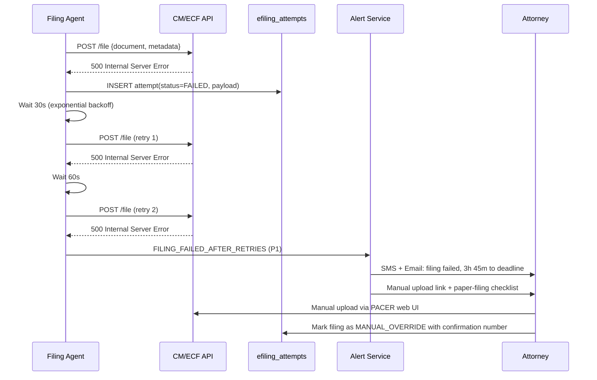
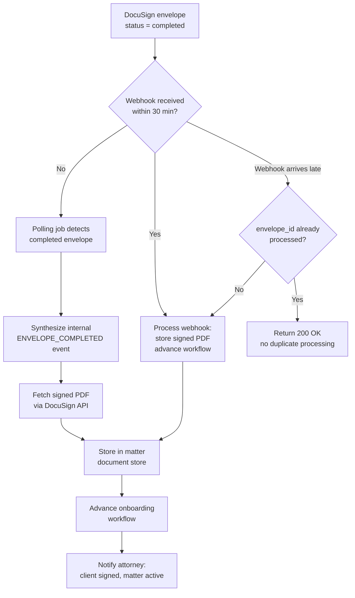
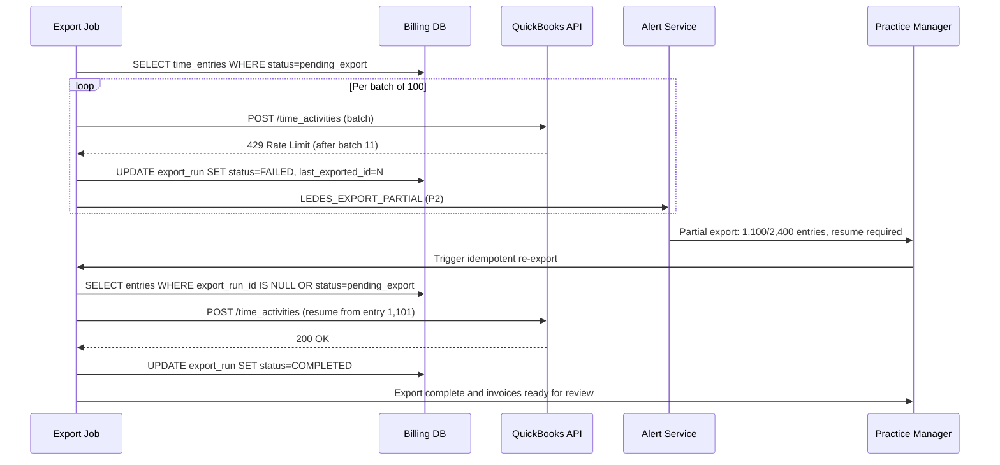
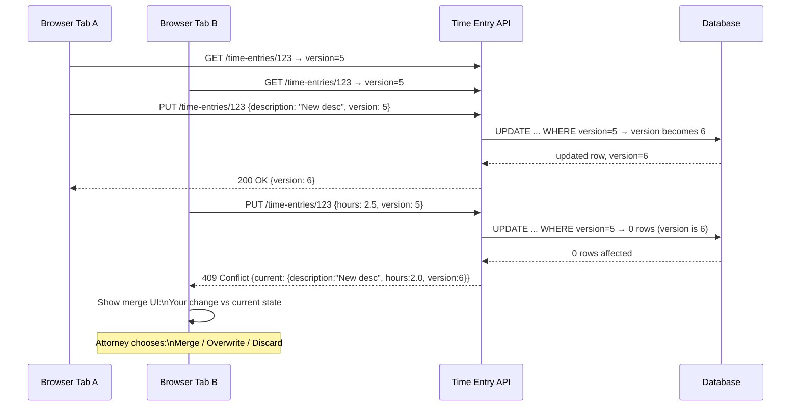

# API and UI Edge Cases

Domain: Law firm SaaS — court e-filing (CM/ECF), DocuSign e-signatures, LEDES billing exports, external API integrations, time-entry concurrency.

---

## Court E-Filing API Failure

### Scenario

The automated CM/ECF filing agent submits a brief via the PACER e-filing API and receives an HTTP 500 Internal Server Error. The response body contains no structured error; the filing deadline is 4 hours away. The system cannot confirm whether the document was received or partially ingested by the court's system.

### Detection

- Every API call to `CourtFilingService` is wrapped with a structured response parser; any non-2xx status writes a `FILING_ATTEMPT_FAILED` record to `efiling_attempts` with full request/response payload.
- A filing is considered "confirmed" only when a PACER confirmation number is stored in `efiling_confirmations`; any filing older than 15 minutes without a confirmation number triggers `FILING_UNCONFIRMED` alert.
- Distinct from a transient network error (which resolves within 1–2 retries), a 500 from CM/ECF is treated as potentially stateful — the server may have partially processed the document.

### System Response

### Manual Steps

1. Attorney logs into PACER directly and checks the court's docket for the matter — if the document appears, the filing succeeded despite the 500; record the confirmation number.
2. If the document is not on the docket, proceed with manual upload via the PACER web interface.
3. If manual upload also fails, prepare paper filing and contact the clerk immediately.
4. After resolution, submit a support ticket to PACER describing the 500 response; retain the raw response body as evidence in case of a timeliness dispute.
5. Audit the filing attempt record to ensure the final confirmation number is stored before closing the incident.

### Prevention

- **Idempotency key** included in every filing request header; if CM/ECF supports it, duplicate submissions will be rejected rather than double-filed.
- **Pre-filing dry-run**: validate document format and metadata against CM/ECF schema 24 h before deadline; surface errors early.
- Automated filing is initiated at T-4 h minimum; T-1 h is the trigger for immediate escalation regardless of retry state.
- Retry strategy: max 3 attempts with 30 s / 60 s / 120 s backoff; do not exceed 3 retries as duplicate filing risk rises.

---

## DocuSign Webhook Timeout

### Scenario

A retainer agreement sent via DocuSign is signed by the client. DocuSign fires a completion webhook to the platform, but the webhook endpoint is temporarily unreachable (deploy was in progress, 2-minute downtime). DocuSign marks the delivery as failed and does not automatically retry on its default exponential schedule for another 4 hours. The matter's onboarding workflow is stalled waiting for the signed document.

### Detection

- DocuSign is configured to send webhooks to `/api/webhooks/docusign`; the endpoint records every delivery in `webhook_deliveries` with `source=DOCUSIGN`, `event_type`, `envelope_id`, and `received_at`.
- A **polling fallback job** runs every 10 minutes and queries `DocuSign:GetEnvelope` for all envelopes in `SENT` status older than 30 minutes; if the API returns `completed` but no webhook was received, the job synthesizes a `ENVELOPE_COMPLETED` event internally.
- Duplicate webhook detection: envelope_id + event_type is a unique index on `webhook_deliveries`; a replayed webhook returns 200 OK immediately without reprocessing.

### System Response

### Manual Steps

1. If the polling job has not yet run, attorney can manually trigger a "Check DocuSign Status" action from the matter page; this calls `GetEnvelope` on demand.
2. If the signed PDF is not retrievable via API (DocuSign API outage), the attorney requests the client forward the DocuSign email completion PDF directly.
3. Document is manually uploaded to the matter with source noted as `MANUAL_DOCUSIGN_RECOVERY`.
4. Check whether the missed webhook caused any cascading workflow delays (e.g., billing clock not started, court filing not triggered); manually advance each stalled step.

### Prevention

- Webhook endpoint is excluded from zero-downtime deploy drain; deploys use a blue-green strategy so the endpoint is never offline.
- All DocuSign envelopes in `SENT` status for > 60 minutes without a completion event are surfaced on an attorney dashboard widget.
- Deadline impact assessment: if a signed retainer is required before a court filing, the dependency is modeled explicitly in the workflow DAG; the filing step cannot advance without the signed document, providing a clear blocking indicator.

---

## Billing Export Failure (LEDES)

### Scenario

During month-end processing, the LEDES 1998B export job begins transferring 2,400 time entries and 180 expense entries to QuickBooks Online via its API. After 1,100 time entries are pushed, QuickBooks returns a rate-limit error (429), and the job terminates without completing. The system now has 1,100 entries marked `exported` and 1,300 still `pending_export`, with the monthly client invoices not yet generated.

### Detection

- The export job writes a `billing_export_run` record with `status=IN_PROGRESS` at start; it is updated to `COMPLETED` or `FAILED` atomically at the end of the run.
- Any `billing_export_run` with `status=IN_PROGRESS` for > 30 minutes triggers `EXPORT_JOB_STALLED` alert.
- Each time entry's export status (`pending → exported`) is updated individually within the job transaction; on failure, entries already exported are NOT rolled back (they are in QuickBooks), but their IDs are captured in `export_run_items`.

### System Response

### Manual Steps

1. Do not trigger a full re-export without checking the partial state — this risks duplicating the 1,100 entries already in QuickBooks.
2. In QuickBooks, verify the last successfully imported entry ID; use this as the resume cursor for the re-export.
3. If QuickBooks shows duplicates (unlikely but possible if the entry was written then the 429 arrived), use the `billing_export_run_items` table to identify and void duplicates.
4. If the re-export cannot complete before invoice due date, generate invoices manually in QuickBooks for the exported entries and flag the remainder for a supplemental invoice.
5. Notify affected clients if invoices will be delayed beyond the contractual billing cycle.

### Prevention

- QuickBooks API rate limits (150 req/min) are respected via a token-bucket rate limiter in the export job; batch size of 50 with 800 ms delay between batches stays well under limit.
- Export job is **idempotent**: each time entry carries an `external_quickbooks_id` field; entries already in QuickBooks are skipped on re-run.
- Month-end export is scheduled for the 25th of the month, not the last day, to provide recovery time.

---

## API Rate Limiting by External Service

### Scenario

The case intake module performs real-time bar association license verification for newly onboarded attorneys using a state bar lookup API. During a large batch onboarding (40 attorneys imported via CSV), all 40 requests are fired concurrently. The bar API (which permits 5 requests/minute) throttles after the first 5 requests and returns 429 for the remaining 35. The import completes with 35 attorneys marked `bar_verification_pending`, blocking them from being assigned to matters.

### Detection

- The `BarVerificationService` wraps the external API call; any 429 response increments `rate_limit_counter` in Redis with a 60-second TTL.
- When `rate_limit_counter > 3` within a sliding window, the service enters **degraded mode**: new verification requests are enqueued rather than executed immediately, and the UI shows a "Verification in progress" badge instead of blocking access.
- CSV import jobs detect concurrent-call risk and automatically serialize requests with configurable delay between each.

### System Response

- Requests that receive 429 are placed on a `bar_verification_queue` (SQS/Redis queue) with a `retry_after` timestamp parsed from the `Retry-After` response header.
- A queue consumer processes one item per minute in compliance with the 5 req/min limit, with a 4-item buffer to avoid exhausting the quota.
- Cache-first strategy: once a bar number is successfully verified, the result is cached for 30 days; re-verification requests for the same number are served from cache.
- Degraded mode allows attorneys to be assigned to matters provisionally; a `PENDING_BAR_VERIFICATION` flag is surfaced on the matter page.

### Manual Steps

1. If a specific attorney assignment is urgent, practice manager can manually trigger a single bar verification request and wait for the result.
2. If the bar API is persistently unavailable, the attorney can upload a copy of their bar card; a supervisor manually marks the verification as `OVERRIDE_MANUAL` with their user ID logged.
3. After queue processing completes, audit the `bar_verification_results` table to confirm all 40 attorneys are verified.

### Prevention

- All external API clients are instantiated with a rate-limit-aware wrapper that reads API quota from config and enforces a token bucket.
- CSV batch imports use a configurable `requests_per_second` parameter defaulting to the lowest known external limit.
- Results are cached aggressively (bar license validity typically changes only at annual renewal); TTL aligned with state bar renewal cycles.

---

## Optimistic Lock Conflict on Time Entry

### Scenario

Two browser tabs belonging to the same attorney are open on the same time entry (a common pattern when attorneys keep a second tab open as a reference). The attorney edits the description in Tab A and submits. While the Tab A request is in flight, Tab B (which loaded the same entry 4 minutes earlier) also submits an edit to the hours field. Tab B's submission arrives at the server 200 ms after Tab A's, and without concurrency control, Tab B's write silently overwrites Tab A's description change.

### Detection

- Every time entry row carries a `version` integer (optimistic lock column); the frontend sends the `version` it read alongside any update request.
- The update query is: `UPDATE time_entries SET ... WHERE id = ? AND version = ? RETURNING version`.
- If `RETURNING version` returns no rows, the update was rejected (version mismatch); the server returns HTTP 409 Conflict with a conflict payload containing the current server state.

### System Response

### Manual Steps

1. The 409 Conflict response triggers a non-blocking merge dialog in the UI: it shows the conflicting fields side by side with the current server state.
2. The attorney selects one of three resolution strategies: **Merge** (apply their change to the latest version), **Overwrite** (force-submit their full entry), or **Discard** (abandon their edit).
3. Overwrite submits with the current server `version` — this constitutes a force-write and is logged in `time_entry_audit_log` with `conflict_resolution=OVERWRITE`.
4. If the conflict UI fails to appear (e.g., the error is swallowed by a JS error), the attorney refreshes the page — the latest server state is always displayed on fresh load.

### Prevention

- **Auto-save with lock awareness**: drafts are saved to `localStorage` every 30 seconds; before auto-save promotion to the server, the version is rechecked.
- The time entry form detects when another tab has the same entry open (via `BroadcastChannel` API) and shows a warning banner: "This entry is open in another tab."
- Billing admin can view the full version history of any time entry from the audit log, including all conflict resolutions, for up to 7 years (retention policy).
- Merge strategy preference is configurable per firm: `last-write-wins` (default for smaller firms) or `always-prompt` (default for firms > 10 attorneys).

---

## Integration Reliability Summary

All five edge cases above share a common reliability architecture. The table below summarises the key guardrails applied consistently across all external integrations.

| Integration | Retry Strategy | Circuit Breaker | Idempotency | Fallback |
|---|---|---|---|---|
| CM/ECF E-Filing | Exponential backoff, max 3 attempts | Opens after 5 failures / 60 s | Idempotency key per submission | Manual PACER web upload |
| DocuSign Webhooks | Polling every 10 min after 30 min gap | N/A (push model) | Unique index on envelope_id + event | Manual status fetch + upload |
| QuickBooks (LEDES) | Token-bucket rate limiter, resume cursor | N/A (batch job) | `external_quickbooks_id` skip-if-exists | Manual QB entry + supplemental invoice |
| Bar Association API | Queue-based retry with `Retry-After` header | Degraded mode after 3 consecutive 429s | Cache-first (30-day TTL) | Manual bar card upload + supervisor override |
| Time Entry API | Optimistic locking (version column) | N/A (synchronous) | Version-gated update query | 409 Conflict merge UI |

### Cross-Cutting Alerting Rules

- Any external API returning non-2xx for > 3 consecutive calls within 5 minutes: P1 alert to on-call engineer.
- Any integration in degraded mode for > 30 minutes: escalate to P0 and notify practice manager.
- All integration failures are correlated against active court deadlines; if a failing integration is on the critical path for a deadline within 4 hours, it automatically upgrades to P0 regardless of the standard threshold.
- Weekly integration health report delivered to the engineering lead, summarising retry rates, circuit breaker trips, and fallback activations per integration.
