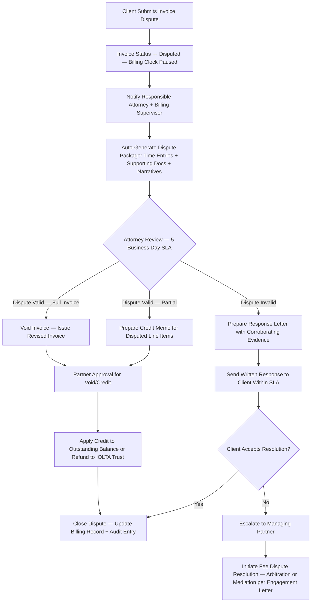
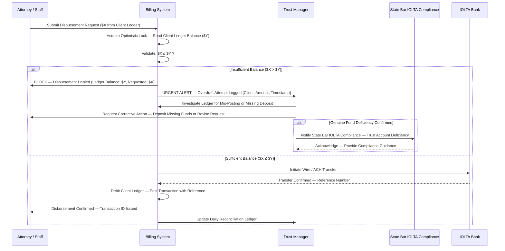
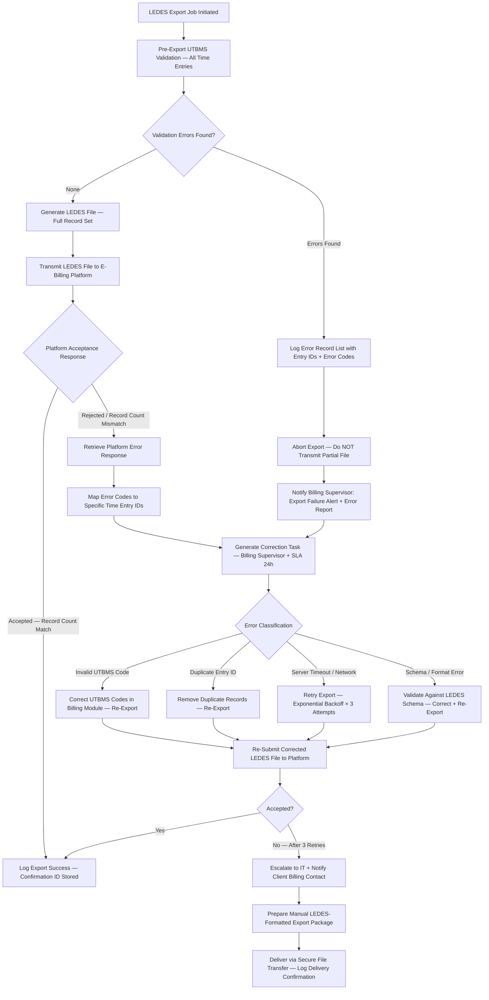

# Billing and Time Tracking Edge Cases

Domain: Legal Case Management System — Law Firm SaaS

---

## Invoice Dispute

### Scenario Description

A client formally disputes one or more line items on a rendered invoice, alleging overbilling, duplicate time entries, incorrect billing rates, vague narratives, or work that was never performed or was not authorized. Disputes must be resolved in compliance with ABA billing ethics guidelines and the dispute process specified in the engagement letter, while preserving the firm's right to collect legitimate fees.

### Detection Mechanism

- Client submits a dispute through the client portal's "Dispute Invoice" feature, selecting specific line items and entering a mandatory reason code and narrative.
- Client sends a written dispute letter via email or post; intake staff manually flags the corresponding invoice as "Disputed" in the billing module and assigns a dispute ticket.
- Automatic dispute trigger: invoice unpaid beyond the grace period with a concurrent portal message or email referencing billing concerns — the system flags the invoice for review rather than sending an overdue notice.

### System Response

### Manual Intervention Steps

1. **Time Entry Evidence Review** — The responsible attorney retrieves supporting documentation corroborating each disputed time entry: court filing receipts, email thread timestamps, meeting calendar entries, research platform access logs, and contemporaneous notes.
2. **Billing Adjustment** — If the dispute is valid in whole or in part, the billing supervisor prepares a credit memo for the specific disputed line items, itemizing the credit amount and the reason. Credit memos require partner approval before issuance.
3. **Credit Memo Generation** — The credit memo must reference the original invoice number, the disputed line item descriptions, the credit amount, and the stated basis for the credit. It is attached to both the matter billing record and the client portal invoice history.
4. **Client Communication** — Send a written response within 5 business days of receiving the dispute, either accepting it with a credit memo or providing a reasoned defense of each disputed charge with supporting evidence.
5. **Fee Arbitration** — If the dispute cannot be resolved bilaterally, refer to the state bar's mandatory fee arbitration program (where applicable) or the dispute resolution mechanism specified in the engagement letter.
6. **Billing Record Update** — Regardless of outcome, update the matter billing record to reflect the dispute ticket reference, any adjustments made, the basis for the adjustment, and the resolution status. This record is retained for seven years.

### Prevention Measures

- Require detailed narrative descriptions on all time entries (enforced minimum of 50 characters); entries with vague descriptions ("review file," "conference") are automatically flagged for supplementation during the pre-bill review.
- Conduct a mandatory pre-bill review with the responsible attorney before each invoice is finalized and sent; attorneys must electronically certify the accuracy of their time entries.
- Send interim billing statements monthly on all active matters regardless of billing frequency, so that clients can surface concerns before they accumulate into a large contested invoice.
- Include a clear, plain-language dispute process in every engagement letter, specifying the dispute window (30 days from receipt), the submission method, and the escalation path.

### Compliance Implications

- **ABA Model Rule 1.5** requires that fees be reasonable; billing for non-existent work, block billing that obscures individual task durations, or billing multiple clients for the same work constitutes professional misconduct and may result in disbarment.
- State bar disciplinary rules in many jurisdictions mandate fee arbitration as the required first step before any civil collection action; check local rules before initiating litigation to collect disputed fees.
- Credit memos and billing adjustments must be retained in the matter billing file for a minimum of seven years and are discoverable in malpractice and disciplinary proceedings.
- Recurring patterns of billing disputes on a specific attorney's matters should trigger a billing audit by the firm's ethics committee, independent of any individual dispute resolution.

---

## IOLTA Trust Account Overdraft

### Scenario Description

A disbursement request is submitted against a client's individual ledger within the firm's IOLTA (Interest on Lawyers' Trust Accounts) trust account, but the disbursement amount exceeds the available balance in that client's ledger. An overdraft would cause the firm to disburse funds belonging to other clients — a per se commingling violation — or to draw down the aggregate trust balance below zero. Either outcome is a serious ethics violation that mandates immediate bar notification in most jurisdictions.

### Detection Mechanism

- The disbursement entry workflow applies **optimistic locking** on the client ledger record before any write is committed: the system reads the current balance, calculates the post-disbursement balance, and rejects the write if `requested_amount > client_ledger_balance` at the moment of commit.
- A real-time balance validation step within the disbursement UI prevents submission of any request exceeding the available client ledger balance, surfacing an immediate blocking error to the user.
- Nightly three-way reconciliation — individual client ledgers vs. aggregate IOLTA account balance vs. bank statement — surfaces any discrepancy that may indicate a mis-posted transaction or unauthorized withdrawal.

### System Response

### Manual Intervention Steps

1. **Ledger Investigation** — Trust manager audits the individual client ledger to identify the source of the shortfall: unposted retainer deposit, data entry error, duplicate disbursement, or missing wire confirmation.
2. **Corrective Deposit** — If the firm owes additional funds to the client's trust ledger (e.g., a retainer check that was never posted), initiate the corrective deposit immediately, post it to the correct ledger entry, and re-submit the disbursement request.
3. **Bar Ethics Notification** — If the investigation confirms a genuine deficiency in client funds — meaning funds that should exist are missing and cannot be accounted for — the state bar's IOLTA compliance officer must be notified immediately. Prompt self-reporting is a significant mitigating factor in disciplinary proceedings.
4. **Bank Reconciliation** — Perform an emergency three-way reconciliation: sum of all individual client ledger balances must equal the aggregate trust account balance on the system, which must equal the bank statement balance. Any discrepancy must be documented and corrected.
5. **Root Cause Analysis** — Investigate and document the root cause: billing entry error, concurrent-transaction race condition (mitigated by optimistic locking), wire fraud, unauthorized internal disbursement, or bank error. Implement a corrective action plan.

### Prevention Measures

- Enforce a non-bypassable hard block on any disbursement where `requested_amount > client_ledger_balance`; the block may be overridden only by the trust account supervisor with a documented written justification attached to the override record.
- Perform mandatory monthly three-way reconciliation of individual client ledgers, aggregate trust account balance, and bank statement; reconciliation sign-off by the billing supervisor is required before the next billing cycle.
- Restrict trust account disbursement permissions to a named list of authorized personnel; require dual-authorization (two approvers) for any single disbursement above a configurable threshold (default: $10,000).
- Generate daily email summaries of all trust account transactions to the managing partner and billing supervisor; anomalies are reviewable before end of business day.

### Compliance Implications

- **ABA Model Rule 1.15** and all state IOLTA regulations impose strict liability for trust account management; an overdraft caused by disbursing funds belonging to another client is commingling and a per se ethics violation regardless of intent.
- Mandatory self-reporting requirements apply in most jurisdictions when trust account deficiencies are discovered; the obligation to report arises immediately upon confirmation of the deficiency and cannot be deferred pending investigation.
- Trust account records — every receipt, disbursement, ledger card, bank statement, and reconciliation — must be retained for a minimum of five years and must be available for bar inspection on demand.
- A confirmed trust account violation triggers mandatory discipline in most jurisdictions; the severity of sanctions (reprimand, suspension, disbarment) is materially reduced by prompt self-reporting and full remediation.

---

## Write-Off Approval Failure

### Scenario Description

An attorney or billing supervisor initiates a write-off of unbilled WIP (work-in-progress) or a billed but uncollected amount, and the responsible partner — whose approval is required for write-offs above the automatic-approval threshold — is unavailable due to travel, illness, or extended leave. The write-off approval task sits in a pending state, blocking the invoice finalization workflow and allowing WIP to age on the matter financial reports, distorting both matter profitability data and firm-wide billing metrics.

### Detection Mechanism

- Write-off requests above the automatic-approval threshold generate a pending approval task in the partner's task queue with a default 3-business-day SLA.
- If the task is not acted upon within the SLA window, an escalation alert fires to the supervising partner and the billing supervisor.
- The WIP aging report (generated weekly) surfaces all write-off requests with a pending age exceeding the SLA period, along with the dollar amounts and the matter references.

### System Response

- At SLA expiry (3 business days without action), the system automatically escalates the approval request to the next level in the approval hierarchy: supervising partner, then managing partner.
- If no approval is received within a secondary escalation window (5 additional business days), the write-off request is automatically placed on the agenda of the next scheduled billing committee meeting.
- For partial write-offs that fall below the automatic-approval threshold, the billing supervisor is authorized to approve without partner involvement, subject to a per-day cap and a monthly cumulative cap enforced by the system.

### Manual Intervention Steps

1. **Escalation Notification** — Billing supervisor sends a direct written notification to the supervising partner if the responsible partner is confirmed unavailable for an extended period (leave of absence, medical leave), requesting an expedited review.
2. **Delegation of Authority** — The responsible partner may pre-delegate write-off approval authority to a named colleague via an approval delegation record in the system; delegations are time-bounded, scoped by dollar amount, and recorded in the audit trail.
3. **Partial Write-Off** — If the full write-off cannot be approved within the required window, the billing supervisor may approve a partial write-off within their authority limit and flag the remainder as pending for the partner's return.
4. **Billing Committee Review** — Write-offs exceeding the billing committee's review threshold (set by firm policy, typically $5,000) must be formally placed on the billing committee agenda with a written justification memo, the matter summary, and the billing history.
5. **Invoice Hold and Client Notice** — The invoice associated with the pending write-off is placed on hold; if the delay extends beyond 10 business days from the original scheduled send date, the client receives a brief written notification of a billing processing delay without disclosing internal approval details.

### Prevention Measures

- Require all partners to designate a write-off approval delegate in the system before any scheduled absence exceeding 3 business days; the system blocks absence calendar entries until a delegate is named.
- Set automatic approval for routine small write-offs (e.g., under $250 per entry, under $500 per matter per month) to eliminate bottlenecks on immaterial amounts.
- Conduct a monthly WIP review meeting attended by all billing supervisors and a managing partner representative; resolve all aging write-off requests before they accumulate to the billing committee threshold.

### Compliance Implications

- **ABA Model Rule 1.5** requires timely and accurate billing; prolonged approval delays that prevent invoice delivery beyond the billing cycle established in the engagement letter may be interpreted as a failure of the firm's fiduciary duty to the client.
- Write-off records — the amount written off, the reason, the approving partner, and the date — are retained for seven years and are discoverable in malpractice litigation; vague write-off justifications ("client relationship") are inadequate and should not be accepted.
- Systematic patterns of unapproved or auto-escalated write-offs on a specific matter or attorney may indicate billing irregularities; the ethics committee should review recurring escalation patterns as part of the annual billing audit.

---

## Billing Rate Change Mid-Matter

### Scenario Description

The firm implements a standard billing rate adjustment (annual increase, associate promotion, or a senior partner's engagement on a previously lower-rate matter) during an active engagement. The original engagement letter specifies the billing rates at inception. Applying new rates retroactively or without adequate advance notice violates ABA Model Rule 1.5(b) and may constitute a breach of the engagement agreement, exposing the firm to fee disputes and disciplinary complaints.

### Detection Mechanism

- The billing rate management module flags any active matter where the attorney's current standard rate in the system differs from the rate recorded and locked in the matter's engagement configuration.
- When a new time entry is saved, the system compares the rate applied against the engagement letter rate for that attorney and matter. A "Rate Mismatch" warning is attached to the entry if a discrepancy is detected; the entry is placed in "Pending Billing Approval" status and cannot be included in a final invoice until resolved.
- A quarterly rate drift audit report is generated, listing every active matter where any time entry has been posted at a rate that diverges from the engagement letter rate.

### System Response

- Time entries posted at a rate above the engagement letter rate are flagged "Rate Mismatch — Pending Approval" and excluded from all invoice drafts until the rate change is formally approved and the engagement letter is amended.
- The billing supervisor receives an automated rate change alert listing the affected matter, the engagement letter rate, the new proposed rate, the effective date of the firm-wide change, and the number of affected unbilled entries.
- The system does not automatically update the billing rate for any active matter; every rate change for an active engagement requires an explicit per-matter confirmation by the billing supervisor after an engagement letter amendment is on file.

### Manual Intervention Steps

1. **Client Notification** — Draft and send a written rate change notice to the client at least 30 days before the effective date of the new rate, as required by ABA Model Rule 1.5(b). The notice must specify the new rate, the effective date, and the attorney(s) affected.
2. **Engagement Letter Amendment** — Prepare and obtain the client's written acknowledgment of an engagement letter amendment or stand-alone rate amendment letter confirming the new rates and effective date. Store the executed amendment in the matter document repository under the "Engagement" tab.
3. **Retroactive Rate Policy** — Firm policy must explicitly prohibit retroactive rate increases; new rates apply only to work performed on or after the date the client's written acknowledgment is received, not from the date the firm implemented the firm-wide change.
4. **Time Entry Update** — Once the client's written acknowledgment is received and the amendment is on file, the billing supervisor updates the matter billing configuration to the new rate. All pending (unbilled) time entries logged after the acknowledgment date are then re-rated; billed-and-paid entries from prior billing periods are not adjusted.
5. **Exception Handling** — If the client disputes the proposed rate change, the responsible partner must negotiate a resolution before any invoice is generated at the new rate; do not issue invoices containing both old-rate and new-rate entries without clear disclosure and client consent.

### Prevention Measures

- Encode the agreed billing rate in the engagement letter and link it as a binding configuration parameter to the matter's billing module; the system enforces the engagement-letter rate as the default for all time entries until a signed amendment supersedes it.
- Schedule firm-wide rate change reviews at least 60 days before the start of each new fiscal year; send client rate change notices at that time to ensure the 30-day notice requirement is met before the new rates take effect.
- Require a countersigned rate amendment letter to be uploaded and associated with the matter before the billing supervisor is permitted to activate the new rate in the system.

### Compliance Implications

- **ABA Model Rule 1.5(b)** requires that the basis or rate of the fee and any changes in the billing rate be communicated to the client in writing promptly; failure to provide advance written notice of a rate increase is an independent ethics violation.
- Retroactive rate increases applied without client consent are both unethical and a breach of the engagement contract; courts routinely enforce engagement letter rate provisions against law firms.
- Any billing at the new rate on entries that predate client acknowledgment must be reversed on the invoice; the corrected invoice version and the underlying rate mismatch log must be retained in the matter billing file.

---

## LEDES Export Failure

### Scenario Description

A bulk LEDES (Legal Electronic Data Exchange Standard) billing export is initiated to transmit invoice data to a client's e-billing platform (e.g., Wolters Kluwer ELM Solutions, SimpleLegal, Mitratech TeamConnect). The export job fails partway through due to a server timeout, a malformed time entry record, an invalid UTBMS task code, or a platform-level rejection. The result is either a non-delivered export or a partially ingested file that leaves the client's billing platform in an inconsistent state relative to the firm's billing system.

### Detection Mechanism

- The LEDES export job reports a non-zero validation error count at the conclusion of the generation phase; any validation error aborts the file before transmission and raises an export failure alert.
- The e-billing platform returns a rejection response (HTTP 4xx/5xx or a platform-specific structured error payload) when a partial or malformed file is submitted; the rejection is logged with the full error response body.
- A record count checksum comparison between the expected export record count (from the billing system's pre-export manifest) and the delivered record count at the platform confirms whether all records were ingested successfully.
- The nightly export status report flags any export job with status "Failed," "Partial," or "Rejected" for immediate review by the billing supervisor.

### System Response

### Manual Intervention Steps

1. **Error Log Review** — Billing supervisor opens the export error report and identifies the specific time entry IDs, UTBMS codes, and error messages that caused the validation failure or platform rejection.
2. **UTBMS Code Correction** — For invalid UTBMS task or activity codes, locate the affected time entries in the billing module, apply the correct code per the LEDES 1998B standard or the client's outside counsel guidelines (OCGs), and mark the entries for re-export.
3. **Duplicate Entry Removal** — Identify any duplicate time entry records that may have been introduced by prior retry logic or double-posting. Confirm unique entry IDs before re-running the export; do not delete original entries — mark duplicates as "Void" with a reference to the original.
4. **Retry Strategy** — Attempt automatic re-export up to three times using exponential backoff intervals (5 minutes, 15 minutes, 45 minutes). After three consecutive failures, trigger the manual intervention workflow and alert IT infrastructure.
5. **Client Notification** — If the export cannot be corrected and re-submitted within the client's billing submission deadline, notify the client's billing contact in writing, provide the error summary at a high level, and request a deadline extension. Do not disclose internal system details.
6. **Manual Export Fallback** — If the automated export pipeline cannot be restored before the deadline, generate a correctly formatted LEDES 1998B or LEDES XML export manually from the billing module's export utility and deliver it to the client's billing team via a secure, encrypted file transfer method. Record the delivery method, timestamp, and recipient in the matter audit log.
7. **Post-Incident Review** — After a successful re-export, conduct a root cause analysis, document the corrective actions in the billing system audit log, and update the UTBMS code reference table if the failure was caused by a stale or non-standard code mapping.

### Prevention Measures

- Run UTBMS code validation and LEDES schema conformance checks as a background validation job nightly, applied to all new and modified time entries, not only at export time. Flag non-conforming entries in the billing review queue proactively.
- Maintain a client-specific UTBMS code allowlist synchronized with the OCGs for each major client; prevent time entries from being saved with codes that are not on the client's approved list.
- Implement export checkpointing: store the record-level export state so that a retry job can resume from the last successfully processed record rather than reprocessing the entire batch from scratch.
- Establish billing submission windows with at least a 48-hour buffer before the client's deadline; for high-volume matters, extend this to 72 hours to accommodate correction cycles.

### Compliance Implications

- Late or incorrect LEDES submissions may violate client billing guidelines or the contractual terms of the outside counsel guidelines; OCGs frequently specify financial penalties or audit rights for non-compliant submissions.
- Incorrect UTBMS billing codes in regulated sectors (insurance, healthcare, financial services) may trigger client-side audits or chargebacks; code accuracy is both a compliance and a revenue protection matter.
- All export attempts — successful, failed, and corrected — must be logged in the billing audit trail with timestamps, error codes, and resolution notes; these records are retained with the matter billing file.
- Recurring LEDES export failures on the same matter or export pipeline may indicate systemic billing data quality issues that require a formal data quality audit; the billing supervisor must escalate recurring failures to the managing partner within 30 days.
