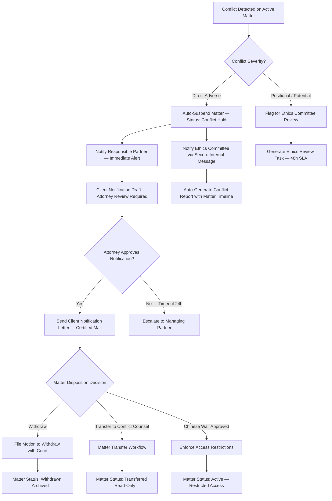
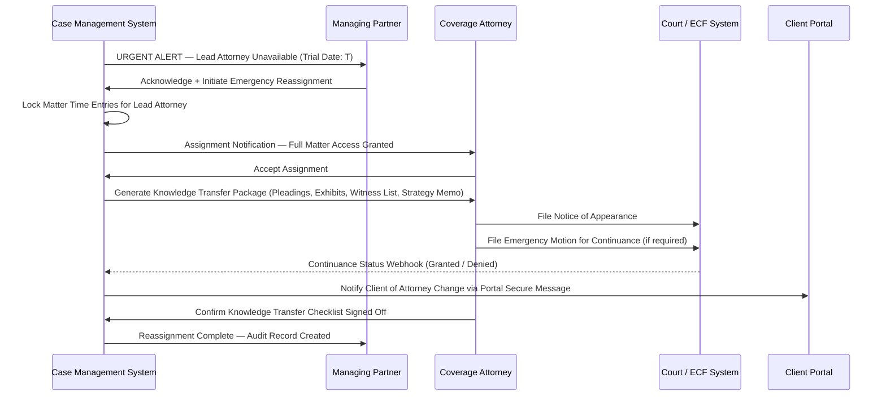

# Case Lifecycle Edge Cases

Domain: Legal Case Management System — Law Firm SaaS

---

## Conflict Check Failure After Case Opened

### Scenario Description

A conflict of interest is discovered after a matter has already been opened, fees collected, and substantive work commenced. This typically occurs when a new client is accepted without a thorough conflicts check, when a lateral hire brings undisclosed adverse relationships from a prior firm, or when a corporate client acquires an entity that the firm already represents on the other side of a dispute. The conflict may be a direct adverse interest (firm representing both sides of the same dispute) or a positional conflict (firm advancing inconsistent legal positions across matters).

### Detection Mechanism

- **Automated nightly conflict scan** traverses all active matters against the full client/contact database and adverse party registry, flagging any new matches since the prior run.
- **Lateral hire onboarding** triggers a batch conflict re-check against the new attorney's prior matter history, uploaded via a structured conflicts import form within 24 hours of the hire start date.
- **Manual conflict check request**, submittable by any attorney from the matter dashboard, surfaces a conflict warning modal before any status change to Active is permitted.
- **Third-party conflict database integration** (e.g., Legal Tracker, Conflicts Checker API) returns a match flag during matter creation and on every party addition.

### System Response

### Manual Intervention Steps

1. **Immediate Matter Suspension** — If the automated suspension has not fired, the responsible partner manually sets the matter status to "Conflict Hold" and locks all time entry and document upload functions.
2. **Ethics Committee Notification** — Submit a written conflict disclosure memo within 24 hours detailing the nature of the conflict, the affected matters, the dates work commenced on each, and the personnel involved.
3. **Client Notification** — Draft and send written notice to each affected client explaining the conflict and the firm's proposed resolution. Retain proof of delivery (certified mail receipt or portal delivery confirmation).
4. **Adverse Party Protocol** — If the conflict involves an adverse party currently represented by the firm on a separate matter, counsel for that party must receive independent notification through their own matter's communication channel — never through the conflicted matter's thread.
5. **Trust Funds** — Any unearned retainer held in IOLTA must be returned promptly. A disbursement request is submitted with the notation "conflict withdrawal — retainer refund," subject to trust account supervisor approval.
6. **Pending Court Filings** — Review the court calendar for imminent deadlines. If withdrawal cannot be accomplished before a filing deadline, seek an emergency extension or arrange interim co-counsel.
7. **Matter Transfer or Withdrawal** — Complete a formal motion to withdraw (court matters) or a matter transfer letter (transactional matters) per the applicable jurisdiction's procedural rules.

### Prevention Measures

- Run conflict checks at matter intake, before any engagement letter is issued, and again at every lateral hire onboarding event.
- Require three-way approval (originating partner, conflicts committee, managing partner) before any matter is set to Active status.
- Maintain a continuously updated adverse party index; update it automatically whenever a new party is added to any matter.
- Enforce a mandatory 48-hour "review hold" before a matter is activated if any potential conflict flag — even low-severity — is raised.
- Include conflict re-check triggers in engagement letter amendments that add parties, expand scope, or involve new counsel.

### Compliance Implications

- **ABA Model Rules 1.7 and 1.9** govern concurrent and successive conflicts of interest; failure to withdraw promptly constitutes a disciplinary violation.
- State bar ethics rules may require written disclosure and informed written client consent even where a conflict is technically waivable.
- Malpractice exposure arises from any work product produced while the conflict was active; the file must be quarantined from potential litigation use until counsel is retained.
- Retain the conflict discovery memo, all client notifications, adverse party communications, and the matter suspension audit log for a minimum of seven years.

---

## Case Reassignment During Trial

### Scenario Description

The lead trial attorney becomes unavailable mid-trial due to sudden illness, incapacitation, a newly discovered conflict of interest, or professional discipline. The matter requires immediate reassignment to a qualified attorney with little to no prior familiarity with the case. Time pressure is extreme: courts impose strict continuance standards, and missing a scheduled trial date can result in default judgment, sanctions, or dismissal.

### Detection Mechanism

- Attorney marks themselves unavailable in the calendar module, triggering an urgent matter coverage alert for any matter with a trial date within 30 days.
- Supervising partner receives an automated escalation if an attorney has active trial-date calendar entries within 14 days and no coverage attorney is assigned to the matter.
- An HR or conflict event (leave of absence entry, bar suspension notice from the state bar integration) automatically flags all active trial-date matters associated with the attorney.

### System Response

### Manual Intervention Steps

1. **Immediate Coverage Identification** — Managing partner identifies a qualified coverage attorney with available capacity and a confirmed clean conflicts check against the matter parties.
2. **Bar Notice Requirements** — Verify whether the jurisdiction requires a formal notice of appearance or substitution of counsel filing; prepare and file within the court's required timeframe.
3. **Court Notification** — File an emergency motion for continuance if the coverage attorney requires additional preparation time, attaching supporting documentation (medical certificate, conflict affidavit) as required by local rules.
4. **Knowledge Transfer Checklist** — Coverage attorney reviews and signs off on: case theory and strategy memo, all filed pleadings and pending motions, exhibit list and exhibit binders, witness list and deposition summaries, outstanding discovery obligations, pending court orders, and client communication preferences.
5. **Client Communication** — Notify the client in writing of the reassignment, the coverage attorney's qualifications, and any impact on the trial schedule. Obtain written acknowledgment.
6. **Fee Adjustment** — If the reassignment results in duplicated review work, document the additional time, apply any warranted write-down per firm policy, and notify the client proactively before invoicing.

### Prevention Measures

- Assign a secondary "shadow attorney" to every active trial matter at least 30 days before the trial date; the shadow attorney attends key depositions and hearings.
- Require all case strategy memos, trial preparation materials, and witness outlines to be current and stored in the matter document repository — never on local drives only.
- Conduct bi-weekly trial readiness reviews for all matters within 60 days of the trial date.
- Maintain a firm-wide emergency coverage roster with pre-cleared conflict status, updated monthly.

### Compliance Implications

- **ABA Model Rule 1.3 (Diligence)** — the firm has a duty to ensure client representation is not disrupted by attorney-side events.
- Local court rules on substitution of counsel and continuance motions must be followed strictly; sanctions for missed trial dates may be non-waivable.
- Malpractice risk is elevated during the transition period; document all knowledge transfer steps with timestamps.
- Record all coverage attorney time at the agreed billing rates; avoid surprise invoice increases during an already stressful transition for the client.

---

## Parallel Matter Conflicts

### Scenario Description

A client engages the firm for multiple simultaneous matters, and two of those matters develop opposing legal interests. For example, the firm represents a corporate client in a merger (Matter A) while separately advising the same client's subsidiary in a contract dispute where the subsidiary's interests directly diverge from the parent's (Matter B). Alternatively, two distinct clients of the firm find themselves on opposite sides of a new transaction or dispute.

### Detection Mechanism

- On every new matter intake, the system cross-references the incoming client ID, all listed party IDs, and all adverse party IDs against every open matter in the database.
- A nightly batch job performs a graph-based conflict traversal: `client → related entities → adverse parties → open matters`, surfacing second- and third-degree relationships.
- Manual "matter link" entries (e.g., a "related matter" designation added by an attorney) trigger a conflict alert if the linked matter has a different primary client or an overlapping adverse party.
- Attorney self-reporting via an ad hoc conflict disclosure form, accessible from any matter dashboard.

### System Response

- A conflict flag is created and assigned to the responsible partners for both matters and to the conflicts committee.
- Both matters are placed in "Conflict Review" status; new time entries and document uploads are blocked until the review is resolved.
- A conflict report is auto-generated listing both matters, the overlapping parties, the dates work commenced on each, and a timeline of all cross-matter communications.
- Cross-matter document sharing is disabled; attorneys on one matter cannot view or search documents from the other.

### Manual Intervention Steps

1. **Partner Review** — Responsible partners for each matter jointly review the conflict report within 48 hours and determine the nature and severity of the conflict.
2. **Client Consultation** — Both clients are contacted independently to disclose the conflict and discuss options: informed written consent to the dual representation, withdrawal from one matter, or a Chinese wall arrangement.
3. **Chinese Wall Creation** — If both clients provide informed written consent to a Chinese wall: configure role-based access controls so attorneys on Matter A have zero read or write access to Matter B files, and vice versa. Document the wall configuration in both matter records.
4. **Access Restriction Enforcement** — The system enforces the Chinese wall by filtering matter search results, blocking shared document links, and preventing cross-matter email threading. Any attempt to bypass the restriction generates an immediate security alert.
5. **Ongoing Monitoring** — A quarterly automated conflict re-check is scheduled for all matters operating under an active Chinese wall; any new party additions are validated against the wall policy immediately.

### Prevention Measures

- Implement real-time conflict detection at matter intake that surfaces related entity relationships (parent/subsidiary, commonly owned affiliates) using corporate hierarchy data.
- Require clients to disclose all affiliated entities and subsidiaries at engagement; capture these relationships in the contact record's entity hierarchy.
- Apply a multi-level conflict check: direct party name match, alias/DBA match, and entity relationship graph traversal.

### Compliance Implications

- **ABA Model Rule 1.7** requires informed written consent from all affected clients before any concurrent representation of directly adverse interests may proceed.
- A Chinese wall is not universally accepted as a cure for direct adverse conflicts in all jurisdictions; obtain local ethics counsel opinion before relying on a wall arrangement.
- Bar disciplinary action may result if conflicts are not timely disclosed; retain all disclosure letters and consent confirmations in both matter files.

---

## Matter Reopening After Close

### Scenario Description

A closed and archived matter must be reopened due to new developments: post-settlement enforcement disputes, additional claims arising from the same facts, malpractice allegations related to the prior representation, or a client requesting additional services directly related to the original engagement. The matter was previously archived, final billing was issued, and the physical and digital file was transferred to long-term storage.

### Detection Mechanism

- Client submits a reopen request through the client portal's "Request Matter Reactivation" form, or an attorney submits a reopen request directly from the closed matter record.
- An incoming document (new court filing, demand letter, statute of limitations tolling notice) is associated with a closed matter number via the document intake workflow, automatically triggering a reopen review alert.
- Inbound communications (emails or portal messages) tagged to a closed matter by the routing logic notify the assigned partner and flag the matter for review.

### System Response

- A reopen request generates a pending approval task assigned to the responsible partner and the billing supervisor, with a 5-business-day SLA.
- The closed matter is placed in "Reopen Pending" status — read-only access is maintained during review; no new time entries or document uploads are permitted until approval is granted.
- The system auto-generates a reopen audit entry recording the requester, request date, stated reason, and a summary of the matter's prior billing and activity history.
- Upon approval, the matter is set to Active with a new billing period start date; all historical billing records from the prior active period remain immutable and clearly dated.

### Manual Intervention Steps

1. **Reactivation Approval** — Responsible partner and billing supervisor review the request, confirm no administrative bar to reopening (outstanding balance, active conflicts, malpractice claim), and approve or deny within 5 business days.
2. **Engagement Letter Amendment** — Issue an updated engagement letter or matter reopening letter confirming the scope, applicable billing rates (which may have changed), retainer requirements, and any amended terms.
3. **Billing Impact Review** — Determine whether any write-offs from the original close-out are affected by the reopen; adjust the matter financial summary and note any changes in the billing record.
4. **Document Restoration** — Retrieve archived documents from cold storage to the active matter repository. Log each restoration event in the document audit trail with the retrieval date and the authorizing party.
5. **Court Calendar and Deadline Check** — If the matter involves active litigation, immediately review whether any court deadlines, statute of limitations periods, or post-judgment compliance dates arose or expired during the closed period.

### Prevention Measures

- Require completion of a formal close checklist before any matter can be archived; the checklist must confirm resolution of all pending tasks, open invoices, outstanding court obligations, and trust account balances.
- Implement a 90-day "soft close" window during which the matter is closed to new billing but remains accessible for review, before transitioning to full archived status.
- Set automated reminders at 30, 60, and 90 days post-close for matters in statute-of-limitations-sensitive practice areas.

### Compliance Implications

- Reopening a matter resets the conflicts check obligation; a fresh conflict check must be completed before any substantive work resumes.
- Any statute of limitations or court deadline issues that arose during the closed period must be investigated immediately and documented; missed deadlines during the closed period may create malpractice exposure.
- Billing records from the original matter period must remain immutable; all new charges must appear in a clearly demarcated new billing period with distinct invoice numbers.

---

## Duplicate Client/Contact Detection

### Scenario Description

The same client or contact person is entered into the system twice — commonly because different attorneys or intake staff created records independently without searching for existing entries. This creates split billing histories, duplicate privilege logs, conflicting contact details, and critical conflict check blind spots where an adverse relationship on one record is invisible from the other.

### Detection Mechanism

- A fuzzy matching algorithm checks the incoming record's name, email address, phone number, and tax ID (EIN/SSN last four) against all existing contacts at the time of record creation.
- A duplicate confidence score (0–100) is computed. Scores ≥ 80 block record creation and require mandatory deduplication review. Scores 50–79 surface a "Possible Duplicate" warning banner and require acknowledgment before proceeding.
- A nightly deduplication batch scan runs across the full contact database and produces a daily report of potential duplicate pairs for review by the conflicts administrator.
- Incoming documents (court filings, engagement letters) with party names are matched against the contact index during document intake; near-matches surface a merge prompt before the document is associated with a matter.

### System Response

- Contact creation is blocked (score ≥ 80) or flagged (score 50–79) pending review by the conflicts administrator.
- A merge candidate record is automatically created, linking the two contact entries with a side-by-side field comparison (name, addresses, phone numbers, email, tax ID, associated matters, billing history).
- All matters, documents, time entries, and trust account records associated with both duplicate records are listed in the merge candidate view for reconciliation.

### Manual Intervention Steps

1. **Record Review** — The conflicts administrator or billing supervisor reviews the side-by-side comparison and confirms whether the two records represent the same legal person or entity.
2. **Master Record Selection** — Designate one record as the master. The master record retains the primary client ID; all references from the duplicate record (matters, documents, invoices) are remapped to the master ID.
3. **Billing History Consolidation** — Merge invoice histories, retainer balances, credit memos, and IOLTA trust account entries from both records. Manually reconcile any discrepancies before completing the merge.
4. **Privilege Log Reconciliation** — Review privilege logs from both records to ensure all privileged documents are captured and tagged under the master record. Correct any privilege designations that were applied only to the duplicate.
5. **Conflict Check Re-Run** — After the merge is complete, immediately run a fresh conflict check on the master record to surface any conflicts that were invisible due to the split records.
6. **Audit Trail Preservation** — Retain a permanent, immutable audit log of the merge event: which records were merged, the authorizing user, the date/time, the master record designation, and a snapshot of both pre-merge records.

### Prevention Measures

- Enforce duplicate detection as a hard blocking step — not merely advisory — for confidence scores above the configurable threshold (default: 80).
- Train all intake staff on the mandatory contact search procedure before creating any new record; include this step in the intake workflow checklist.
- Integrate with authoritative external data sources (state bar directory, secretary of state business registry) to standardize entity names at the point of record creation.
- Conduct a quarterly deduplication audit using the nightly scan report; resolve all open merge candidates within 10 business days of identification.

### Compliance Implications

- Duplicate records create conflict check blind spots that can expose the firm to undiscovered adverse relationships and ethics violations under ABA Model Rules 1.7 and 1.9.
- Privilege log gaps resulting from split records may be exploited by opposing counsel during discovery; a court may decline to enforce privilege for documents not properly logged.
- State bar rules requiring accurate and complete client records are implicated if duplicate records persist beyond a reasonable discovery-and-correction window; periodic deduplication audits are a best practice and may be required under bar management rules.
- Billing disputes caused by split billing histories may trigger fee arbitration; consolidated and accurate billing records are the firm's primary defense.
