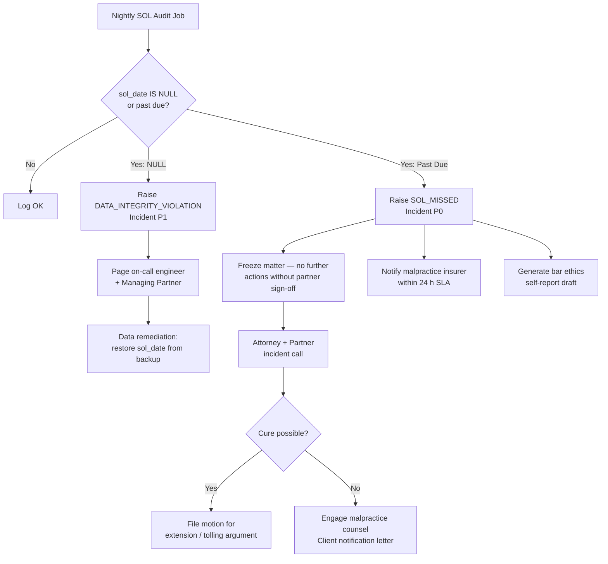
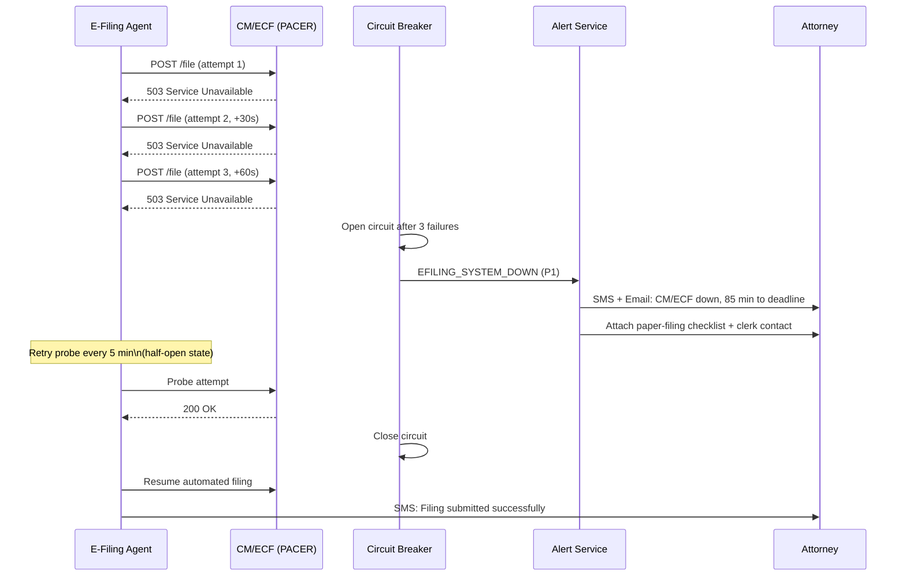
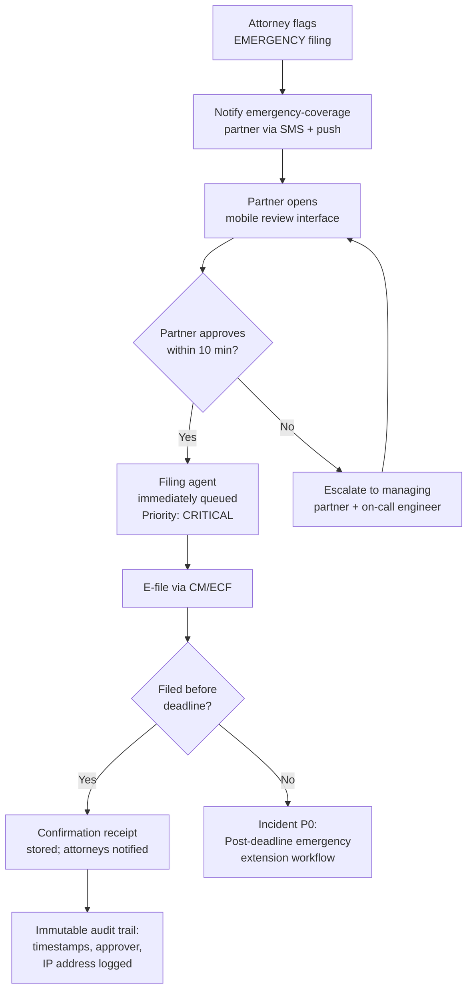
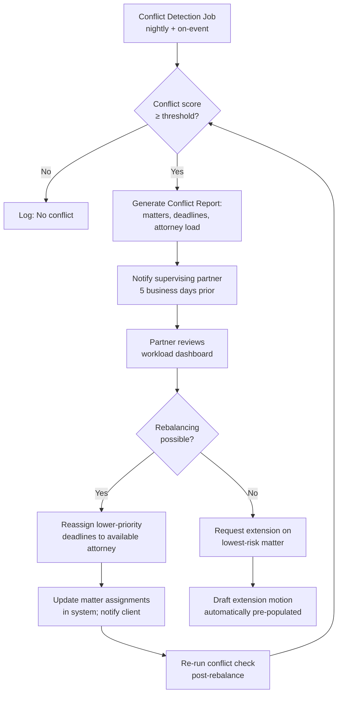

```mermaid
flowchart LR
    A[Heartbeat missed\n> 30 min] --> B[Alert: CALENDAR_SYNC_DEGRADED]
    B --> C[Suspend sync service\nto prevent partial state]
    C --> D[Notify all attorneys:\nCalendar sync offline\nUse system portal]
    D --> E{OAuth token\nstill valid?}
    E -- No --> F[Trigger re-auth workflow\nAdmin prompted via Slack]
    E -- Yes --> G[Restart sync worker\nwith fresh state]
    F --> H[Admin completes OAuth\nre-authorization]
    H --> G
    G --> I[Full re-sync:\npush all deadlines\nnext 90 days]
    I --> J[Reconciliation report:\nevents added / removed]
    J --> K[Alert: CALENDAR_SYNC_RESTORED\nall attorneys notified]
```

# Court Deadline Edge Cases

Domain: Law firm SaaS — matter management, court calendar, statute of limitations tracking, e-filing.

---

## Statute of Limitations Missed

### Scenario

The system fails to fire an SOL alert before the limitations period expires on a personal injury matter. The attorney discovers the missed deadline only after the opposing counsel raises a timeliness defense. The SOL was correctly entered at intake but a migration script silently nulled out `sol_date` for ~40 matters when the firm upgraded from v2 to v3.

### Detection

- Nightly SOL audit job compares `matters.sol_date` against `NOW() + 30 days` and emits `SOL_APPROACHING` events.
- Alert delivery confirmed via `alert_delivery_log`; any undelivered alert within 24 h triggers a secondary Slack/SMS escalation.
- Post-migration data validation job checks for null `sol_date` on active, non-closed matters and raises a `DATA_INTEGRITY_VIOLATION` incident.

### System Response

### Manual Steps

1. **Immediately** place matter in read-only lock; no documents can be filed or modified without managing-partner override token.
2. Pull matter timeline from audit log to establish exactly when SOL entry was made and when alert chain broke.
3. Contact malpractice insurer hotline within the window specified in the firm's policy (typically 24–48 h of discovery).
4. Draft client notification letter — jurisdiction-specific requirements apply (some states mandate written notice within 5 business days).
5. Assess tolling arguments: discovery rule, fraudulent concealment, minority/disability exceptions.
6. File a motion to enlarge time or seek leave to amend where jurisdictionally available.

### Prevention

- **Dual-entry validation**: SOL date required at intake and independently confirmed by supervising attorney within 48 h.
- **Migration regression tests**: post-migration suite asserts `sol_date IS NOT NULL` for a sample of 100 seeded matters.
- **Monthly SOL reconciliation report** emailed to managing partner listing all matters with SOL within 90 days.
- **Immutable audit log**: any update to `sol_date` writes a `BEFORE` image to `matter_audit_log`.

### Compliance Notes

- ABA Model Rule 1.3 (Diligence) — failure to track SOL is per se lack of diligence.
- Most state bars treat missed SOL as presumptively negligent; self-reporting may be required under Rule 8.3 depending on jurisdiction.
- Malpractice insurer must be notified before any communication with the client acknowledging fault.

---

## Court System Downtime During E-Filing

### Scenario

CM/ECF (PACER) is unavailable with 90 minutes remaining before a federal response deadline. The automated filing agent receives repeated HTTP 503 responses. The matter involves a dispositive motion where failure to respond results in default.

### Detection

- E-filing agent records each attempt with HTTP status in `efiling_attempts`; three consecutive 503 responses within 5 minutes trigger `EFILING_SYSTEM_DOWN` alert.
- PACER status page is polled every 60 s via a separate monitoring probe; any non-200 response is correlated with active filing queues.
- Circuit breaker on `CourtFilingService` opens after 5 failures in 60 s, preventing futile retries that could exhaust the deadline window.

### System Response

### Manual Steps

1. Print the filing documents immediately; most district courts accept paper filing when CM/ECF is confirmed down.
2. Call the clerk's office to confirm the system outage is logged officially — get the clerk's name, call time, and confirmation number.
3. File paper documents with clerk and obtain a file-stamped copy; some districts allow fax filing as a fallback.
4. Submit an emergency extension request citing system downtime (Local Rule emergency filing procedures vary by district).
5. Once CM/ECF is restored, upload documents and attach the clerk's confirmation as an exhibit.
6. Document everything in the matter's activity log within 1 h of resolution.

### Prevention

- **30 / 60 / 90-minute countdown alerts** for all pending e-filings, not just on system failure.
- Maintain a pre-populated paper-filing kit (cover sheet, required formatting) for every pending filing.
- Subscribe to PACER system status RSS feed and auto-correlate with deadline calendar.
- Never schedule automated filing within 2 h of deadline; firm policy requires submission by T-4 h.

### Compliance Notes

- FRCP 6(b) and Local Rules provide emergency extension mechanisms; most judges look favorably when CM/ECF downtime is documented.
- Some circuits (e.g., Ninth Circuit) have standing orders that treat CM/ECF outages as force majeure for timely-filing purposes.

---

## Calendar Sync Failure

### Scenario

The firm's Google Workspace calendar sync stops propagating court deadlines after a Google OAuth token expires silently. Attorneys using Google Calendar as their primary interface miss three upcoming hearing dates over a two-week period before the failure is discovered during a file review.

### Detection

- **Heartbeat check**: every 15 minutes, the sync service writes a canary event (`SYNC_HEARTBEAT`) to both Google Calendar and the internal `calendar_sync_log`. A missing heartbeat for > 30 minutes triggers `CALENDAR_SYNC_DEGRADED`.
- **Event count reconciliation**: nightly job compares count of `upcoming_deadlines` in the internal DB against events in each attorney's Google Calendar for the next 30 days; delta > 0 triggers `CALENDAR_DRIFT_DETECTED`.
- OAuth token expiry is caught by a proactive token-refresh job that runs 24 h before expiry and alerts if refresh fails.

### System Response

### Manual Steps

1. Send firm-wide alert: "Calendar sync is offline — do not rely on Google/Outlook calendar for deadlines until further notice."
2. Print the master deadline report from the case management portal for all open matters for the next 30 days.
3. Conduct manual deadline audit: have each attorney confirm their next 5 deadlines against the portal report.
4. Document any deadline that was missed or nearly missed during the outage window; assess whether extension filings are needed.
5. After sync restoration, verify reconciliation report accounts for every deadline in the internal DB.

### Prevention

- Dual reminder channel: in-app portal notifications are always authoritative; calendar sync is supplementary.
- OAuth tokens stored with expiry timestamp; auto-refresh 48 h before expiry with fallback SMS to admin.
- Weekly calendar reconciliation digest sent to all attorneys listing their deadlines and confirming sync status.

### Compliance Notes

- Attorneys have an independent professional duty (Rule 1.3) to track their own deadlines; calendar sync failure does not transfer responsibility to the vendor.
- Firm policy should document that the system portal is the authoritative deadline source, limiting malpractice exposure.

---

## Emergency Filing

### Scenario

At 4:45 PM on a Friday, a client calls with newly discovered evidence that must be filed as a supplemental submission by 5:00 PM court close. The standard approval workflow (associate drafts → partner reviews → e-filing queued) takes ~45 minutes under normal conditions.

### Detection

- Attorney manually flags the filing as `EMERGENCY` in the portal; this bypasses the standard queue and notifies the designated emergency-coverage partner immediately.
- System checks `court_deadlines` for same-day cutoffs and automatically escalates any filing queued within 60 minutes of a hard deadline.

### System Response

### Manual Steps

1. Attorney dials the court clerk directly to notify of imminent filing and request confirmation the clerk's office will remain available.
2. If CM/ECF is sluggish, prepare paper filing simultaneously as a fallback.
3. Partner review is conducted on the mobile app; verbal approval is not sufficient — a tap-to-approve with biometric or PIN is required for the audit trail.
4. After filing, attorney emails confirmation receipt to client within 15 minutes.
5. Post-incident review scheduled for the following Monday to assess whether the emergency was preventable.

### Prevention

- Emergency filings are a symptom of insufficient lead time; the system tracks "filing preparation start time" and flags matters where documents are not in draft 48 h before deadline.
- Emergency-coverage partner roster published at the start of each week; out-of-hours contact chain clearly defined.
- Client education: supplemental discovery filings should be initiated by T-3 days, not T-15 minutes.

### Compliance Notes

- Emergency partner override is logged with full audit trail; the log is immutable and cannot be deleted by any user role.
- Any filing submitted under emergency override is automatically flagged for next-week managing-partner review.

---

## Conflicting Deadlines

### Scenario

On a given Wednesday, seven matters assigned to two associates have hard court deadlines. Two of the deadlines are in different federal districts but fall at the same time (5:00 PM ET). One associate is also scheduled for a deposition that afternoon, rendering them effectively unavailable for filing work after 1:00 PM.

### Detection

- **Conflict detection job** runs nightly and at every calendar update; it queries `upcoming_deadlines` grouped by `assigned_attorney_id` and `due_date::date`.
- A conflict score is computed: `(number of same-day deadlines) × (deposition/hearing hours that day) × (document readiness score)`.
- Any attorney with conflict score ≥ 3 on a given day triggers a `DEADLINE_CONFLICT` alert 5 business days in advance.

### System Response

### Manual Steps

1. Partner convenes a 15-minute conflict triage call with associates to confirm actual availability vs. calendar availability.
2. For each conflicting deadline, rank by: (a) legal consequence of missing, (b) case value, (c) client relationship priority.
3. Reassign lower-ranked deadlines to available attorneys; ensure the receiving attorney has adequate context (brief reading time budgeted).
4. For matters where extension is sought, file the motion by T-2 days to give the court time to rule.
5. Document the conflict, resolution decision, and rationale in each matter's activity log.

### Prevention

- Soft deadline alerts fire 14 days out; filing documents must be in near-final form 5 days before deadline.
- Attorney capacity is tracked in the system (target: ≤ 3 hard deadlines per attorney per day); workload dashboard visible to all partners.
- Associates cannot be assigned more than 2 new matters in the 10 days preceding an existing hard deadline without partner sign-off.

### Compliance Notes

- Rule 1.3 diligence applies to the firm collectively; inadequate staffing is not a defense for a missed deadline.
- Conflict resolution decisions and rationale must be documented — they constitute part of the matter's file and may be discoverable in a malpractice action.
- Extension motions must accurately represent counsel availability; misrepresenting the reason for an extension violates Rule 3.3.

---

## Operational Policy Reference

The following firm-level policies underpin all five edge case workflows above. Each policy maps to a system-enforced control.

| Policy | System Control | Review Frequency |
|---|---|---|
| No hard deadline without a T-14 soft alert | `upcoming_deadlines.soft_alert_date` required field | Per matter, at intake |
| Attorney capacity limit: ≤ 3 hard deadlines/day | Workload guard on matter assignment | Real-time |
| SOL entry confirmed by supervising attorney | `sol_date` dual-approval workflow | Within 48 h of intake |
| Emergency filings require partner tap-to-approve | Mobile approval token required before queue | Per filing |
| Calendar sync treated as supplementary only | Portal banner shown when sync is offline | Continuous |
| All deadline changes logged immutably | `deadline_audit_log` append-only table | Continuous |
| Conflict detection runs nightly + on calendar change | Scheduled job + event trigger | Nightly minimum |
| Extension motions filed by T-2 days | Filing prep SLA enforced via dashboard warning | Per matter |

All policies are reviewed annually by the ethics committee and updated to reflect changes in local court rules and ABA guidance.
