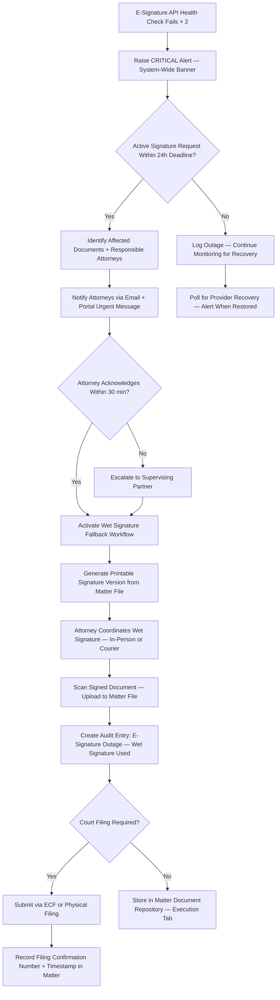
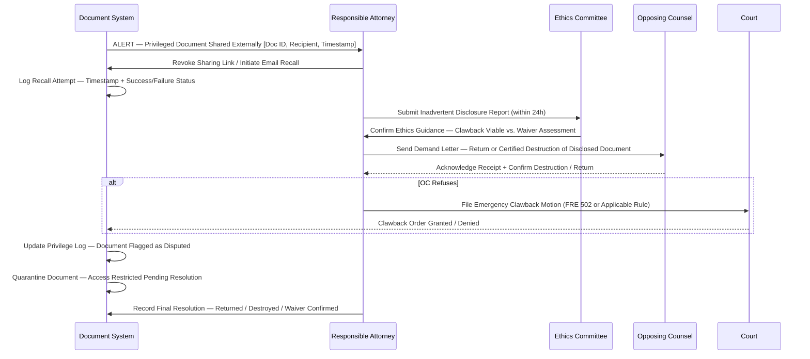

# Document Management Edge Cases

Domain: Legal Case Management System — Law Firm SaaS

---

## E-Signature Provider Outage During Court Deadline

### Scenario Description

The firm relies on a third-party e-signature provider (e.g., DocuSign, Adobe Sign) for client authorization of filings, settlement agreements, and engagement letters. An outage occurs precisely when a signature is required within hours of a court filing deadline, an opposing counsel response window, or a transactional closing. The integration returns a timeout or 5xx error, and the document remains unsigned with the deadline imminent.

### Detection Mechanism

- The e-signature integration health check runs every 5 minutes via a lightweight ping endpoint. After two consecutive failures the system raises a CRITICAL alert and broadcasts a system-wide warning banner to all active users.
- Individual signature request timeouts — no provider response within 30 seconds — trigger a per-document alert to the responsible attorney and escalate to the supervising partner after 15 minutes without resolution.
- A deadline proximity monitor cross-references all outstanding signature requests against the court calendar and flags any request linked to a calendar entry within the next 24 hours.

### System Response

### Manual Intervention Steps

1. **Fallback Activation** — Attorney downloads the printable signature version directly from the matter's document tab; confirm the version is the executed-ready final draft.
2. **Wet Signature Procurement** — Coordinate with the client for in-person signing, overnight courier delivery, or notarized remote signing as permitted by the applicable jurisdiction and court rules.
3. **Court Notification** — If the signature delay risks missing a filing deadline, contact the court clerk immediately to request a brief administrative extension, citing the documented provider outage as cause.
4. **Provider Communication** — Open a priority support ticket with the e-signature provider and obtain an incident reference number; attach this to the matter audit entry.
5. **Post-Outage Reconciliation** — Once the provider recovers, compare any documents signed via wet signature against the original template version to confirm no alterations were introduced. Update the matter file with the final countersigned version if applicable.
6. **Audit Documentation** — Record in the matter file: the precise outage window (start and end timestamps from the health check log), the fallback method used, the identity of the signatory, and the date and time of the wet-signed document.

### Prevention Measures

- Configure and regularly test a secondary e-signature provider as an automatic hot standby; activate it via a feature flag when the primary provider fails.
- Establish a policy that critical signature requests must not be initiated within 48 hours of a hard court deadline; enforce this with a calendar-proximity warning at the time of signature request creation.
- For every document with a deadline within 7 days, automatically generate and store a printable signature packet in the matter file so that the wet fallback is always one click away.
- Subscribe to e-signature provider status page webhooks and integrate them directly into the system's health monitoring dashboard.

### Compliance Implications

- The **ESIGN Act (15 U.S.C. § 7001)** and **UETA** permit electronic signatures but do not require them; a wet signature on the same document is universally valid as a fallback and carries no lesser legal weight.
- Court-specific e-filing rules (e.g., CM/ECF, PACER) may require a specific signature format on electronically filed documents; verify local rules before submitting a scanned wet signature in lieu of an electronic one.
- Document the outage and every fallback step in the matter file; this record protects the firm against sanctions motions by opposing counsel alleging procedural deficiency.
- Review engagement letters to confirm they disclose the firm's e-signature fallback policy and obtain client consent to wet signatures when electronic means are unavailable.

---

## Privilege Waiver by Accidental Disclosure

### Scenario Description

A privileged document — protected by attorney-client privilege or the work product doctrine — is inadvertently shared with opposing counsel, a third party, or via an unsecured portal link. Disclosure may occur through a mis-addressed email, an incorrect document attached to a discovery production batch, or a misconfigured external sharing link. Even momentary disclosure can trigger a waiver argument that is difficult and costly to overcome.

### Detection Mechanism

- The document sharing audit log captures every external share event. A post-share classification check immediately flags any document tagged "Privileged" or "Work Product" that was shared with a recipient outside the firm.
- The discovery production workflow includes a mandatory privilege screen; any document in a production batch that matches the privileged document index triggers a hold and an alert before the production is transmitted.
- Outbound email integration scans all attachments against the privileged document index before delivery and presents a confirmation prompt if a match is detected.
- Opposing counsel or a third-party recipient may proactively notify the firm of the inadvertent disclosure, as required by ABA Model Rule 4.4.

### System Response

### Manual Intervention Steps

1. **Immediate Recall** — Revoke the portal sharing link or recall the email within the shortest possible window. Log the attempt timestamp and record whether the recall succeeded or failed (email recall is not guaranteed).
2. **Opposing Counsel Demand** — Send a written demand for the return or certified destruction of the disclosed document within 24 hours of discovery, per ABA Model Rule 4.4 and any clawback agreement language in the applicable protective order.
3. **Privilege Log Update** — Flag the document in the privilege log as "Disputed — Inadvertent Disclosure" with the date, recipient, and disclosure mechanism. Do not remove it from the log.
4. **Ethics Committee Notification** — Submit an inadvertent disclosure report detailing the document description, the recipient identity, the disclosure mechanism (email, portal, production batch), and every remediation step taken to date.
5. **Clawback Motion** — If opposing counsel refuses to return or destroy the document, immediately file an emergency clawback motion under FRE 502(b) or the applicable state rule, or seek enforcement of an existing FRE 502(d) court order.
6. **Document Quarantine** — Restrict access to the disclosed document in the system pending resolution of the clawback dispute; annotate the document record with the incident reference number.

### Prevention Measures

- Enforce a mandatory privilege classification review step — performed by a second attorney — before any bulk document export or discovery production batch is finalized and transmitted.
- Require dual-attorney approval for any external share of documents tagged "Privileged," "Work Product," or "Confidential."
- Obtain a **FRE 502(d) court order** at the outset of every federal litigation matter; this order provides the strongest protection against inadvertent waiver and should be a standard intake step.
- Apply document-level digital rights management (DRM) to restrict printing and forwarding of privileged documents when shared via the client portal.

### Compliance Implications

- **ABA Model Rule 1.6** (confidentiality) requires the firm to take all reasonable steps to prevent unauthorized disclosure and to act promptly to remedy any disclosure that does occur.
- **ABA Model Rule 4.4** requires opposing counsel who receives an inadvertently disclosed privileged document to notify the producing party; the producing firm must assert privilege and demand return without delay.
- **FRE 502** governs inadvertent waiver in federal proceedings; failure to take prompt, documented remediation steps weakens any subsequent clawback argument.
- All disclosure incidents, demand letters, responses, and clawback filings must be retained in the matter file; these records form the evidentiary foundation for any privilege motion.

---

## Bates Numbering Gap

### Scenario Description

During discovery production review — either internally before production or by opposing counsel after receipt — a gap is identified in the Bates number sequence. For example, documents jump from FIRM000450 to FIRM000452, skipping FIRM000451. Gaps raise an immediate suspicion of intentional document withholding and create significant compliance risk under applicable discovery rules, potentially resulting in sanctions or adverse inference instructions.

### Detection Mechanism

- An automated Bates sequence validator runs as a mandatory post-generation step after every discovery production batch is created. It checks all Bates numbers in the production set for sequential continuity and flags any missing number or out-of-sequence entry.
- The production manifest is cross-referenced against the document repository metadata; any Bates entry present in the sequence log but absent from the manifest generates a gap report.
- Opposing counsel identifies a gap during their review and raises it via a deficiency letter, triggering an incoming correspondence workflow within the matter.

### System Response

- A gap report is automatically generated listing the specific missing Bates number(s), the documents immediately preceding and following the gap, the production batch in which the gap appears, and a timestamp.
- The affected production batch is placed in "Review Hold" status; no supplemental productions are permitted from the same matter until the gap is investigated and resolved.
- The responsible attorney and litigation support coordinator receive an urgent task with a 24-hour resolution SLA.

### Manual Intervention Steps

1. **Gap Analysis** — Review the document repository for any document that should have received the missing Bates number. Common causes: document deleted after numbering was assigned, numbering error during re-export, document withheld for privilege without a corresponding privilege log entry.
2. **Root Cause Documentation** — Determine and document the specific cause. Possible findings: (a) withheld privileged document — must be added to privilege log immediately; (b) technical export error — must be corrected and re-exported; (c) inadvertent deletion — investigate and restore from backup if possible.
3. **Correction Workflow** — If the gap is due to a technical error, regenerate the affected portion of the production with corrected Bates numbering and issue a corrected production set to opposing counsel with an explanatory cover letter identifying the error and the correction.
4. **Opposing Counsel Notification** — Proactively notify opposing counsel of the gap, its confirmed cause, and the corrective action being taken, even if opposing counsel has not yet raised the issue in a deficiency letter. Proactive disclosure is a significant mitigating factor.
5. **Privilege Log Update** — If the missing Bates number corresponds to a withheld privileged document, add the document to the privilege log immediately with the appropriate privilege designation, the Bates number it would have occupied, and the date of the original production.

### Prevention Measures

- Run the Bates sequence validator as a hard blocking pre-production check; the production package cannot be exported or transmitted until the validator returns zero gaps.
- Maintain a Bates gap register for every production set; any intentional gap (withheld document) must be logged in the privilege log at the exact time of production, not after the fact.
- Implement a policy that Bates numbers once assigned are never deleted or re-used; documents removed from a production set after numbering are marked "Withdrawn — Privileged" in the sequence log with a privilege log cross-reference.

### Compliance Implications

- **FRCP Rule 26** and analogous state discovery rules require complete and accurate productions; unexplained Bates gaps may result in monetary sanctions, evidence preclusion, or adverse inference instructions under FRCP Rule 37.
- If the gap is attributable to intentional withholding without a timely privilege log entry, the court may rule that privilege has been waived for the withheld document.
- A proactive, fully documented correction submitted before opposing counsel raises the issue is the strongest available defense against sanctions; delay in disclosure compounds both the ethical and litigation risk.

---

## Document Version Conflict

### Scenario Description

Two attorneys simultaneously open and edit the same document — a motion draft, a contract, or a settlement agreement — in the absence of a locking or co-authoring mechanism. When both save their versions, one save silently overwrites the other, potentially destroying substantive edits. Alternatively, both versions survive but exist in the system with no clear authoritative master, creating confusion about which version controls for filing or execution.

### Detection Mechanism

- The document management system records a "document open for editing" event for each user and continuously monitors for concurrent open sessions on the same document ID.
- When a second save is attempted on a document that has an active concurrent edit session, a version conflict warning fires before the save is committed.
- The audit log records all save events with timestamps, user IDs, and document version hashes; post-hoc conflict detection is possible by comparing version hashes across saves within the same editing window.

### System Response

- On conflict detection, neither version is automatically overwritten. Both edited versions are saved as distinct revision entries with identifiers (e.g., `v1.3-smith` and `v1.3-jones`) and marked "Conflict — Pending Merge."
- A version conflict resolution task is created and assigned to both editors and the responsible partner, with a 4-hour resolution SLA.
- The document is locked against further edits until the conflict is resolved; users attempting to open the document receive a "Conflict Resolution Pending" notice with the task reference.

### Manual Intervention Steps

1. **Version Comparison** — Both editors use the built-in side-by-side diff view to review every section that differs between their respective versions.
2. **Merge Decision** — The two editors jointly review the conflicting sections and agree on the authoritative merged content; the responsible partner holds final decision authority if the editors cannot reach agreement.
3. **Resolved Version Save** — The merged content is saved as the new head revision with a version note ("Merged from v1.3-smith and v1.3-jones by [Partner] on [Date]") appended to the version history.
4. **Audit Trail Preservation** — Both conflicting pre-merge versions, the merge decision log, and the final merged version are all retained permanently in the version history. No version is deleted.

### Prevention Measures

- Implement optimistic locking at the document level: when a user opens a document for editing, a soft lock is applied. A second user who attempts to open the same document receives a real-time notification ("Document currently being edited by [Name]") and is offered a read-only view with a request-to-edit notification.
- Use a check-out / check-in model for high-stakes documents (executed agreements, filed pleadings) to enforce strictly sequential editing.
- Integrate with collaborative editing platforms (e.g., Microsoft 365 co-authoring) for documents requiring simultaneous multi-author input, as these platforms handle real-time merge conflict resolution natively.

### Compliance Implications

- Version control records are part of the matter file and are subject to discovery; complete, unaltered version histories must be maintained for the life of the matter.
- For executed agreements and court filings, only one authoritative version may exist in the matter file; enforce single-editor document locks for any document that has been finalized, executed, or filed.
- Accidental overwriting of a finalized document may constitute a spoliation risk if the matter is in litigation; document the incident, both versions, and the resolution in the matter audit trail.

---

## Document Storage Quota Exceeded

### Scenario Description

The firm's document storage allocation is exhausted during an active case, preventing new document uploads, blocking e-discovery production exports, and potentially rendering portions of the document management system unavailable. This commonly occurs during large-scale litigation with high-volume discovery, M&A due diligence, or regulatory investigations where document ingestion rates are exceptionally high.

### Detection Mechanism

- Storage utilization is monitored continuously; automated tiered alerts are dispatched at 75% ("Warning"), 90% ("High"), and 98% ("Critical") of the allocated quota to the IT administrator, firm administrator, and managing partner.
- A hard-block error is returned to the end user on any upload attempt that would push total usage beyond the quota; the error message includes the contact for emergency storage allocation.
- The billing dashboard's storage widget shows a projected capacity exhaustion date based on the trailing 30-day average daily upload rate, surfacing the warning in advance of the hard limit.

### System Response

- At 98% capacity, new document uploads to non-active matters are automatically blocked. Uploads to active matters require an explicit administrator override with a documented justification.
- An emergency storage allocation request is automatically generated and routed to the IT administrator and firm administrator, with a 4-hour response SLA.
- A tiered archival recommendation report is generated: closed matters older than 3 years with no pending litigation holds or compliance flags are listed as candidates for cold storage migration.

### Manual Intervention Steps

1. **Emergency Allocation** — IT administrator provisions additional cloud storage capacity within 4 hours of the Critical alert, recording the allocation change in the infrastructure change log.
2. **Archival Review** — Firm administrator reviews the archival candidate report and approves a batch of eligible closed matters for migration to cold storage, confirming that no litigation holds or regulatory preservation obligations apply to those matters.
3. **Billing Impact Review** — Determine whether the storage overage was driven by a specific client matter (e.g., large-scale e-discovery) that warrants cost reimbursement. Prepare a supplemental cost itemization if the overage is billable to the client under the applicable engagement letter.
4. **Client Communication** — For matters where the overage is caused by client-directed discovery scope expansion, notify the client in writing of the projected storage cost impact and obtain written approval before provisioning additional capacity at the client's expense.
5. **Policy Update** — If storage overages are recurring, formally amend the firm's document retention and tiered storage policy to enforce automatic archival at defined intervals and to set per-matter storage budgets with mandatory reviews.

### Prevention Measures

- Set a per-matter storage budget at intake; alert the responsible attorney and billing supervisor when a matter approaches 80% of its individual allocation.
- Implement automatic archival of closed matters after a configurable retention window (default: 3 years post-close, or as required by the applicable jurisdiction's records retention rules).
- Apply storage deduplication and lossless compression to all document ingestion pipelines to reduce raw storage consumption without affecting document fidelity.
- Review aggregate storage projections quarterly; pre-purchase additional capacity tiers before reaching 75% utilization to eliminate emergency provisioning scenarios.

### Compliance Implications

- Document retention obligations — which vary by jurisdiction and matter type and typically range from 5 to 10 years post-close — must be respected; archiving documents to cold storage does not satisfy a deletion request and does not constitute disposal.
- Active litigation holds override all archival and deletion policies without exception; any matter subject to a hold must be excluded from automatic archival workflows.
- **HIPAA**, **GDPR**, and analogous data protection regulations may impose specific storage location, encryption, and data residency requirements on client documents; additional storage provisioned during an emergency must conform to these requirements.
- Storage cost overruns billed to clients must be disclosed in advance per ABA Model Rule 1.5(b); surprise storage surcharges on client invoices may trigger billing disputes.
