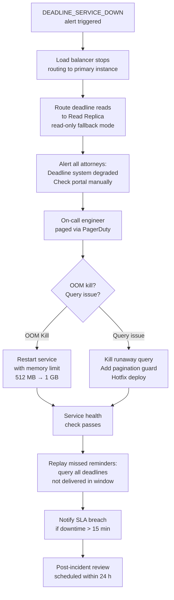
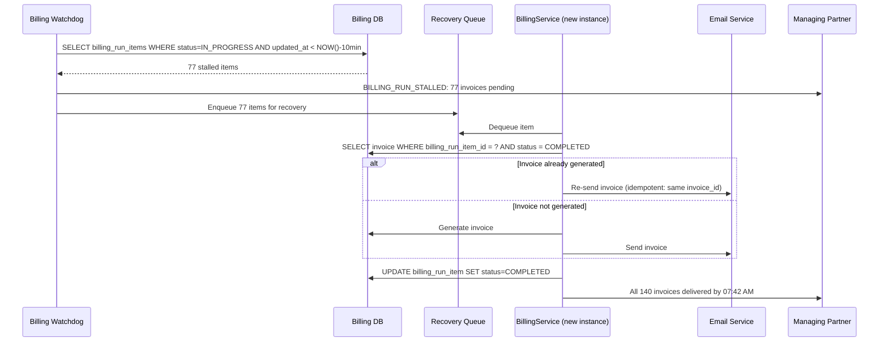
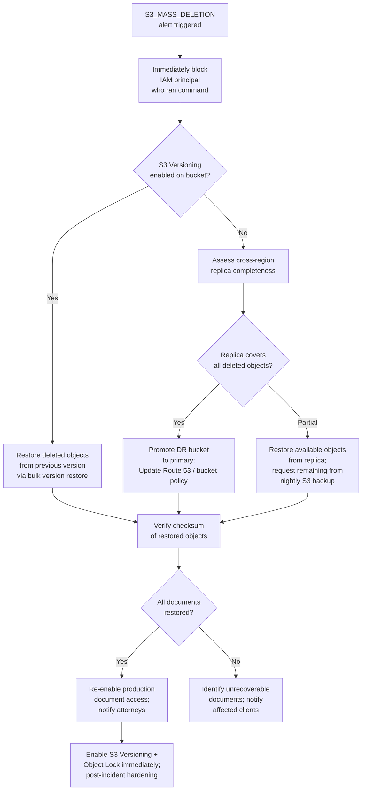
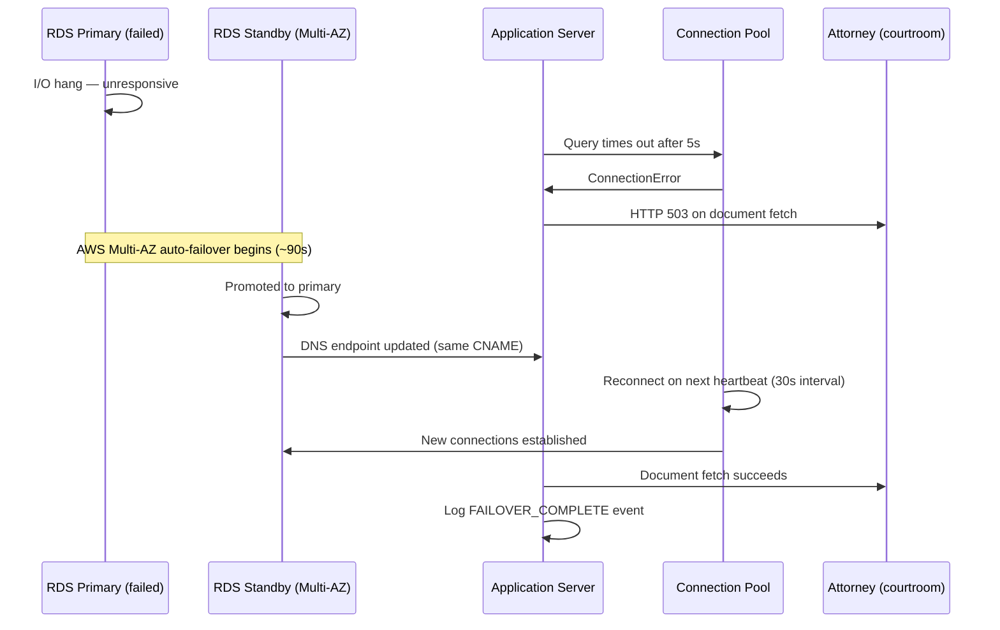
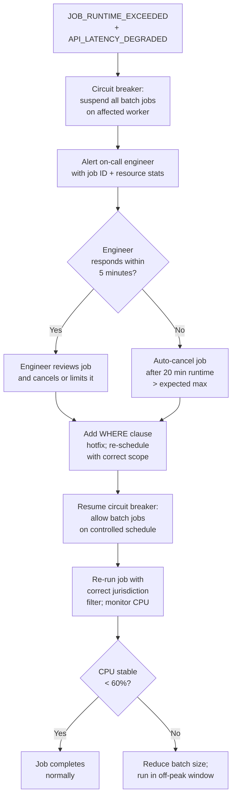

# Operations Edge Cases

Domain: Law firm SaaS — deadline tracking service, billing infrastructure, document storage, database failover, batch job management.

---

## Court Deadline System Unavailable

### Scenario

The `DeadlineService` — a Python microservice responsible for computing, storing, and pushing court deadline reminders — crashes due to an OOM kill after a runaway query loads all deadline history without pagination. The service has been down for 14 minutes before the on-call engineer is paged. During this window, three deadline reminders were not delivered to attorneys, and two court calendar sync pushes failed silently.

### Detection

- **Health check probe**: load balancer pings `/health` on `DeadlineService` every 15 seconds; two consecutive failures trigger `DEADLINE_SERVICE_DOWN` PagerDuty incident (P1).
- **Dead man's switch**: the service publishes a heartbeat event to the `deadline-heartbeat` SQS queue every 5 minutes; a CloudWatch alarm triggers if no message is received in 10 minutes.
- **Missed reminder detection**: a secondary `ReminderAuditService` (separate process, separate host) polls `upcoming_deadlines WHERE due_date BETWEEN NOW() AND NOW() + INTERVAL '24 hours'` and checks whether each has a corresponding entry in `reminder_delivery_log`; gaps trigger `REMINDER_GAP_DETECTED`.

### System Response

### Manual Steps

1. Immediately pull the crash dump / OOM kill log from CloudWatch; identify the offending query via the slow-query log.
2. While service is down, publish a firm-wide alert: "Deadline reminders are paused — verify your next 48 hours of deadlines in the portal."
3. Execute the manual deadline review checklist: each attorney opens the matter portal and confirms their next 3 deadlines against the matter file.
4. After service recovery, run the missed-reminder replay job; confirm delivery receipts for each replayed reminder before clearing the incident.
5. Schedule a post-incident review to add pagination to the offending query and introduce a memory limit guardrail.

### SLA Impact

- **Reminder delivery SLA**: 99.9% of deadline reminders delivered within 1 minute of scheduled time; a 14-minute outage that misses 3 reminders breaches this SLA.
- **Client-facing SLA**: client portal showing upcoming hearings is degraded (read-only from replica) but not fully unavailable; this is within the 99.5% portal availability SLA.
- SLA breach triggers an automatic credit calculation and internal incident report to the CTO.

### Recovery Procedure

1. Confirm the read replica is serving correct deadline data by spot-checking 5 randomly selected matters.
2. Restart `DeadlineService` primary; verify memory usage stabilizes below the new limit under load test.
3. Replay the missed-reminder queue: `SELECT * FROM upcoming_deadlines WHERE scheduled_reminder_time BETWEEN <outage_start> AND <outage_end> AND reminder_delivered = false`.
4. For any deadline with `due_date < NOW() + 4 hours` that was in the missed window, immediately call the assigned attorney directly (do not rely on automated delivery).
5. Close incident in PagerDuty with a full timeline; add regression test for the pagination guard.

---

## Billing System Failover

### Scenario

`BillingService` crashes at 11:47 PM on the last business day of the month during a scheduled batch invoice-generation run. At the time of the crash, 63 of 140 client invoices have been generated and emailed. The remaining 77 are in an indeterminate state: some may have been written to the database but not emailed; others may not have been generated at all. Partners need all invoices delivered by 8:00 AM the next morning.

### Detection

- Every invoice generation writes a `billing_run_item` record with `status = IN_PROGRESS` before generation starts, and updates to `COMPLETED` or `FAILED` after. A crash leaves some records stuck at `IN_PROGRESS`.
- A **billing watchdog job** runs every 5 minutes; any `billing_run` record with `status = IN_PROGRESS` for > 10 minutes triggers `BILLING_RUN_STALLED` (P1 alert).
- The email delivery service records each invoice email in `invoice_delivery_log`; a generated invoice without a corresponding delivery record within 5 minutes triggers `INVOICE_NOT_DELIVERED`.

### System Response

### Manual Steps

1. Identify the exact crash point: query `billing_run_items WHERE status = IN_PROGRESS`; these are the ambiguous records.
2. For each ambiguous record, check `invoices` table: if an invoice exists with `billing_run_item_id`, it was generated; check `invoice_delivery_log` to confirm email status.
3. Do not re-generate invoices that are already in `invoices` table — only re-send the email for confirmed-generated, un-delivered invoices.
4. For truly un-generated invoices, run the generation step individually to avoid another bulk failure.
5. Send a brief advisory to all clients whose invoices will arrive later than 8 AM EST, explaining a technical issue delayed delivery.

### SLA Impact

- **Invoice delivery SLA**: invoices due by end of the last business day of the month; a crash recovery extending to 7:42 AM the next day technically breaches the delivery SLA.
- A billing SLA breach triggers an internal escalation report and, per client contracts, may require a written explanation.
- Automated SLA breach notification is sent to the COO and Managing Partner when delivery is confirmed past the SLA window.

### Recovery Procedure

1. Restart `BillingService` on a new instance with increased memory allocation.
2. Trigger the recovery queue consumer: it processes each stalled item idempotently, checking for existing invoices before generating new ones.
3. Monitor recovery queue depth in the ops dashboard until it reaches zero.
4. Run a post-recovery audit: `SELECT COUNT(*) FROM billing_run_items WHERE billing_run_id = ? AND status != 'COMPLETED'` must return 0.
5. Confirm all 140 invoice delivery records exist in `invoice_delivery_log` with `delivered_at` timestamps.

---

## Document Storage Disaster Recovery

### Scenario

An engineer accidentally runs a production cleanup script intended for the staging environment, executing `aws s3 rm s3://lcms-prod-documents --recursive` on the production document bucket. The command runs for 4 minutes before it is stopped; approximately 18,000 of 95,000 documents are permanently deleted (S3 versioning was not enabled on the production bucket at the time). The deletion is detected via a CloudTrail alert 8 minutes after it begins.

### Detection

- **CloudTrail + EventBridge rule**: any `DeleteObjects` API call on production S3 buckets triggers an immediate `S3_MASS_DELETION` alarm if more than 50 objects are deleted in under 60 seconds.
- **Document count monitor**: a CloudWatch metric tracks `NumberOfObjects` on the bucket; a drop of > 100 objects in 5 minutes triggers `DOC_COUNT_ANOMALY`.
- **Cross-region replication**: the production bucket replicates to `lcms-dr-documents` in `us-west-2` with a 15-minute replication lag; replicated objects are not deleted when source objects are deleted (replication delete marker behavior disabled).

### System Response

### Manual Steps

1. Halt all delete operations immediately; if the script is still running, terminate it and revoke the IAM credentials.
2. Determine the exact list of deleted objects by querying CloudTrail `DeleteObjects` events in the incident window.
3. Attempt restoration from the cross-region replica: compare the deleted object list against the replica bucket inventory.
4. For objects not in the replica (deleted before replication caught them), request point-in-time restore from the nightly S3 backup (Glacier/S3 Backup).
5. For any documents that cannot be recovered, identify the affected matters and clients; prepare client notification letters.
6. After full restoration, run a checksum audit: compare SHA-256 hashes in `document_metadata` against the restored S3 objects.

### SLA Impact

- **RPO (Recovery Point Objective)**: 1 hour — cross-region replication lag is 15 minutes; nightly backup provides a 24-hour fallback. Target RPO is met for the replica; the nightly backup introduces up to 24-hour data loss risk for the gap.
- **RTO (Recovery Time Objective)**: 4 hours — from detection to full document access restoration; this is the target RTO for document storage DR.
- If RTO is breached, the CTO must be notified within 30 minutes; client-facing document access SLA breach triggers written notification per service agreement.

### Recovery Procedure

1. Enable S3 Object Lock (Compliance mode) on the production bucket immediately after incident — this is the hardening step.
2. Restore from DR replica for all available objects; use AWS DataSync for high-throughput transfer back to the primary region.
3. Restore remaining objects from the nightly S3 backup (AWS Backup vault); prioritize active matters with upcoming deadlines.
4. Perform a full document inventory reconciliation: `document_metadata.s3_key` vs actual S3 object list.
5. Any unrecoverable documents are marked `UNRECOVERABLE` in `document_metadata`; the matter's assigned attorney is notified with a list.

---

## Database Failover During Active Trial

### Scenario

The firm is supporting a high-stakes commercial litigation trial. At 9:15 AM on day 3 of trial, the RDS PostgreSQL primary instance experiences a storage I/O hang, making it unresponsive to queries. Attorneys in the courtroom are actively using the client portal to pull up deposition summaries and exhibit lists. The outage begins during cross-examination.

### Detection

- **RDS Enhanced Monitoring**: CPU wait time on I/O exceeds 90% for > 60 seconds; CloudWatch alarm triggers `RDS_IO_HANG` (P0).
- **Application layer**: `pg_pool` connection pool reports all connections timing out after 5 seconds; the API returns HTTP 503 for all database-dependent endpoints; health check endpoint `/health/db` returns `DEGRADED`.
- **RDS Multi-AZ**: AWS automatically detects the primary failure and begins failover to the standby instance; typical failover time is 60–120 seconds.

### System Response

### Manual Steps

1. Immediately switch the courtroom to the **offline exhibit binder** (a pre-exported PDF bundle generated each morning at 7 AM as part of the trial ops procedure).
2. The trial support paralegal calls the operations team on a dedicated trial-support hotline to get a status update.
3. Engineers monitor the AWS RDS console for failover completion; do not manually intervene in the automatic failover process as this can extend downtime.
4. After failover, instruct all attorneys to hard-refresh the portal; verify document access is restored by loading the exhibit list.
5. Once restored, check for any transactions that may have been lost in the failover window; verify that any in-flight document uploads are complete or re-queued.

### SLA Impact

- **RTO for database failover**: 3 minutes (target); Multi-AZ failover typically completes in 90–120 seconds; connection pool reconnection adds ~30 seconds.
- **RPO for database failover**: near-zero — Multi-AZ standby uses synchronous replication; no committed transactions are lost.
- During the failover window (~2 minutes), all write operations fail; read operations from the application's Redis cache succeed if the requested data is cached.
- Post-failover, a P0 incident report is auto-generated; the RDS instance type and I/O provisioning are reviewed for upgrade.

### Recovery Procedure

1. After Multi-AZ failover completes, verify the new primary is healthy: `SELECT 1` from the app server.
2. Check `pg_stat_replication` to confirm the new standby (former primary, if recovered) has re-joined as a replica.
3. Run a transaction log consistency check: compare the `last_committed_transaction_id` in the application's idempotency table against the database.
4. Identify any client-visible data gaps: documents uploaded during the 90-second window should be re-attempted via the retry queue.
5. Submit an AWS support case for root cause analysis of the I/O hang; provision additional IOPS or upgrade to `io2` storage class.

---

## Runaway Batch Job

### Scenario

The monthly deadline recalculation job — which recomputes all court deadlines after a jurisdiction's rules update — is triggered manually by an administrator on a production database with 220,000 active matters. Due to a missing `WHERE` clause filter, the job processes all matters regardless of jurisdiction, consuming 94% of available CPU for 18 minutes and causing cascading API timeouts across the entire platform. Three user sessions drop, and one automated e-filing is delayed.

### Detection

- **Resource usage alarm**: CloudWatch alarm triggers when `CPUUtilization` on the application server exceeds 85% for > 2 minutes.
- **Job runtime monitor**: all batch jobs register a `batch_job_run` record with `started_at` and an expected `max_runtime_seconds`; jobs exceeding this threshold trigger `JOB_RUNTIME_EXCEEDED`.
- **Circuit breaker on job executor**: the job execution framework monitors system CPU and memory; if CPU > 80% for > 60 seconds, it suspends new job dispatches and emits `RESOURCE_PRESSURE`.
- **API latency degradation**: p99 API response time exceeding 5 seconds triggers `API_LATENCY_DEGRADED`, which correlates with active batch job runs to identify the cause.

### System Response

### Manual Steps

1. Immediately cancel the runaway job: `UPDATE batch_job_runs SET status = 'CANCELLED', cancelled_at = NOW() WHERE id = ?`.
2. Verify the job is actually stopped: check process list on the worker node; kill the worker process if the job does not stop within 30 seconds.
3. Assess which API requests failed during the CPU spike; check the retry queue for any e-filing requests that were delayed or dropped.
4. Manually re-trigger the delayed e-filing with priority flag; confirm court submission before proceeding with job remediation.
5. Fix the missing `WHERE` clause, add a `LIMIT` clause for safe testing, and schedule the job for 2:00 AM on a Saturday.
6. Add a pre-execution dry-run mode that reports the row count the job will process before executing; require engineer sign-off for jobs affecting > 10,000 rows.

### SLA Impact

- **Platform availability SLA**: 18 minutes of API degradation (p99 > 5 s) breaches the 99.9% uptime SLA for the affected period.
- **E-filing delay**: the 90-minute delay on the automated filing did not breach the court deadline (8 hours remaining), but a SLA breach report is generated internally.
- Affected users receive an automatic service credit if the degradation window exceeds 10 minutes (per service agreement).
- Post-incident, the batch job framework's resource quota enforcement is reviewed and tightened.

### Recovery Procedure

1. After job cancellation, allow CPU to stabilize (monitor CloudWatch for 5 minutes).
2. Re-enable the circuit breaker (allow batch jobs to resume on a controlled schedule: one job at a time, max 40% CPU target).
3. Run the deadline recalculation job with the corrected jurisdiction filter and `LIMIT 500` per batch, with a 2-second delay between batches.
4. Monitor progress via `batch_job_runs.progress_pct`; confirm completion without resource pressure.
5. Verify the recalculated deadlines are correct by spot-checking 10 matters in the target jurisdiction against the court rules change document.
6. Add a mandatory review step for batch jobs: any job affecting > 5,000 records requires a query plan review (`EXPLAIN ANALYZE`) and estimated runtime before execution is authorized.
