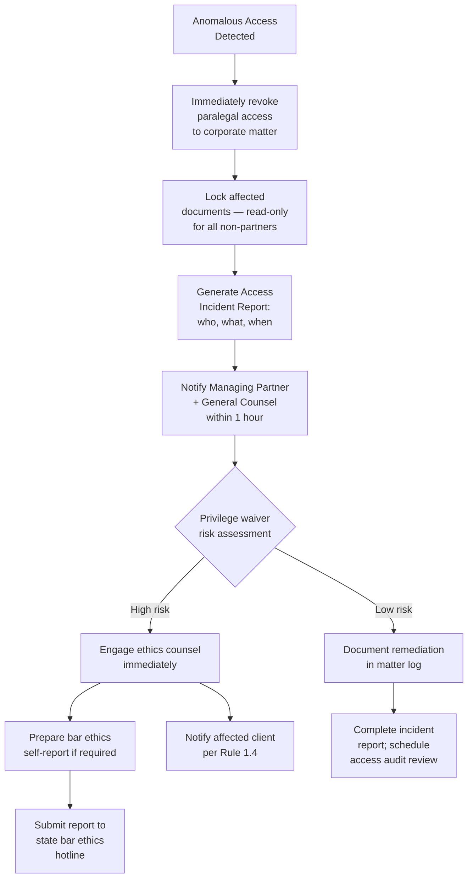
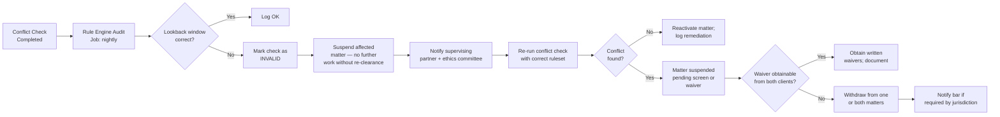
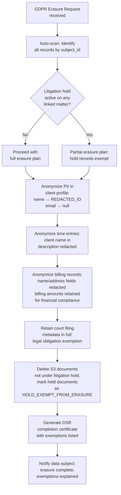
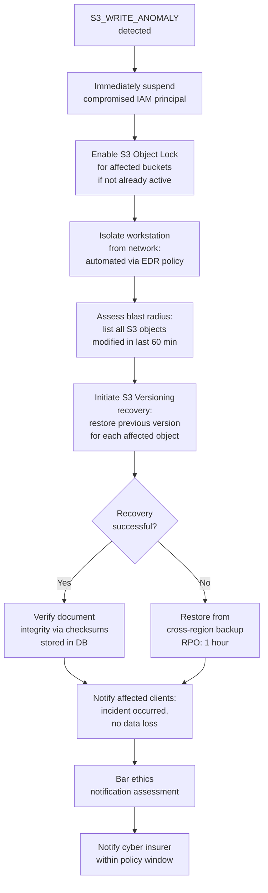
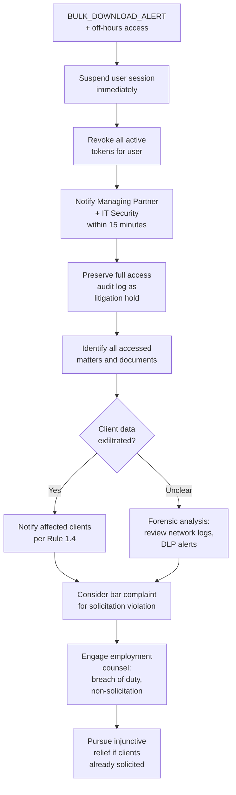

# Security and Compliance Edge Cases

Domain: Law firm SaaS — attorney-client privilege, bar professional responsibility rules, GDPR, ransomware resilience, IOLTA trust accounting, insider threat.

---

## Attorney-Client Privilege Breach

### Scenario

A paralegal assigned to a personal injury matter is also briefly added to a corporate litigation matter by mistake during a bulk matter-assignment import. The import script incorrectly maps user IDs from a CSV with duplicate rows. As a result, the paralegal gains read access to 47 privileged documents in the corporate matter — including confidential settlement strategy memos — for 6 hours before the error is discovered during a routine access audit.

### Detection

- **Anomalous access detector**: a nightly job cross-references `document_access_log` against `matter_assignments`; any access where `user_id` is not in `matter_assignments.user_id` for the accessed matter generates an `UNAUTHORIZED_ACCESS` incident.
- Real-time RBAC check at the document service layer logs every access attempt with `granted=true/false`; a separate stream processor flags `granted=true` events where the user was not assigned to the matter at intake (retroactive role change pattern).
- The bulk import script's output is validated against a pre-import snapshot; row-count and ID-uniqueness assertions must pass before the import transaction is committed.

### System Response

### Manual Steps

1. **Within 1 hour**: Revoke all access for the paralegal to the corporate matter; verify revocation by attempting a document fetch with their credentials in a test environment.
2. Preserve the `document_access_log` for the incident window as a litigation hold; do not purge or rotate these logs.
3. Review exactly which documents were accessed and for how long; assess whether the paralegal viewed, printed, or downloaded any document.
4. Consult with ethics counsel to assess whether the inadvertent disclosure constitutes a privilege waiver under applicable state law (majority view: no waiver if prompt remedial action taken).
5. Notify the affected corporate client per Rule 1.4 and the firm's incident notification policy.
6. Remediate the import script: add row-deduplication validation, and require two-person approval for any bulk user-matter assignment.

### Prevention

- Bulk import scripts run in a staging environment with production-identical access control rules; access assertion tests must pass before promotion to production.
- RBAC changes to matters require two-factor confirmation for any assignment adding a user who was not part of the matter's original team.
- Document access is segmented at the matter level with a separate encryption key per matter (envelope encryption); a user with no matter assignment cannot decrypt documents even if they obtain a signed URL.

### Regulatory Notification Requirements

- ABA Model Rule 1.4: notify client of any disclosure of confidential information.
- ABA Model Rule 1.6(c): firm must make reasonable efforts to prevent unauthorized disclosure.
- State-specific breach notification statutes may require written notice within 30–72 hours if the disclosed documents contain personal data (e.g., California CPRA).
- Malpractice insurer notification within policy-specified window (typically 30 days of discovery).

---

## Bar Compliance Violation

### Scenario

The system's conflict-of-interest check module has a bug in its lateral hire processing: when an attorney joins the firm and their prior-firm matters are imported, the conflict engine only checks active matters, not closed matters within the 3-year lookback window. As a result, the system incorrectly clears a conflict check for a new corporate matter where the newly joined attorney had previously represented the opposing party.

### Detection

- **Rule engine audit**: every conflict clearance writes a `ConflictCheckResult` record that includes the rules evaluated and the lookback window applied; a nightly audit job validates that all clearances used the correct 3-year lookback.
- Compliance rules are versioned in `compliance_rules` table; any rule engine execution uses the version active at the time of the check; version mismatches trigger a re-run with the current ruleset.
- The bug is also detectable via the "Conflict Check Completeness" report that surfaces any attorney whose prior-firm matter import is in `PARTIAL` status.

### System Response

### Manual Steps

1. Immediately suspend all billable work on the affected matter pending re-clearance; notify the responsible attorney.
2. Re-run the conflict check using the corrected rule engine against the full 3-year lookback, including closed matters.
3. If a conflict is confirmed, assess whether an ethical screen (Chinese wall) is sufficient under the applicable state bar rules (MRPC 1.10 lateral conflicts).
4. Obtain advance written waivers from all affected clients if the conflict is consentable.
5. If withdrawal is required, initiate orderly withdrawal per Rule 1.16: reasonable notice, return of files, protection of client interests.
6. Remediate the rule engine bug with a hotfix; run a full back-check on all conflict clearances performed during the buggy version's deployment window.

### Prevention

- Conflict rule engine has a comprehensive test suite with at least one test per ABA Model Rule scenario; test coverage for lateral hire lookback is part of the CI pipeline.
- The rule engine version is pinned in each `ConflictCheckResult`; any engine update triggers a background re-check of all clearances issued in the prior 90 days.
- Lateral hire matter imports are always marked `REQUIRES_CONFLICT_REVIEW` until a supervising partner manually confirms the import is complete.

### Regulatory Notification Requirements

- MRPC 1.7, 1.9, 1.10: govern conflict obligations; violations must be remediated promptly.
- Depending on jurisdiction and severity, voluntary disclosure to the state bar may be required under Rule 8.3.
- Affected clients must be notified of the conflict and provided the option to seek independent counsel per Rule 1.7(b).

---

## GDPR Data Subject Request

### Scenario

A former EU-based client submits a GDPR Article 17 erasure request ("right to be forgotten"). The client's personal data appears in: (a) the client profile, (b) time entries, (c) billing records, (d) court filing metadata, and (e) email correspondence stored in the matter's document store. However, the client's matter is also subject to a litigation hold tied to an ongoing regulatory inquiry, which legally prohibits deletion of any matter-related records.

### Detection

- A GDPR request intake form creates a `DataSubjectRequest` record with `type=ERASURE`, `subject_id`, `submitted_at`, and a 30-day SLA clock.
- The system automatically scans all data stores (PostgreSQL, S3, Elasticsearch) for records linked to the `subject_id` and generates a data map.
- The litigation hold module is checked: if `matter.litigation_hold = true` for any matter linked to the data subject, a `HOLD_CONFLICT` flag is set on the DSR, and automatic deletion is blocked pending legal review.

### System Response

### Manual Steps

1. Legal counsel reviews the data map and signs off on the hold-vs-erasure conflict resolution before any deletion proceeds.
2. The anonymization script runs in a dry-run mode first, producing a report of fields to be modified; legal counsel approves.
3. For documents under litigation hold, the data subject is notified in writing that their data is retained under legal obligation (GDPR Article 17(3)(e)) and will be deleted upon hold release.
4. After hold release, a reminder task is created in the system to re-process the partial erasure for the previously exempt records.
5. All actions are logged in the `dsr_audit_log` with timestamps, approver IDs, and the legal basis for each retention decision.

### Prevention

- GDPR exemption logic is documented in the Privacy Policy and Terms of Service; clients acknowledge that litigation hold may delay erasure.
- Retention policy is configured per data category in `retention_policies` table; the GDPR erasure engine respects minimum retention periods mandated by financial and professional regulations.
- Data minimization at intake: only collect PII fields that are strictly necessary; reduces erasure complexity.

### Regulatory Notification Requirements

- GDPR Article 12: respond to the data subject within 1 month (extendable by 2 months for complex cases with notification).
- If erasure is partially refused, provide written explanation citing the specific legal basis under Article 17(3).
- Record the DSR and its resolution in the GDPR Record of Processing Activities (ROPA).

---

## Ransomware on Case Files

### Scenario

A firm workstation is compromised via a phishing email. The malware enumerates mapped drives and begins encrypting files in the document storage network share and, via a compromised service account, begins calling the document API to overwrite S3 object versions with encrypted blobs. Within 22 minutes, approximately 3,400 documents across 80 matters are overwritten.

### Detection

- **S3 anomaly detection**: AWS CloudTrail + GuardDuty monitors for unusually high `PutObject` rates from a single IAM principal; a rate exceeding 100 writes/minute triggers `S3_WRITE_ANOMALY`.
- The document service records write operations in `document_events`; a stream processor computes a rolling write rate per user; > 50 writes/minute from a non-batch service account triggers `UNUSUAL_WRITE_RATE`.
- Encrypted blob detection: a Lambda function triggered on `s3:ObjectCreated` runs a file-type check; a high ratio of unknown/encrypted file types from a single session triggers `RANSOMWARE_SUSPECTED`.

### System Response

### Manual Steps

1. **Immediately** revoke all tokens issued to the compromised service account; rotate the IAM credentials.
2. Engage the incident response plan: declare a P0 security incident, activate the IR team, preserve forensic evidence before remediation.
3. Use S3 versioning to list all objects modified after the attack start time; restore each to the prior version in bulk using the AWS CLI or a recovery script.
4. Verify document integrity: compare SHA-256 checksums stored in `document_metadata` against the restored S3 objects.
5. Notify all clients whose matters were affected; the notification must describe what happened, what data was affected, and what steps were taken.
6. Conduct a post-incident forensic analysis to determine the initial access vector and close the vulnerability.

### Prevention

- S3 Object Lock (Compliance mode) on the document bucket prevents any version deletion or overwrite for the retention period.
- Cross-region replication to a secondary S3 bucket with a 1-hour replication lag; the replica bucket has a separate IAM role that the primary service account cannot write to.
- Least-privilege IAM: service account credentials can only `PutObject` in approved prefixes; no `DeleteObject` permission.
- Mandatory MFA for all IAM users; phishing-resistant MFA (hardware keys) for admin accounts.

### Regulatory Notification Requirements

- If documents contain personal data, state data breach notification laws apply (e.g., CCPA: notify within 72 hours of discovery).
- ABA Formal Opinion 483 (2018): lawyers have a duty to monitor for and respond to data breaches; must notify affected clients.
- Cyber insurance claim must be filed within the policy notification window (typically 30–72 hours).
- If the firm holds IOLTA trust account records, the state bar must be notified as IOLTA funds may be at risk.

---

## Insider Threat

### Scenario

A recently resigned associate downloads case files, time entry records, and client contact information for 12 matters they were never assigned to, during their notice period. The downloads occur across three sessions over 5 days, each session starting at 7:00 AM before other staff arrive. The associate subsequently joins a competing firm that solicits several of the same clients.

### Detection

- **Access anomaly scoring**: user activity is scored nightly using a behavioral baseline; access to matters outside `matter_assignments` increments the anomaly score; a score exceeding threshold triggers `INSIDER_THREAT_SUSPECTED`.
- **Resignation flag**: when an employee's status is set to `NOTICE_PERIOD`, the system automatically increases access monitoring frequency to real-time and reduces their access scope to currently assigned matters only.
- **Off-hours access detection**: access events before 7:30 AM or after 8:00 PM are flagged for review; combined with resignation status, these trigger immediate alert.
- **Bulk download detection**: > 10 document downloads in a 5-minute window from a single session triggers `BULK_DOWNLOAD_ALERT`.

### System Response

### Manual Steps

1. Immediately suspend all system access and collect all access tokens; if the employee has physical access to the office, coordinate with HR.
2. Preserve the access audit log, network flow logs, and email logs as a litigation hold; do not allow log rotation to purge these records.
3. Conduct a forensic review to identify every document accessed, downloaded, or printed; assess what client data was exposed.
4. Consult with employment counsel regarding the breach of fiduciary duty and any applicable non-solicitation provisions in the employment agreement.
5. Notify each affected client that their confidential information may have been accessed; offer assurance of remediation steps.
6. File a bar complaint if there is evidence the former associate solicited clients using information obtained from the firm's system.

### Prevention

- **Access scope reduction on resignation**: immediately upon notice period start, system access is automatically restricted to currently active assigned matters; no new matter access without partner approval.
- **Data Loss Prevention (DLP)**: all bulk downloads are watermarked with the user's ID; documents exported from the system embed a hidden per-user identifier for forensic tracing.
- **Separation of duties**: client contact data is not accessible from the document management module; contact export requires a separate permission flag.
- **Continuous behavioral monitoring**: user activity baselines are updated weekly; z-score anomalies trigger progressive alerts before reaching the threshold for session suspension.

### Regulatory Notification Requirements

- ABA Model Rule 1.6: firm must take reasonable measures to prevent unauthorized disclosure; incident must be documented.
- ABA Model Rule 8.3: if the former employee is a licensed attorney, a Rule 8.3 report to the state bar may be required if the conduct raises a substantial question of professional fitness.
- State trade secret laws (DTSA): if the exfiltrated data constitutes a trade secret, a civil action is available; notify the relevant insurer.
- Client notification is required under applicable state breach notification statutes if personal data was accessed.
