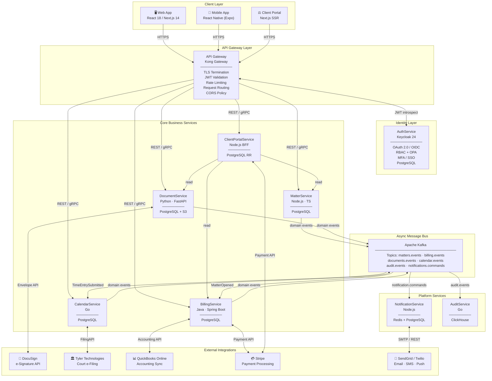
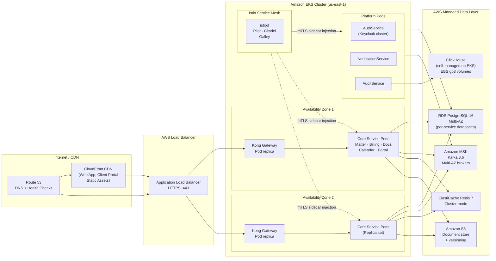

# Legal Case Management System — High-Level Architecture

## Architecture Style

The Legal Case Management System (LCMS) is designed as a **domain-driven microservices architecture** with **event-driven communication** between services. Each service owns a distinct bounded context, its own data store, and is independently deployable, scalable, and fault-tolerant.

**Why Microservices for a Law Firm SaaS?**

Legal workflows span fundamentally independent domains: case intake, billing, document management, court scheduling, and client communication. Coupling these in a monolith creates significant risk — a billing regression during LEDES export should never affect court deadline tracking, and a document upload bottleneck should never block client portal access. Microservices enforce domain boundaries that mirror how law firm departments actually operate.

Key architectural drivers:

- **Regulatory isolation**: IOLTA trust accounting (BillingService) must meet strict ABA Model Rule 1.15 compliance. Isolating it limits the blast radius of changes and audits to a single service.
- **Independent scaling**: Court filing season creates deadline spikes in CalendarService without impacting DocumentService throughput.
- **Team autonomy**: Billing engineers can evolve UTBMS code independently of matter lifecycle engineers.
- **Multi-tenancy**: Every service enforces `firm_id`-scoped data isolation via PostgreSQL row-level security (RLS) and JWT claim propagation.

**Event-Driven Communication**

Services communicate asynchronously through **Apache Kafka** for domain events. Events such as `MatterOpened`, `TimeEntrySubmitted`, `DocumentSigned`, `DeadlineCreated`, and `InvoicePaid` flow through Kafka, decoupling producers from consumers and providing a durable, replayable event log.

Synchronous REST (JSON over HTTPS) or gRPC is reserved for request-response flows where an immediate result is required — such as the client portal fetching matter status or BillingService performing a real-time trust account balance check before disbursement.

**Communication Patterns Summary**

| Pattern | Protocol | Use Cases |
|---|---|---|
| Synchronous request-response | REST / gRPC | Client portal queries, conflict-of-interest checks, billing previews |
| Asynchronous domain events | Kafka | Matter opened → billing setup, document signed → notification, deadline created → calendar |
| Webhook callbacks | HTTPS POST | DocuSign signature completion, Stripe payment confirmation, court e-filing status |
| Read-through cache | Redis | Client portal session, rate-limit counters, notification dedup |

---

## Service Inventory

| Service | Responsibilities | Tech Stack | Database |
|---|---|---|---|
| **MatterService** | Case intake forms, matter lifecycle (open / active / closed / archived), party and opposing-counsel management, conflict-of-interest check engine, practice area classification, statute tagging | Node.js 20 / TypeScript | PostgreSQL 16 |
| **BillingService** | Time entry capture with UTBMS task/activity codes, LEDES 1998B/eBillingHub export, invoice generation and approval workflow, IOLTA trust ledger, retainer management, payment reconciliation, QuickBooks sync | Java 21 / Spring Boot 3 | PostgreSQL 16 (dedicated schema for trust ledger) |
| **DocumentService** | Secure document upload and versioning, template rendering (Docxtemplater), e-signature orchestration via DocuSign, OCR and metadata extraction (Apache Tika), Bates numbering, privilege log management | Python 3.12 / FastAPI | PostgreSQL 16 + AWS S3 |
| **CalendarService** | Court deadline computation using jurisdiction-specific rules, statute-of-limitations engine, hearing and deposition scheduling, court e-filing integration (Tyler Technologies), iCal / Exchange calendar sync, conflict detection across attorneys | Go 1.22 | PostgreSQL 16 |
| **ClientPortalService** | Client-facing matter status dashboard, secure document sharing and download, invoice review and online payment via Stripe, secure messaging thread, notification preferences | Next.js 14 (SSR) + Node.js BFF | PostgreSQL 16 (read replica) |
| **NotificationService** | Email, SMS, and push notification dispatch for deadlines, invoice due dates, document requests, portal messages; delivery tracking and bounce handling; per-firm branding and template management | Node.js 20 | Redis 7 (queue) + PostgreSQL 16 (delivery log) |
| **AuthService** | JWT / OAuth 2.0 token issuance, OIDC provider federation, RBAC role and permission management, MFA (TOTP / WebAuthn), SSO for enterprise firms, service-to-service mTLS identity | Keycloak 24 | PostgreSQL 16 |
| **AuditService** | Immutable event log for ABA / state-bar compliance, user activity trails, data-change history with before/after state, 7-year retention, compliance report generation | Go 1.22 | ClickHouse (append-only) |

---

## System Architecture Diagram

---

## Cross-Cutting Concerns

### Authentication and Authorization

All inbound requests are validated at the **API Gateway** (Kong) using JWT bearer token introspection against **AuthService** (Keycloak). Tokens carry claims for `firm_id`, `user_id`, `roles[]`, and `matter_access_list[]`.

Within each service, fine-grained authorization is enforced using **OPA (Open Policy Agent)** sidecars. Policy examples:
- A `billing_staff` role may submit time entries but cannot access opposing-counsel contact details.
- A `client` role can view only matters where `client_id` matches the JWT claim.
- A `supervising_attorney` may approve invoices only within their practice group.

Inter-service communication uses mTLS with service identities managed by **Istio** service mesh, ensuring no service can impersonate another.

### Audit Logging

Every state-mutating operation emits a structured event to Kafka topic `audit.events`. **AuditService** consumes these events and writes them to **ClickHouse** in append-only fashion. No audit record can be updated or deleted — only new correction events can be appended.

Audit record schema:

| Field | Type | Description |
|---|---|---|
| `event_id` | UUID | Unique event identifier |
| `firm_id` | UUID | Tenant identifier |
| `actor_id` | UUID | User or service that performed the action |
| `action` | ENUM | `CREATE`, `UPDATE`, `DELETE`, `VIEW`, `EXPORT` |
| `resource_type` | STRING | e.g., `Matter`, `Invoice`, `Document` |
| `resource_id` | UUID | Target resource |
| `before_state` | JSONB | Snapshot before mutation (null for CREATE) |
| `after_state` | JSONB | Snapshot after mutation (null for DELETE) |
| `ip_address` | INET | Request origin |
| `timestamp` | TIMESTAMPTZ | Event time (UTC) |

Retention: **7 years** per ABA Model Rule 1.15.

### Encryption

**At rest:**
- PostgreSQL databases: AES-256 via AWS RDS encryption.
- S3 document objects: SSE-S3 with per-object keys; sensitive documents (e.g., settlement agreements) use SSE-KMS with firm-specific KMS key aliases.
- ClickHouse audit volumes: dm-crypt encryption on EBS.
- Application-level: IOLTA trust account numbers, SSNs, and tax IDs are envelope-encrypted using AWS KMS before persistence.

**In transit:**
- TLS 1.3 enforced on all external traffic. TLS 1.2 minimum on internal service-to-service communication.
- Kafka broker connections use mTLS with certificates rotated by cert-manager / Vault.

### Rate Limiting and Throttling

Kong API Gateway enforces rate limits keyed by `firm_id` and `user_id`:

| Endpoint Group | Limit | Window |
|---|---|---|
| General API | 1,000 requests | Per minute per firm |
| Court e-Filing proxy | 100 requests | Per minute (upstream constraint) |
| Document upload | 50 requests | Per minute per user |
| Client portal | 200 requests | Per minute per client |
| Auth token issuance | 20 requests | Per minute per IP |

Throttled requests receive `HTTP 429` with a `Retry-After` header and are logged in the audit trail.

### Observability

| Concern | Tool | Detail |
|---|---|---|
| Distributed tracing | OpenTelemetry + Jaeger | Trace ID propagated via `X-Trace-Id` header across all services |
| Metrics | Prometheus + Grafana | SLOs: MatterService p99 < 300ms; BillingService invoice generation < 2s |
| Structured logging | ELK Stack | JSON logs with `firm_id`, `trace_id`, `service`, `level`, `message` |
| Alerting | PagerDuty + Grafana Alerts | On-call rotation for P1/P2 SLA breaches |
| Health checks | Kubernetes liveness + readiness probes | Per-service `/health` and `/ready` endpoints |

### Data Residency and Multi-Tenancy

- `firm_id` is a partition key on all tables; PostgreSQL RLS policies prevent cross-tenant data leakage.
- Firms can elect a geographic region for their data (US-East, US-West, EU) — each region runs an independent Kubernetes cluster with no cross-region data replication by default.
- GDPR / CCPA right-to-erasure: handled via soft-delete with a scheduled data-masking pipeline. Audit logs retain metadata but PII fields are replaced with irreversible hashes.

---

## Technology Stack

| Layer | Technology | Version | Purpose |
|---|---|---|---|
| **Web Frontend** | React, Next.js, TailwindCSS | React 18, Next.js 14 | Law firm web application |
| **Mobile** | React Native, Expo | SDK 51 | Attorney and paralegal mobile app |
| **Client Portal** | Next.js (SSR), Radix UI | Next.js 14 | External client-facing portal |
| **API Gateway** | Kong Gateway (self-hosted on EKS) | Kong 3.6 | Routing, auth, rate limiting, TLS termination |
| **Service Runtimes** | Node.js, Java, Python, Go | Node 20, Java 21, Python 3.12, Go 1.22 | Per-service language optimized for domain |
| **Message Bus** | Apache Kafka (Amazon MSK) | Kafka 3.6 | Async domain event streaming |
| **Primary Database** | PostgreSQL (Amazon RDS) | PostgreSQL 16 | Per-service transactional data store |
| **Object Storage** | Amazon S3 | — | Document blob storage |
| **Search** | Elasticsearch | 8.x | Full-text matter and document search |
| **Cache / Queue** | Redis (Amazon ElastiCache) | Redis 7 | Session cache, notification queues, dedup |
| **Analytics DB** | ClickHouse | 24.x | Immutable audit log, billing analytics |
| **Identity Provider** | Keycloak | 24.x | OAuth 2.0, OIDC, MFA, SSO, SCIM |
| **Policy Engine** | OPA (Open Policy Agent) | 0.65 | Fine-grained RBAC enforcement |
| **Secrets Management** | AWS Secrets Manager + KMS | — | Credentials and envelope encryption keys |
| **Service Mesh** | Istio | 1.22 | mTLS, traffic management, circuit breaking |
| **Container Orchestration** | Kubernetes (Amazon EKS) + Helm | K8s 1.30 | Service deployment and auto-scaling |
| **Observability** | OpenTelemetry, Jaeger, Prometheus, Grafana, ELK | — | Tracing, metrics, alerting, log aggregation |
| **CI / CD** | GitHub Actions + ArgoCD + Argo Rollouts | — | Build, test, progressive delivery (canary) |
| **Infrastructure as Code** | Terraform + Terragrunt | Terraform 1.8 | Cloud resource provisioning |
| **E-Signature** | DocuSign eSignature API | v2.1 | Binding electronic signatures on legal documents |
| **Payment Processing** | Stripe | API 2024 | Client invoice payments |
| **Accounting Integration** | QuickBooks Online API | v3 | General ledger sync |
| **Court E-Filing** | Tyler Technologies Odyssey | — | Electronic court filing submission |
| **Email / SMS** | SendGrid + Twilio | — | Transactional email and SMS notifications |

---

## Deployment Architecture

The LCMS platform is deployed on **Amazon EKS** across two availability zones (AZ-1 and AZ-2) per AWS region. All stateful components (PostgreSQL RDS, Kafka MSK, Redis ElastiCache, S3) are managed AWS services with multi-AZ replication enabled. Stateless service pods are distributed across AZs via Kubernetes topology spread constraints.

**Resilience Patterns**

| Pattern | Implementation | Applied To |
|---|---|---|
| Circuit Breaker | Istio outlier detection | All service-to-service calls |
| Retry with exponential backoff | Istio VirtualService retries + client-side | External API calls (DocuSign, Stripe) |
| Bulkhead | Separate Kafka consumer groups per service | NotificationService, AuditService |
| Dead Letter Queue | Kafka DLQ topic per consumer group | All Kafka consumers |
| Health checks | Kubernetes liveness + readiness + startup probes | All service pods |
| Horizontal Pod Autoscaler | HPA on CPU + custom Kafka consumer lag metric | MatterService, BillingService, CalendarService |
| Database connection pool | PgBouncer sidecar | All PostgreSQL-connected services |
| Graceful shutdown | SIGTERM handler, drain in-flight requests | All Node.js, Java, Go, Python services |

---

## Service Communication Reference

### Synchronous REST Endpoints (selected)

| Service | Endpoint | Method | Consumer | Description |
|---|---|---|---|---|
| MatterService | `/matters` | POST | Web App | Create new matter (case intake) |
| MatterService | `/matters/{id}/conflict-check` | GET | Web App | Run conflict-of-interest check |
| BillingService | `/time-entries` | POST | Web App / Mobile | Submit billable time entry |
| BillingService | `/invoices/{id}/export/ledes` | GET | Web App | Download LEDES 1998B file |
| BillingService | `/trust/accounts/{id}/balance` | GET | Web App | Real-time trust account balance |
| DocumentService | `/documents` | POST | Web App | Upload document (multipart) |
| DocumentService | `/documents/{id}/sign` | POST | Web App | Initiate DocuSign envelope |
| CalendarService | `/deadlines` | POST | Web App | Create court deadline |
| CalendarService | `/deadlines/compute` | POST | Web App | Auto-compute deadlines from event date + jurisdiction |
| ClientPortalService | `/portal/matters` | GET | Client Portal | List client's visible matters |
| ClientPortalService | `/portal/invoices/{id}/pay` | POST | Client Portal | Initiate Stripe payment session |

### Asynchronous Domain Events (Kafka topics)

| Topic | Key Events | Producers | Consumers |
|---|---|---|---|
| `matters.events` | `MatterOpened`, `MatterUpdated`, `MatterClosed`, `ConflictDetected` | MatterService | BillingService, CalendarService, AuditService, NotificationService |
| `billing.events` | `TimeEntrySubmitted`, `InvoiceCreated`, `InvoiceApproved`, `PaymentReceived`, `TrustDisbursed` | BillingService | AuditService, NotificationService, CalendarService |
| `documents.events` | `DocumentUploaded`, `DocumentSigned`, `DocumentArchived`, `EnvelopeSent` | DocumentService | AuditService, NotificationService |
| `calendar.events` | `DeadlineCreated`, `DeadlineUpdated`, `HearingScheduled`, `FilingSubmitted`, `FilingConfirmed` | CalendarService | AuditService, NotificationService |
| `audit.events` | All domain events re-published with audit metadata | All services | AuditService |
| `notifications.commands` | `SendDeadlineAlert`, `SendInvoiceReminder`, `SendDocumentRequest`, `SendPortalInvite` | All services (via Kafka) | NotificationService |
