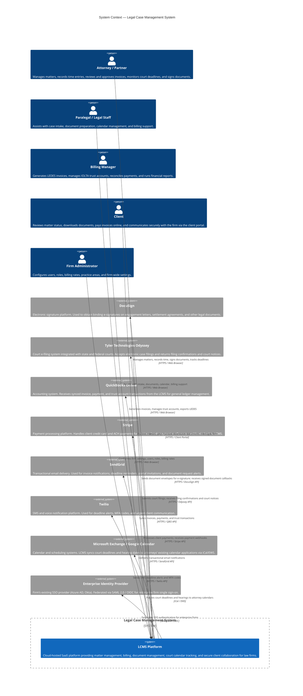
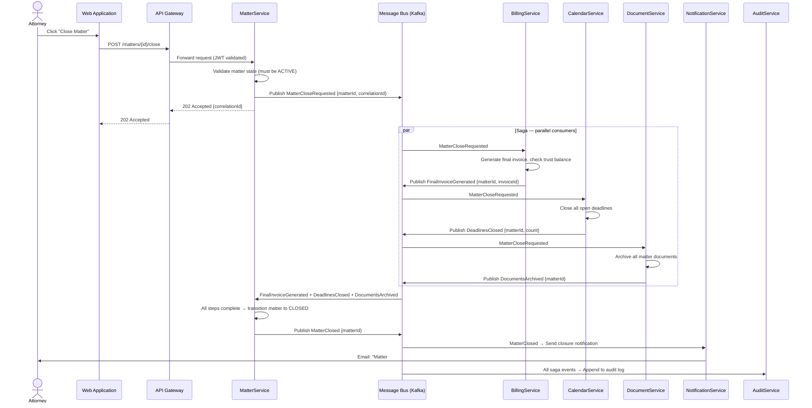

# Legal Case Management System — C4 Context and Container Diagrams

## C4 Level 1 — System Context Diagram

The System Context diagram shows the Legal Case Management System (LCMS) in relation to the users who interact with it and the external systems it depends on or integrates with. This is the highest-level view — it answers "who uses the system and what does it talk to?"

---

## C4 Level 2 — Container Diagram

The Container diagram decomposes the LCMS platform into its deployable units. Each container is an independently deployed process or data store. This view answers "what are the major building blocks and how do they communicate?"

```mermaid
C4Container
    title Container Diagram — Legal Case Management System

    Person(attorney, "Attorney / Staff", "Uses web or mobile app to manage cases and billing.")
    Person(client, "Client", "Uses the client portal to review matters and pay invoices.")

    System_Ext(docusign, "DocuSign", "e-Signature")
    System_Ext(tyler, "Tyler Technologies", "Court e-Filing")
    System_Ext(quickbooks, "QuickBooks Online", "Accounting")
    System_Ext(stripe, "Stripe", "Payments")
    System_Ext(emailsms, "SendGrid / Twilio", "Email and SMS")
    System_Ext(idp, "Enterprise IdP", "SSO / SAML / OIDC")

    System_Boundary(lcms, "Legal Case Management System") {

        Container(webApp, "Web Application", "React 18 / Next.js 14", "Single-page application providing matter management, billing, document, and calendar workflows for attorneys and legal staff. Served via CDN.")
        Container(mobileApp, "Mobile Application", "React Native / Expo", "Native iOS and Android app for attorneys. Time entry, deadline alerts, document review on the go.")
        Container(clientPortal, "Client Portal", "Next.js 14 (SSR)", "Server-side rendered portal for law firm clients. Secure matter status, document downloads, invoice payment, and messaging.")

        Container(apiGateway, "API Gateway", "Kong Gateway on EKS", "Single entry point for all client traffic. Handles TLS termination, JWT validation, rate limiting, request routing, and CORS. Routes to downstream services.")

        Container(authService, "AuthService", "Keycloak 24 + Node.js", "OAuth 2.0 / OIDC token issuance. RBAC role and permission store. MFA (TOTP / WebAuthn). SAML federation with enterprise IdPs. Issues signed JWTs consumed by API Gateway and services.")

        Container(matterService, "MatterService", "Node.js 20 / TypeScript", "Core matter lifecycle management. Case intake, matter open/close/archive, party management, conflict-of-interest check engine, practice area and statute tagging. Emits MatterOpened, MatterClosed events.")
        ContainerDb(matterDb, "Matter Database", "PostgreSQL 16", "Stores matters, parties, intake forms, conflict checks, practice areas. Row-level security by firm_id.")

        Container(billingService, "BillingService", "Java 21 / Spring Boot 3", "Time entry capture with UTBMS task/activity codes. LEDES 1998B/eBillingHub invoice export. IOLTA trust ledger (separate schema, strict audit trail). Retainer management. Reconciles Stripe payments. Syncs to QuickBooks.")
        ContainerDb(billingDb, "Billing Database", "PostgreSQL 16", "Time entries, invoices, trust ledger (separate schema), payment records, billing rates. Append-only trust ledger rows.")

        Container(documentService, "DocumentService", "Python 3.12 / FastAPI", "Secure document upload with versioning, virus scanning, and AV quarantine. Template rendering (Docxtemplater). DocuSign envelope orchestration. OCR and metadata extraction (Apache Tika). Bates numbering and privilege log management.")
        ContainerDb(documentDb, "Document Database", "PostgreSQL 16", "Document metadata, versions, envelope status, privilege tags, Bates ranges.")
        ContainerDb(documentStore, "Document Object Store", "Amazon S3", "Encrypted document blob storage. SSE-KMS for sensitive documents. Lifecycle policy for archival.")

        Container(calendarService, "CalendarService", "Go 1.22", "Jurisdiction-specific court deadline computation. Statute-of-limitations engine. Hearing and deposition scheduling. Tyler Technologies court e-filing integration. iCal and Exchange calendar sync. Attorney scheduling conflict detection.")
        ContainerDb(calendarDb, "Calendar Database", "PostgreSQL 16", "Deadlines, hearings, jurisdiction rules, court holiday calendars, filing confirmations.")

        Container(clientPortalService, "ClientPortalService", "Node.js 20 BFF", "Backend-for-frontend serving the Client Portal. Aggregates read models from MatterService, BillingService, and DocumentService. Manages secure messaging threads. Triggers Stripe payment sessions. Enforces client-scoped RBAC.")
        ContainerDb(portalDb, "Portal Read Replica", "PostgreSQL 16 (Read Replica)", "Read-optimized replica for matter status, invoice summaries, and document listings visible to clients.")

        Container(notificationService, "NotificationService", "Node.js 20", "Consumes notification commands from Kafka. Routes to SendGrid (email) or Twilio (SMS/push). Per-firm branded email templates. Delivery tracking and bounce handling. Idempotency via Redis dedup keys.")
        ContainerDb(notifQueue, "Notification Queue", "Redis 7", "Kafka consumer offset tracking, dedup keys, in-flight notification state.")

        Container(auditService, "AuditService", "Go 1.22", "Consumes audit events from Kafka. Persists immutable records to ClickHouse. Serves compliance report endpoints (7-year retention, ABA Model Rule 1.15). Never deletes records — append-only corrections only.")
        ContainerDb(auditDb, "Audit Log Store", "ClickHouse", "Append-only, immutable audit event log. Columnar storage optimised for compliance queries and billing analytics.")

        Container(messageBus, "Message Bus", "Apache Kafka (Amazon MSK)", "Durable, ordered event streaming. Topics: matters.events, billing.events, documents.events, calendar.events, audit.events, notifications.commands. mTLS on all broker connections.")
    }

    Rel(attorney, webApp, "Uses", "HTTPS")
    Rel(attorney, mobileApp, "Uses", "HTTPS")
    Rel(client, clientPortal, "Uses", "HTTPS")

    Rel(webApp, apiGateway, "API calls", "HTTPS / REST")
    Rel(mobileApp, apiGateway, "API calls", "HTTPS / REST")
    Rel(clientPortal, apiGateway, "API calls", "HTTPS / REST")

    Rel(apiGateway, authService, "Validates JWT", "gRPC / HTTPS")
    Rel(apiGateway, matterService, "Routes requests", "HTTPS / REST")
    Rel(apiGateway, billingService, "Routes requests", "HTTPS / REST")
    Rel(apiGateway, documentService, "Routes requests", "HTTPS / REST")
    Rel(apiGateway, calendarService, "Routes requests", "HTTPS / REST")
    Rel(apiGateway, clientPortalService, "Routes requests", "HTTPS / REST")

    Rel(matterService, matterDb, "Reads / writes", "SQL / TLS")
    Rel(matterService, messageBus, "Publishes MatterOpened, MatterClosed", "Kafka / mTLS")

    Rel(billingService, billingDb, "Reads / writes", "SQL / TLS")
    Rel(billingService, messageBus, "Publishes InvoiceCreated, PaymentReceived", "Kafka / mTLS")
    Rel(billingService, quickbooks, "Syncs GL entries", "HTTPS / QBO API")
    Rel(billingService, stripe, "Creates payment intents", "HTTPS / Stripe API")

    Rel(documentService, documentDb, "Reads / writes metadata", "SQL / TLS")
    Rel(documentService, documentStore, "Stores / retrieves blobs", "HTTPS / S3 API")
    Rel(documentService, messageBus, "Publishes DocumentUploaded, DocumentSigned", "Kafka / mTLS")
    Rel(documentService, docusign, "Creates and tracks envelopes", "HTTPS / DocuSign API")

    Rel(calendarService, calendarDb, "Reads / writes", "SQL / TLS")
    Rel(calendarService, messageBus, "Publishes DeadlineCreated, HearingScheduled", "Kafka / mTLS")
    Rel(calendarService, tyler, "Submits court filings", "HTTPS / Odyssey API")

    Rel(clientPortalService, portalDb, "Reads aggregated data", "SQL / TLS")
    Rel(clientPortalService, matterService, "Queries matter details", "HTTPS / REST")
    Rel(clientPortalService, billingService, "Queries invoices, initiates payment", "HTTPS / REST")
    Rel(clientPortalService, documentService, "Requests document download URLs", "HTTPS / REST")
    Rel(clientPortalService, stripe, "Creates client payment sessions", "HTTPS / Stripe API")

    Rel(messageBus, notificationService, "Delivers notification commands", "Kafka / mTLS")
    Rel(messageBus, auditService, "Delivers audit events", "Kafka / mTLS")
    Rel(messageBus, billingService, "Delivers MatterOpened (triggers billing setup)", "Kafka / mTLS")
    Rel(messageBus, calendarService, "Delivers MatterOpened (triggers deadline seed)", "Kafka / mTLS")

    Rel(notificationService, notifQueue, "Dedup and state tracking", "Redis protocol / TLS")
    Rel(notificationService, emailsms, "Sends email and SMS", "HTTPS / API")

    Rel(auditService, auditDb, "Appends audit records", "ClickHouse native / TLS")

    Rel(authService, idp, "Federates SSO", "SAML 2.0 / OIDC")
```

---

## Container Descriptions

| Container | Technology | Responsibilities | Communicates With |
|---|---|---|---|
| **Web Application** | React 18, Next.js 14, TailwindCSS, served via CloudFront CDN | Law firm UI for matter management, time entry, billing, document review, and court calendar. Authenticated attorney and staff sessions. | API Gateway (REST) |
| **Mobile Application** | React Native (Expo SDK 51), iOS + Android | On-the-go time capture, deadline alerts, document preview, and matter lookup for attorneys away from office. | API Gateway (REST) |
| **Client Portal** | Next.js 14 (SSR), Radix UI | Server-rendered portal for clients. Matter status, document downloads, invoice payment, secure message threads. Optimized for non-technical users. | API Gateway (REST) |
| **API Gateway** | Kong Gateway 3.6 on EKS | Single ingress point. TLS 1.3 termination, JWT validation (AuthService), rate limiting by firm, CORS, request routing, plugin-based extensibility. | AuthService, all core services |
| **AuthService** | Keycloak 24, PostgreSQL 16 | Token issuance (OAuth 2.0, OIDC), RBAC roles and permissions, MFA (TOTP, WebAuthn), SAML federation with enterprise IdPs, service-to-service mTLS identity. | API Gateway, Enterprise IdP, all services (token validation) |
| **MatterService** | Node.js 20 / TypeScript, PostgreSQL 16 | Matter lifecycle (intake → open → active → closed → archived), party and opposing-counsel records, conflict-of-interest check engine, practice area taxonomy. | Matter DB, Kafka (publisher) |
| **BillingService** | Java 21 / Spring Boot 3, PostgreSQL 16 | Time entry with UTBMS codes, LEDES 1998B invoice export, IOLTA trust ledger, retainer drawdowns, payment reconciliation, QuickBooks GL sync, Stripe integration. | Billing DB, Kafka (publisher + consumer), QuickBooks, Stripe |
| **DocumentService** | Python 3.12 / FastAPI, PostgreSQL 16, AWS S3 | Versioned document storage with virus scan, Docxtemplater rendering, DocuSign envelope lifecycle, Tika OCR, Bates numbering, privilege log. | Document DB, S3, Kafka (publisher), DocuSign |
| **CalendarService** | Go 1.22, PostgreSQL 16 | Jurisdiction-aware deadline computation, statute-of-limitations engine, hearing scheduling, Tyler Technologies e-filing proxy, iCal/EWS sync. | Calendar DB, Kafka (publisher + consumer), Tyler Technologies, Exchange/Google Calendar |
| **ClientPortalService** | Node.js 20 BFF, PostgreSQL 16 read replica | BFF aggregating matter, billing, and document data for the client-facing portal. Manages messaging threads, Stripe payment sessions, client-scoped data access. | Portal Read Replica, MatterService, BillingService, DocumentService, Stripe |
| **NotificationService** | Node.js 20, Redis 7, PostgreSQL 16 | Consumes notification commands from Kafka, dispatches via SendGrid or Twilio, tracks delivery status, handles bounces, deduplicates with Redis. | Notification Queue (Redis), Kafka (consumer), SendGrid, Twilio |
| **AuditService** | Go 1.22, ClickHouse | Consumes all audit events from Kafka, persists immutable records with full before/after state, serves compliance report API. 7-year retention. | ClickHouse, Kafka (consumer) |
| **Message Bus** | Apache Kafka (Amazon MSK) | Durable, ordered event backbone. Topics per domain. mTLS broker connections. Schema Registry (Avro) for contract enforcement. | All services (producer and/or consumer) |
| **Matter DB** | PostgreSQL 16 (RDS) | Transactional store for matters, parties, intake data. RLS by firm_id. | MatterService |
| **Billing DB** | PostgreSQL 16 (RDS) | Time entries, invoices, trust ledger (separate schema with audit triggers), payment records. | BillingService |
| **Document DB** | PostgreSQL 16 (RDS) | Document metadata, version history, envelope tracking, privilege log, Bates index. | DocumentService |
| **Document Store** | Amazon S3 | Encrypted document blob storage. SSE-KMS for sensitive files. S3 Lifecycle policy for Glacier archival after 2 years. | DocumentService |
| **Calendar DB** | PostgreSQL 16 (RDS) | Deadlines, hearings, jurisdiction rules, court holidays, filing receipts. | CalendarService |
| **Portal Read Replica** | PostgreSQL 16 (RDS Read Replica) | Read-optimized replica for client portal queries. Prevents client reads from impacting transactional write path. | ClientPortalService |
| **Notification Queue** | Redis 7 (ElastiCache) | Dedup keys, in-flight message tracking, Kafka consumer offsets for NotificationService. | NotificationService |
| **Audit Log Store** | ClickHouse | Append-only columnar store. Optimized for compliance queries (filter by actor, resource, date range). Immutable by design. | AuditService |

---

## Key Architectural Decisions

### ADR-001: Adopt Microservices with Event-Driven Integration over Modular Monolith

**Context**

The initial architectural evaluation considered both a modular monolith and a microservices approach. The legal domain comprises billing (IOLTA compliance), court deadlines (jurisdiction-specific rules), and document management (e-signature lifecycle) — domains with very different change rates, compliance requirements, and scaling profiles. The engineering team is 8–12 developers organized around domain squads.

**Decision**

Adopt a microservices architecture with Apache Kafka as the event bus. Each service owns its bounded context and data store. Synchronous REST is used only where immediate responses are required. Asynchronous domain events are used for cross-service workflows.

**Consequences**

- **Positive**: Independent deployability allows the billing team to ship LEDES format changes without coordinating a full system release. CalendarService can be scaled horizontally during court deadline spikes. AuditService can be hardened in isolation for compliance.
- **Negative**: Distributed systems complexity — eventual consistency must be accepted for cross-service reads. Kafka increases operational burden. Integration testing requires a running event bus.
- **Mitigations**: Saga pattern (choreography-based) for multi-step workflows; contract testing with Pact; local Docker Compose environment includes Kafka.

---

### ADR-002: PostgreSQL per Service with Row-Level Security for Multi-Tenancy

**Context**

The platform is a multi-tenant SaaS serving multiple law firms. Options evaluated: (a) shared schema with `firm_id` column, (b) separate schema per firm in a shared PostgreSQL instance, (c) separate database per firm. Given the expected scale (hundreds of firms, not thousands), and the need for strong data isolation for legal confidentiality and bar association compliance, a pragmatic approach was needed.

**Decision**

Each microservice has its own dedicated PostgreSQL database. Within each database, all tables include `firm_id` as a non-nullable column. PostgreSQL **Row-Level Security (RLS)** policies are enabled on all tenant-scoped tables. The application sets `SET app.current_firm_id = $1` at connection time, and RLS policies enforce `firm_id = current_setting('app.current_firm_id')`.

**Consequences**

- **Positive**: Strong tenant isolation enforced at the database layer — even a misconfigured query cannot return another firm's data. No risk of accidental cross-tenant data leakage in application code.
- **Negative**: RLS adds a small query planning overhead. Cross-firm analytics (for platform-level reporting) requires a separate analytics pipeline that bypasses RLS.
- **Mitigations**: RLS overhead measured at < 2ms per query in benchmarks at target row counts. A separate ClickHouse analytics pipeline aggregates anonymized cross-tenant data for product analytics.

---

### ADR-003: IOLTA Trust Accounting in a Dedicated Schema with Append-Only Ledger

**Context**

IOLTA (Interest on Lawyers' Trust Accounts) trust accounting is subject to strict ABA Model Rule 1.15 and state bar requirements. Trust funds are client property — any modification or deletion of a ledger entry is a potential ethics violation. Standard CRUD patterns are insufficient.

**Decision**

The trust ledger is stored in a **separate schema** (`trust_ledger`) within BillingService's PostgreSQL database. All ledger tables are append-only: no `UPDATE` or `DELETE` is permitted (enforced via PostgreSQL triggers that raise exceptions). Corrections are made by posting a new reversal entry with a reference to the original entry ID. The trust schema has a separate backup schedule (continuous WAL archival) and a dedicated audit trail in AuditService.

**Consequences**

- **Positive**: Full immutable audit trail for every trust fund movement. Corrections are transparent and auditable. Complies with ABA Model Rule 1.15(a) requirements for complete records of client funds.
- **Negative**: Querying current balance requires summing all ledger entries per matter (no single balance field). Reversal workflows add UI complexity.
- **Mitigations**: Materialized view (`trust_balance_mv`) refreshed on every insert provides O(1) balance lookup. The reversal workflow is encapsulated in BillingService's domain logic and exposed as a `POST /trust/corrections` endpoint.

---

### ADR-004: Kafka Schema Registry with Avro for Inter-Service Event Contracts

**Context**

With eight services publishing and consuming events, uncontrolled schema evolution risks breaking downstream consumers. A `MatterOpened` event published by MatterService is consumed by BillingService, CalendarService, AuditService, and NotificationService. An accidental breaking change in the event schema would silently corrupt downstream processing.

**Decision**

All Kafka topics use **Avro serialization** with the **Confluent Schema Registry** (deployed on EKS alongside MSK). Schema compatibility mode is set to `BACKWARD_COMPATIBLE` — new fields must have defaults, and fields cannot be removed without a deprecation cycle. Schemas are version-controlled in a `schemas/` directory in the mono-repo and validated in CI before merge.

**Consequences**

- **Positive**: Producers and consumers are decoupled from schema changes. Backward compatibility enforcement prevents accidental breaking changes. Avro provides compact binary serialization (important for high-volume audit events).
- **Negative**: Schema Registry is a new operational dependency. Avro requires schema compilation step in build pipelines. Debugging is harder than JSON (requires schema lookup to decode).
- **Mitigations**: Schema Registry is deployed in a highly-available configuration (3 replicas). A `schema-check` GitHub Actions job validates compatibility before any event schema is merged to main. A Kafka UI (Redpanda Console) provides human-readable event inspection with schema-aware decoding.

---

### ADR-005: Saga Pattern (Choreography) for Multi-Step Cross-Service Workflows

**Context**

Several LCMS workflows span multiple services — for example, closing a matter involves MatterService (state change), BillingService (final invoice generation, trust disbursement), DocumentService (archiving), and CalendarService (closing open deadlines). A naive approach using synchronous REST chains creates tight coupling and risks partial failures leaving the system in an inconsistent state.

**Decision**

Adopt the **Saga pattern using choreography** (event-driven, no central orchestrator). Each service listens for domain events and performs its local transaction, then emits its own completion event. Compensating transactions are defined for each step and triggered by failure events on dedicated error topics. The saga state is reconstructed by replaying Kafka events (Kafka is the source of truth for saga progress).

**Example — Matter Close Saga:**
1. `MatterService` → publishes `MatterCloseRequested`
2. `BillingService` consumes `MatterCloseRequested` → generates final invoice, publishes `FinalInvoiceGenerated`
3. `CalendarService` consumes `MatterCloseRequested` → closes open deadlines, publishes `DeadlinesClosed`
4. `DocumentService` consumes `MatterCloseRequested` → archives documents, publishes `DocumentsArchived`
5. `MatterService` consumes all three completion events → transitions matter to `CLOSED` state

**Consequences**

- **Positive**: No single point of failure (no orchestrator). Services remain decoupled — adding a new step (e.g., NotificationService sending a closure email) requires no changes to existing services.
- **Negative**: Saga state is distributed across Kafka topics — debugging requires correlating events by `matter_id` across multiple topics. Compensation logic (rollback) must be carefully designed for each step.
- **Mitigations**: A dedicated `saga.events` Kafka topic aggregates all saga-related events with a common `correlation_id` field. AuditService indexes events by `correlation_id`, enabling end-to-end saga trace lookup in the compliance dashboard. Compensating transactions are unit-tested with embedded Kafka in service test suites.

---

### ADR-006: Client Portal as a Separate SSR Application with a Dedicated BFF

**Context**

The client portal serves law firm clients — non-lawyers who need a simplified, trustworthy interface to view matters, download documents, and pay invoices. Requirements differ significantly from the attorney-facing SPA: clients expect a server-rendered, fast-loading experience with no JavaScript-heavy framework initialization delay; security requirements restrict clients to their own data only; the portal must support white-labeling with firm branding.

**Decision**

Deploy the client portal as a **separate Next.js (SSR) application** backed by a dedicated **Backend-for-Frontend (BFF)** service (`ClientPortalService`). The BFF aggregates data from MatterService, BillingService, and DocumentService, applies client-scoped RBAC, and returns pre-shaped responses optimized for portal views. White-label branding (logo, colors, domain) is resolved at the BFF layer based on the `firm_id` in the session token.

**Consequences**

- **Positive**: Server-rendered HTML delivers fast first-contentful-paint for clients on slow connections. The BFF acts as a strict data firewall — clients cannot call internal services directly. White-labeling is handled centrally without duplicating logic across services.
- **Negative**: A separate deployment increases infrastructure surface area. The BFF must be kept in sync with the data models of three upstream services.
- **Mitigations**: The ClientPortalService uses consumer-driven contract tests (Pact) against MatterService, BillingService, and DocumentService to detect breaking API changes before deployment. The portal is deployed on a separate subdomain (`portal.{firm-slug}.lcms.io`) and served via a CDN with edge-level auth cookie validation.

---

## Container Interaction Sequence — Matter Close Workflow

The following sequence illustrates how containers collaborate on a multi-step cross-service workflow, using the Matter Close saga as a concrete example.

