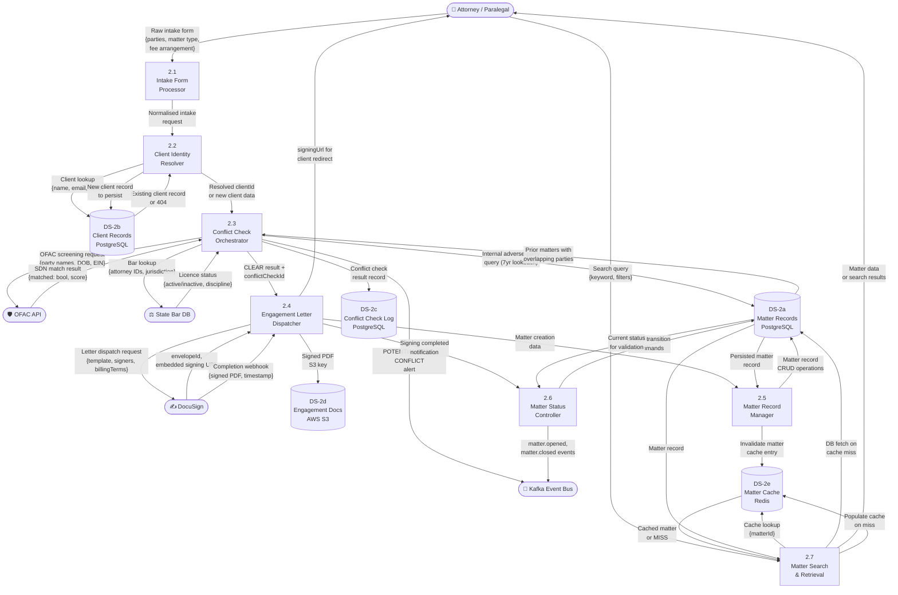

# Data Flow Diagrams — Legal Case Management System

| Field   | Value                                     |
|---------|-------------------------------------------|
| Version | 1.0.0                                     |
| Status  | Approved                                  |
| Date    | 2025-01-15                                |
| Owner   | Architecture & Engineering, LCMS Program  |

---

## Overview

This document presents a layered set of data flow diagrams (DFDs) for the Legal Case Management System, progressing from the system-level context view (Level 0) through major subsystem decomposition (Level 1) to detailed subsystem drill-downs (Level 2). All DFDs follow the Yourdon-DeMarco notation adapted for Mermaid flowchart syntax: external entities are represented as rectangles, processes as rounded rectangles, and data stores as open-ended rectangles. Data flows are labelled with the nature of the data being transferred.

The diagrams are intended for use by the security team (data classification and protection requirements), infrastructure team (network boundary design), compliance team (data-at-rest and data-in-transit mapping), and onboarding engineers.

---

## Level 0 — Context DFD

The Level 0 diagram treats the LCMS as a single black-box system and shows all external entities that exchange data with it and the nature of those exchanges.

```mermaid
flowchart TD
    %% External Entities
    Attorney(["👤 Attorney"])
    Paralegal(["👤 Paralegal"])
    Client(["👤 Client"])
    BillingSpec(["👤 Billing Specialist"])
    ManagingPartner(["👤 Managing Partner"])
    ITAdmin(["👤 IT Admin"])

    PACER(["🏛️ PACER / CM-ECF\n(Federal Court System)"])
    DocuSign(["✍️ DocuSign\n(eSignature Platform)"])
    Accounting(["💼 QuickBooks / Aderant\n(Accounting System)"])
    StateBar(["⚖️ State Bar Database\n(Attorney Licensing)"])
    OFAC(["🛡️ OFAC SDN Screening\n(Sanctions API)"])
    WestLaw(["📚 Westlaw / LexisNexis\n(Legal Research)"])

    LCMS(["⚖️ LEGAL CASE\nMANAGEMENT SYSTEM"])

    %% Attorney flows
    Attorney -- "Matter intake, time entries,\ndocument uploads, task updates" --> LCMS
    LCMS -- "Matter status, deadlines,\ndocument index, billing reports" --> Attorney

    %% Paralegal flows
    Paralegal -- "Task completion, docket updates,\ndocument filings, scheduling" --> LCMS
    LCMS -- "Task lists, deadline alerts,\ncourt orders, client communications" --> Paralegal

    %% Client flows
    Client -- "Intake form, signed\nengagement letter, payments" --> LCMS
    LCMS -- "Matter status updates, invoices,\ndocuments shared with client,\ntrust account statements" --> Client

    %% Billing Specialist flows
    BillingSpec -- "Pre-bill approvals,\nwrite-downs, fee adjustments" --> LCMS
    LCMS -- "Pre-bills, A/R aging,\nLEDES files, payment reports" --> BillingSpec

    %% Managing Partner flows
    ManagingPartner -- "Trust disbursement approvals,\nconflict overrides, firm config" --> LCMS
    LCMS -- "Firm KPI dashboard, profitability\nreports, conflict flags, trust balances" --> ManagingPartner

    %% IT Admin flows
    ITAdmin -- "User provisioning, role assignments,\nsystem configuration" --> LCMS
    LCMS -- "Audit logs, security events,\nhealth metrics" --> ITAdmin

    %% PACER/CM-ECF flows
    LCMS -- "Filing documents, case queries,\ndocket retrieval requests" --> PACER
    PACER -- "Docket entries, NEF receipts,\ncase filings, hearing notices" --> LCMS

    %% DocuSign flows
    LCMS -- "Engagement letters, settlement\nagreements for e-signature" --> DocuSign
    DocuSign -- "Signed documents, completion\nwebhooks, audit certificates" --> LCMS

    %% Accounting flows
    LCMS -- "Journal entries, invoice records,\ntrust fund transactions, A/R data" --> Accounting
    Accounting -- "Payment confirmations,\nACH settlement status" --> LCMS

    %% State Bar flows
    LCMS -- "Attorney licence lookup requests,\ndisciplinary history queries" --> StateBar
    StateBar -- "Licence status, admittance\ndates, disciplinary records" --> LCMS

    %% OFAC flows
    LCMS -- "Party names, dates of birth,\nEINs for sanctions screening" --> OFAC
    OFAC -- "SDN match results,\nsanctions risk scores" --> LCMS

    %% Westlaw/LexisNexis flows
    LCMS -- "Deep-link context, matter\nand case references" --> WestLaw
    WestLaw -- "Research citations,\ncase law results" --> LCMS
```



---

## Level 1 — System DFD

The Level 1 diagram decomposes the LCMS into its major subsystems and illustrates the primary data flows between them and with external entities.

```mermaid
flowchart TD
    %% External Entities
    ExtUsers(["👥 Attorneys / Paralegals\n/ Clients / Billing Staff"])
    ExtPACER(["🏛️ PACER / CM-ECF"])
    ExtDocuSign(["✍️ DocuSign"])
    ExtAccounting(["💼 Accounting System"])
    ExtStateBar(["⚖️ State Bar DB"])
    ExtOFAC(["🛡️ OFAC SDN API"])

    %% Core Subsystems
    subgraph CORE ["LCMS Core Subsystems"]
        AuthSvc["1.0\nUser & Auth Service\n(Keycloak-backed)"]
        MatterMgmt["2.0\nMatter Management\nSubsystem"]
        DocMgmt["3.0\nDocument Management\nSubsystem"]
        BillingSub["4.0\nBilling Subsystem"]
        TrustSub["5.0\nTrust Accounting\nSubsystem"]
        CalSub["6.0\nCalendar & Deadlines\nSubsystem"]
        TaskSub["7.0\nTask Management\nSubsystem"]
        NotifSub["8.0\nNotification\nSubsystem"]
    end

    %% Data Stores
    DS_Identity[("DS-1\nIdentity Store\nPostgreSQL")]
    DS_Matter[("DS-2\nMatter Store\nPostgreSQL")]
    DS_Document[("DS-3\nDocument Store\nS3 + Elasticsearch")]
    DS_Billing[("DS-4\nBilling Store\nPostgreSQL")]
    DS_Trust[("DS-5\nTrust Ledger\nPostgreSQL")]
    DS_Calendar[("DS-6\nCalendar Store\nPostgreSQL")]
    DS_EventBus[("DS-7\nEvent Bus\nApache Kafka")]

    %% User → Auth
    ExtUsers -- "Login credentials,\nMFA tokens" --> AuthSvc
    AuthSvc -- "JWT access tokens,\nrefresh tokens, RBAC claims" --> ExtUsers
    AuthSvc <--> DS_Identity

    %% Auth → All Services
    AuthSvc -- "Token validation,\nRBAC enforcement" --> MatterMgmt
    AuthSvc -- "Token validation" --> DocMgmt
    AuthSvc -- "Token validation" --> BillingSub
    AuthSvc -- "Token validation" --> TrustSub

    %% Users → Matter Management
    ExtUsers -- "Intake forms, matter updates,\nnotes, party changes" --> MatterMgmt
    MatterMgmt -- "Matter data, conflict\ncheck results, status" --> ExtUsers
    MatterMgmt <--> DS_Matter
    MatterMgmt -- "Conflict check request\n(parties, matter type)" --> ExtOFAC
    MatterMgmt -- "Bar lookup request" --> ExtStateBar
    ExtOFAC -- "SDN screening result" --> MatterMgmt
    ExtStateBar -- "Licence status" --> MatterMgmt
    MatterMgmt -- "Engagement letter\nfor e-signature" --> ExtDocuSign
    ExtDocuSign -- "Signed document\nwebhook, PDF" --> MatterMgmt

    %% Matter → Event Bus
    MatterMgmt -- "matter.opened,\nmatter.closed events" --> DS_EventBus

    %% Document Management
    ExtUsers -- "Documents, filing\ninstructions, Bates requests" --> DocMgmt
    DocMgmt -- "Validated docs, Bates\nstamps, filing receipts" --> ExtUsers
    DocMgmt <--> DS_Document
    DocMgmt -- "Filing package\n(PDF, metadata)" --> ExtPACER
    ExtPACER -- "Docket receipt,\nNEF, case orders" --> DocMgmt
    DocMgmt -- "document.filed,\ndocument.uploaded events" --> DS_EventBus

    %% Billing Subsystem
    ExtUsers -- "Time entries, pre-bill\napprovals, write-downs" --> BillingSub
    BillingSub -- "Pre-bills, invoices,\nLEDES files, A/R data" --> ExtUsers
    BillingSub <--> DS_Billing
    BillingSub -- "Journal entries,\nA/R postings" --> ExtAccounting
    ExtAccounting -- "Payment confirmations" --> BillingSub
    DS_EventBus -- "matter.opened → init\nbilling record" --> BillingSub
    BillingSub -- "invoice.created,\npayment.received events" --> DS_EventBus

    %% Trust Accounting
    ExtUsers -- "Deposit receipts,\ndisbursement requests" --> TrustSub
    TrustSub -- "Trust balances,\nledger cards" --> ExtUsers
    TrustSub <--> DS_Trust
    TrustSub -- "ACH disbursements\nto payees / operating account" --> ExtAccounting
    DS_EventBus -- "payment.received →\nfee earned transfer" --> TrustSub
    TrustSub -- "trust.disbursement.*\nevents" --> DS_EventBus

    %% Calendar & Deadlines
    DS_EventBus -- "document.filed →\nextract NEF deadlines" --> CalSub
    CalSub <--> DS_Calendar
    CalSub -- "calendar.deadline.approaching,\ncalendar.sol.expiring events" --> DS_EventBus

    %% Task Management
    DS_EventBus -- "matter.opened,\ndocument.filed events" --> TaskSub
    TaskSub -- "Task assignments,\nchecklist updates" --> ExtUsers
    ExtUsers -- "Task completions,\nnew task requests" --> TaskSub

    %% Notifications
    DS_EventBus -- "All domain events\nfor notification routing" --> NotifSub
    NotifSub -- "Emails, SMS, push\nnotifications, in-app alerts" --> ExtUsers
```



---

## Level 2 — Matter Management DFD

This diagram drills down into the Matter Management subsystem (Process 2.0 from Level 1) to show the internal data flows between its component processes.



---

## Level 2 — Billing DFD

This diagram drills down into the Billing Subsystem (Process 4.0) including trust accounting integration.

```mermaid
flowchart TD
    %% External Entities
    Attorney(["👤 Attorney\n/ Paralegal"])
    BillingSpec(["👤 Billing Specialist"])
    Client(["👤 Client"])
    ExtAccounting(["💼 QuickBooks\n/ Aderant"])
    EventBus(["📨 Kafka Event Bus"])
    PayGW(["💳 Payment Gateway\n(LawPay / Stripe)"])
    TrustSub(["🏦 Trust Accounting\nSubsystem"])

    %% Data Stores
    DS_TimeEntry[("DS-4a\nTime Entry Store\nPostgreSQL")]
    DS_Disbursement[("DS-4b\nDisbursement Store\nPostgreSQL")]
    DS_Invoice[("DS-4c\nInvoice Store\nPostgreSQL")]
    DS_Rates[("DS-4d\nRate Schedule Store\nPostgreSQL")]
    DS_LEDES[("DS-4e\nLEDES Files\nAWS S3")]
    DS_BillingCache[("DS-4f\nBilling Cache\nRedis")]

    %% Processes
    P41["4.1\nTime Entry\nCapture"]
    P42["4.2\nTime Entry\nReview & Approval"]
    P43["4.3\nPre-Bill\nAggregator"]
    P44["4.4\nBilling Rule\nEngine"]
    P45["4.5\nInvoice\nGenerator"]
    P46["4.6\nLEDES\nFormatter"]
    P47["4.7\nPayment\nProcessor"]
    P48["4.8\nA/R Ledger\nManager"]
    P49["4.9\nAccounting\nSync"]

    %% Time Entry Capture
    Attorney -- "Time entry\n{matterId, hours, UTBMS,\nnarrative, workDate}" --> P41
    P41 -- "Validate matter active,\nrate lookup" --> DS_Rates
    DS_Rates -- "Timekeeper rate\nfor matter/period" --> P41
    P41 -- "Store submitted\ntime entry" --> DS_TimeEntry
    P41 -- "timeentry.submitted\nevent" --> EventBus

    %% Time Entry Review
    BillingSpec -- "Review, approve,\nor reject entries" --> P42
    P42 -- "Read pending\nentries" --> DS_TimeEntry
    DS_TimeEntry -- "Pending entry\nrecords" --> P42
    P42 -- "Update entry\nstatus (approved/rejected)" --> DS_TimeEntry

    %% Pre-bill Aggregation
    BillingSpec -- "Generate pre-bill\n{matterId, period}" --> P43
    P43 -- "Fetch approved entries\nand disbursements" --> DS_TimeEntry
    P43 -- "Fetch disbursements\nfor period" --> DS_Disbursement
    DS_TimeEntry -- "Approved entry records" --> P43
    DS_Disbursement -- "Disbursement records" --> P43
    P43 -- "Raw line items\nfor rule application" --> P44

    %% Billing Rule Engine
    P44 -- "Fetch rate schedules,\nbilling rules, caps" --> DS_Rates
    DS_Rates -- "Engagement-specific\nbilling rules" --> P44
    P44 -- "Apply UTBMS coding,\nminimum increments,\nrate caps, write-downs" --> P43
    P43 -- "Pre-bill summary\nfor review" --> BillingSpec

    %% Invoice Generation
    BillingSpec -- "Approve pre-bill\nfor invoicing" --> P45
    P45 -- "Create invoice\nrecord" --> DS_Invoice
    P45 -- "Line items for\nLEDES generation" --> P46
    P46 -- "Generate LEDES\n1998B file" --> DS_LEDES
    DS_LEDES -- "S3 key of\nLEDES file" --> P45
    P45 -- "Update invoice with\nledesRef, set APPROVED" --> DS_Invoice
    P45 -- "invoice.created\nevent" --> EventBus

    %% Payment
    Client -- "Payment submission\n{invoiceId, method, amount}" --> P47
    P47 -- "Charge request\n{amount, metadata}" --> PayGW
    PayGW -- "Charge result\n{chargeId, status}" --> P47

    alt Trust retainer applicable
        P47 -- "Fee-earned disbursement\nrequest {matterId, amount}" --> TrustSub
        TrustSub -- "Disbursement\nconfirmed" --> P47
    end

    P47 -- "Update invoice\nstatus → PAID" --> DS_Invoice
    P47 -- "payment.received\nevent" --> EventBus
    P47 -- "Update A/R\nbalance" --> P48

    %% A/R Ledger
    P48 -- "Read/write\nA/R balances" --> DS_Invoice
    P48 -- "A/R aging report" --> BillingSpec
    P48 -- "Invalidate billing\ncache entries" --> DS_BillingCache

    %% Accounting Sync
    EventBus -- "payment.received,\ninvoice.created events" --> P49
    P49 -- "POST journal entries\n(debit A/R, credit revenue)" --> ExtAccounting
    ExtAccounting -- "Journal entry\nACK / error" --> P49
    P49 -- "Reconciliation\nstatus update" --> DS_Invoice
```

---

## Data Classification

All data processed by the LCMS is classified into one of four categories. Classification drives encryption requirements, access control policies, data-at-rest handling, retention schedules, and breach notification obligations.

| Classification | Label | Description | Examples | Encryption at Rest | Encryption in Transit | Access Control |
|----------------|-------|-------------|----------|-------------------|----------------------|---------------|
| **Attorney-Client Privileged** | `ACP` | Communications and work product protected by the attorney-client privilege or work-product doctrine. Subject to clawback if inadvertently disclosed. | Matter notes, legal strategy documents, attorney-client emails, draft pleadings, legal research memos | AES-256 (field-level for structured data; S3 SSE-KMS for documents) | TLS 1.3 minimum | Strict need-to-know; role `attorney` or above; matter-level access list enforced |
| **Personally Identifiable Information** | `PII` | Data that can identify an individual. Subject to applicable state privacy laws (CCPA, VCDPA) and potential HIPAA if health information is involved. | Client SSN/EIN, date of birth, home address, phone number, email address, bank account numbers | AES-256 column-level encryption; tokenisation for SSN/EIN | TLS 1.3 | `client:pii:read` scope required; logged on every access |
| **Financial — Firm Confidential** | `FIN` | Billing records, invoices, trust ledger entries, and fee arrangements that are confidential to the firm and client. | Invoices, time entries, billing rates, trust account ledgers, LEDES files, payment card data (tokenised) | AES-256 at rest; PCI DSS tokenisation for card data | TLS 1.3; mTLS for billing service to payment gateway | `billing:read` or `trust:read` scope; billing specialist or attorney role |
| **Public Record** | `PUB` | Data that is part of the public court record or otherwise not subject to confidentiality restrictions. | Filed court documents (after filing), CM-ECF docket entries, court orders, public case numbers | Standard S3 encryption (SSE-S3) | TLS 1.3 | Authenticated users (any role); shareable with client portal |
| **Operational — Internal** | `OPS` | System operational data not directly tied to a matter. | Audit logs, system health metrics, Kafka consumer offsets, Elasticsearch index metadata | AES-256 at rest | TLS 1.3 | IT Admin role; restricted from attorney/client access |

---

## Data Retention Flows

The LCMS implements a multi-tier retention and archival pipeline to satisfy both state bar ethics rules (which mandate file retention for a minimum of seven years after matter closure in most jurisdictions) and firm risk-management policies.

### Retention Tiers

| Tier | Storage | Retention Period | Trigger |
|------|---------|-----------------|---------|
| **Active** | PostgreSQL (primary) + Elasticsearch | Duration of matter + 90 days post-closure | Matter status = ACTIVE or CLOSED (within 90-day grace period) |
| **Warm Archive** | PostgreSQL (read replica) + S3 Standard-IA | 90 days to 7 years post-closure | Scheduled archival job fires at matter closure + 90 days |
| **Cold Archive** | S3 Glacier Instant Retrieval | 7 to 10 years post-closure | Scheduled archival job fires at matter closure + 7 years |
| **Purge** | Permanent deletion with audit record | After 10 years (or per client instruction) | Managing partner approved purge workflow; immutable audit entry retained |

### Retention Flow Description

**Matter Closure → Warm Archive (T+90 days):**
The `matter.closed` domain event starts a 90-day grace period during which the matter record remains in the active PostgreSQL database and all documents remain in S3 Standard. After 90 days, the data archival job:
1. Moves the matter record to the read-replica partition with a `WARM_ARCHIVED` status flag.
2. Transitions all associated S3 document objects from Standard to Standard-IA storage class.
3. Removes the matter index from Elasticsearch (full-text search no longer available for warm-archived matters without explicit retrieval).
4. Emits a `matter.archived.warm` event for the audit log.

**Warm Archive → Cold Archive (T+7 years):**
A nightly batch job scans warm-archived matters for closure dates older than seven years. For qualifying matters:
1. S3 documents are transitioned to S3 Glacier Instant Retrieval using a lifecycle policy.
2. The PostgreSQL matter record is flagged `COLD_ARCHIVED`; only the matter header (number, parties, dates, responsible attorney) and financial summary are retained in warm storage.
3. The `matter.archived.cold` event is emitted.
4. Elasticsearch index entries are permanently removed.

**Purge Flow (T+10 years or on instruction):**
Client-directed file destruction or expiry of the maximum retention period triggers the purge workflow, which requires explicit managing-partner approval:
1. The purge request is logged as an immutable audit record (retained permanently, per bar ethics rules governing trust account records).
2. All S3 Glacier objects are permanently deleted.
3. The PostgreSQL record is hard-deleted except for the immutable `matter_summary` archive row (matter number, parties, dates, supervising attorney) which is retained indefinitely.
4. Any associated DocuSign signed-document references are revoked where the DocuSign retention period permits.

### PII Minimisation Flow

For matters that proceed to cold archive, PII fields (client SSN/EIN, date of birth, home address) are replaced with one-way hashes in the warm-archive snapshot. The encryption keys for field-level PII encryption are rotated annually; legacy key material is retained in AWS KMS for the duration of the data retention period to allow lawful access requests.

### Legal Hold Flow

When litigation is anticipated or a regulatory inquiry is received, a legal hold may be placed on one or more matters. A legal hold:
1. Suspends all automated archival and purge schedules for the identified matters.
2. Creates an immutable `legal_hold` record linking the matter to the hold authority (case reference or regulatory request).
3. Emits a `matter.legal_hold.placed` event, which causes the Document Service to mark all associated documents as `HOLD_PROTECTED` — preventing any storage class transition or deletion.
4. The hold is released only by a managing-partner-approved `matter.legal_hold.released` command, which resumes the normal retention schedule from the point of hold placement.
