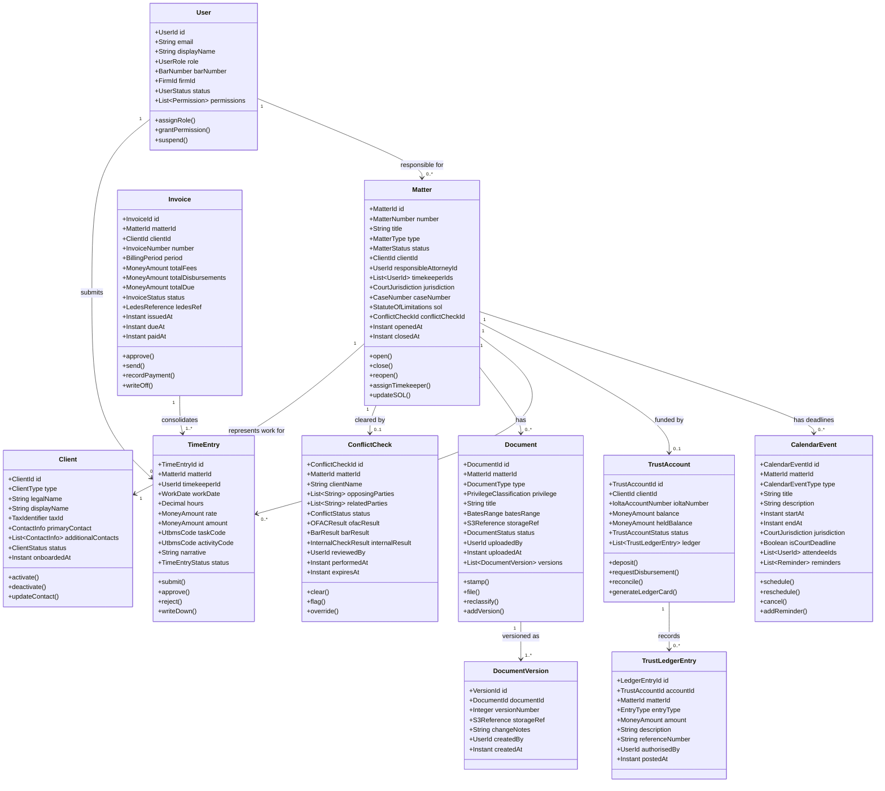

# Domain Model — Legal Case Management System

| Field   | Value                                     |
|---------|-------------------------------------------|
| Version | 1.0.0                                     |
| Status  | Approved                                  |
| Date    | 2025-01-15                                |
| Owner   | Architecture & Engineering, LCMS Program  |

---

## Overview

The LCMS domain model is organised according to Domain-Driven Design (DDD) principles. The domain is divided into eight bounded contexts, each owning its own ubiquitous language, aggregates, and persistence store. Inter-context communication is achieved exclusively through domain events published to the shared Apache Kafka event bus or via well-defined anti-corruption layer (ACL) adapters for external systems.

The core of the domain is the **Matter** aggregate, which represents the unit of legal work performed for a client. A Matter has a lifecycle that spans from initial intake and conflict clearance, through active representation, to final disposition and archival. All significant business rules — billing arrangements, court deadlines, trust account obligations, and privileged-document handling — are anchored to the Matter.

The model deliberately separates **billing concerns** (time entries, invoices, LEDES formatting) from **trust accounting concerns** (IOLTA ledger, client fund segregation) because they are governed by distinct bar-association rules and require independent auditability. Similarly, **document management** is a separate bounded context because documents carry their own identity, provenance chain, Bates numbering, and privilege classification that must outlive any individual matter.

---

## Bounded Contexts

| Bounded Context      | Description                                                                                                        | Owns                                                   | Key External Dependency           |
|----------------------|--------------------------------------------------------------------------------------------------------------------|--------------------------------------------------------|-----------------------------------|
| Matter Management    | Core context. Manages the full lifecycle of a legal matter from intake through closure. Enforces engagement rules. | Matter, MatterParty, MatterNote, ConflictCheck         | Conflict Check Service (internal) |
| Client Management    | Canonical source of truth for all client (and prospective client) identity, contact, and relationship data.        | Client, ContactInfo, ClientRelationship, RetainerAgreement | State Bar Database               |
| Document Management  | Manages creation, versioning, classification, Bates numbering, privilege review, and court filing of documents.    | Document, DocumentVersion, BatesRange, PrivilegeLog    | PACER/CM-ECF, DocuSign            |
| Billing              | Time entry capture, pre-bill review, invoice generation, LEDES formatting, and accounts-receivable tracking.       | TimeEntry, Disbursement, Invoice, PreBill, UtbmsCode   | QuickBooks / Aderant              |
| Trust Accounting     | IOLTA trust ledger, client fund segregation, disbursement approvals, and bank reconciliation.                      | TrustAccount, TrustLedgerEntry, Disbursement           | Bank ACH API                      |
| Calendar & Deadlines | Court deadlines, statute-of-limitations tracking, hearing schedules, and attorney availability.                    | CalendarEvent, DeadlineRule, SOLCalculation            | CM-ECF NEF parsing                |
| Task Management      | Matter-scoped tasks, checklists, workflow automation, and assignment tracking.                                      | Task, TaskList, WorkflowTemplate                       | None                              |
| User & Auth          | Attorney, paralegal, staff, and client identity; role-based access control; firm configuration.                    | User, Role, Permission, FirmConfig                     | Keycloak, State Bar Database      |

---

## Domain Model Diagram

---

## Aggregate Descriptions

### Matter

The **Matter** aggregate is the central aggregate in the LCMS domain. It represents one discrete legal engagement between the firm and a client. Every billable activity, document, deadline, and trust fund movement is anchored to a Matter via `matterId`.

**Lifecycle states:** `INTAKE → CONFLICT_CHECK → PENDING_ENGAGEMENT → ACTIVE → SUSPENDED → CLOSED → ARCHIVED`

- **Intake:** The matter is created with basic identifying information. A conflict check is automatically triggered.
- **Conflict Check:** The matter is locked for editing while the Conflict Check Service performs its three-pronged verification (OFAC screening, State Bar lookup, internal adverse-party sweep). A `ConflictCheckId` is stored on the aggregate once the check is complete.
- **Pending Engagement:** The conflict check returned `CLEAR`. An engagement letter has been sent via DocuSign but not yet signed.
- **Active:** The engagement letter is fully executed. Time entries may be posted, documents filed, and trust deposits accepted.
- **Suspended:** The matter is temporarily inactive (client non-responsive, administrative hold). Time entries are blocked; existing deadlines remain active.
- **Closed:** All work product has been delivered, invoices paid, and trust funds returned or disbursed. The matter number is retired.
- **Archived:** The matter has passed the firm's document retention period for active storage (typically seven years post-closure). Metadata is retained; full document content is moved to cold storage (AWS Glacier).

**Key invariants:**
- A matter may not transition to `ACTIVE` without a `CLEAR` `ConflictCheckId`.
- A matter may not be `CLOSED` if outstanding invoice balance > $0 or trust balance > $0.
- The responsible attorney must hold a valid bar licence in the matter's jurisdiction.

---

### Client

The **Client** aggregate owns the canonical identity record for any individual or entity that retains the firm. It is the single source of truth for client contact information consumed by Matter, Billing, and Notification contexts.

**Client types:** `INDIVIDUAL`, `CORPORATION`, `PARTNERSHIP`, `GOVERNMENT_ENTITY`, `NON_PROFIT`, `TRUST_ESTATE`

- `taxId` stores either a Social Security Number (individuals) or Employer Identification Number (entities), encrypted at rest with AES-256.
- A client may have multiple active matters simultaneously. The relationship is one-to-many from Client to Matter.
- Client records are never hard-deleted; deactivated clients retain their full history for conflict-check purposes.
- The `onboardedAt` timestamp begins the State Bar disclosure period for attorney-client privilege.

---

### Invoice

The **Invoice** aggregate consolidates approved time entries and disbursements for a billing period into a billable unit. It is owned exclusively by the Billing bounded context.

**Invoice states:** `DRAFT → REVIEWED → APPROVED → SENT → PARTIALLY_PAID → PAID → WRITTEN_OFF`

- A LEDES 1998B file is generated atomically with the invoice PDF and stored in S3. The `ledesRef` on the aggregate stores the S3 key for the LEDES file.
- `totalDue` = `totalFees` + `totalDisbursements` − `trustRetainerApplied` − `writeDowns`.
- Payment against a trust retainer triggers a cross-context call to Trust Accounting Service to record the earned-fee disbursement on the IOLTA ledger.
- An invoice may not be deleted once it reaches `SENT` status; only a credit memo can offset it.

---

### Document

The **Document** aggregate represents any file (pleading, contract, correspondence, exhibit, or court order) associated with a matter. Documents are immutable once filed with a court; prior versions remain accessible via `DocumentVersion` history.

**Document types:** `PLEADING`, `MOTION`, `ORDER`, `CONTRACT`, `CORRESPONDENCE`, `EXHIBIT`, `DEPOSITION`, `EXPERT_REPORT`, `ENGAGEMENT_LETTER`

**Privilege classifications:** `ATTORNEY_CLIENT`, `WORK_PRODUCT`, `COMMON_INTEREST`, `UNPROTECTED`

- Each document has a `BatesRange` value object that encodes the starting and ending Bates stamp numbers within the matter's Bates sequence.
- Court-filed documents carry the CM-ECF `docketEntryNumber` and `courtFiledAt` timestamp as immutable fields set on the `file()` command.
- Privilege re-classification (e.g., inadvertent disclosure claw-back) creates a `PrivilegeLog` entry recording who reclassified the document, when, and under what authority.

---

### TrustAccount

The **TrustAccount** aggregate represents a client's sub-ledger within the firm's pooled IOLTA (Interest on Lawyers' Trust Accounts) account. Each client-matter pairing may have at most one trust account record.

**Key invariants:**
- `balance` may never be negative (overdraft protection enforced at the aggregate boundary).
- `heldBalance` represents funds frozen by pending disbursement requests awaiting approval. Available balance = `balance` − `heldBalance`.
- Every credit and debit is recorded as an immutable `TrustLedgerEntry`. The running balance is derived by summing all entries; it is also stored as a denormalised field and reconciled nightly.
- Disbursements above a configurable threshold (default: $10,000) require two-attorney approval.
- The aggregate generates a formatted `LedgerCard` (ABA-format three-column client trust ledger) on demand for bar compliance reporting.

---

### CalendarEvent

The **CalendarEvent** aggregate captures any date-sensitive obligation arising from a matter: court hearings, filing deadlines, statute-of-limitations dates, deposition notices, and client meetings.

**Event types:** `HEARING`, `TRIAL`, `DEPOSITION`, `FILING_DEADLINE`, `STATUTE_OF_LIMITATIONS`, `RESPONSE_DEADLINE`, `CLIENT_MEETING`, `MEDIATION`

- Court-derived events (created from CM-ECF NEF parsing) carry the `courtDocketNumber` and are marked `isCourtDeadline = true`. These events trigger automatic reminder chains based on local court rules (e.g., 30/14/7/1 days before deadline for federal court filings).
- SOL events are computed by the **SOL Calculator Domain Service** based on the cause of action, jurisdiction, discovery date, and applicable tolling rules.
- Rescheduling a `HEARING` event emits a `calendar.event.rescheduled` domain event consumed by Task Service to update any dependent tasks.

---

## Value Objects

| Value Object             | Type                        | Description                                                                                                                                                        |
|--------------------------|-----------------------------|--------------------------------------------------------------------------------------------------------------------------------------------------------------------|
| `MoneyAmount`            | `{amount: Decimal, currency: ISO4217}` | Immutable monetary value with currency. All monetary comparisons and arithmetic use the `decimal.js` library to prevent floating-point errors. Stored as `NUMERIC(15,2)` in PostgreSQL. |
| `BatesRange`             | `{prefix: String, start: Integer, end: Integer}` | Encodes a contiguous Bates stamp range in the format `PREFIX-000001 through PREFIX-000250`. Ensures no overlap with other ranges in the same matter via domain service validation. |
| `UtbmsCode`              | `{taskCode: String, activityCode: String, expenseCode?: String}` | Unified Task-Based Management System code pair used for legal billing. Task codes follow the ABA UTBMS taxonomy (L100–L600 for litigation tasks, B100–B400 for business matters). |
| `CaseNumber`             | `{court: String, year: Integer, type: String, sequence: Integer}` | Federal court case number in the format `1:25-cv-00042`. Parses and validates format per court-specific rules (e.g., SDNY vs. NDCA numbering conventions). |
| `StatuteOfLimitations`   | `{causeOfAction: String, jurisdiction: String, limitationPeriod: Duration, discoveryDate: Date, tollingEvents: List~TollingEvent~, computedDeadline: Date}` | Encapsulates SOL computation including discovery rule, minority tolling, fraudulent-concealment tolling, and cross-border conflicts of law. |
| `BarNumber`              | `{state: String, number: String, admittedDate: Date}` | State bar licence number with admission date. Validated against State Bar Database at matter assignment and annually via scheduled verification job. |
| `TaxIdentifier`          | `{type: SSN|EIN, value: EncryptedString}` | Encrypted tax identification number. Decryption requires the `client:pii:read` scope. Never logged in plain text. |
| `IoltaAccountNumber`     | `{bankRoutingNumber: String, accountNumber: EncryptedString, accountType: CHECKING}` | IOLTA bank account reference. Encrypted at rest. Used for ACH disbursement instructions. |
| `BillingPeriod`          | `{year: Integer, month: Integer}` | Identifies a billing cycle (e.g., `2025-01`). Immutable once an invoice is approved for the period; subsequent time entries roll into the next period. |
| `CourtJurisdiction`      | `{country: String, circuit?: String, district: String, division?: String}` | Fully qualified court identifier (e.g., `US / 9th Circuit / N.D. Cal. / San Francisco`). Drives court-rule deadline computation and CM-ECF endpoint routing. |

---

## Domain Events

Domain events are the primary mechanism for cross-bounded-context communication in the LCMS. All events are published to the Apache Kafka `lcms.*` topic namespace, serialised as Avro, and versioned using the Confluent Schema Registry.

### Matter Management

| Event | Payload Highlights | Consumers |
|-------|--------------------|-----------|
| `matter.intake.submitted` | matterId, clientId, matterType, opposingParties | Conflict Check Service |
| `matter.conflict.cleared` | matterId, conflictCheckId, checkTimestamp | Matter Service (transitions status) |
| `matter.conflict.flagged` | matterId, conflictCheckId, flagReason | Notification Service, Matter Service |
| `matter.opened` | matterId, clientId, responsibleAttorneyId, openedAt | Billing Service, Calendar Service, Notification Service |
| `matter.closed` | matterId, closedAt, closureReason, finalBalance | Trust Accounting Service, Document Service, Billing Service |

### Billing

| Event | Payload Highlights | Consumers |
|-------|--------------------|-----------|
| `timeentry.submitted` | timeEntryId, matterId, timekeeperId, hours, utbmsCode | Billing Service (pre-bill queue) |
| `invoice.created` | invoiceId, matterId, clientId, totalDue, ledesS3Key | Notification Service |
| `invoice.approved` | invoiceId, approvedBy, approvedAt | Notification Service, Client Portal |
| `payment.received` | invoiceId, chargeId, amount, paidAt | QuickBooks Integration, Trust Accounting Service, Notification Service |
| `invoice.written_off` | invoiceId, writeOffAmount, reason, authorisedBy | QuickBooks Integration |

### Document Management

| Event | Payload Highlights | Consumers |
|-------|--------------------|-----------|
| `document.uploaded` | docId, matterId, docType, privilege, s3Key | Elasticsearch indexer, Notification Service |
| `document.filed` | docId, matterId, docketEntryNumber, courtFiledAt, filingFee | Calendar Service, Task Service, Notification Service |
| `document.privilege.changed` | docId, oldPrivilege, newPrivilege, changedBy, reason | Audit Log Service |

### Trust Accounting

| Event | Payload Highlights | Consumers |
|-------|--------------------|-----------|
| `trust.deposit.received` | accountId, matterId, amount, depositedAt, sourceRef | Billing Service, Notification Service |
| `trust.disbursement.pending` | disbursementId, matterId, amount, payee, requestedBy | Notification Service (approval alert) |
| `trust.disbursement.completed` | disbursementId, transferId, amount, settledAt | Billing Service, QuickBooks Integration, Notification Service |
| `trust.account.reconciled` | accountId, reconciledBalance, reconciledAt, reconciledBy | Audit Log Service |

### Calendar & Deadlines

| Event | Payload Highlights | Consumers |
|-------|--------------------|-----------|
| `calendar.deadline.approaching` | eventId, matterId, daysUntilDue, eventType | Notification Service, Task Service |
| `calendar.sol.expiring` | eventId, matterId, solDate, causeOfAction | Notification Service (high-priority alert) |
| `calendar.event.rescheduled` | eventId, matterId, oldDate, newDate | Notification Service, Task Service |

---

## Domain Services

### Conflict Check Service

Orchestrates the three-pronged conflict-of-interest analysis required by ABA Model Rule 1.7 (current-client conflicts) and 1.9 (former-client conflicts) before a matter may be opened.

**Inputs:** Prospective client name, opposing parties, related parties (e.g., guarantors, subsidiaries), matter type, and proposed timekeepers.

**Operations:**
1. **OFAC/SDN Screening** — Submits all party names and identifiers to the OFAC Specially Designated Nationals list API. Fuzzy matching with a Jaro-Winkler similarity threshold of 0.92 to catch name variations.
2. **State Bar Standing Check** — Verifies that each proposed timekeeper holds a current, active bar licence in the matter's jurisdiction and has no relevant disciplinary history.
3. **Internal Adverse-Party Sweep** — Queries the Matter database for any current or former matters where any proposed party appears as an adverse party to an existing or former client. Lookback period: seven years (configurable per jurisdiction).

**Output:** A `ConflictCheck` aggregate with a `ConflictStatus` of `CLEAR`, `POTENTIAL` (requires managing-partner override), or `HARD_CONFLICT` (non-waivable; matter cannot proceed).

---

### SOL Calculator Domain Service

Computes the applicable statute-of-limitations deadline for a given cause of action, accounting for jurisdiction-specific discovery rules, tolling events, and inter-state conflicts of law.

**Inputs:** Cause of action type, jurisdiction (state + federal circuit if applicable), incident date, discovery date, client date of birth (for minority tolling), and any known tolling events (fraudulent concealment, continuous representation, disability).

**Output:** A `StatuteOfLimitations` value object with the computed deadline date and an audit trail of each tolling adjustment applied.

**Jurisdiction coverage:** All 50 U.S. states plus D.C. and federal circuits. Limitation periods and tolling rules are stored in a versioned `sol_rules` reference table updated by the legal operations team. The service emits a `calendar.sol.expiring` event 365, 180, 90, 30, and 7 days before the computed deadline.

---

### LEDES Generator Domain Service

Produces LEDES 1998B-format billing files from an approved invoice aggregate. LEDES (Legal Electronic Data Exchange Standard) is the industry-standard electronic billing format required by most corporate legal departments and insurance carriers.

**Inputs:** Approved `Invoice` aggregate (including all consolidated `TimeEntry` and `Disbursement` records) and the matter's UTBMS code mappings.

**Output:** ASCII-delimited LEDES 1998B file with the following fields per line item: INVOICE_DATE, INVOICE_NUMBER, CLIENT_ID, LAW_FIRM_MATTER_ID, INVOICE_TOTAL, BILLING_START_DATE, BILLING_END_DATE, INVOICE_DESCRIPTION, LINE_ITEM_NUMBER, EXP/FEE/INV_ADJ_TYPE, LINE_ITEM_NUMBER_OF_UNITS, LINE_ITEM_ADJUSTMENT_AMOUNT, LINE_ITEM_TOTAL, LINE_ITEM_DATE, LINE_ITEM_TASK_CODE, LINE_ITEM_EXPENSE_CODE, LINE_ITEM_ACTIVITY_CODE, TIMEKEEPER_ID, TIMEKEEPER_NAME, TIMEKEEPER_CLASSIFICATION, LINE_ITEM_DESCRIPTION.

Validates UTBMS code consistency before generating the file. The output file is stored in S3 and the S3 key is written back to the `Invoice.ledesRef` field.
