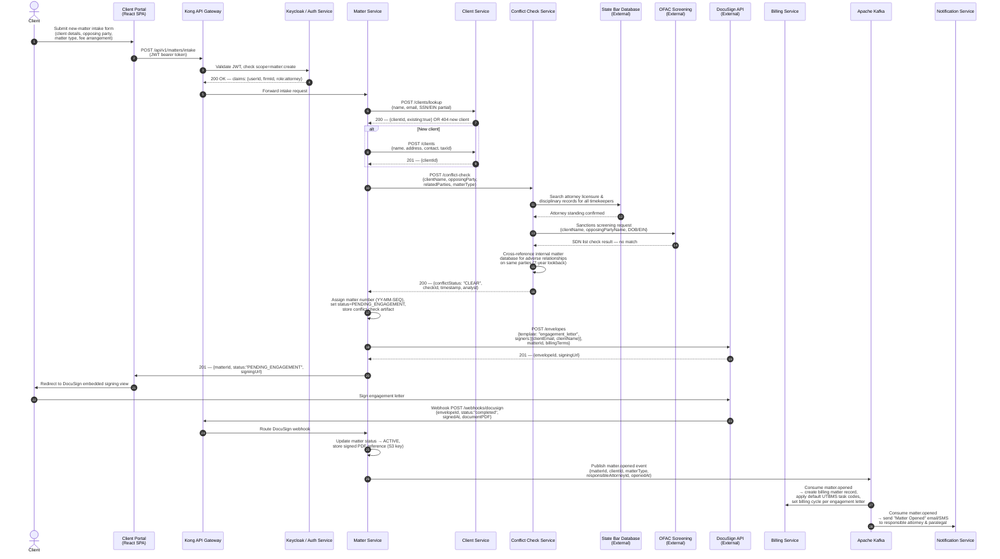
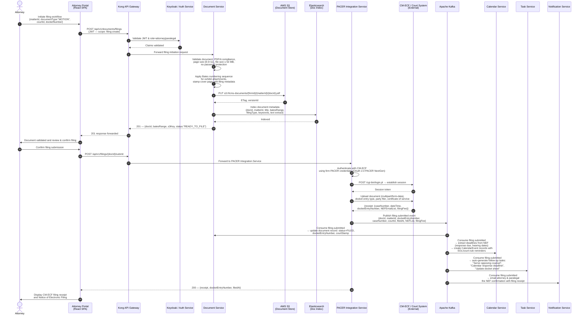
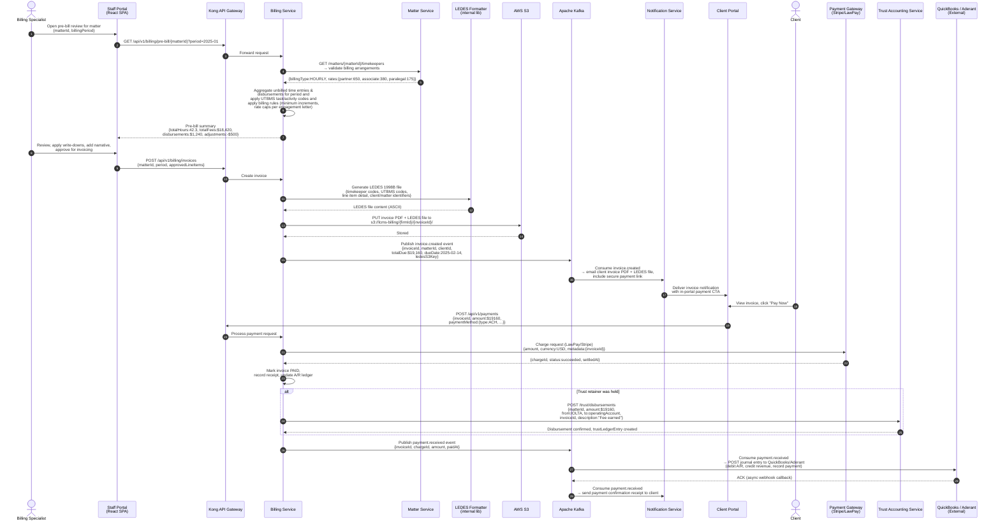
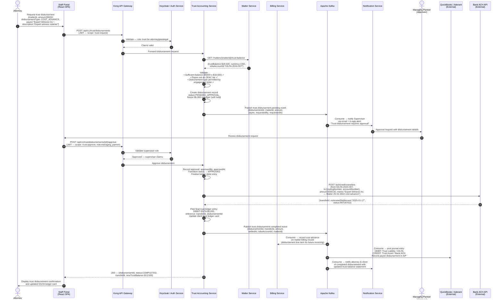

# System Sequence Diagrams — Legal Case Management System

| Field   | Value                                     |
|---------|-------------------------------------------|
| Version | 1.0.0                                     |
| Status  | Approved                                  |
| Date    | 2025-01-15                                |
| Owner   | Architecture & Engineering, LCMS Program  |

---

## Overview

This document captures the primary cross-system interaction sequences for the Legal Case Management System (LCMS). Each diagram models the message exchange between actors, internal microservices, and external systems for a key business workflow. Diagrams follow UML sequence diagram conventions rendered in Mermaid and are supplemented with numbered step-by-step explanations.

The flows documented here represent the highest-stakes business operations in a mid-to-large law firm: opening a new matter (with mandatory conflict screening), electronically filing with federal courts via PACER/CM-ECF, generating LEDES-formatted invoices and collecting payments, and disbursing funds from an IOLTA trust account. Together these four flows exercise every major microservice and all three external integration points.

---

## 1. Matter Intake with Conflict Check

### 1.1 Diagram

### 1.2 Step-by-Step Explanation

| Step | Actor / Service | Action |
|------|-----------------|--------|
| 1 | Client | Submits the new-matter intake form through the self-service Client Portal. The form captures client identification details (name, address, tax ID or SSN partial), the nature of the legal matter, all known opposing and related parties, and the proposed fee arrangement (hourly, flat, contingency). |
| 2–4 | Portal → Gateway → Auth | The portal forwards the authenticated request to the Kong API Gateway, which delegates token validation to Keycloak. The gateway enforces that the calling principal holds the `matter:create` scope before forwarding. |
| 5–7 | MatterSvc → ClientSvc | Matter Service resolves or creates the client record to ensure a canonical `clientId` exists before any conflict check is run against the internal database. |
| 8–13 | MatterSvc → ConflictSvc | A conflict-check request is dispatched to the Conflict Check Service, which performs three independent checks in parallel: attorney standing in the State Bar database, OFAC/SDN sanctions screening, and an internal adverse-relationship sweep across all active and closed matters for a seven-year lookback period. A `CLEAR` result with an immutable `checkId` is mandatory to proceed. |
| 14–15 | MatterSvc | On a clear conflict result, Matter Service mints a firm-unique matter number formatted as `YY-MM-SEQNNN` and sets the initial status to `PENDING_ENGAGEMENT`. The conflict check artifact is stored alongside the matter record for audit purposes. |
| 16–18 | MatterSvc → DocuSign | The engagement letter is dispatched via the DocuSign Envelopes API using a pre-configured firm template that merges matter-specific billing terms. The client receives an embedded signing URL. |
| 19–22 | Client → DocuSign → MatterSvc | Once the client signs, DocuSign posts a completion webhook. Matter Service transitions the matter status to `ACTIVE` and persists the signed PDF reference in Amazon S3. |
| 23–25 | MatterSvc → Kafka | A `matter.opened` domain event is published to the Kafka `lcms.matters` topic. Both Billing Service (to initialise the billing record and UTBMS code set) and Notification Service (to alert the responsible attorney) consume this event asynchronously. |

---

## 2. Court Filing via PACER / CM-ECF

### 2.1 Diagram

### 2.2 Step-by-Step Explanation

| Step | Actor / Service | Action |
|------|-----------------|--------|
| 1–4 | Attorney → DocSvc | The attorney initiates a filing workflow by specifying the matter, document type, target court, and docket/case number. Kong validates the JWT and ensures the caller holds the `filing:create` scope. |
| 5–9 | DocSvc | Document Service performs a series of pre-flight validations required by CM-ECF: PDF/A compliance check, page-dimension conformance, 50 MB per-document size cap, and absence of password protection. Exhibits receive a Bates stamp from the central Bates sequence for the matter. The validated file is written to S3 (versioned bucket) and its text is indexed in Elasticsearch for full-text search. |
| 10–13 | Portal ↔ Attorney | The validated document is previewed in the portal. The attorney reviews the CM-ECF docket entry metadata and confirms submission. |
| 14–18 | PACER Integration → CM-ECF | The PACER Integration Service authenticates using the firm's PACER NextGen OAuth credentials, constructs the CM-ECF multipart filing request (document, case number, docket entry type, party information, and certificate of service), and submits. CM-ECF returns a filing receipt containing the docket entry number, timestamp, filing fee, and the list of attorneys who will receive the Notice of Electronic Filing (NEF). |
| 19–24 | Kafka consumers | A `filing.submitted` event triggers three downstream consumers: Document Service records the docket entry number and marks the document `FILED`; Calendar Service parses response deadlines from the NEF and creates calendar events with automatic court-rule-based reminders; Task Service generates standard post-filing task checklist items; Notification Service delivers the NEF and receipt to the filing attorney and assigned paralegal. |

---

## 3. Invoice Generation and Payment Collection

### 3.1 Diagram

### 3.2 Step-by-Step Explanation

| Step | Actor / Service | Action |
|------|-----------------|--------|
| 1–6 | BillingSpec → BillingSvc | The billing specialist opens the pre-bill review dashboard for a specific matter and billing period. Billing Service fetches the matter's rate schedule from Matter Service and aggregates all unbilled time entries and disbursements, applying firm billing rules such as minimum time increments (typically 0.1-hour tenths), rate caps specified in the engagement letter, and UTBMS task/activity code mappings. |
| 7–8 | Portal → BillingSpec | The pre-bill summary is presented for human review. The specialist can apply write-downs, add narrative descriptions, and remove any entries before finalising. |
| 9–13 | BillingSvc → LEDES | Upon approval, Billing Service invokes the internal LEDES 1998B formatter to produce the machine-readable billing file required by most corporate clients and insurance carriers. Both the formatted invoice PDF and the LEDES file are stored in S3 under a versioned key. |
| 14–16 | Kafka → NotifySvc | The `invoice.created` event triggers Notification Service to deliver the invoice to the client via email and through the client portal, including a secure one-time payment link. |
| 17–21 | Client → PayGW | The client pays through the portal using ACH or card via LawPay or Stripe. Billing Service records the payment, marks the invoice `PAID`, and updates the accounts-receivable ledger. |
| 22–24 | Trust disbursement (conditional) | If fees were drawn against a held retainer in the IOLTA trust account, Billing Service instructs Trust Accounting Service to execute the disbursement from the IOLTA account to the firm's operating account with a proper ledger entry. |
| 25–27 | Kafka → QuickBooks | The `payment.received` event is consumed by the accounting integration, which posts the corresponding journal entry to QuickBooks or Aderant, ensuring the firm's financial system of record remains synchronised. |

---

## 4. Trust Account Disbursement

### 4.1 Diagram

### 4.2 Step-by-Step Explanation

| Step | Actor / Service | Action |
|------|-----------------|--------|
| 1–4 | Attorney → TrustSvc | The attorney submits a trust disbursement request specifying the matter, amount, disbursement type (cost advance, earned-fee transfer, or third-party payment), payee details, and a description for the trust ledger. Kong validates the JWT and confirms the `trust:request` scope. |
| 5–6 | TrustSvc → MatterSvc | Trust Accounting Service fetches the current IOLTA trust balance for the matter to confirm sufficient funds are available before any ledger holds are placed. |
| 7–8 | TrustSvc (validation) | Three concurrent validations are performed: balance sufficiency, OFAC sanctions screening of the payee, and verification that the disbursement type is permitted under the client's engagement letter terms. A soft ledger hold is placed on the requested amount to prevent double-spending during the approval window. |
| 9–11 | Kafka → Supervisor | A `trust.disbursement.pending` event routes an approval notification to the managing partner or designated trust account supervisor via both email and the in-app notification centre. The approval request includes the full disbursement context and a direct link to the approval workflow. |
| 12–15 | Supervisor → TrustSvc | The supervising attorney reviews and approves the disbursement from the portal. Keycloak enforces that only principals holding the `trust:approve` scope and the `managing_partner` role can issue approvals. Trust Service transitions the disbursement record to `APPROVED` and finalises the ledger debit entry. |
| 16–18 | TrustSvc → Bank ACH | The service initiates an ACH credit transfer from the IOLTA account to the payee's bank account via the firm's banking API. The estimated settlement date (typically next business day for same-day ACH) is recorded. |
| 19–23 | Kafka consumers | The `trust.disbursement.completed` event triggers: Billing Service records the cost advance as a disbursement line item on the matter for future invoicing; QuickBooks receives the journal entry debiting the IOLTA trust liability and crediting the bank asset; Notification Service sends the attorney and client an updated IOLTA ledger card reflecting the new trust balance and the disbursement transaction. |
