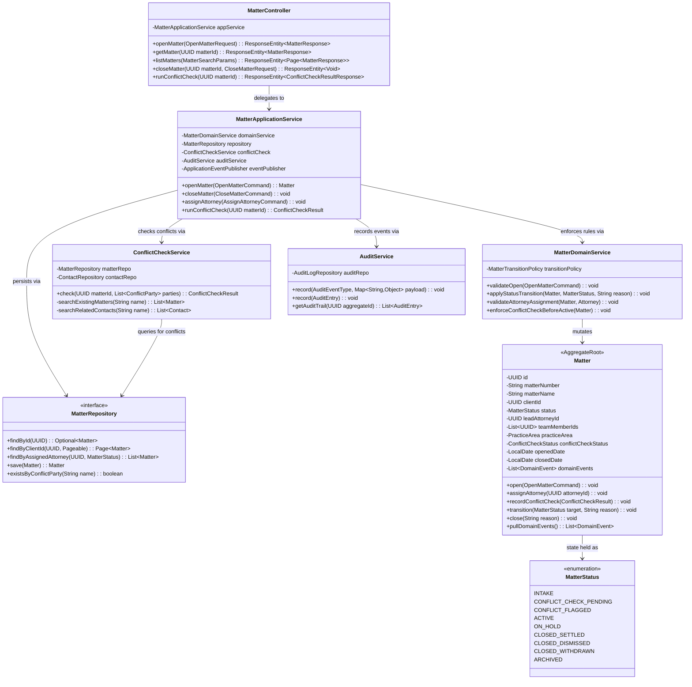
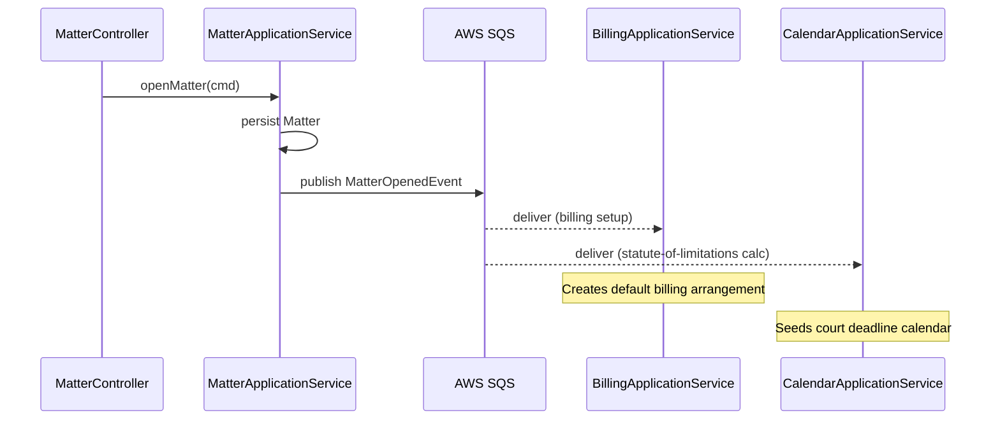
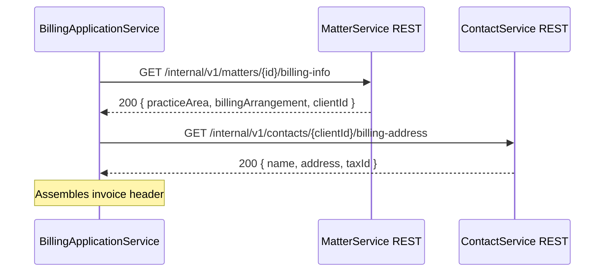
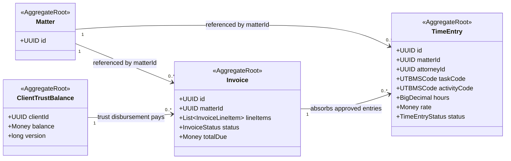

# C4 Code-Level Diagram — Legal Case Management System

## Overview

This document describes the internal code structure of the two highest-criticality services in the system: **MatterService** (the core of matter lifecycle management) and **BillingService** (time entry, invoicing, LEDES export, and IOLTA trust accounting). These diagrams supplement the C4 Container diagram and are intended for onboarding engineers, code reviewers, and security auditors.

---

## MatterService — Package Structure

```
matter/
├── api/
│   ├── MatterController.java              # HTTP entrypoint, request mapping
│   ├── dto/
│   │   ├── OpenMatterRequest.java
│   │   ├── MatterResponse.java
│   │   ├── UpdateMatterRequest.java
│   │   └── ConflictCheckResultResponse.java
│   └── mapper/
│       └── MatterMapper.java              # Domain ↔ DTO conversion
├── application/
│   ├── MatterApplicationService.java      # Orchestrates use cases
│   ├── command/
│   │   ├── OpenMatterCommand.java
│   │   ├── CloseMatterCommand.java
│   │   └── AssignAttorneyCommand.java
│   └── event/
│       ├── MatterOpenedEvent.java
│       ├── MatterClosedEvent.java
│       └── ConflictFlaggedEvent.java
├── domain/
│   ├── Matter.java                        # Aggregate root
│   ├── MatterStatus.java                  # Enum
│   ├── MatterDomainService.java           # Business rules
│   ├── ConflictCheckService.java          # Conflict-of-interest checks
│   └── policy/
│       └── MatterTransitionPolicy.java    # Status FSM rules
├── infrastructure/
│   ├── MatterRepositoryImpl.java
│   ├── MatterJpaRepository.java           # Spring Data interface
│   └── audit/
│       └── AuditService.java              # Writes to audit_log
└── MatterServiceModule.java               # Spring @Configuration / DI wiring
```

---

## MatterService — Class Diagram



---

## Key Method Signatures and Descriptions

### MatterController

| Method | HTTP | Description |
|---|---|---|
| `openMatter(request)` | `POST /api/v1/matters` | Validates the DTO, maps to `OpenMatterCommand`, delegates to application service. Returns 201 with location header. |
| `getMatter(matterId)` | `GET /api/v1/matters/{id}` | Returns matter detail; privilege-filtered documents excluded unless role is ATTORNEY. |
| `listMatters(params)` | `GET /api/v1/matters` | Paginated, filterable by status, practice area, attorney, date range. |
| `closeMatter(id, req)` | `POST /api/v1/matters/{id}/close` | Triggers status FSM transition; requires reason code. |
| `runConflictCheck(id)` | `POST /api/v1/matters/{id}/conflict-check` | Initiates async conflict check; returns 202 Accepted with job ID. |

### MatterApplicationService

| Method | Description |
|---|---|
| `openMatter(cmd)` | Validates the command, calls domain service for rule enforcement, runs an immediate conflict pre-screen, persists the new `Matter`, publishes `MatterOpenedEvent` to SQS. |
| `closeMatter(cmd)` | Verifies no unbilled time entries exist (delegates to BillingService via sync REST call), transitions status, publishes `MatterClosedEvent`. |
| `runConflictCheck(matterId)` | Loads all parties from the matter, delegates to `ConflictCheckService`, persists result on the aggregate, emits `ConflictFlaggedEvent` if conflicts found. |

### Matter Aggregate

| Method | Description |
|---|---|
| `transition(target, reason)` | Delegates to `MatterTransitionPolicy` to validate the FSM edge. Records a `MatterStatusChanged` domain event. Throws `InvalidMatterTransitionException` on illegal transitions. |
| `recordConflictCheck(result)` | Sets `conflictCheckStatus`; transitions to `CONFLICT_FLAGGED` if result is positive. Only callable when status is `CONFLICT_CHECK_PENDING`. |
| `pullDomainEvents()` | Returns and clears the internal list of uncommitted domain events. Called by the application service after `save()` to dispatch events. |

### ConflictCheckService

| Method | Description |
|---|---|
| `check(matterId, parties)` | Cross-references all party names (client, opposing counsel, witnesses, related entities) against existing open matters and contact records. Returns `ConflictCheckResult` with flagged matches and severity level. |

---

## Dependency Injection Wiring

All beans are registered via Spring `@Configuration` in `MatterServiceModule`. Constructor injection is mandatory — no field injection (`@Autowired` on fields is prohibited by ArchUnit rule).

```java
@Configuration
public class MatterServiceModule {

    @Bean
    public MatterApplicationService matterApplicationService(
        MatterDomainService domainService,
        MatterRepository repository,
        ConflictCheckService conflictCheckService,
        AuditService auditService,
        ApplicationEventPublisher eventPublisher
    ) {
        return new MatterApplicationService(
            domainService, repository, conflictCheckService,
            auditService, eventPublisher
        );
    }

    @Bean
    public MatterDomainService matterDomainService(
        MatterTransitionPolicy transitionPolicy
    ) {
        return new MatterDomainService(transitionPolicy);
    }

    @Bean
    public ConflictCheckService conflictCheckService(
        MatterRepository matterRepository,
        ContactRepository contactRepository
    ) {
        return new ConflictCheckService(matterRepository, contactRepository);
    }
}
```

**Scoping rules:**
- `MatterApplicationService` — singleton
- `AuditService` — singleton; its underlying `AuditLogRepository` uses a separate `DataSource` bean pointing at the append-only audit schema
- `MatterRepository` — prototype-scoped is NOT used; the JPA context manages connection lifecycle via transaction proxy

---

## BillingService — Package Structure

```
billing/
├── api/
│   ├── TimeEntryController.java
│   ├── InvoiceController.java
│   └── TrustLedgerController.java
├── application/
│   ├── TimeEntryApplicationService.java
│   ├── InvoiceApplicationService.java
│   ├── LEDESExportApplicationService.java
│   └── IOLTALedgerApplicationService.java
├── domain/
│   ├── timeentry/
│   │   ├── TimeEntry.java                 # Aggregate root
│   │   ├── TimeEntryStatus.java
│   │   └── UTBMSCode.java                 # UTBMS task/activity codes
│   ├── invoice/
│   │   ├── Invoice.java                   # Aggregate root
│   │   ├── InvoiceLineItem.java
│   │   ├── InvoiceStatus.java
│   │   └── LEDESFormatter.java            # 1998B/2000 format output
│   └── trust/
│       ├── IOLTATransaction.java
│       ├── ClientTrustBalance.java        # Aggregate root
│       └── ThreeWayReconciliation.java
├── infrastructure/
│   ├── TimeEntryRepositoryImpl.java
│   ├── InvoiceRepositoryImpl.java
│   ├── IOLTALedgerRepositoryImpl.java
│   └── stripe/
│       └── StripePaymentAdapter.java
└── BillingServiceModule.java
```

### BillingService Component Table

| Component | Responsibility |
|---|---|
| `TimeEntryApplicationService` | Records, edits, submits, and approves time entries. Enforces UTBMS code validity. Publishes `TimeEntrySubmitted` event. |
| `InvoiceApplicationService` | Aggregates approved time entries into invoices. Applies billing arrangements (hourly, flat-fee, contingency). Triggers PDF generation. |
| `LEDESExportApplicationService` | Formats invoices as LEDES 1998B or 2000 files for e-billing submission to insurance carriers and corporate legal departments. |
| `IOLTALedgerApplicationService` | Records client deposits, disbursements, and earned transfers. Enforces double-entry invariant. Produces three-way reconciliation reports. |
| `StripePaymentAdapter` | Wraps Stripe API for invoice payment links and automated ACH/card collection. Translates Stripe webhooks to domain `PaymentReceivedEvent`. |

---

## Inter-Service Communication Patterns

### Async Event Flow (SQS)

Cross-context communication that does not require an immediate response uses Amazon SQS with dead-letter queues. Events are published as JSON using a versioned schema (`schemaVersion` field in every envelope).



**SQS queue configuration:**

| Queue | Consumer | DLQ Retries |
|---|---|---|
| `matter-events` | BillingService, CalendarService, ClientPortalService | 3 |
| `billing-events` | MatterService (for unbilled check), ClientPortalService | 3 |
| `document-events` | BillingService (for invoice attachments), PortalService | 3 |

### Sync REST for Reads

When a service needs data owned by another service to complete a synchronous user-facing request, it calls that service's internal REST API. Internal calls use mutual TLS within the VPC and carry a `X-Internal-Request-Id` header for distributed tracing.



### Event Schema Versioning

All SQS message envelopes follow this structure. Consumers must handle `schemaVersion` gracefully — reject unknown versions to the DLQ rather than silently dropping fields:

```json
{
  "eventId": "f2a3...",
  "eventType": "MatterOpened",
  "schemaVersion": "1.0",
  "occurredAt": "2025-06-01T14:22:00Z",
  "aggregateId": "matter-uuid",
  "payload": { }
}
```

---

## Aggregate Interaction Rules



**Cross-aggregate reference rule:** Aggregates reference each other **by ID only** — never by direct object reference. Loading a related aggregate requires going through its own repository. This boundary is enforced by ArchUnit:

```java
@ArchTest
static final ArchRule no_direct_aggregate_references =
    noClasses().that().areAnnotatedWith(AggregateRoot.class)
        .should().directlyDependOn(
            classes().that().areAnnotatedWith(AggregateRoot.class)
                .and().areNotTheClass(SelfType.class));
```
