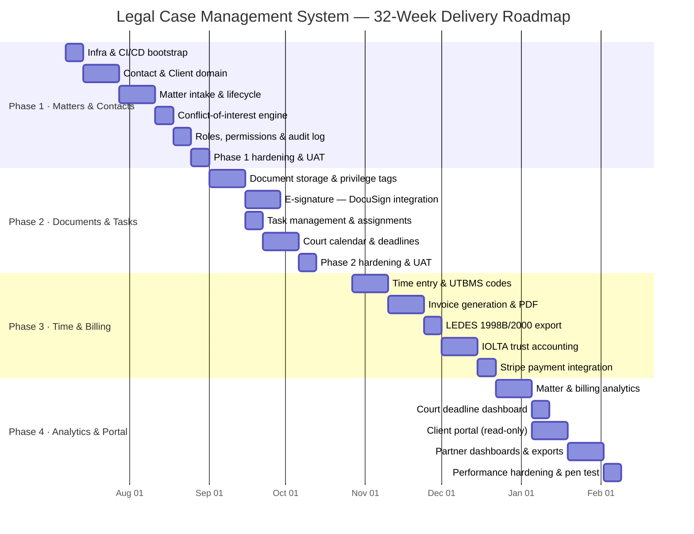

# Implementation Playbook — Legal Case Management System

## Overall Timeline



---

## Phase 1 — Matters & Contacts (Weeks 1–8)

### Goals

Stand up the foundational data model and workflows that every other phase depends upon. By end of Phase 1, a firm should be able to onboard a client, open a matter, run a conflict-of-interest check, and have a full audit trail of every action. No billing, no documents — just the core entity lifecycle with production-grade security and observability.

### Team Composition

| Role | Count | Responsibilities |
|---|---|---|
| Tech Lead / Architect | 1 | Architecture decisions, cross-cutting concerns, PR review |
| Backend Engineers | 3 | Domain model, API, repository layer, event publishing |
| Frontend Engineer | 1 | Matter intake UI, contact management screens |
| QA Engineer | 1 | Test plans, integration test suite, UAT scripts |
| DevOps Engineer | 0.5 | CI/CD, AWS infra (RDS, SQS, ECS), Secrets Manager |
| Product Owner | 0.5 | Acceptance criteria, stakeholder demos |

### Deliverables

| Deliverable | Description | Owner |
|---|---|---|
| Infrastructure baseline | VPC, ECS cluster, RDS PostgreSQL, SQS queues, Secrets Manager, ALB | DevOps |
| CI/CD pipeline | GitHub Actions — build, test, lint, Docker push, ECS deploy | DevOps |
| Contact domain | Client, opposing counsel, witness entities with full CRUD and audit | Backend |
| Matter domain | Matter aggregate, FSM status transitions, audit trail, domain events | Backend |
| Conflict-of-interest engine | Party name cross-reference against existing matters and contacts | Backend |
| RBAC & auth | Role-based access control: ATTORNEY, PARALEGAL, CLIENT, ADMIN | Backend |
| Matter intake UI | Multi-step form: client lookup, parties, practice area, initial notes | Frontend |
| API documentation | OpenAPI 3.1 spec auto-generated and published to developer portal | Tech Lead |

### Sprint Breakdown

**Sprint 1 (Weeks 1–2): Foundation**

- Bootstrap monorepo with module structure (matter, billing, document, portal)
- Terraform: VPC, subnets, RDS, ECS cluster, SQS, ALB, WAF
- GitHub Actions pipeline: build → unit test → integration test → push image → deploy to dev
- Core domain model: `Contact`, `Client`, `Matter`, `MatterStatus` enum
- `AuditLog` schema with append-only rules and no-delete database rule
- JWT authentication with Cognito as identity provider

**Sprint 2 (Weeks 3–4): Matter Lifecycle**

- `MatterApplicationService.openMatter()` — full flow including validation, domain event, SQS publish
- `MatterDomainService` with `MatterTransitionPolicy` FSM
- `MatterController` with OpenAPI annotations
- Privilege-aware `MatterDocumentRepository` interface (schema only, implementation in Phase 2)
- `AuditService` and `AuditInterceptor` — verify immutability with integration test

**Sprint 3 (Weeks 5–6): Conflict Check & Roles**

- `ConflictCheckService` — fuzzy name matching, exact entity match, cross-matter search
- `ConflictCheckResult` with flagged parties and severity (`CLEAR`, `POTENTIAL`, `DEFINITE`)
- RBAC: `@PreAuthorize` annotations on all controller methods; ArchUnit rule to catch unannotated endpoints
- Attorney assignment and matter team management API
- Frontend: matter intake form, contact search/create modal

**Sprint 4 (Weeks 7–8): Hardening & UAT**

- Load test: 500 concurrent matter opens — verify no race conditions in conflict check
- Security scan: OWASP dependency check, Semgrep static analysis
- Penetration test: RBAC bypass attempts, privilege escalation, SQL injection probing
- UAT with law firm pilot users; capture feedback
- Rollback rehearsal: restore from RDS snapshot, verify audit log integrity

### Acceptance Criteria

- A matter can be opened, assigned, conflict-checked, and closed via API with all transitions captured in `audit_log`
- Conflict check returns results within 2 seconds for matters with up to 50 parties
- An attorney role cannot read another firm's matters (multi-tenant isolation verified)
- A client role cannot read matters they are not a party to
- All API endpoints return OpenAPI-compliant responses validated against the published spec
- Zero high or critical findings from OWASP dependency check
- Audit log rows are immutable (verified by attempting direct UPDATE via psql — blocked)

### Risks & Mitigations

| Risk | Likelihood | Impact | Mitigation |
|---|---|---|---|
| Conflict check false positives alienate pilot users | Medium | Medium | Implement confidence score; surface as "review required" not hard block |
| RDS schema migrations break rolling deploys | Medium | High | Use Flyway with backward-compatible migrations; never drop columns in same release as code change |
| Cognito integration delays auth delivery | Low | High | Spike in Week 1; fall back to in-house JWT service if needed |
| Multi-tenant data leak via missing `firmId` predicate | Low | Critical | ArchUnit rule + integration test asserting cross-tenant query returns empty |

### Rollback Plan

- All database migrations are reversible (Flyway `V*__*.sql` paired with `U*__*.sql` undo scripts)
- ECS task definitions are versioned; prior task definition is deployed via `ecs update-service --task-definition <prev-arn>` in under 5 minutes
- RDS automated snapshots taken every 6 hours; point-in-time recovery enabled
- Feature flags (LaunchDarkly) gate every new API endpoint — disable at flag level before code rollback if needed

### Definition of Done

- All unit tests pass (≥ 90% coverage on domain classes)
- All integration tests pass against Testcontainers PostgreSQL
- Pact contracts published for Matter → Billing and Matter → Portal consumers
- OpenAPI spec committed and validated via `openapi-generator validate`
- CHANGELOG updated
- Tech Lead sign-off on security review checklist
- Product Owner demo acceptance

---

## Phase 2 — Documents & Tasks (Weeks 9–16)

### Goals

Firms live in documents. Phase 2 adds the document management system with attorney-client privilege tagging, e-signature via DocuSign, task management, and a court calendar with statute-of-limitations deadline tracking. By end of Phase 2, attorneys can upload, tag, share (within privilege rules), and execute documents from within the matter, and paralegals can manage task lists and court dates.

### Team Composition

Same as Phase 1, with the addition of:
- 1 additional Backend Engineer (document storage, DocuSign integration)
- 1 UI/UX Designer (0.5 FTE, client portal wireframes)

### Deliverables

| Deliverable | Description | Owner |
|---|---|---|
| Document storage service | S3-backed storage with server-side encryption, presigned URLs, virus scan on upload | Backend |
| Privilege classification UI | Tag documents at upload; bulk re-classify with audit trail | Frontend |
| Privilege log generator | Auto-generate court-ready privilege log for any matter on demand | Backend |
| DocuSign integration | Send for signature, status webhooks, signed doc stored back to matter | Backend |
| Task management | Task CRUD, assignee, due date, priority, linked matter or document | Backend + Frontend |
| Court calendar | Hearing dates, filing deadlines, statute-of-limitations calculator | Backend + Frontend |
| Calendar sync | Outbound iCal / Google Calendar sync for attorney court dates | Backend |

### Sprint Breakdown

**Sprint 5 (Weeks 9–10): Document Storage**

- S3 bucket per tenant (logical prefix), SSE-KMS, bucket policies deny public access
- ClamAV scan on every upload via Lambda trigger before document is marked `AVAILABLE`
- `MatterDocument` entity with `PrivilegeClassification` and `markedForPrivilegeLog`
- `DocumentContentService` — presigned URL generation with 15-minute expiry, no direct S3 URLs exposed
- Privilege-aware repository (`PrivilegeFilter` from code guidelines implemented)
- Privilege log generator (`PrivilegeLogService.generateForMatter()`)

**Sprint 6 (Weeks 11–12): DocuSign & E-Signature**

- `DocuSignAdapter` wrapping DocuSign eSignature REST API v2.1
- Send-for-signature flow: create envelope, embed signing URL in client portal
- Webhook listener for `envelope-completed` — download signed PDF, store to S3, update `MatterDocument.status`
- Signature audit trail: signer identity, timestamp, IP stored in `audit_log`
- Fallback: wet-signature upload flow for clients who cannot use DocuSign

**Sprint 7 (Weeks 13–14): Task Management**

- `Task` entity: title, description, assignee, due date, priority, linked matter, linked document, status
- Task templates per practice area (e.g., personal injury intake checklist auto-generates tasks on matter open)
- `@MatterTaskOverdue` scheduled job — daily scan, notify assignee via email (SES)
- Task list UI with Kanban and list views; drag-and-drop status update

**Sprint 8 (Weeks 15–16): Court Calendar & Hardening**

- `CourtDeadline` entity with deadline type enum: `HEARING`, `FILING`, `STATUTE_OF_LIMITATIONS`, `DISCOVERY_CUTOFF`
- `StatuteCalculatorService` — pluggable rule engine per jurisdiction and cause of action
- iCal export endpoint; Google Calendar OAuth2 push sync
- Court calendar UI with colour-coded urgency (overdue, due within 7 days, upcoming)
- Phase 2 UAT; pen test focused on privilege bypass and document URL enumeration

### Acceptance Criteria

- Uploading a document classified `ATTORNEY_CLIENT` returns 403 when fetched by a user with CLIENT role
- Privilege log generated for a matter with 20 privileged documents returns correct FRCP-compliant fields
- DocuSign envelope completion triggers document status update within 30 seconds (webhook SLA)
- ClamAV scan rejects a test EICAR virus file upload with HTTP 422
- Court deadline 7-day warning emails arrive in attorney inbox (verified in staging with SES sandbox)
- Statute-of-limitations calculator returns correct result for 5 validated jurisdiction/cause-of-action pairs provided by pilot firm's litigation partners

### Risks & Mitigations

| Risk | Likelihood | Impact | Mitigation |
|---|---|---|---|
| DocuSign API rate limits during bulk sends | Medium | Medium | Implement exponential backoff; queue sends via SQS |
| Privilege mis-classification by paralegal | Medium | High | Require attorney review before `ATTORNEY_CLIENT` tag is finalised; workflow approval step |
| S3 presigned URL leaked in browser history | Low | Medium | Keep expiry at 15 min; log every URL generation in audit trail |
| Statute calculator inaccuracy — malpractice risk | Medium | Critical | Scope to 5 jurisdictions initially; require attorney review of all calculated dates; disclaim in UI |

### Definition of Done

- Privilege filter integration test: CLIENT role query returns zero `ATTORNEY_CLIENT` documents across 100 test records
- DocuSign sandbox end-to-end flow completes without manual intervention
- ClamAV rejects EICAR test file in staging environment
- Court calendar renders correctly on mobile (390px viewport)
- All Pact contracts updated for Document → Portal consumer
- Security review checklist signed off

---

## Phase 3 — Time & Billing (Weeks 17–24)

### Goals

Time and billing is the revenue engine of any law firm. Phase 3 delivers UTBMS-coded time entry, flexible invoice generation, LEDES 1998B/2000 export for insurance and corporate e-billing, IOLTA trust accounting with three-way reconciliation, and Stripe-powered payment collection. This phase has the highest compliance risk — every story requires a compliance review sign-off from the firm's bar-compliance liaison before it ships to production.

### Team Composition

Same as Phase 1, plus:
- 1 Backend Engineer specialising in financial systems
- 0.5 FTE bar compliance consultant (reviews IOLTA logic before production deploy)

### Deliverables

| Deliverable | Description | Owner |
|---|---|---|
| Time entry module | UTBMS-coded time entry with draft → submitted → approved workflow | Backend |
| Billing arrangements | Hourly, flat-fee, contingency, hybrid; applied per matter at billing review | Backend |
| Invoice generator | Aggregates approved entries, applies arrangements, generates PDF | Backend |
| LEDES 1998B export | Industry-standard e-billing file for insurance carrier submission | Backend |
| LEDES 2000 export | XML-based LEDES 2000 format for corporate legal departments | Backend |
| IOLTA ledger | Double-entry client trust ledger, overdraft prevention, audit trail | Backend |
| Three-way reconciliation | Monthly bank/client/trust balance report with discrepancy detection | Backend |
| Stripe integration | Payment links, ACH/card collection, webhook-driven payment recording | Backend |
| Billing UI | Timesheet entry, invoice review & approval, trust ledger views | Frontend |

### Sprint Breakdown

**Sprint 9 (Weeks 17–18): Time Entry**

- `TimeEntry` aggregate with `UTBMSCode` (task code + activity code validation)
- Time entry workflow: `DRAFT` → `SUBMITTED` → `APPROVED` → `BILLED`
- `TimeEntryApplicationService.recordTime()` — validates UTBMS codes against published UTBMS registry
- Bulk time import from CSV (for firms migrating from legacy systems)
- Timesheet UI: weekly grid view, quick-entry modal, UTBMS code typeahead

**Sprint 10 (Weeks 19–20): Invoice Generation**

- `Invoice` aggregate, `InvoiceLineItem`, billing arrangement engine
- `InvoiceApplicationService.generateDraft()` — collects all approved unbilled entries for a matter
- PDF generation via JasperReports template (firm logo, IOLTA trust balance, itemised entries)
- Invoice review UI: approve, edit line items, add write-ups/write-downs, send to client
- `InvoiceApplicationService.sendToClient()` — emails PDF, records `InvoiceSentEvent`

**Sprint 11 (Weeks 21–22): LEDES Export & IOLTA**

- `LEDESFormatter` — LEDES 1998B flat file with field-by-field mapping validated against LEDES specification
- `LEDES2000Formatter` — XML output; validates against published LEDES 2000 XSD
- LEDES export UI: select invoices, download file, submission status tracking
- `IOLTALedgerApplicationService.recordDeposit()` — double-entry, optimistic lock, overdraft check
- `IOLTALedgerApplicationService.disburseToFirm()` — transfers earned fees from trust to operating
- `ThreeWayReconciliation` job — runs on month-end, flags discrepancies, emails managing partner
- **Compliance review sign-off required before merging IOLTA code to main**

**Sprint 12 (Weeks 23–24): Stripe & Hardening**

- `StripePaymentAdapter` — invoice payment link generation, webhook for `payment_intent.succeeded`
- `PaymentReceivedEvent` → updates invoice status to `PAID`, records trust deposit if applicable
- ACH / direct bank transfer flow with Stripe Financial Connections
- Load test: 200 concurrent time entry submissions — verify optimistic lock prevents duplicate billing
- IOLTA reconciliation accuracy test: seed 1,000 transactions across 50 clients, verify three-way balance
- Bar compliance consultant review of IOLTA audit trail completeness

### Acceptance Criteria

- LEDES 1998B export passes validation by at least one major insurance carrier's e-billing portal (Tymetrix or Legal Tracker staging environment)
- IOLTA overdraft prevention: concurrent disbursement attempts for same client where only one can succeed — exactly one succeeds, one receives HTTP 409
- Three-way reconciliation detects a seeded $1 discrepancy across 1,000 transactions
- Invoice PDF renders correctly in Adobe Acrobat (not just browser PDF viewer)
- Stripe payment link collects a test payment in Stripe test mode and updates invoice to `PAID` within 60 seconds
- All UTBMS task codes and activity codes are validated against the published 2025 UTBMS code set
- Bar compliance consultant signs off on IOLTA trust accounting audit trail documentation

### Risks & Mitigations

| Risk | Likelihood | Impact | Mitigation |
|---|---|---|---|
| LEDES spec ambiguity causes carrier rejection | Medium | High | Test against three carriers in staging before prod; maintain carrier-specific override config |
| IOLTA optimistic lock contention under load | Low | Critical | Load test at 2× expected peak; add circuit breaker to disbursement flow |
| Stripe webhook delivery failure loses payment record | Low | Critical | Idempotency key on webhook handler; dead-letter queue; reconcile daily against Stripe API |
| Bar compliance review delays sprint | Medium | Medium | Engage compliance consultant in Sprint 9 for early review; do not block on last-sprint review |

### Definition of Done

- LEDES formatter output validated against LEDES 1998B specification v1.05 programmatically
- IOLTA double-entry invariant verified by property-based tests (jqwik) across 10,000 generated transactions
- All financial domain classes have ≥ 95% unit test coverage
- Stripe webhook handler is idempotent (tested by replaying same event 3 times — no duplicate payment records)
- Bar compliance sign-off document committed to `docs/compliance/` directory
- Three-way reconciliation report reviewed by pilot firm's bookkeeper and signed off

---

## Phase 4 — Analytics & Reporting (Weeks 25–32)

### Goals

Phase 4 converts the operational data accumulated in Phases 1–3 into actionable intelligence: matter performance analytics, billing realization reports, real-time court deadline dashboards, a self-service client portal, and partner-level financial dashboards. This phase also hardens the platform for production scale — performance tuning, penetration testing, and SOC 2 Type 1 evidence collection.

### Team Composition

Same as Phase 1, plus:
- 1 Data Engineer (analytics pipeline, read model ETL)
- 1 Frontend Engineer (dashboards, client portal)
- 0.5 FTE Security Consultant (penetration test, SOC 2 evidence)

### Deliverables

| Deliverable | Description | Owner |
|---|---|---|
| Matter analytics read model | Denormalised read model for analytics queries, refreshed via CDC from operational DB | Data Engineer |
| Billing realization dashboard | Collected vs. billed vs. worked hours; realization rate by attorney and practice area | Frontend + Backend |
| Court deadline dashboard | Real-time list of upcoming and overdue deadlines sorted by urgency and risk | Frontend |
| Client portal | Authenticated client view: matter status, documents, invoices, trust balance | Frontend + Backend |
| Partner dashboards | Revenue, WIP, realization, accounts receivable by partner and practice group | Frontend |
| Export suite | Excel/CSV export for all reports; PDF for client-facing reports | Backend |
| Performance hardening | Query optimisation, connection pooling, CDN for portal assets | DevOps + Backend |
| Penetration test | External pen test of all Phase 1–4 surfaces; findings remediated before GA | Security Consultant |
| SOC 2 Type 1 evidence | Collect and document controls evidence for auditor | Tech Lead + DevOps |

### Sprint Breakdown

**Sprint 13 (Weeks 25–26): Analytics Read Model**

- AWS DMS or Debezium CDC pipeline from RDS operational schema to read-model schema (separate RDS instance)
- Read model tables: `mv_matter_summary`, `mv_attorney_billing`, `mv_invoice_aging`, `mv_trust_balance_history`
- Incremental refresh every 15 minutes via scheduled Lambda
- Analytics API: `GET /api/v1/analytics/billing-realization?period=&attorney=&practiceArea=`
- Billing realization dashboard (React, Recharts): worked hours, billed hours, collected, realization %

**Sprint 14 (Weeks 27–28): Dashboards**

- Court deadline dashboard: filterable by attorney, matter type, urgency band; sort by days remaining
- Overdue deadline alert: badge on navigation, daily email digest to attorney
- Partner dashboard: revenue by practice group, WIP aging, AR aging buckets (0–30, 31–60, 61–90, 90+)
- Export suite: XLSX via Apache POI, PDF via JasperReports for all dashboard views

**Sprint 15 (Weeks 29–30): Client Portal**

- Separate Next.js app deployed to CloudFront + S3; API calls to backend via Client Portal API Gateway
- Authentication: Cognito hosted UI with MFA required
- Matter status view: current status, assigned attorney, next deadline
- Document view: privilege-filtered (CLIENT role); download presigned URL with 15-min expiry
- Invoice view: outstanding invoices, download PDF, click-to-pay via Stripe payment link
- Trust account view: current balance, transaction history (last 12 months)
- Portal tested against WCAG 2.1 AA; keyboard navigation verified

**Sprint 16 (Weeks 31–32): Hardening & Go-Live**

- Performance: EXPLAIN ANALYZE on all analytics queries, add missing indexes, target p99 < 500ms
- CDN caching headers on portal static assets; CloudFront invalidation on deploy
- External penetration test; critical and high findings remediated within sprint
- SOC 2 Type 1 controls mapping: access control, change management, availability, confidentiality
- Disaster recovery drill: full RDS restore to point-in-time in staging; verify data integrity
- Production deployment runbook finalised and rehearsed
- GA readiness review with all stakeholders

### Acceptance Criteria

- Billing realization dashboard loads within 2 seconds for a firm with 500 matters and 3 years of data
- Court deadline dashboard correctly flags 100% of seeded overdue deadlines in acceptance test dataset
- Client portal passes WCAG 2.1 AA audit (axe-core zero violations)
- Client portal shows zero `ATTORNEY_CLIENT` documents for client-role user (regression of Phase 2 privilege check)
- Partner dashboard AR aging totals reconcile to within $0.01 of operational invoice totals
- Penetration test report shows zero critical, zero high unmitigated findings at GA
- Disaster recovery: RDS point-in-time restore tested and documented, RTO < 4 hours, RPO < 1 hour

### Risks & Mitigations

| Risk | Likelihood | Impact | Mitigation |
|---|---|---|---|
| Analytics read model lag causes stale dashboard data | Medium | Low | Display "as of" timestamp on every dashboard; alert if lag > 30 minutes |
| Client portal MFA friction causes adoption drop | Medium | Medium | Offer TOTP + SMS; provide onboarding video; helpdesk support for first 60 days |
| Pen test findings require architecture changes | Low | High | Begin pen test in Sprint 15 to allow Sprint 16 buffer for remediation |
| SOC 2 evidence collection underestimated | Medium | Medium | Assign DevOps to start evidence collection in Sprint 13 in parallel |

### Definition of Done

- All four phases' acceptance criteria are met
- Zero open P1 or P2 bugs in production issue tracker
- Performance benchmarks documented and baseline captured in Datadog
- SOC 2 Type 1 report issued by auditor (or auditor engagement letter in place)
- Runbook for every operational procedure (deploy, rollback, DR, secret rotation, IOLTA reconciliation)
- Security penetration test remediation sign-off by security consultant
- All Pact contracts verified in CI for all inter-service boundaries
- Product Owner and pilot firm managing partner sign-off on GA readiness checklist

---

## Cross-Phase Standards

### Branching Strategy

```
main          ← production; protected, requires 2 approvals + CI green
staging       ← pre-production; auto-deployed from main after approval
develop       ← integration branch; all feature branches merge here first
feature/*     ← individual stories, rebased before PR
hotfix/*      ← emergency production fixes, merged to main AND develop
```

### Definition of Ready (for a story to enter a sprint)

- Acceptance criteria written in Given/When/Then format
- API contract (OpenAPI diff) approved if the story touches an API
- Database migration script reviewed by a second engineer
- Compliance or privilege-related stories reviewed by bar compliance liaison

### Incident Severity Levels

| Severity | Definition | Response SLA |
|---|---|---|
| P1 — Critical | IOLTA trust funds inaccessible, data loss, security breach | 15 minutes |
| P2 — High | Billing or invoice generation down, privilege leak detected | 1 hour |
| P3 — Medium | Performance degradation, non-critical feature unavailable | 4 hours |
| P4 — Low | Cosmetic issue, minor UX defect | Next sprint |

### Observability Stack

- **Metrics:** Datadog APM with custom business metrics (`matter.open.count`, `iolta.balance.total`, `invoice.generated.amount`)
- **Logs:** Structured JSON logs shipped to Datadog; `traceId` and `userId` on every log line
- **Tracing:** OpenTelemetry SDK; distributed traces across MatterService → BillingService → DocuSign adapter
- **Alerts:** PagerDuty integration; P1 alerts page on-call engineer immediately; P2 alerts within 5 minutes
