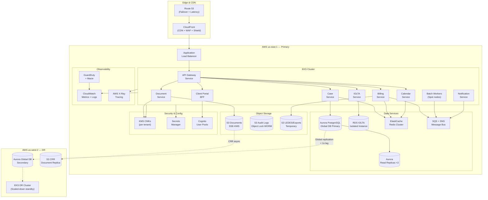

# Cloud Architecture — Legal Case Management System

## AWS Services Reference

| Service | Purpose | Configuration | Cost Tier |
|---|---|---|---|
| EKS | Kubernetes control plane and managed node groups | 1.30, Karpenter autoscaler, Fargate for system pods | ~$0.10/hr per cluster + node costs |
| Aurora PostgreSQL | Primary relational store — all tenant schemas | Global Database, r6g.2xlarge writer, 2 readers, Multi-AZ | Reserved 1yr (40% saving) |
| RDS PostgreSQL | IOLTA trust accounting — isolated instance | db.r6g.xlarge, Multi-AZ standby, encrypted | Reserved 1yr |
| ElastiCache Redis | Session cache, rate limiting, pub/sub | Cluster mode, 3 shards × 2 replicas, r7g.large | Reserved 1yr |
| S3 | Document storage, audit logs, LEDES exports | Versioning, SSE-KMS, Object Lock on audit bucket | S3 Intelligent-Tiering + Glacier Deep Archive |
| CloudFront | CDN, SSL termination, WAF integration | Price Class 100 (US/Canada/EU), Origin Shield enabled | Pay-per-request + data transfer |
| ALB | HTTP/2 load balancing, path-based routing | Multi-AZ, access logs to S3, connection draining 30s | Hourly + LCU pricing |
| SQS | Async job queues (billing, notifications, exports) | Standard queues + FIFO for billing order | Pay-per-million requests |
| SNS | Fan-out notifications, system event bus | Topic-per-domain, SQS + Lambda subscribers | Pay-per-million publishes |
| KMS | Envelope encryption, tenant CMKs | One CMK per tenant, automatic annual rotation | $1/key/month + API call pricing |
| Secrets Manager | DB credentials, API keys, OAuth secrets | Automatic rotation (Lambda), cross-account sharing blocked | $0.40/secret/month |
| ACM | TLS certificates | Wildcard `*.legalcms.io`, auto-renewed, CloudFront + ALB | Free |
| Route 53 | DNS, health checks, failover routing | Private hosted zone + public, latency + failover policies | $0.50/hosted zone/month |
| WAF | Layer 7 traffic filtering | Managed rule groups + custom rules, CloudFront-attached | Pay-per-rule + request |
| Shield Advanced | DDoS protection | Organization-level, DRT access, cost protection | $3,000/month flat |
| GuardDuty | Threat detection and anomaly detection | All sources enabled including EKS runtime, RDS | Pay-per-volume |
| CloudTrail | API audit log (who did what, when) | Organization trail, S3 + CloudWatch, integrity validation | Pay-per-event |
| AWS Config | Resource configuration compliance | All regions, conformance pack for SOC 2 | Pay-per-rule evaluation |
| VPC Flow Logs | Network traffic audit | VPC-level, CloudWatch Logs → S3 Object Lock | CloudWatch + S3 storage |
| Macie | S3 PII and privilege data discovery | Automated scans on document bucket | Pay-per-GB scanned |
| ECR | Container image registry | Private, image scanning, signing, lifecycle policies | Pay-per-GB storage + transfer |
| CodeBuild / GH Actions | CI pipeline execution | GitHub Actions OIDC federation to AWS | GH Actions minutes |
| X-Ray | Distributed tracing | OpenTelemetry SDK, sampling 5% normal / 100% error | Pay-per-trace |
| CloudWatch | Metrics, logs, alarms, dashboards | Custom namespaces per service, composite alarms | Pay-per-metric |
| Backup | RDS and EFS centralized backup | Daily automated backups, cross-region copy | Pay-per-GB |
| SES | Transactional email (court alerts, client notices) | Verified domain, DKIM + DMARC, dedicated IPs | Pay-per-thousand |
| Cognito | Client portal authentication | User pools per tenant, MFA enforced, SAML federation | Pay-per-MAU |
| PrivateLink | Private connectivity for IOLTA and internal APIs | Interface endpoints in isolated subnets | Hourly + data transfer |

---

## Multi-Tenancy Strategy

### Schema-Per-Tenant Isolation

LCMS uses a **schema-per-tenant** model within a shared Aurora PostgreSQL cluster for
all general case and billing data. Each tenant is provisioned a PostgreSQL schema
(`tenant_{slug}`) with all tables, sequences, and functions scoped to that schema.
The application sets `search_path = tenant_{slug}, public` at connection time using
a pool managed by PgBouncer running as a sidecar.

This provides:

- Strong logical data isolation without the operational cost of per-tenant clusters
- Ability to query across tenants by a superuser role (audit/compliance only)
- Schema-level permission grants — no tenant service role can `SET search_path` to
  another tenant's schema
- Independent migration execution per tenant for phased rollouts

### IOLTA Isolation — Dedicated Database

Trust accounting data is held to a stricter standard than general case data. The IOLTA
service connects exclusively to a **dedicated RDS PostgreSQL instance** in the isolated
subnet tier. It is not part of the Aurora Global Database cluster. No other service has
network access to this instance. Access is brokered only through the IOLTA service API,
and all IOLTA API calls require a separate `X-IOLTA-Auth` header signed with a
tenant-specific HMAC key stored in Secrets Manager.

### Tenant Onboarding Flow

```
1. Tenant provisioned in control-plane DB (tenant registry)
2. Schema creation Job runs: CREATE SCHEMA tenant_{slug}; + migrations
3. Cognito user pool group created for tenant
4. KMS CMK created and tagged with tenant ID
5. S3 prefix {tenant_id}/ created; bucket policy denies cross-tenant access
6. Route 53 record created: {slug}.legalcms.io
7. Secrets Manager secret created: /lcms/{slug}/db-credentials
8. IOLTA schema provisioned in isolated RDS
```

### Data Access Pattern

| Layer | Mechanism | Tenant Enforcement |
|---|---|---|
| API Gateway | JWT `tenant_id` claim extracted from Cognito token | Validated on every request |
| Service layer | `TenantContext` propagated via gRPC metadata | All DB queries scoped to context |
| Database | `search_path` set per connection via PgBouncer auth hook | Schema-level PostgreSQL permission |
| S3 | Object key prefix `{tenant_id}/` enforced in service code + bucket policy | IAM condition `s3:prefix` |
| KMS | Per-tenant CMK; decrypt call includes tenant ID as encryption context | Context mismatch = decrypt failure |

---

## Cloud Architecture Diagram



---

## High Availability Design

### RPO / RTO Targets

| Scenario | RPO | RTO | Strategy |
|---|---|---|---|
| Single AZ failure | 0 (no data loss) | < 2 min | Multi-AZ failover (Aurora auto-failover) |
| Full primary region failure | < 5 min | < 30 min | Aurora Global DB promote + Route 53 failover |
| Database accidental deletion | < 24 hours | < 1 hour | RDS automated backup restore |
| Document storage corruption | 0 (versioned) | < 15 min | S3 versioning rollback |
| IOLTA data corruption | 0 | < 30 min | RDS snapshot (taken every 30 min) + PITR |
| Complete account compromise | 0 | < 4 hours | AWS Backup cross-account restore |

### Aurora Global Database Configuration

The primary Aurora PostgreSQL cluster spans three AZs in `us-east-1` with one writer
and two reader endpoints:

- **Writer endpoint**: round-robin to the primary writer instance
- **Reader endpoint**: distributes read queries across two reader instances in 1b and 1c
- **Global secondary**: `us-west-2` replica with < 1 second typical replication lag
- **Failover**: Aurora auto-failover promotes a reader in < 30 seconds for AZ failures;
  manual promotion of global secondary for region-level failures takes < 2 minutes

### ElastiCache Redis High Availability

- Cluster mode with 3 shards across 3 AZs
- 2 replicas per shard (primary + 1 replica per AZ)
- Automatic failover enabled — replica promotion < 60 seconds
- Keyspace split: shard 0 — session tokens; shard 1 — rate limits; shard 2 — pub/sub

### S3 Data Durability

- All document buckets use **S3 Standard** with versioning enabled
- Lifecycle policy moves noncurrent versions to **S3 Standard-IA** after 30 days
- Cross-region replication to `us-west-2` with `COMPLETED` replication status monitoring
- **S3 Object Lock** (WORM) on the audit log bucket — `COMPLIANCE` mode, 7-year retention

---

## Auto-Scaling Policies

### Horizontal Pod Autoscaler (HPA)

Each Deployment has an HPA targeting `averageUtilization` on CPU, with some services
also scaling on custom metrics from Prometheus (queue depth, active connections).

```yaml
# Example: billing-service HPA
metrics:
  - type: Resource
    resource:
      name: cpu
      target:
        type: Utilization
        averageUtilization: 70
  - type: External
    external:
      metric:
        name: sqs_queue_depth
        selector:
          matchLabels:
            queue: billing-jobs
      target:
        type: AverageValue
        averageValue: "50"
```

### Cluster Autoscaler — Karpenter

Karpenter replaces the legacy cluster autoscaler and manages node provisioning:

| NodePool | Instance Families | Min | Max | Consolidation |
|---|---|---|---|---|
| general | m6i, m7i, m6a | 3 | 20 | Enabled (30-min idle) |
| memory | r6i, r7i | 1 | 8 | Enabled (30-min idle) |
| spot-batch | m6i, m7i, c6i | 0 | 15 | Immediate on job completion |

Karpenter provisioning latency is < 90 seconds from pod pending to node ready in
tested load scenarios. Spot interruption handling uses the AWS Node Termination Handler
to gracefully drain Spot nodes 2 minutes before reclamation.

### Aurora Read Replica Auto-Scaling

Aurora auto-scaling adds read replicas when the average `ReaderQueryThroughput` exceeds
80% for 3 consecutive 1-minute periods:

```
Min replicas: 2
Max replicas: 5
Scale-out cooldown: 5 min
Scale-in cooldown: 15 min
```

Scale-in is intentionally slower than scale-out to prevent oscillation during court
filing deadline surges (which are predictable but irregular).

### Predictive Scaling

Two services use predictive scaling based on historical patterns:

- **Calendar Service** — scales up automatically at 8:00 AM ET on court filing days
  (Monday and Thursday) based on scheduled CloudWatch metric alarms
- **Billing Service** — scales up at month-end (last 3 business days) using a
  scheduled Karpenter `NodeClaim` that pre-provisions nodes before the surge

---

## Cost Optimization

### Reserved Capacity Strategy

| Resource | Commitment | Estimated Saving | Renewal |
|---|---|---|---|
| Aurora writer (r6g.2xlarge) | 1-year reserved | ~40% | Annual, auto-renew review |
| Aurora readers (r6g.xlarge ×2) | 1-year reserved | ~40% | Annual |
| IOLTA RDS (r6g.xlarge) | 1-year reserved | ~40% | Annual |
| ElastiCache r7g.large ×6 | 1-year reserved | ~35% | Annual |
| EKS general node group (m6i.xlarge ×3) | 1-year reserved | ~40% | Annual |
| EKS system node group (m6i.large ×2) | 1-year reserved | ~40% | Annual |

### Spot Instance Usage

Batch workloads — LEDES export generation, billing cycle aggregation, court deadline
digest emails — run exclusively on Spot instances via the `spot-batch` NodePool. These
jobs are designed to be idempotent and checkpoint progress to SQS, so Spot interruptions
result in automatic retry with no data loss. Estimated saving vs On-Demand: **65–70%**.

Karpenter's `spot-to-on-demand` fallback policy ensures batch jobs still complete
(with higher cost) if Spot capacity is unavailable in all preferred instance families.

### S3 Lifecycle Policies

| Bucket | Object Age | Action |
|---|---|---|
| documents-lcms-prod | > 30 days (noncurrent) | Transition to S3 Standard-IA |
| documents-lcms-prod | > 90 days (noncurrent) | Transition to S3 Glacier Instant Retrieval |
| documents-lcms-prod | > 7 years (noncurrent) | Expire (attorney retention obligation met) |
| ledes-exports | > 7 days | Expire (regeneratable on demand) |
| audit-logs | Governed by Object Lock | No expiry (WORM, 7-year mandatory) |
| cloudwatch-logs-archive | > 90 days | Transition to S3 Glacier |

### CloudFront Cost Controls

- Origin Shield enabled in `us-east-1` reduces origin fetch costs by ~60% for
  repeated document reads (client portal case files)
- Price Class 100 restricts edge locations to US, Canada, and Europe — sufficient
  for current client base and avoids premium edge pricing in other regions
- Response compression (Brotli + gzip) reduces data transfer costs on API responses

### Cost Allocation and Chargeback

All AWS resources are tagged with:

```
lcms:tenant = {tenant-slug}          # for per-tenant cost analysis
lcms:environment = production|staging|dev
lcms:service = case|billing|iolta|documents|...
lcms:cost-center = engineering|infrastructure|security
```

AWS Cost Explorer tenant-level cost reports are generated monthly and used for
SaaS unit economics analysis (cost-per-tenant, cost-per-matter).

---

## Disaster Recovery Runbook Outline

### Scenario 1 — Single AZ Failure

1. Aurora automatically promotes a reader in a healthy AZ (< 30 sec).
2. EKS reschedules affected pods to healthy nodes in remaining AZs (< 2 min).
3. ALB health checks remove unhealthy targets automatically.
4. NAT Gateway per-AZ design ensures remaining AZs have uninterrupted egress.
5. **No manual action required** for AZ-level failures.
6. Post-incident: review CloudWatch alarm history, file incident report.

### Scenario 2 — Primary Region (us-east-1) Failure

| Step | Action | Owner | SLA |
|---|---|---|---|
| 1 | PagerDuty alert fires — Route 53 health check fails | On-call SRE | Automatic |
| 2 | Confirm outage scope via AWS Health Dashboard | On-call SRE | 5 min |
| 3 | Promote Aurora Global DB secondary in us-west-2 | DBA on-call | 5 min |
| 4 | Update Route 53 failover record to DR ALB endpoint | SRE | 3 min |
| 5 | Scale EKS DR cluster from 0 to full capacity (Karpenter) | SRE (automated script) | 10 min |
| 6 | Verify S3 CRR replication status — confirm document parity | SRE | 5 min |
| 7 | Validate IOLTA RDS snapshot restore in us-west-2 | DBA | 15 min |
| 8 | Run smoke test suite against DR endpoints | SRE | 5 min |
| 9 | Notify all active tenants via status page and email | Customer Success | 15 min |
| **Total** | | | **< 30 min RTO** |

### Scenario 3 — Data Corruption (Non-IOLTA)

1. Identify corrupted tenant schema and approximate time of corruption.
2. Restore Aurora to Point-in-Time Recovery (PITR) to a new cluster.
3. Use `pg_dump` to export the affected tenant schema from the PITR cluster.
4. Restore the exported schema to the production cluster.
5. Validate data integrity with the tenant's account manager.
6. Root-cause analysis mandatory before closing incident.

### Scenario 4 — IOLTA Trust Accounting Corruption

**This scenario requires immediate bar association notification in most jurisdictions.**

1. Immediately suspend IOLTA service to prevent further writes.
2. Notify compliance officer and general counsel within 15 minutes.
3. Restore IOLTA RDS from the most recent 30-minute snapshot.
4. Cross-reference restored data against the immutable audit log.
5. Reconcile any discrepancy against bank statements (bar association requirement).
6. Document all findings in the incident report for potential regulatory submission.
7. Re-enable IOLTA service only after reconciliation is confirmed in writing.

### DR Testing Schedule

| Test Type | Frequency | Scope | Last Tested |
|---|---|---|---|
| AZ failover simulation | Monthly | Aurora + EKS | Tracked in ops runbook |
| Regional failover drill | Quarterly | Full DR region activation | Tracked in ops runbook |
| PITR restore validation | Monthly | Random tenant schema restore | Tracked in ops runbook |
| Backup integrity check | Weekly | Automated restore + checksum verify | Automated — CloudWatch alarm |
| Chaos engineering (EKS pods) | Bi-weekly | Pod kill, node drain in staging | Tracked in ops runbook |
| IOLTA restore drill | Quarterly | Full IOLTA PITR + reconciliation | Tracked in ops runbook |
