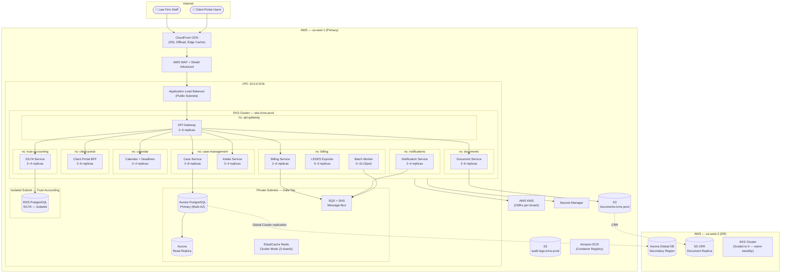
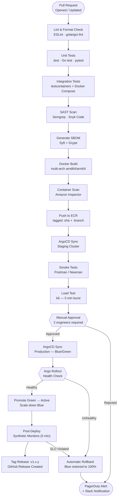

# Deployment Architecture — Legal Case Management System

## Deployment Overview

The Legal Case Management System (LCMS) runs on AWS Elastic Kubernetes Service (EKS)
with a multi-AZ active-active configuration in a primary region (`us-east-1`) and a
warm-standby deployment in a secondary region (`us-west-2`) for disaster recovery. All
workloads are containerized and managed through Helm charts, with strict namespace
isolation reinforcing attorney-client privilege data boundaries at the infrastructure
level.

Each tenant's data is logically isolated through schema-per-tenant PostgreSQL patterns,
with IOLTA trust accounting residing in a fully separate, network-isolated RDS instance.
Container images are signed with AWS Signer and stored in private Amazon ECR repositories
with automated vulnerability scanning on every push.

### Regional Topology

| Region | Role | AZs Active | Purpose |
|---|---|---|---|
| us-east-1 | Primary | 1a, 1b, 1c | Active traffic, primary data store |
| us-west-2 | DR Standby | 2a, 2b, 2c | Warm standby, Aurora Global DB secondary |

### EKS Cluster Configuration

| Parameter | Value |
|---|---|
| Kubernetes version | 1.30 (managed upgrades) |
| CNI plugin | AWS VPC CNI + Calico network policies |
| Service mesh | AWS App Mesh (mTLS between services) |
| Ingress controller | AWS Load Balancer Controller |
| Secrets management | External Secrets Operator → AWS Secrets Manager |
| Image registry | Amazon ECR (private, signed, scanned) |
| GitOps engine | ArgoCD with Argo Rollouts |
| Cluster autoscaler | Karpenter |

---

## Deployment Diagram



---

## Kubernetes Workload Inventory

| Deployment | Namespace | Min / Max Replicas | CPU Request / Limit | Memory Request / Limit | HPA Trigger |
|---|---|---|---|---|---|
| api-gateway | api-gateway | 2 / 6 | 250m / 1000m | 256Mi / 512Mi | CPU > 70% |
| case-service | case-management | 2 / 8 | 500m / 2000m | 512Mi / 1Gi | CPU > 65% |
| intake-service | case-management | 2 / 4 | 250m / 1000m | 256Mi / 512Mi | CPU > 70% |
| document-service | documents | 2 / 6 | 500m / 2000m | 512Mi / 2Gi | CPU > 60% |
| billing-service | billing | 2 / 6 | 500m / 1500m | 512Mi / 1Gi | CPU > 70% |
| ledes-exporter | billing | 1 / 3 | 250m / 1000m | 256Mi / 512Mi | Queue depth > 100 |
| batch-billing-worker | billing | 0 / 10 | 1000m / 4000m | 1Gi / 4Gi | Queue depth > 50 (Spot) |
| iolta-service | trust-accounting | 2 / 4 | 500m / 2000m | 512Mi / 1Gi | CPU > 60% |
| notification-service | notifications | 2 / 6 | 250m / 500m | 256Mi / 512Mi | Queue depth > 200 |
| calendar-service | calendar | 2 / 4 | 250m / 1000m | 256Mi / 512Mi | CPU > 70% |
| client-portal-bff | client-portal | 2 / 6 | 250m / 1000m | 256Mi / 512Mi | CPU > 65% |

### Node Group Configuration

| Node Group | Instance Type | Min / Max Nodes | Workloads | Lifecycle |
|---|---|---|---|---|
| system | m6i.large | 2 / 4 | System pods, ingress, ArgoCD | On-Demand |
| general | m6i.xlarge | 3 / 12 | All API services | On-Demand |
| memory | r6i.xlarge | 2 / 6 | Document service, billing aggregation | On-Demand |
| spot-batch | m6i.2xlarge | 0 / 10 | Batch billing, LEDES export, reports | Spot (Karpenter) |

---

## CI/CD Pipeline

All code changes flow through a GitHub Actions CI pipeline followed by ArgoCD for
GitOps-based continuous delivery. No engineer can deploy directly to production without
the pipeline — all production changes are gated on passing SAST scans and manual
approval from two engineers.



### Pipeline Stage SLAs

| Stage | Tooling | Max Duration | Failure Action |
|---|---|---|---|
| Lint & Format | ESLint, Prettier, golangci-lint | 2 min | Block PR merge |
| Unit Tests | Jest, Go test, pytest | 5 min | Block PR merge |
| Integration Tests | testcontainers | 10 min | Block PR merge |
| SAST Scan | Semgrep, Snyk Code | 5 min | Block on HIGH/CRITICAL |
| SBOM + CVE Check | Syft + Grype | 2 min | Warn; block on CRITICAL |
| Container Scan | Amazon Inspector | 3 min | Block on CRITICAL CVEs |
| Staging Deploy | ArgoCD | 5 min | Block release gate |
| Smoke Tests | Postman/Newman | 3 min | Block release gate |
| Load Test | k6 | 5 min | Warn if p95 > 500 ms |
| Production Deploy | ArgoCD Blue/Green | 10 min | Auto-rollback |

---

## Blue/Green Deployment Strategy

LCMS uses **Argo Rollouts** with a blue/green strategy to guarantee zero-downtime
releases for all production services. Law firms operate across time zones with active
court deadlines, making unplanned downtime unacceptable.

### Traffic Shift Sequence

| Step | Green Traffic | Blue Traffic | Wait Time | Auto-abort Threshold |
|---|---|---|---|---|
| Preview deployed | 0% | 100% | Health checks pass | Any pod failing readiness |
| Pre-promotion analysis | 0% | 100% | 5 min analysis window | Error rate > 0.5% |
| Shift begins | 10% | 90% | 2 min | Error rate > 1% |
| Mid-shift | 50% | 50% | 2 min | Error rate > 1% |
| Full promotion | 100% | 0% | 15 min observation | SLO violation |
| Blue decommissioned | 100% | terminated | After 15 min clean run | — |

### Rollout Manifest Snippet

```yaml
strategy:
  blueGreen:
    activeService: case-service-active
    previewService: case-service-preview
    autoPromotionEnabled: false
    scaleDownDelaySeconds: 900
    prePromotionAnalysis:
      templates:
        - templateName: success-rate-check
      args:
        - name: service-name
          value: case-service-preview
    postPromotionAnalysis:
      templates:
        - templateName: error-rate-check
        - templateName: latency-p95-check
```

### Deployment Windows

| Environment | Window | Rollback SLA | Required Approvers |
|---|---|---|---|
| Development | Any time — fully automated | N/A | CI system only |
| Staging | Any time — fully automated | N/A | CI system only |
| Production | Mon–Fri 10:00–16:00 ET | < 5 min | 2 engineers |
| Production (hotfix) | Any time | < 3 min | 1 engineer + on-call lead |
| IOLTA service only | Mon–Fri 11:00–14:00 ET | < 3 min | 2 engineers + compliance |

### Database Migration Strategy

Schema changes follow the **expand-contract pattern** to maintain compatibility during
blue/green traffic shifts:

- **Expand phase** — New columns and tables are added in a backward-compatible migration
  that runs as a Kubernetes Job before the new pods start. The current version ignores
  new columns.
- **Deploy phase** — New application version rolls out; both old and new schemas are
  functional simultaneously.
- **Contract phase** — Old columns or tables are removed in a separate PR in the
  following sprint, after all pods confirm they are running the new version.

Migrations for IOLTA are run manually within a maintenance window with bar association
compliance notification where required, and a full RDS snapshot is taken before any
migration executes against the trust accounting database.

---

## Container Image Strategy

| Concern | Implementation |
|---|---|
| Base images | Distroless (Google) or Alpine 3.20 — no shell in production |
| Image signing | AWS Signer with Notation; unsigned images rejected by OPA/Gatekeeper |
| Vulnerability scanning | Amazon Inspector on ECR push; block pipeline on CRITICAL CVEs |
| Multi-arch | `amd64` + `arm64` manifests via `docker buildx` |
| Image retention | ECR lifecycle: keep last 20 tagged per service; untagged deleted after 7 days |
| Secrets in images | Prohibited — External Secrets Operator injects at pod startup |

---

## Observability Stack

| Component | Tool | Namespace |
|---|---|---|
| Metrics collection | Prometheus + Kube State Metrics | monitoring |
| Dashboards | Grafana (managed AWS) | monitoring |
| Distributed tracing | AWS X-Ray + OpenTelemetry Collector | monitoring |
| Log aggregation | Fluent Bit → CloudWatch Logs | kube-system |
| Alerting | Alertmanager → PagerDuty + Slack | monitoring |
| Synthetic monitors | CloudWatch Synthetics (canaries) | N/A — managed |
| Uptime SLA dashboard | Grafana SLO panels (error budget burn rate) | monitoring |

Audit logs from all IOLTA and case data access are shipped to a dedicated, immutable
S3 bucket with Object Lock (WORM) enabled, satisfying bar association record-keeping
requirements.
