# Network Infrastructure — Legal Case Management System

## VPC Design Overview

The LCMS network is built on a single AWS VPC per region with strict layer separation
across three subnet tiers. Three Availability Zones provide fault tolerance for every
tier. No workload subnet has a direct route to the internet — all outbound traffic
routes through NAT Gateways, and all inbound traffic arrives exclusively through the
Application Load Balancer or, for administrative access, a hardened bastion host.

The IOLTA trust accounting service lives in an **isolated subnet** with no NAT Gateway
route, communicating only with its dedicated RDS instance and with the billing service
via AWS PrivateLink. This satisfies bar association requirements for logical segregation
of client trust funds.

### Address Plan

| Subnet Tier | CIDR (per AZ) | AZs | Route to Internet | Purpose |
|---|---|---|---|---|
| Public | 10.0.0.0/24, 10.0.1.0/24, 10.0.2.0/24 | 1a, 1b, 1c | Internet Gateway (direct) | ALB, NAT Gateways, Bastion |
| Private (App) | 10.0.16.0/20, 10.0.32.0/20, 10.0.48.0/20 | 1a, 1b, 1c | NAT Gateway | EKS nodes, ElastiCache |
| Private (Data) | 10.0.64.0/22, 10.0.68.0/22, 10.0.72.0/22 | 1a, 1b, 1c | NAT Gateway | RDS Aurora, SQS VPC Endpoints |
| Isolated (Trust) | 10.0.80.0/24, 10.0.81.0/24, 10.0.82.0/24 | 1a, 1b, 1c | None | IOLTA RDS only |

One NAT Gateway is deployed per AZ (not shared) to prevent cross-AZ NAT traffic and
eliminate single-AZ failure as a network-level risk.

---

## VPC Architecture Diagram

```mermaid
graph TB
    subgraph Internet["Internet"]
        USR(["Users / Law Firm Staff"])
        ADM(["Admin / DevOps Engineers"])
    end

    IGW["Internet Gateway"]
    CF["CloudFront\n(CDN + WAF + Shield)"]

    subgraph VPC["VPC  10.0.0.0/16  —  us-east-1"]

        subgraph PUB_A["Public Subnet — us-east-1a\n10.0.0.0/24"]
            ALB_A["ALB Node"]
            NAT_A["NAT Gateway A\nEIP"]
            BASTION["Bastion Host\n(SSM Session Manager)"]
        end
        subgraph PUB_B["Public Subnet — us-east-1b\n10.0.1.0/24"]
            ALB_B["ALB Node"]
            NAT_B["NAT Gateway B\nEIP"]
        end
        subgraph PUB_C["Public Subnet — us-east-1c\n10.0.2.0/24"]
            ALB_C["ALB Node"]
            NAT_C["NAT Gateway C\nEIP"]
        end

        subgraph APP_A["Private App Subnet — 1a\n10.0.16.0/20"]
            EKS_A["EKS Nodes\n(AZ-a)"]
        end
        subgraph APP_B["Private App Subnet — 1b\n10.0.32.0/20"]
            EKS_B["EKS Nodes\n(AZ-b)"]
        end
        subgraph APP_C["Private App Subnet — 1c\n10.0.48.0/20"]
            EKS_C["EKS Nodes\n(AZ-c)"]
        end

        subgraph DATA_A["Private Data Subnet — 1a\n10.0.64.0/22"]
            RDS_A[("Aurora Primary")]
            REDIS_A["ElastiCache\nNode"]
        end
        subgraph DATA_B["Private Data Subnet — 1b\n10.0.68.0/22"]
            RDS_B[("Aurora Reader")]
            REDIS_B["ElastiCache\nNode"]
        end
        subgraph DATA_C["Private Data Subnet — 1c\n10.0.72.0/22"]
            REDIS_C["ElastiCache\nNode"]
        end

        subgraph ISO["Isolated Subnets — 1a/1b/1c\n10.0.80-82.0/24"]
            IOLTA_RDS[("IOLTA RDS PostgreSQL\nNo NAT — fully isolated")]
        end

        subgraph ENDPOINTS["VPC Interface Endpoints (PrivateLink)"]
            EP_S3["S3 Gateway Endpoint"]
            EP_SM["Secrets Manager\nEndpoint"]
            EP_KMS["KMS Endpoint"]
            EP_ECR["ECR Endpoints\n(api + dkr)"]
            EP_CW["CloudWatch\nEndpoint"]
            EP_SQS["SQS Endpoint"]
        end
    end

    subgraph EXTERNAL["External Services via PrivateLink"]
        DATADOG["Datadog Agent\n(VPN tunnel)"]
        DOCUSIGN["DocuSign\n(Internet via NAT)"]
        COURTS["Court E-Filing APIs\n(Internet via NAT)"]
    end

    USR --> CF --> IGW --> ALB_A & ALB_B & ALB_C
    ADM -->|"SSM Session Manager\n(no SSH port open)"| BASTION
    ALB_A & ALB_B & ALB_C --> EKS_A & EKS_B & EKS_C
    EKS_A --> NAT_A --> IGW
    EKS_B --> NAT_B --> IGW
    EKS_C --> NAT_C --> IGW
    EKS_A & EKS_B & EKS_C --> RDS_A & RDS_B
    EKS_A & EKS_B & EKS_C --> REDIS_A & REDIS_B
    EKS_A & EKS_B & EKS_C -.->|"PrivateLink only"| IOLTA_RDS
    EKS_A & EKS_B & EKS_C --> EP_S3 & EP_SM & EP_KMS & EP_ECR & EP_SQS
    EKS_A --> EP_CW
    NAT_A --> COURTS & DOCUSIGN
```



---

## Security Group Matrix

| Service / Resource | Inbound Ports | Allowed Source | Purpose |
|---|---|---|---|
| ALB | 443 (HTTPS) | 0.0.0.0/0 | Public HTTPS (CloudFront only via WAF header check) |
| ALB | 80 (HTTP) | 0.0.0.0/0 | Redirect to HTTPS — no data served |
| EKS Node (API pods) | 8080 (HTTP) | ALB Security Group | Internal pod traffic from ALB |
| EKS Node (system) | 443 | EKS Control Plane SG | Kubernetes API communication |
| EKS Node | 10250 | EKS Control Plane SG | Kubelet API |
| Aurora Primary | 5432 (PostgreSQL) | EKS Node Security Group | Application database connections |
| Aurora Reader | 5432 (PostgreSQL) | EKS Node Security Group | Read-only queries |
| IOLTA RDS | 5432 (PostgreSQL) | IOLTA Service SG only | Trust accounting — strict source lock |
| ElastiCache Redis | 6379 (Redis) | EKS Node Security Group | Session cache, rate limiting |
| Bastion Host | 443 (SSM) | 0.0.0.0/0 (SSM endpoints) | Session Manager — no inbound SSH |
| VPC Endpoints | 443 (HTTPS) | EKS Node Security Group | AWS service API calls (no internet) |
| SQS Endpoint | 443 (HTTPS) | EKS Node Security Group | Message queue access |
| ECR Endpoints | 443 (HTTPS) | EKS Node Security Group | Container image pulls |

**Key principle**: No security group permits inbound `0.0.0.0/0` except the ALB on
port 443, and even that traffic is pre-filtered by CloudFront with a secret header
that the WAF verifies — ensuring direct ALB access without CloudFront is rejected.

---

## DNS and TLS Termination Strategy

### Per-Tenant Subdomain Routing

Each law firm tenant receives a dedicated subdomain:

```
{tenant-slug}.legalcms.io          → CloudFront → ALB → EKS API Gateway
portal.{tenant-slug}.legalcms.io   → CloudFront → ALB → Client Portal BFF
```

The `tenant-slug` is extracted at the API Gateway level from the `Host` header and
used to resolve the correct database schema and S3 prefix for that tenant.

### Route 53 Configuration

| Record Type | Name Pattern | Target | TTL |
|---|---|---|---|
| A (Alias) | `*.legalcms.io` | CloudFront distribution | 60s |
| A (Alias) | `api.legalcms.io` | ALB DNS name | 60s |
| CNAME | `portal.*.legalcms.io` | CloudFront distribution | 60s |
| A | `bastion.internal.legalcms.io` | Bastion private IP | 300s |
| NS / SOA | `legalcms.io` | Route 53 hosted zone | 86400s |

Route 53 health checks monitor ALB endpoints. If the primary region health check
fails for > 60 seconds, Route 53 failover routing activates the DR region endpoint.

### TLS Certificate Management

| Certificate | Issued By | Coverage | Renewal |
|---|---|---|---|
| `*.legalcms.io` | AWS ACM (us-east-1) | All tenant subdomains | Auto-renew via ACM |
| `*.legalcms.io` | AWS ACM (us-east-1, CloudFront region) | CloudFront viewer certs | Auto-renew via ACM |
| Internal service mesh | AWS Private CA | Pod-to-pod mTLS (App Mesh) | Auto-rotated 90 days |
| RDS in-transit | AWS-managed | Database connections | Auto-managed |

TLS 1.2 is the minimum enforced at CloudFront; TLS 1.3 is preferred. TLS 1.0 and
1.1 are explicitly disabled in all CloudFront security policies. The ALB origin
connection from CloudFront also enforces TLS 1.2+ on the origin-facing certificate.

Custom domains for enterprise tenants (e.g., `matters.biglaw.com`) are supported
via CloudFront alternate domain names with tenant-provided ACM certificates validated
through DNS CNAME records.

---

## Network Access Controls

### Network ACLs (NACLs)

NACLs act as a stateless second layer of defense at the subnet boundary.

| Subnet Tier | Inbound Allow | Outbound Allow | Block (Explicit) |
|---|---|---|---|
| Public | 443 (HTTPS), 80 (HTTP), ephemeral 1024–65535 | All (return traffic) | All other ports |
| Private App | Ephemeral 1024–65535 from NAT, 8080 from ALB SG, 443 from VPC endpoints | 443, 5432, 6379, 443 to VPC CIDR | Deny all inter-AZ except defined |
| Private Data | 5432, 6379 from app CIDR | Ephemeral return traffic to app CIDR | All internet-routable traffic |
| Isolated Trust | 5432 from IOLTA service CIDR only | Ephemeral return | Everything except 5432 to/from IOLTA SG |

### AWS WAF Rule Groups

| Rule Group | Purpose | Action |
|---|---|---|
| AWSManagedRulesCommonRuleSet | OWASP Top 10 baseline protection | Block |
| AWSManagedRulesSQLiRuleSet | SQL injection prevention | Block |
| AWSManagedRulesKnownBadInputsRuleSet | Log4j, Spring4Shell, SSRF | Block |
| AWSManagedRulesAmazonIpReputationList | Known malicious IPs and botnets | Block |
| RateLimit-PerIP-Login | 20 requests/5 min on `/auth/*` per IP | Block |
| RateLimit-PerTenant-API | 1000 requests/min per tenant slug | Count + Alert |
| CloudFrontSecretHeader | Reject requests missing `x-lcms-origin` header | Block |
| GeoBlock-SanctionedCountries | OFAC-sanctioned countries | Block |

### DDoS Protection

AWS Shield Advanced is enabled at the organization level, covering:

- CloudFront distributions (all tenant endpoints)
- Route 53 hosted zones
- All Application Load Balancers
- Elastic IPs on NAT Gateways

Shield Advanced provides automatic inline DDoS mitigation, layer 3/4 volumetric
attack absorption, and 24/7 access to the AWS DDoS Response Team (DRT). The SRT
has pre-approved access to WAF rules to add emergency mitigations during active
attacks without requiring an engineer on-call to be woken.

---

## Privileged Access Management

### Bastion Host Design

The bastion host does **not** expose SSH port 22. All administrative access uses
AWS Systems Manager Session Manager, which:

- Routes through SSM endpoints (no inbound firewall rules required)
- Logs all session activity to CloudWatch Logs and S3
- Requires IAM authentication + MFA
- Supports session duration limits (max 1 hour per session)

### Access Tiers

| Role | Access Method | Permitted Targets | MFA Required |
|---|---|---|---|
| Developer | SSM Session Manager → Bastion → kubectl | EKS read-only (staging only) | Yes |
| SRE / Platform | SSM + AWS Console | EKS, RDS (no prod data), CloudWatch | Yes |
| DBA | SSM Session Manager → Bastion → psql | RDS read replicas (prod), primary (break-glass) | Yes + approval ticket |
| IOLTA DBA | SSM → dedicated IOLTA bastion | IOLTA RDS only | Yes + compliance officer co-sign |
| Security | Read-only AWS Console + CloudTrail | All audit logs, Config, GuardDuty | Yes |

Production database credentials are never stored in human-readable form. Engineers
use `aws secretsmanager get-secret-value` with time-limited IAM role assumption, and
all calls are logged in CloudTrail. Direct IAM keys for production are prohibited;
all production access uses IAM roles with session tokens.

---

## SOC 2 and Compliance Network Controls

### SOC 2 Type II — Relevant Network Controls

| Control | Implementation | Evidence |
|---|---|---|
| CC6.1 — Logical access controls | IAM roles, SGs, NACLs, WAF | AWS Config rules, CloudTrail logs |
| CC6.6 — Network traffic restrictions | SGs deny-by-default, NACLs, WAF | VPC Flow Logs, WAF logs |
| CC6.7 — Encryption in transit | TLS 1.2+ everywhere, mTLS for service mesh | ACM certificates, App Mesh config |
| CC7.2 — Anomaly detection | GuardDuty, VPC Flow Logs, CloudTrail → SIEM | GuardDuty findings, alert history |
| A1.2 — Availability | Multi-AZ ALB, Multi-AZ RDS, NAT per AZ | RDS failover tests, LB health logs |
| CC8.1 — Change management | GitHub Actions pipeline, ArgoCD GitOps, manual approval gates | Pipeline logs, ArgoCD sync history |
| PI1.5 — Processing integrity | WAF input validation, API schema validation (OpenAPI) | WAF logs, API Gateway access logs |

### Data Residency

- All primary data stored in `us-east-1` by default.
- Tenants who require `us-west-2` residency (California-barred firms) can be onboarded
  to the DR cluster as their primary, with `us-east-1` as their DR.
- No data transits outside the United States. CloudFront edge caches serve only static
  assets and non-privileged API responses; all privileged legal data responses are
  marked `Cache-Control: no-store, private` and never cached at edge nodes.
- Cross-region replication for S3 (document storage) is encrypted with the same
  tenant-specific KMS CMK replicated to the secondary region.

### VPC Flow Logs

VPC Flow Logs are enabled at the VPC level and captured to a dedicated CloudWatch
Log Group with a 90-day retention policy. Logs are exported to the immutable S3
audit bucket (`audit-logs-lcms-prod`) with S3 Object Lock (WORM, 7-year retention)
for legal hold compliance. Flow log analysis is automated via Athena queries that
alert on unexpected inter-subnet traffic patterns.

---

## Inter-Service Communication Security

All pod-to-pod communication inside the EKS cluster travels through AWS App Mesh
with mutual TLS enforced. Each service's Envoy sidecar presents a certificate issued
by AWS Private CA. The mesh policy explicitly denies direct pod-to-pod connections that
bypass the sidecar proxy, enforced by a Calico `GlobalNetworkPolicy` that blocks
inter-pod TCP unless traffic passes through port 15001 (Envoy listener).

| Service Pair | Protocol | Auth Method | Encrypted |
|---|---|---|---|
| API Gateway → Case Service | HTTP/2 (gRPC) | mTLS via App Mesh | Yes — Private CA cert |
| API Gateway → IOLTA Service | HTTP/2 (gRPC) | mTLS + `X-IOLTA-Auth` HMAC header | Yes |
| Billing Service → SQS | HTTPS | IAM role (IRSA) | Yes — TLS 1.2+ |
| Document Service → S3 | HTTPS | IAM role (IRSA) | Yes — TLS 1.2+ |
| EKS → Secrets Manager | HTTPS (VPC Endpoint) | IAM role (IRSA) | Yes — private network |
| EKS → RDS | PostgreSQL TLS | IAM authentication + password | Yes — RDS TLS enforced |

IRSA (IAM Roles for Service Accounts) ensures each Kubernetes service account maps
to a least-privilege IAM role. No service can assume another service's IAM role.
AWS STS `AssumeRoleWithWebIdentity` tokens are short-lived (1 hour) and automatically
rotated by the EKS OIDC provider integration.
