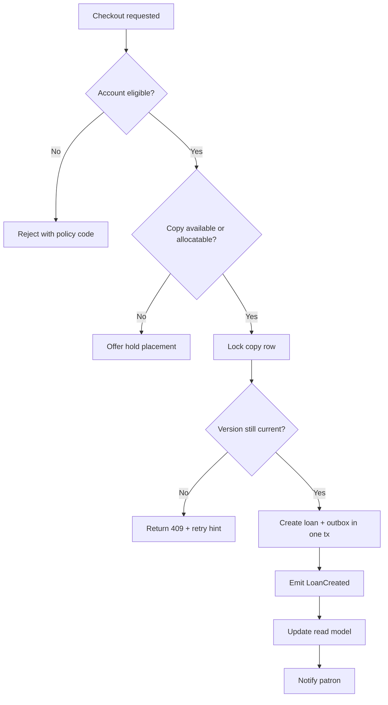

# Activity Diagram - Library Management System

## Borrow-to-Return Lifecycle

```mermaid
flowchart TD
    start([Patron needs item]) --> search[Search catalog]
    search --> available{Item available?}
    available -- Yes --> checkout[Issue item to patron]
    available -- No --> hold[Place hold / join waitlist]
    hold --> wait[Wait for return or transfer]
    wait --> notify[Notify patron when ready]
    notify --> pickup[Patron collects item]
    pickup --> checkout
    checkout --> due[Loan active until due date]
    due --> renewable{Renewal allowed?}
    renewable -- Yes --> renew[Renew loan]
    renew --> due
    renewable -- No --> return[Return item]
    due --> overdue{Overdue?}
    overdue -- Yes --> fine[Assess overdue fine or block]
    fine --> return
    overdue -- No --> return
    return --> nextHold{Pending hold queue?}
    nextHold -- Yes --> holdShelf[Move to hold shelf or transfer branch]
    nextHold -- No --> shelf[Reshelve item]
    holdShelf --> end([Availability updated])
    shelf --> end
```

## Borrowing & Reservation Lifecycle, Consistency, Penalties, and Exception Patterns

### Artifact focus: Executable activity rules

This section is intentionally tailored for this specific document so implementation teams can convert architecture and analysis into build-ready tasks.

### Implementation directives for this artifact
- Annotate each activity decision with explicit policy predicates so BPMN/activity transitions can be directly coded as guards.
- Specify compensation branches for every external dependency call (payment, messaging, identity).
- Include timeout and retry transitions to avoid hidden dead ends in orchestration.

### Lifecycle controls that must be reflected here
- Borrowing must always enforce policy pre-checks, deterministic copy selection, and atomic loan/copy updates.
- Reservation behavior must define queue ordering, allocation eligibility re-checks, and pickup expiry/no-show outcomes.
- Fine and penalty flows must define accrual formula, cap behavior, and lost/damage adjudication paths.
- Exception handling must define idempotency, conflict semantics, outbox reliability, and operator recovery procedures.

### Traceability requirements
- Every major rule in this document should map to at least one API contract, domain event, or database constraint.
- Include policy decision codes and audit expectations wherever staff override or monetary adjustment is possible.

### Mermaid implementation reference


### Definition of done for this artifact
- Content is specific to this artifact type and not a generic duplicate.
- Rules are testable (unit/integration/contract) and reference concrete data/events/errors.
- Diagram semantics (if present) are consistent with textual constraints and lifecycle behavior.
