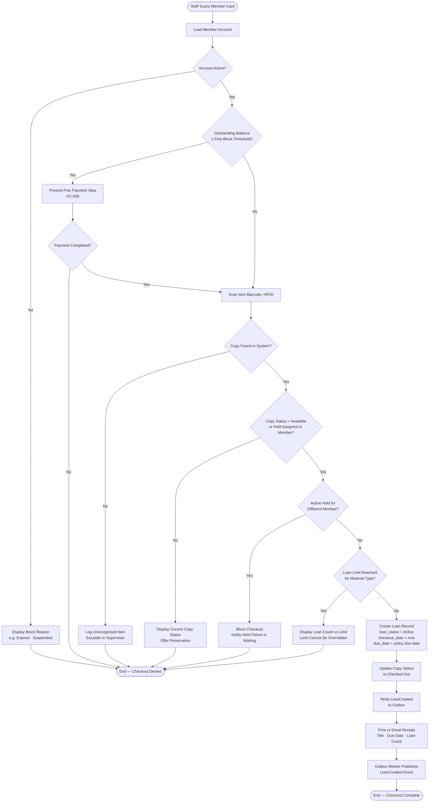
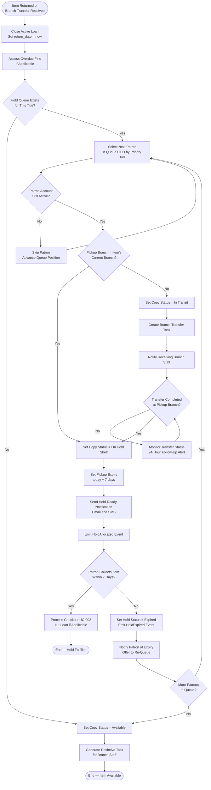

# Activity Diagrams — Library Management System

## Overview

This document presents activity diagrams for three key operational workflows within the Library Management System. Each diagram models the control flow, decision points, and concurrent activities involved in the workflow, enabling development teams to implement guards, compensation branches, and state transitions accurately.

| Workflow | Description |
|----------|-------------|
| **WF-01** | Book Checkout Process |
| **WF-02** | Reservation Fulfillment |
| **WF-03** | Fine Assessment and Payment |

---

## WF-01: Book Checkout Process

### Description

The book checkout workflow begins when a staff member or self-checkout kiosk scans a member card and ends when a loan receipt is issued and the `LoanCreated` event is published. This workflow enforces account-eligibility checks, fine-block enforcement, item-availability validation, and loan-limit guards before committing any state change.

All state mutations — loan record creation and copy status update — are performed atomically in a single database transaction. The `LoanCreated` domain event is published via the outbox pattern after the transaction commits.

### Diagram

### Key Decision Guards

| Decision | Guard Condition | Outcome on Failure |
|----------|-----------------|--------------------|
| Account Active? | `member.status = Active AND expiry_date > today` | Block reason displayed; checkout denied |
| Fine-block threshold | `member.fine_balance >= policy.fine_block_threshold` | Fine payment required before proceeding |
| Copy available? | `copy.status IN (Available, OnHoldShelf) AND (copy.hold_member = null OR copy.hold_member = current_member)` | Offer reservation |
| Loan limit | `member.active_loans[material_type] < policy.loan_limit[borrower_category][material_type]` | Limit message displayed; cannot override |

### Domain Events Published

| Event | Trigger Point |
|-------|--------------|
| `LoanCreated` | After atomic commit of loan record and copy status update |
| `FinePaymentReceived` | If fine payment occurs during checkout (delegated to UC-006) |

---

## WF-02: Reservation Fulfillment

### Description

The reservation fulfillment workflow is triggered whenever an item is returned (WF-01 check-in) or transferred into a branch. The system determines whether a hold queue exists for the title and, if so, allocates the copy to the first eligible patron. The hold patron is notified and given a 7-day pickup window. If the hold is not collected within that window, the system advances to the next patron in the queue until the queue is exhausted, at which point the copy returns to the available shelf.

### Diagram

### Hold Queue Allocation Rules

| Rule | Detail |
|------|--------|
| **Queue ordering** | FIFO within priority tier. Priority tiers: Staff > Adult > Senior > Junior (configurable). |
| **Account re-check** | Each patron's account is validated at allocation time; inactive accounts are skipped. |
| **Branch transfer** | If the pickup branch differs from the item's current branch, a transfer task is created. No hold notification is sent until the item arrives at the pickup branch. |
| **Pickup window** | Default 7 calendar days from the hold-ready notification. Configurable per branch by System Admin. |
| **Queue exhaustion** | If all patrons in the queue expire without collecting, the copy is set to Available and a reshelve task is generated. |

### Domain Events Published

| Event | Trigger |
|-------|---------|
| `HoldAllocated` | When a hold is successfully assigned to a copy |
| `HoldExpired` | When a patron's pickup window closes without collection |
| `LoanCreated` | When the hold patron checks out the item (from WF-01) |

---

## WF-03: Fine Assessment and Payment

### Description

The fine assessment and payment workflow has two phases. **Phase A** — Assessment — occurs automatically during item return (WF-01 step 3) and during the nightly overdue-notice job (UC-011). **Phase B** — Payment — is initiated by the member or Librarian and delegates card payments to Stripe. A borrowing block is applied when the member's cumulative fine balance meets or exceeds the configured threshold, and cleared when payment brings the balance below that threshold.

### Diagram

```mermaid
flowchart TD
    A([Item Return or\nNightly Overdue Job]) --> B[Calculate Overdue Days\noverdue_days = max0, return_date − due_date]
    B --> C{overdue_days > 0?}
    C -- No --> D([End — No Fine Assessed])
    C -- Yes --> E[Compute Gross Fine\nfine_amount = overdue_days × daily_rate material_type]
    E --> F{fine_amount > Fine Cap\nfor Material Type?}
    F -- Yes --> G[Set fine_amount = Fine Cap]
    F -- No --> H[Record Fine on Member Account\nfine_status = Unpaid]
    G --> H
    H --> I[Emit FineAssessed Event]
    I --> J[Recalculate Member\nOutstanding Balance]
    J --> K{balance >= BorrowingBlock\nThreshold?}
    K -- Yes --> L[Apply Borrowing Block\nblock_reason = UnpaidFines]
    K -- No --> M[No Block Change]
    L --> N([Phase A Complete])
    M --> N
    N -.->|Member or Librarian\ninitates payment| O

    O([Payment Initiated]) --> P[Display Fine Breakdown\nto Member or Staff]
    P --> Q[Member Selects Fines to Pay\nFull or Partial]
    Q --> R{Payment Method}
    R -- Card via Stripe --> S[Create Stripe PaymentIntent\nServer-Side]
    S --> T[Member Completes Card Entry\nStripe Elements Client-Side]
    T --> U{Stripe Webhook\npayment_intent.succeeded?}
    U -- No / Declined --> V[Display Decline Code\nUser-Friendly Message]
    V --> W([End — Fine Remains Unpaid])
    U -- Yes --> X[Mark Selected Fines\nas Paid with Stripe Charge ID]
    R -- Cash at Desk --> Y[Librarian Records\nCash Amount Received]
    Y --> X
    X --> Z[Recalculate Outstanding Balance]
    Z --> AA{balance < Borrowing\nBlock Threshold?}
    AA -- Yes --> AB[Clear Borrowing Block\nEmit BorrowingBlockCleared]
    AA -- No --> AC[Block Remains Active]
    AB --> AD[Email Payment Receipt\nto Member]
    AC --> AD
    AD --> AE[Emit FinePaymentReceived]
    AE --> AF([End — Payment Complete])
```

### Fine Rates and Caps (Reference Values — Overridden by System Admin Policy)

| Material Type | Daily Rate | Fine Cap per Loan |
|---------------|-----------|------------------|
| Standard book | $0.25 | $10.00 |
| DVD / Blu-ray | $1.00 | $25.00 |
| Periodical | $0.10 | $5.00 |
| Equipment / Device | $2.00 | $50.00 |
| ILL item | $0.50 | $15.00 |

> All values are configurable per material type via System Admin → Configure System Policies (UC-012). The values above are system defaults applied on first deployment.

### Domain Events Published

| Event | Trigger |
|-------|---------|
| `FineAssessed` | When a non-zero fine is calculated and recorded on the member account |
| `FinePaymentReceived` | When a card or cash payment is successfully processed |
| `FineWaived` | When a Librarian waives a fine with a reason code |
| `BorrowingBlockCleared` | When the member's balance falls below the configured block threshold after payment or waiver |
