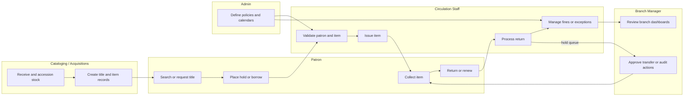

# BPMN Swimlane Diagram - Library Management System

## Swimlane Interpretation

- Patron-facing actions stay lightweight while staff workflows handle policy, exceptions, and operations.
- Cataloging and acquisitions supply circulation with accurate, branch-aware inventory.
- Administrative policy changes affect every circulation validation path.
