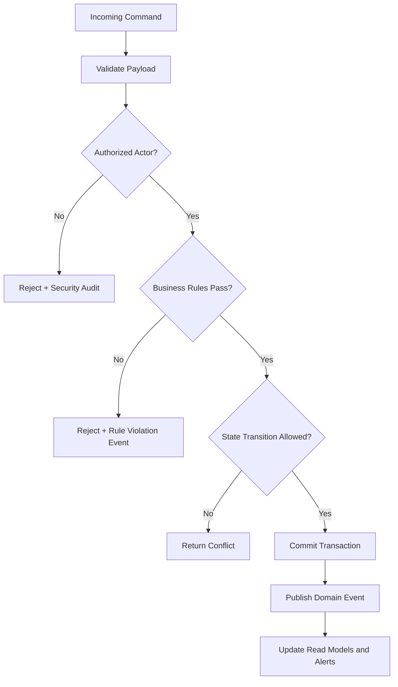

# Business Rules

This document defines enforceable policy rules for **Library Management System** so command processing, asynchronous jobs, and operational actions behave consistently under normal and exceptional conditions.

## Context
- Domain focus: library management workflows.
- Rule categories: lifecycle transitions, authorization, compliance, and resilience.
- Enforcement points: APIs, workflow/state engines, background processors, and administrative consoles.

## Enforceable Rules
1. Every state-changing command must pass authentication, authorization, and schema validation before processing.
2. Lifecycle transitions must follow the configured state graph; invalid transitions are rejected with explicit reason codes.
3. High-impact operations (financial, security, or regulated data actions) require additional approval evidence.
4. Manual overrides must include approver identity, rationale, and expiration timestamp.
5. Retries and compensations must be idempotent and must not create duplicate business effects.

## Rule Evaluation Pipeline

## Exception and Override Handling
- Overrides are restricted to approved exception classes and require dual logging (business + security audit).
- Override windows automatically expire and trigger follow-up verification tasks.
- Repeated override patterns are reviewed for policy redesign and automation improvements.

## Borrowing & Reservation Lifecycle, Consistency, Penalties, and Exception Patterns

### Artifact focus: Normative business rule set

This section is intentionally tailored for this specific document so implementation teams can convert architecture and analysis into build-ready tasks.

### Implementation directives for this artifact
- Convert each rule into `Given/When/Then` acceptance criteria and map each to an owning policy table/flag.
- Define precedence order when rules conflict (e.g., recall rule overrides renewal allowance).
- Document rule change governance with effective dates and migration behavior for existing loans.

### Lifecycle controls that must be reflected here
- Borrowing must always enforce policy pre-checks, deterministic copy selection, and atomic loan/copy updates.
- Reservation behavior must define queue ordering, allocation eligibility re-checks, and pickup expiry/no-show outcomes.
- Fine and penalty flows must define accrual formula, cap behavior, and lost/damage adjudication paths.
- Exception handling must define idempotency, conflict semantics, outbox reliability, and operator recovery procedures.

### Traceability requirements
- Every major rule in this document should map to at least one API contract, domain event, or database constraint.
- Include policy decision codes and audit expectations wherever staff override or monetary adjustment is possible.

### Definition of done for this artifact
- Content is specific to this artifact type and not a generic duplicate.
- Rules are testable (unit/integration/contract) and reference concrete data/events/errors.
- Diagram semantics (if present) are consistent with textual constraints and lifecycle behavior.
