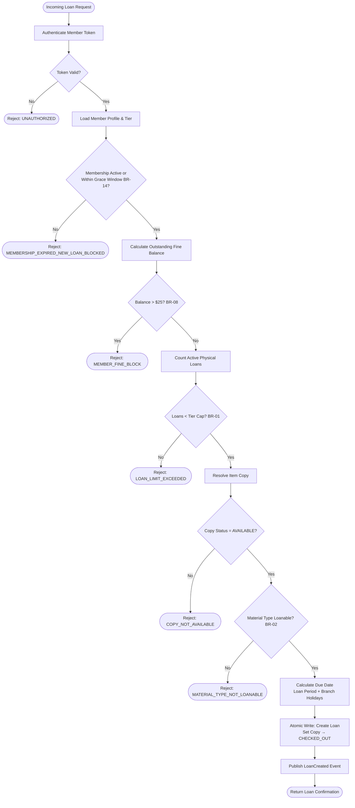

# Business Rules — Library Management System

This document defines all normative, enforceable policy rules for the Library Management System. Every rule maps directly to at least one API pre-condition check, domain event, database constraint, or background-job assertion. Rules are versioned alongside the policy table in the database; changes require an effective date and a migration note for loans and reservations already in flight.

---

## Context

| Attribute | Value |
|---|---|
| Domain | Library management — circulation, catalog, acquisitions, digital lending, ILL |
| Rule categories | Borrowing limits, loan periods, fines, reservations, digital access, acquisitions, membership, catalog integrity |
| Enforcement points | REST API pre-condition guards, domain service policy checks, nightly batch jobs, event consumers |
| Override authority | Librarian (minor), Branch Manager (standard), System Administrator (all) |
| Audit retention | All rule evaluations producing an override or exception are retained for 7 years |

---

## Enforceable Rules

### Summary Table

| Rule ID | Category | Short Description | Enforcement Point |
|---|---|---|---|
| BR-01 | Borrowing Limits | Concurrent loan cap by membership tier | `POST /loans` pre-condition |
| BR-02 | Loan Periods | Loan duration by material type | Loan creation + renewal date calculation |
| BR-03 | Renewals | Maximum renewal count per loan | `POST /loans/{id}/renew` guard |
| BR-04 | Fines | Accrual rate and cap by material type | Nightly batch + return processing |
| BR-05 | Reservations | Hold shelf expiry period | Nightly batch + notification job |
| BR-06 | Digital Lending | Simultaneous DRM token cap per member | `POST /digital-loans` pre-condition |
| BR-07 | Acquisitions | Purchase order approval threshold | `POST /purchase-orders` workflow gate |
| BR-08 | Member Account | Borrowing block on outstanding fine balance | `POST /loans` pre-condition |
| BR-09 | Circulation | Overdue item recall when reservation exists | Nightly recall job + notification |
| BR-10 | Digital Lending | Digital loan availability window and auto-return | DRM token TTL + expiry job |
| BR-11 | ILL | Inter-library loan membership eligibility | `POST /ill-requests` pre-condition |
| BR-12 | Lost Items | Lost declaration and replacement billing threshold | Nightly overdue escalation job |
| BR-13 | Fines | Grace period by material type | Fine accrual calculation |
| BR-14 | Membership | Expiry grace window for existing loans | Loan validation on renewal |
| BR-15 | Catalog | ISBN uniqueness and duplicate merge trigger | `POST /catalog/items` + import pipeline |

---

### Detailed Rule Specifications

**BR-01**: **Concurrent Loan Cap by Membership Tier**

A member's total number of active physical loans (status = `ACTIVE` or `OVERDUE`) must not exceed the cap defined by their current membership tier at the time of checkout.

| Tier | Concurrent Loan Cap |
|---|---|
| Basic | 3 |
| Standard | 7 |
| Premium | 15 |
| Scholar | Unlimited |

- The cap is evaluated against the member's active loan count across all branches.
- Digital loans (BR-06) are counted separately and do not consume this cap.
- Downgrade of membership tier takes effect at the next checkout; existing loans above the new cap are not recalled.
- Policy code: `LOAN_LIMIT_EXCEEDED` — returned in `errors[].code` on rejection.

---

**BR-02**: **Loan Period by Material Type**

The due date for a new loan is calculated from the checkout timestamp using the period defined for the item's material type.

| Material Type | Loan Period | Notes |
|---|---|---|
| Book | 21 days | Applies to monographs, graphic novels, and audio books on physical media |
| DVD / Blu-ray | 7 days | Applies to all video media regardless of rating |
| Periodical | 3 days | Magazines, journals, and newspapers |
| Reference | In-library only | Cannot be checked out; no loan record created |
| Reserve / High-Demand | 3 days | Items flagged `HIGH_DEMAND` by cataloging staff |

- Material type is read from the `catalog_item.material_type` field at checkout and is immutable on the loan record.
- Loan period is extended by the number of days the branch was officially closed during the loan window (public-holiday calendar per branch).
- Policy code: `MATERIAL_TYPE_NOT_LOANABLE` for Reference items.

---

**BR-03**: **Renewal Limits**

A loan may be renewed a maximum of two (2) times. A third renewal attempt is rejected.

- If one or more **active reservations** exist for any copy of the same bibliographic record at the member's preferred branch, no renewals are permitted regardless of the renewal count.
- Each renewal resets the due date by one full loan period (BR-02) from the renewal date, not from the original due date.
- A renewal is not permitted if the loan is in `LOST` or `RECALLED` status.
- Renewals may be initiated via the member portal, circulation counter, self-service kiosk, or the `/loans/{id}/renew` API.
- Policy codes: `MAX_RENEWALS_REACHED`, `RENEWAL_BLOCKED_BY_RESERVATION`.

---

**BR-04**: **Fine Accrual Rate and Cap**

Fines accrue per calendar day from the due date (subject to the grace period in BR-13) until the item is returned or declared lost.

| Material Type | Rate per Day | Maximum Fine Cap |
|---|---|---|
| Book | \$0.25 | 3× replacement cost |
| DVD / Blu-ray | \$1.00 | 3× replacement cost |
| Periodical | \$0.10 | 3× replacement cost |
| Reserve / High-Demand | \$0.50 | 3× replacement cost |

- **Replacement cost** is the value stored in `catalog_copy.replacement_cost` at the time the item is declared lost or the cap is first reached, not the current catalogue value.
- Fine accrual stops automatically when the running total reaches the cap. The `fine.capped` flag is set to `true` and a `FineCapped` event is published.
- Fines are stored in the `fines` table, linked to the loan record. Multiple fine rows may exist per loan (e.g., one for overdue accrual, one for damage assessment).
- Policy code: `FINE_CAP_REACHED`.

---

**BR-05**: **Reservation Hold Shelf Expiry**

When a reserved copy arrives at the member's selected pickup branch, the branch notifies the member (email + SMS + push per their preferences) and places the copy on the hold shelf.

- The member has **7 calendar days** from the notification timestamp to collect the item.
- If the item is not collected within 7 days, the reservation is auto-cancelled, the copy is returned to available inventory, and the next patron in the waitlist queue is notified.
- The member who failed to collect receives a `HoldExpiredNotification`; they are permitted to re-join the waitlist at the back of the queue.
- No fine is applied for a failed hold pickup.
- Policy code: `HOLD_EXPIRED`.

---

**BR-06**: **Simultaneous Digital Loan Cap**

A member may hold a maximum of **3 active digital loans** at any time across all digital formats (EPUB, PDF, audiobook streaming token).

- The cap is enforced by counting rows in `digital_loans` where `member_id = :memberId` and `status IN ('ACTIVE', 'PENDING_RETURN')`.
- Membership tier does not raise the digital cap (all tiers share the cap of 3).
- Early return of a digital title releases the DRM token within 60 seconds and decrements the active count, immediately allowing a new digital loan.
- Policy code: `DIGITAL_LOAN_LIMIT_EXCEEDED`.

---

**BR-07**: **Acquisition Purchase Order Approval Threshold**

Purchase orders created in the acquisitions module are subject to a mandatory approval workflow based on order value.

| Order Total | Approval Required |
|---|---|
| ≤ \$500 | None — auto-approved and submitted to vendor |
| \$501 – \$2,000 | Acquisitions Manager approval |
| \$2,001 – \$10,000 | Branch Manager approval |
| > \$10,000 | System Administrator approval |

- Order total is the sum of all line items including applicable tax and shipping at the time of submission.
- Multi-step orders (e.g., blanket orders) use the **estimated annual commitment** for threshold evaluation.
- Approved orders generate a `PurchaseOrderApproved` event and are forwarded to the vendor EDI integration.
- Rejected orders generate a `PurchaseOrderRejected` event with a mandatory rejection reason code.
- Policy code: `PO_APPROVAL_REQUIRED`.

---

**BR-08**: **Borrowing Block on Outstanding Fine Balance**

A member is blocked from initiating new checkouts or placing new holds if their total outstanding fine balance exceeds **\$25.00**.

- The block is evaluated in real time at checkout and hold placement using the `member.outstanding_balance` field, which is updated synchronously on fine payment and asynchronously on fine accrual.
- The block is **automatically lifted** as soon as the balance falls to or below \$25.00 following a payment, waiver, or fine correction.
- Existing active loans are not affected by the block; returns and renewals (within renewal limits) are still permitted.
- Staff may issue a **temporary unblock** valid for one checkout, subject to supervisor co-authentication and a mandatory audit entry (see Exception Handling section).
- Policy code: `MEMBER_FINE_BLOCK`.

---

**BR-09**: **Overdue Item Recall for Reserved Items**

If a member's active loan is overdue **and** one or more reservations exist for any copy of the same title at any branch, the system issues a formal recall notice.

- Recall notices are sent via all of the member's active notification channels on the day the recall is triggered.
- Upon recall, the loan's `due_date` is immediately reset to **today + 3 days** (regardless of original due date), and the loan status transitions to `RECALLED`.
- If the item is not returned within the recall period, the fine rate for High-Demand items (BR-04) is applied retroactively from the original due date.
- Recall overrides the renewal block-by-reservation logic (BR-03); a recalled item cannot be renewed.
- Policy code: `ITEM_RECALLED`.

---

**BR-10**: **Digital Lending Availability Window and Auto-Return**

Digital loans have a fixed availability window of **14 calendar days** from the loan creation timestamp.

- At the end of 14 days, the DRM token is automatically revoked by calling the DRM provider's token revocation API. The `digital_loan.status` transitions to `RETURNED` and a `DigitalLoanAutoReturned` event is published.
- The member is notified 3 days before expiry and again 1 day before expiry.
- Digital loans **cannot be renewed**; the member must initiate a new loan if the title is still available and they are within the digital loan cap (BR-06).
- If the DRM provider is unavailable at the scheduled auto-return time, the system retries every 15 minutes for up to 24 hours. After 24 hours, the loan is marked `RETURN_FAILED` and a `DRMProviderDown` system exception is raised.
- Policy code: `DIGITAL_LOAN_EXPIRED`.

---

**BR-11**: **Inter-Library Loan Eligibility**

Inter-library loan requests may only be submitted by members with an **active Premium or Scholar** membership tier.

- Each ILL request incurs a non-refundable processing fee of **\$3.00**, charged to the member's account at the time of request submission. Members with a fine block (BR-08) may not submit ILL requests.
- ILL items are governed by the lending library's loan period and renewal policies, which may differ from local rules. The local system stores the lender-specified due date and enforces it.
- ILL items are subject to local fine rules if returned late based on the lender-specified due date.
- Policy code: `ILL_MEMBERSHIP_INSUFFICIENT`.

---

**BR-12**: **Lost Item Declaration and Replacement Billing**

If a physical loan remains in `OVERDUE` status for **45 consecutive calendar days** beyond the due date, the system automatically transitions the loan to `LOST` status.

- A `LostItemDeclared` event is published. The member is notified and billed the item's replacement cost (stored in `catalog_copy.replacement_cost`).
- If the fine balance from BR-04 already exceeds the replacement cost, no additional replacement charge is added; the balance is adjusted to the replacement cost.
- If the member subsequently returns the item within **90 days** of the lost declaration, the replacement charge is reversed and the standard overdue fine applies instead. After 90 days, the item is deaccessioned and the replacement charge is permanent.
- Policy code: `ITEM_DECLARED_LOST`.

---

**BR-13**: **Fine Grace Period by Material Type**

A grace period is applied before fine accrual begins after the due date.

| Material Type | Grace Period |
|---|---|
| Book | 1 calendar day |
| DVD / Blu-ray | None (0 days) |
| Periodical | None (0 days) |
| Reserve / High-Demand | None (0 days) |
| Recalled item (BR-09) | None (0 days) |

- Grace period is evaluated once: if the item is returned within the grace window, no fine is created. If it is not returned by end of the grace period, fine accrual starts from the **original due date**, not from the end of the grace period.
- Policy code: `FINE_WITHIN_GRACE_PERIOD` (informational, no fine row created).

---

**BR-14**: **Membership Expiry — Grace Window for Existing Loans**

When a membership expires, the member's account enters a **30-day post-expiry grace window**.

- During the grace window: existing active loans may be renewed (subject to BR-03), existing reservations remain in queue, and the member may pay outstanding fines.
- During the grace window: **new checkouts are blocked** and new reservations may not be placed.
- After 30 days post-expiry without renewal, all queued reservations are auto-cancelled and a `MembershipLapsed` event is published.
- If the member renews their membership during the grace window, all restrictions are lifted immediately.
- Policy code: `MEMBERSHIP_EXPIRED_NEW_LOAN_BLOCKED`, `MEMBERSHIP_LAPSED`.

---

**BR-15**: **Catalog ISBN Uniqueness and Duplicate Merge Workflow**

The `catalog_record.isbn` field is subject to a unique constraint scoped to the ISBN-13 normalised form. A duplicate ISBN detected during manual entry or bulk import triggers the merge workflow.

- During bulk import (MARC / CSV), rows with an ISBN already present in the catalogue are flagged as `DUPLICATE` in the import result manifest rather than creating a new record.
- A cataloging staff member reviews the flagged row and either: (a) confirms it as a variant edition and assigns a new bibliographic record, (b) merges the incoming metadata into the existing record, or (c) discards the incoming row.
- The merge workflow preserves all `catalog_copy` records from both records and reassigns them to the surviving `catalog_record.id`.
- A `CatalogRecordMerged` event is published containing both the surviving and deprecated record IDs for downstream read-model reconciliation.
- Policy code: `DUPLICATE_ISBN_DETECTED`.

---

## Rule Evaluation Pipeline

The following diagram shows the complete rule evaluation sequence executed by the Circulation Service when processing a physical loan request.



---

## Exception and Override Handling

### Staff Override Requirements

Staff members may override specific rule rejections when operationally justified. All overrides are subject to the following constraints without exception.

| Constraint | Requirement |
|---|---|
| Authorisation level | Librarian may override BR-08 (fine block, single-item scope only). Branch Manager may override BR-01, BR-03, BR-08, BR-14. System Administrator may override any rule. |
| Co-authentication | Overrides for BR-08 and BR-01 require a second authenticated staff member to confirm via the override API (`POST /overrides`). |
| Reason code | A mandatory reason code from the `override_reason` enumeration must be supplied (e.g., `PATRON_HARDSHIP`, `SYSTEM_ERROR_CORRECTION`, `POLICY_EXCEPTION`). |
| Free-text justification | A minimum 20-character free-text justification must accompany each override. |
| Time limit | Overrides are scoped to a single transaction. They do not persist as standing exceptions unless explicitly configured by a System Administrator. |
| Expiration | Temporary account-level overrides (e.g., post-expiry new loan) expire after 24 hours or at the end of the business day, whichever comes first. |

### System Exception Classes

The following exception classes are raised by the rule evaluation pipeline and must be handled by all API consumers and event processors.

| Exception Class | Trigger Condition | Consumer Action |
|---|---|---|
| `LoanPolicyException` | Any BR-01 through BR-03 / BR-08 / BR-14 rejection | Return HTTP 422 with `errors[].code` and human-readable message |
| `FinePolicyException` | BR-04, BR-13 evaluation failures or cap-reached edge cases | Log + publish `FineCapReached` event; suppress further accrual |
| `DRMProviderDown` | DRM token issuance or revocation API returns 5xx or times out | Retry with exponential backoff (max 24 h); alert ops team; set loan to `RETURN_FAILED` |
| `NetworkTimeout` | Any external API call (DRM, ILL gateway, vendor EDI) exceeds 10 s | Retry up to 3 times with 2 s / 4 s / 8 s delays; escalate to dead-letter queue |
| `PolicyConflict` | Two or more rules produce contradictory outcomes for the same request (e.g., recall + grace period overlap) | Apply the **stricter** rule; log a `PolicyConflictDetected` warning event with both rule IDs |
| `CatalogIntegrityException` | BR-15 duplicate ISBN detected during API entry or import | Block record creation; return `DUPLICATE_ISBN_DETECTED`; route to merge workflow |

### Audit Trail Requirements

Every policy decision that results in a rejection, override, or exception must produce an immutable audit record conforming to the following schema.

```
audit_log {
  id:               UUID (v7, time-ordered)
  timestamp:        ISO-8601 UTC
  actor_id:         UUID of authenticated staff member or system job
  member_id:        UUID of affected member (nullable for catalog operations)
  rule_id:          e.g., "BR-08"
  decision:         ENUM { APPROVED, REJECTED, OVERRIDDEN, EXCEPTION }
  policy_code:      e.g., "MEMBER_FINE_BLOCK"
  override_reason:  ENUM (required when decision = OVERRIDDEN)
  justification:    TEXT (required when decision = OVERRIDDEN)
  co_auth_actor_id: UUID (required for co-authenticated overrides)
  request_payload:  JSONB (sanitised — no PII beyond member_id)
  source_service:   e.g., "circulation-service"
  correlation_id:   UUID (traces the originating HTTP request or job run)
}
```

- Audit records are **append-only**; no update or delete operations are permitted on the `audit_log` table.
- Records are retained for a minimum of **7 years** in compliance with library service financial record-keeping obligations.
- Audit data is replicated to the organisation's immutable audit data store (separate from the operational database) within 5 minutes of creation via the outbox pattern.
- Monthly automated reports flag any override volume anomalies to the System Administrator for policy review.


## Rule Quick Reference

1. Members may borrow up to their tier limit concurrently; additional loans rejected until returns are processed.
2. Loan periods vary by material type (7d physical, 14d standard, 21d digital); overdue items accrue fines daily.
3. Renewals are capped per loan; denied if item is on another member's hold queue.
4. Fines must be cleared before new loans are permitted; balances above threshold block all borrowing.
5. Holds expire after shelf period; member is notified and next hold in queue is activated.
6. Digital lending slots are DRM-controlled; simultaneous download cap enforced per membership tier.
7. Purchase orders above threshold require senior librarian approval before supplier submission.
8. Accounts with outstanding fines exceeding the block threshold are suspended from new loans automatically.
