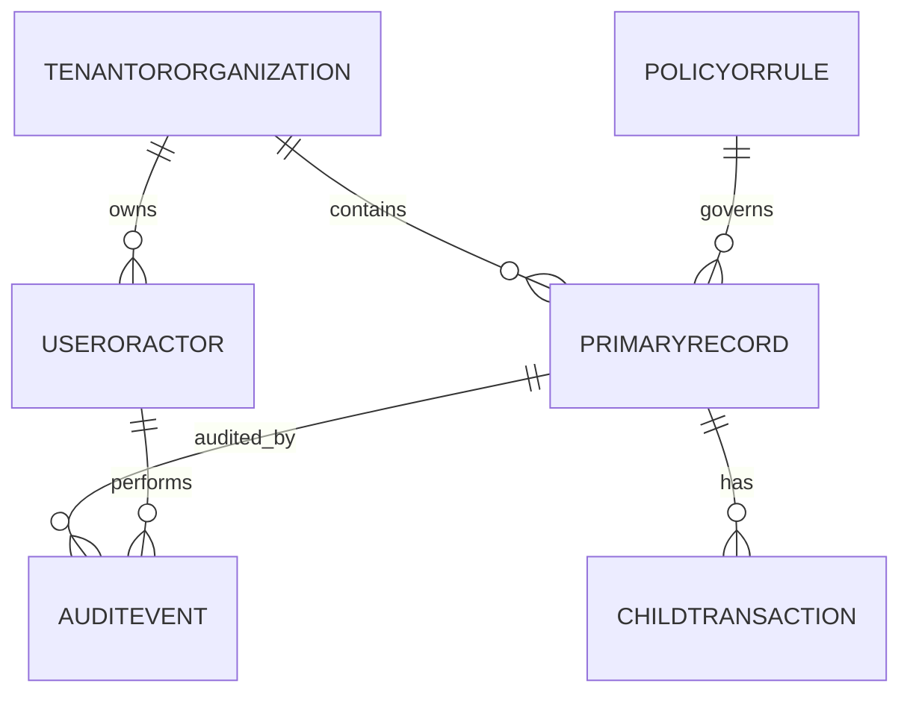

# Data Dictionary

This data dictionary is the canonical reference for **Library Management System**. It defines shared terminology, entity semantics, and governance controls required to keep library management workflows consistent across teams and services.

## Scope and Goals
- Establish a stable vocabulary for architecture, API, analytics, and operations teams.
- Define minimum required fields for core entities and expected relationship boundaries.
- Document data quality and retention controls needed for production readiness.

## Core Entities
| Entity | Description | Required Attributes |
|---|---|---|
| TenantOrOrganization | Top-level ownership boundary for data segregation | `org_id, name, status, region, created_at` |
| UserOrActor | Human/system principal that performs actions | `actor_id, org_id, role, status, last_active_at` |
| PrimaryRecord | Main lifecycle object handled by the platform | `record_id, org_id, state, owner_id, created_at, updated_at` |
| ChildTransaction | Operational transaction or sub-step linked to primary record | `txn_id, record_id, txn_type, amount_or_value, occurred_at` |
| PolicyOrRule | Versioned policy configuration that influences decisions | `policy_id, scope, version, effective_from, effective_to` |
| AuditEvent | Append-only evidence for state changes and controls | `audit_id, record_id, actor_id, action, reason_code, occurred_at` |

## Canonical Relationship Diagram

## Data Quality Controls
1. All write paths enforce required-field validation and referential integrity for mandatory foreign keys.
2. External imports must include provenance metadata (`source_system`, `source_ref`, `ingested_at`).
3. Status/state fields use controlled vocabularies and reject unknown values.
4. Duplicate detection runs on natural keys where business identity collisions are likely.
5. Sensitive fields carry classification tags to drive masking, encryption, and export behavior.

## Retention and Audit
- Operational records remain online for active workflow windows and support forensic queries.
- Historical records move to archive tiers by policy without breaking traceability.
- Audit events are immutable and linked through correlation ids for incident analysis.

## Borrowing & Reservation Lifecycle, Consistency, Penalties, and Exception Patterns

### Artifact focus: Data semantics and validation catalog

This section is intentionally tailored for this specific document so implementation teams can convert architecture and analysis into build-ready tasks.

### Implementation directives for this artifact
- Add canonical definitions for `loan_snapshot`, `hold_rank`, `fine_ledger_entry`, and `policy_decision_code`.
- Define nullability and allowed transitions for each lifecycle field to prevent incompatible producer behavior.
- Include PII classification tags per column and retention windows for compliance.

### Lifecycle controls that must be reflected here
- Borrowing must always enforce policy pre-checks, deterministic copy selection, and atomic loan/copy updates.
- Reservation behavior must define queue ordering, allocation eligibility re-checks, and pickup expiry/no-show outcomes.
- Fine and penalty flows must define accrual formula, cap behavior, and lost/damage adjudication paths.
- Exception handling must define idempotency, conflict semantics, outbox reliability, and operator recovery procedures.

### Traceability requirements
- Every major rule in this document should map to at least one API contract, domain event, or database constraint.
- Include policy decision codes and audit expectations wherever staff override or monetary adjustment is possible.

### Definition of done for this artifact
- Content is specific to this artifact type and not a generic duplicate.
- Rules are testable (unit/integration/contract) and reference concrete data/events/errors.
- Diagram semantics (if present) are consistent with textual constraints and lifecycle behavior.
