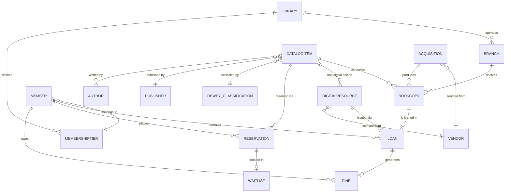

# Data Dictionary

This data dictionary is the canonical reference for the **Library Management System (LMS)**. It defines shared terminology, entity semantics, field-level constraints, PII classifications, and governance controls required to keep borrowing, cataloguing, and patron management workflows consistent across all services and teams.

---

## Core Entities

| Entity | Description | Key Attributes | Relationships |
|---|---|---|---|
| Library | Top-level organisational boundary representing a library system that may operate one or more physical or digital branches. Owns all configuration including tier definitions and fine-rate policy. | `library_id`, `name`, `timezone`, `locale`, `contact_email`, `website`, `status` (`ACTIVE`, `INACTIVE`), `created_at` | Has many Branch; defines many MembershipTier |
| Branch | A physical location where BookCopy items are shelved and patron services are delivered. Each branch belongs to exactly one Library and tracks its own opening hours and contact details. | `branch_id`, `library_id`, `name`, `address_line1`, `city`, `postcode`, `country`, `phone`, `email`, `opening_hours` (JSON), `status` (`OPEN`, `CLOSED`, `TEMPORARILY_CLOSED`) | Belongs to Library; shelves many BookCopy; serves Members |
| Member | A library patron who holds an active, suspended, or expired membership. All identity fields are classified PII and are encrypted at rest. | `member_id`, `library_id`, `tier_id`, `membership_number`, `email`, `given_name`, `family_name`, `date_of_birth`, `phone`, `address` (JSON), `status` (`ACTIVE`, `SUSPENDED`, `EXPIRED`, `PENDING_VERIFICATION`), `registered_at`, `suspended_at`, `expires_at` | Belongs to MembershipTier; has many Loan, Reservation, Fine |
| MembershipTier | Configuration record that codifies borrowing privileges for a class of patron. Four tiers exist by default: Basic, Standard, Premium, and Scholar. | `tier_id`, `library_id`, `name` (`BASIC`, `STANDARD`, `PREMIUM`, `SCHOLAR`), `max_concurrent_loans`, `max_renewals`, `loan_period_days`, `max_digital_concurrent`, `reservation_limit`, `fine_rate_per_day`, `annual_fee`, `currency` | Applied to many Member |
| CatalogItem | Bibliographic record representing a distinct intellectual work. Holds MARC-compatible metadata including ISBN-13 and Dewey Decimal classification. A single CatalogItem may have many physical copies and digital editions. | `catalog_id`, `isbn_13`, `title`, `subtitle`, `edition`, `publication_year`, `language` (BCP-47), `dewey_id`, `publisher_id`, `format` (`PRINT`, `EBOOK`, `AUDIOBOOK`, `PERIODICAL`, `MAP`, `SCORE`), `summary`, `cover_url`, `created_at`, `updated_at` | Has many BookCopy and DigitalResource; linked to many Author; classified by DeweyClassification; published by Publisher |
| BookCopy | A physical copy of a CatalogItem identified by a unique barcode. Tracks shelf location, condition, and lifecycle status. Barcodes are unique per branch. | `copy_id`, `catalog_id`, `branch_id`, `barcode`, `acquisition_id`, `condition` (`NEW`, `GOOD`, `FAIR`, `POOR`), `status` (`AVAILABLE`, `ON_LOAN`, `RESERVED`, `IN_TRANSIT`, `MISSING`, `WITHDRAWN`), `location_code`, `acquired_at`, `withdrawn_at` | Belongs to CatalogItem; shelved at Branch; subject of Loan and Reservation |
| DigitalResource | An electronic resource (e-book or audiobook) attached to a CatalogItem, governed by a DRM license. Concurrent access is bounded by `total_seats`. | `resource_id`, `catalog_id`, `vendor_id`, `format` (`EBOOK`, `AUDIOBOOK`), `drm_provider`, `license_key`, `total_seats`, `available_seats`, `license_expiry`, `file_size_mb`, `access_url`, `created_at` | Belongs to CatalogItem; licensed from Vendor; issued via Loan |
| Loan | An active or closed borrowing record linking a Member to either a BookCopy or a DigitalResource. Exactly one of `copy_id` or `resource_id` is non-null per loan. | `loan_id`, `member_id`, `copy_id` (nullable), `resource_id` (nullable), `branch_id`, `checkout_at`, `due_at`, `returned_at`, `renewal_count`, `status` (`ACTIVE`, `RETURNED`, `OVERDUE`, `LOST`), `digital_token` (nullable, encrypted), `created_by` | Belongs to Member; references BookCopy or DigitalResource; may generate Fine |
| Reservation | A hold request placed by a Member on a CatalogItem when no copy is immediately available for checkout. Tracks preferred branch and pickup expiry window. | `reservation_id`, `member_id`, `catalog_id`, `branch_id` (preferred, nullable), `requested_at`, `expires_at`, `notified_at`, `fulfilled_at`, `status` (`PENDING`, `READY`, `FULFILLED`, `EXPIRED`, `CANCELLED`) | Belongs to Member and CatalogItem; queued in WaitList |
| WaitList | Ordered queue of Reservation entries for a CatalogItem, maintaining patron position and priority class for deterministic copy allocation when a copy becomes available. | `waitlist_id`, `catalog_id`, `reservation_id`, `position`, `priority` (`STANDARD`, `STAFF`, `ACCESSIBILITY`), `queued_at`, `promoted_at` | Belongs to CatalogItem; references one Reservation |
| Fine | Financial penalty raised against a Member for overdue return, damage to, or loss of a copy. Accrues daily for overdue items until returned, waived, or declared lost. | `fine_id`, `member_id`, `loan_id`, `reason` (`OVERDUE`, `DAMAGED`, `LOST`, `PROCESSING_FEE`), `amount`, `currency`, `accrued_at`, `paid_at`, `waived_at`, `waived_by`, `status` (`OUTSTANDING`, `PAID`, `WAIVED`, `IN_DISPUTE`) | Belongs to Member; linked to Loan |
| Acquisition | Purchase order record tracking procurement of new materials (physical or digital) from a Vendor. Governs the full lifecycle from budget approval through receipt and cataloguing. | `acquisition_id`, `vendor_id`, `branch_id`, `catalog_id` (nullable pre-cataloguing), `purchase_order_ref`, `order_date`, `expected_delivery`, `received_date`, `unit_cost`, `quantity`, `quantity_received`, `currency`, `status` (`DRAFT`, `APPROVED`, `ORDERED`, `PARTIAL`, `COMPLETE`, `CANCELLED`), `notes`, `approved_by`, `approved_at` | Belongs to Vendor; may reference CatalogItem; produces BookCopy or DigitalResource records on receipt |
| Vendor | A supplier of physical books, digital licenses, or periodical subscriptions. Holds billing and contact information required for purchase orders and DRM agreements. | `vendor_id`, `name`, `contact_name`, `contact_email`, `contact_phone`, `address` (JSON), `account_number`, `payment_terms`, `preferred_currency`, `status` (`ACTIVE`, `SUSPENDED`, `INACTIVE`), `onboarded_at` | Supplies Acquisition orders; provides DigitalResource DRM licenses |
| DeweyClassification | A node in the Dewey Decimal Classification hierarchy. Codes follow the published DDC schedule with three-digit base class and optional decimal extension. The table is self-referential to model the division/section/subsection hierarchy. | `dewey_id`, `code` (e.g., `823.914`), `label`, `parent_code` (nullable), `level` (`HUNDRED_DIVISION`, `TEN_DIVISION`, `SECTION`, `SUBSECTION`), `description`, `edition` | Classifies many CatalogItem; self-referential hierarchy via `parent_code` |
| Author | A person or corporate body credited as the intellectual creator of a work. Multiple Authors may be linked to a CatalogItem with distinct contribution roles (e.g., AUTHOR, EDITOR, ILLUSTRATOR, TRANSLATOR). | `author_id`, `full_name`, `sort_name`, `birth_year` (nullable), `death_year` (nullable), `nationality`, `biography_url`, `viaf_id` (VIAF authority control identifier), `created_at` | Associated with many CatalogItem via `CatalogItemAuthor` join table which carries a `role` field |
| Publisher | The entity responsible for producing and distributing a work under its imprint. A Publisher may release many CatalogItem records and may itself be an imprint of a parent Publisher. | `publisher_id`, `name`, `country`, `website`, `contact_email`, `parent_publisher_id` (nullable), `status` (`ACTIVE`, `INACTIVE`), `created_at` | Publishes many CatalogItem; optionally child of another Publisher |

---

## Canonical Relationship Diagram

---

## Field-Level Definitions

### BookCopy.status Enumeration

| Value | Meaning | Allowed Transitions |
|---|---|---|
| `AVAILABLE` | On shelf and ready to loan | `ON_LOAN`, `RESERVED`, `IN_TRANSIT`, `WITHDRAWN` |
| `ON_LOAN` | Currently borrowed by a patron | `AVAILABLE` (on return), `MISSING`, `LOST` |
| `RESERVED` | Held at a branch desk awaiting patron pickup | `ON_LOAN` (pickup), `AVAILABLE` (expiry or cancellation) |
| `IN_TRANSIT` | Being moved between branches via inter-library transfer | `AVAILABLE` (on receipt at destination branch) |
| `MISSING` | Cannot be located during shelf check; may be escalated to LOST by staff | `AVAILABLE` (found), `WITHDRAWN` (declared lost) |
| `WITHDRAWN` | Permanently removed from circulation; record retained for audit history | Terminal state — no further transitions permitted |

### Loan.status Enumeration

| Value | Meaning | Allowed Transitions |
|---|---|---|
| `ACTIVE` | Loan is open and within the due window; item is with the patron | `RETURNED`, `OVERDUE`, `LOST` |
| `RETURNED` | Item returned on or before due date; copy marked `AVAILABLE` | Terminal state |
| `OVERDUE` | Due date has passed; item not yet returned; fine accruing per `MembershipTier.fine_rate_per_day` | `RETURNED`, `LOST` |
| `LOST` | Patron or staff declared item lost; loss fine assessed; copy moved to `WITHDRAWN` | Terminal state |

### Reservation.status Enumeration

| Value | Meaning | Allowed Transitions |
|---|---|---|
| `PENDING` | On the waitlist; no copy yet allocated | `READY`, `CANCELLED` |
| `READY` | A copy is held at the preferred branch; patron notified; pickup window clock started | `FULFILLED`, `EXPIRED` |
| `FULFILLED` | Patron collected the reserved copy; associated Loan record created | Terminal state |
| `EXPIRED` | Patron did not collect within the pickup window; copy returned to `AVAILABLE` | Terminal state |
| `CANCELLED` | Cancelled by patron or staff before fulfillment; position released from WaitList | Terminal state |

### Fine.status Enumeration

| Value | Meaning | Allowed Transitions |
|---|---|---|
| `OUTSTANDING` | Unpaid; daily accrual active for `OVERDUE` reason; blocks new loans above tier threshold | `PAID`, `WAIVED`, `IN_DISPUTE` |
| `PAID` | Settled in full via payment service; receipt reference stored in `payment_ref` | Terminal state |
| `WAIVED` | Staff-approved exemption; `waived_by` staff `actor_id` is mandatory; reason recorded in `waive_notes` | Terminal state |
| `IN_DISPUTE` | Patron contest lodged; collection paused; SLA 5 business days for resolution | `OUTSTANDING` (dispute rejected), `WAIVED` (dispute upheld) |

### Acquisition.status Enumeration

| Value | Meaning | Allowed Transitions |
|---|---|---|
| `DRAFT` | Created but not yet submitted for approval | `APPROVED`, `CANCELLED` |
| `APPROVED` | Authorised by acquisitions manager; `approved_by` actor ID is mandatory | `ORDERED`, `CANCELLED` |
| `ORDERED` | Purchase order transmitted to vendor; `purchase_order_ref` must be set | `PARTIAL`, `COMPLETE`, `CANCELLED` |
| `PARTIAL` | Some items received; `quantity_received` is non-zero but less than `quantity` | `COMPLETE`, `CANCELLED` |
| `COMPLETE` | All items received, condition-checked, and catalogued | Terminal state |
| `CANCELLED` | Order cancelled; reason must be recorded in `notes` field | Terminal state |

---

## PII Classification

The following fields contain personally identifiable information subject to data protection regulations (GDPR Article 4, CCPA § 1798.140). All PII fields must be declared in the Data Inventory Register maintained by the Data Protection Officer.

| Entity | Field | PII Class | Handling Requirements |
|---|---|---|---|
| Member | `email` | Direct identifier | AES-256 encrypted at rest; masked in all application logs; explicit consent required for marketing communications |
| Member | `given_name`, `family_name` | Direct identifier | AES-256 encrypted at rest; masked in API responses for roles below `STAFF`; excluded from analytics exports without pseudonymisation |
| Member | `date_of_birth` | Sensitive personal data | AES-256 encrypted at rest; only age-derived values (e.g., age bracket) exposed outside `member-service`; never written to logs or events |
| Member | `phone` | Direct identifier | AES-256 encrypted at rest; masked in non-essential API views; SMS use requires explicit opt-in |
| Member | `address` | Direct identifier | AES-256 encrypted at rest; excluded from all cross-service event payloads; used only for physical mail and statutory reporting |
| Member | `membership_number` | Pseudonymous identifier | Canonical surrogate key in logs, events, and analytics; may appear unmasked in authorised staff views |
| Loan | `digital_token` | Credential | AES-256 encrypted at rest; single-use per DRM session; TTL bounded to loan period; never written to analytics events or logs |

---

## Retention Policies

| Entity | Online Retention | Archive Retention | Deletion Trigger | Legal Hold Behaviour |
|---|---|---|---|---|
| Member (active) | Duration of membership | — | Account closure + 2 years online | Suspend deletion; notify DPO immediately |
| Member (closed) | 2 years post-closure | 5 years from closure date | Verified subject-access deletion request post-archive | Suspend deletion; notify DPO immediately |
| Loan | 7 years from return date | 10 years total | End of archive window | Retention extends indefinitely until hold lifted |
| Fine | 7 years from resolution date | 10 years total | End of archive window | Retention extends indefinitely until hold lifted |
| Reservation | 1 year from terminal status | 3 years total | End of archive window | N/A |
| Acquisition | Permanent (financial audit) | N/A | Never deleted | N/A |
| AuditEvent | 3 years online | 7 years total | End of archive window | Retention extends indefinitely until hold lifted |
| DigitalResource | Duration of DRM license | N/A | License expiry + 90-day grace period | Retention extends until all license disputes resolved |

---

## Data Quality Controls

1. **ISBN-13 check-digit validation**: All `CatalogItem.isbn_13` values are validated using the standard ISBN-13 check digit algorithm (alternating weight 1 and 3 modulo 10) before insertion. Non-conforming values are rejected with error code `ERR_INVALID_ISBN`. Legacy ISBN-10 values are normalised to ISBN-13 on ingest using the `978` prefix.

2. **Member email uniqueness**: A unique partial index on `(lower(email), library_id)` scoped to `status != 'WITHDRAWN'` prevents duplicate active accounts. Case-insensitive deduplication is enforced at the application layer before each database write.

3. **BookCopy barcode uniqueness per branch**: A unique composite index on `(branch_id, barcode)` ensures no two physical copies at the same branch share a barcode. Inter-branch transfers that would create a collision are rejected before the transfer record is created.

4. **Positive fine amounts**: A database check constraint `CHECK (amount > 0.00)` ensures all Fine records carry a non-zero charge. Zero-value fines are semantically invalid; staff must use the waiver workflow (`status = WAIVED`) rather than creating a zero-amount fine.

5. **Loan temporal ordering**: A check constraint `CHECK (due_at > checkout_at)` is enforced on all Loan rows. For returned loans, the service additionally asserts `returned_at >= checkout_at` before committing the return transaction.

6. **Concurrent loan cap enforcement**: Before a Loan is committed, the circulation service reads the member's active loan count (status `ACTIVE` or `OVERDUE`) inside a serialisable transaction and compares it to `MembershipTier.max_concurrent_loans`. Violations raise `ERR_LOAN_LIMIT_EXCEEDED` without creating any partial record.

7. **DigitalResource seat guard**: Before issuing a digital Loan, the service acquires a `SELECT FOR UPDATE` lock on the `DigitalResource` row and verifies `available_seats >= 1`. The seat decrement and Loan insertion are committed atomically. Over-issuance raises `ERR_NO_DIGITAL_SEATS`.

8. **Dewey code format validation**: `DeweyClassification.code` must match the regular expression `^\d{3}(\.\d+)?$`, enforcing the three-digit base class optionally followed by a decimal extension. Values that do not conform are rejected at the classification import boundary.

9. **Reservation limit per member**: A member may not hold more than `MembershipTier.reservation_limit` reservations with status `PENDING` or `READY` simultaneously. The reservation service enforces this count before creating a new hold; excess requests are rejected with `ERR_RESERVATION_LIMIT_EXCEEDED`.

10. **Suspended member write block**: Members with `status = SUSPENDED` are blocked from creating new Loans or Reservations at the API authorisation layer. Existing active Loans remain visible to staff; Fines continue to accrue. The block lifts atomically when all outstanding Fines are resolved and a staff actor sets `status = ACTIVE`.

11. **Acquisition approval chain enforcement**: An Acquisition in `DRAFT` status cannot transition directly to `ORDERED`. The state machine enforces `DRAFT → APPROVED → ORDERED`. The `APPROVED` transition requires a non-null `approved_by` staff actor ID; absence raises `ERR_MISSING_APPROVER`.

12. **Renewal ceiling enforcement**: `Loan.renewal_count` may not exceed `MembershipTier.max_renewals`. The renewal endpoint reads the current count inside a transaction and returns `ERR_MAX_RENEWALS_REACHED` without mutating the record when the ceiling is hit.

13. **WaitList position contiguity**: On every insertion or deletion in the WaitList, a database trigger recalculates positions as a contiguous integer sequence starting from 1, scoped per `catalog_id`. Gaps are not permitted; the trigger fires `AFTER INSERT OR DELETE ON waitlist FOR EACH ROW`.

14. **Orphan prevention for BookCopy withdrawal**: A BookCopy may not transition to `WITHDRAWN` while its status is `ON_LOAN` or `RESERVED`. The service returns `ERR_COPY_IN_USE` and surfaces a staff-facing message instructing resolution of the active Loan or Reservation first.

15. **AuditEvent immutability**: AuditEvent rows are insert-only. `UPDATE` and `DELETE` operations on the `audit_events` table are blocked at the database role level via PostgreSQL role permissions (`GRANT INSERT ON audit_events TO app_role`; no `UPDATE` or `DELETE` granted). Any unauthorised modification attempt raises a permission error and triggers a `SECURITY_ALERT` webhook to the operations channel.

---

## Indexing Strategy

Performance-critical read paths require the following indexes in addition to primary key indexes. All indexes listed here must be created before the service is promoted to production traffic.

| Table | Index Name | Columns | Type | Rationale |
|---|---|---|---|---|
| `members` | `idx_members_email_library` | `(lower(email), library_id)` WHERE `status != 'WITHDRAWN'` | Unique partial B-tree | Duplicate-account check and login lookup |
| `members` | `idx_members_library_status` | `(library_id, status)` | B-tree | Dashboard counts of active/suspended members per library |
| `book_copies` | `idx_copies_catalog_status` | `(catalog_id, status)` | B-tree | Availability check before loan or reservation creation |
| `book_copies` | `idx_copies_branch_barcode` | `(branch_id, barcode)` | Unique B-tree | Barcode-scan lookup at circulation desk |
| `loans` | `idx_loans_member_status` | `(member_id, status)` | B-tree | Concurrent loan count check during checkout |
| `loans` | `idx_loans_due_at_status` | `(due_at, status)` WHERE `status = 'ACTIVE'` | Partial B-tree | Nightly overdue-detection scheduled job |
| `fines` | `idx_fines_member_status` | `(member_id, status)` | B-tree | Outstanding balance lookup on checkout pre-check |
| `reservations` | `idx_reservations_catalog_status` | `(catalog_id, status)` | B-tree | Waitlist promotion on copy return |
| `waitlist` | `idx_waitlist_catalog_position` | `(catalog_id, position)` | B-tree | Ordered queue traversal during allocation |
| `catalog_items` | `idx_catalog_isbn` | `(isbn_13)` | Unique B-tree | MARC import deduplication and search-by-ISBN |
| `catalog_items` | `idx_catalog_dewey` | `(dewey_id)` | B-tree | Browse-by-subject queries |
| `audit_events` | `idx_audit_record_occurred` | `(record_id, occurred_at DESC)` | B-tree | Audit trail retrieval per entity ordered by time |

---

## Domain Glossary

| Term | Definition |
|---|---|
| **Bibliographic record** | The metadata description of a work (title, author, ISBN) as distinct from any physical copy of that work. Corresponds to `CatalogItem`. |
| **Holdings** | The complete set of physical copies (`BookCopy`) and digital seats (`DigitalResource`) owned by a library for a given `CatalogItem`. |
| **Circulation** | The operational domain covering loan creation, renewal, return, and overdue processing. |
| **Acquisitions** | The procurement domain covering purchase orders, vendor management, and receipt of new materials. |
| **Shelf location code** | A human-readable alphanumeric string (e.g., `REF-823-HAR`) derived from the Dewey code and physical shelf position, printed on the spine label of a `BookCopy`. |
| **Pickup window** | The number of calendar days a `READY` reservation remains valid before expiring. Configured per Library; default is 7 days. |
| **Loan period** | The number of days a patron may keep an item before it is overdue. Defined in `MembershipTier.loan_period_days`. |
| **Renewal** | An extension of an active loan's due date by one additional loan period, subject to the `max_renewals` ceiling and the absence of a competing reservation. |
| **Inter-library loan (ILL)** | A loan of a `BookCopy` from one `Branch` to serve a patron registered at a different `Branch` within the same `Library`. Represented as a `Loan` with an `IN_TRANSIT` copy leg. |
| **DRM (Digital Rights Management)** | Technology enforced by the `drm_provider` to limit simultaneous access to a `DigitalResource` to the number of purchased seats (`total_seats`). |
| **MARC** | Machine-Readable Cataloguing standard. `CatalogItem` fields are designed to be importable from MARC 21 bibliographic records. |
| **VIAF** | Virtual International Authority File. Used as the `Author.viaf_id` to link authors to the global authority record, preventing name-variant duplicates. |
