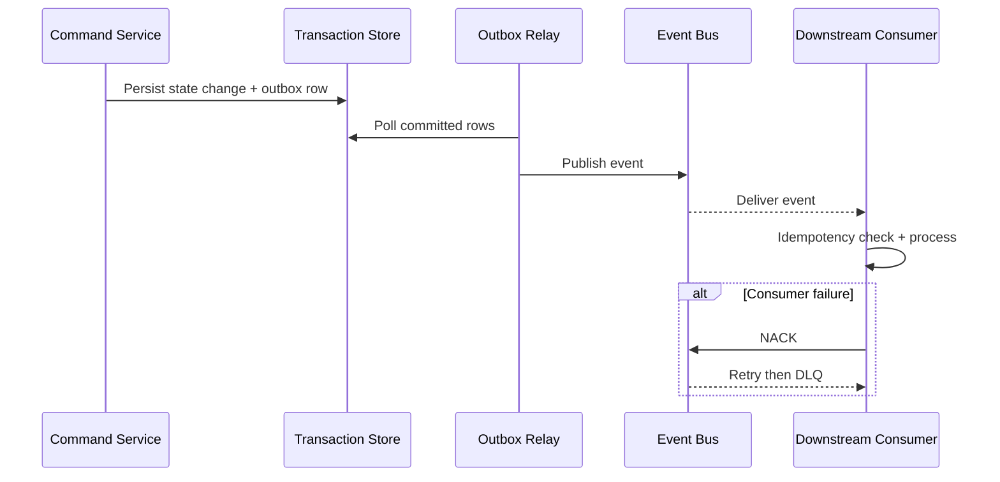

# Event Catalog

This catalog defines stable event contracts for **Library Management System** to support event-driven integrations, auditability, and analytics across library management workflows.

## Contract Conventions
- Event naming: `<domain>.<aggregate>.<action>.v1`.
- Required metadata: `event_id`, `occurred_at`, `correlation_id`, `producer`, `schema_version`, `tenant_context`.
- Delivery mode: at-least-once with mandatory consumer idempotency.
- Ordering guarantee: per aggregate key; no global ordering assumption.

## Domain Events
| Event Name | Payload Highlights | Typical Consumers |
|---|---|---|
| `domain.record.created.v1` | record_id, actor_id, initial_state, occurred_at | orchestration, analytics |
| `domain.record.state_changed.v1` | record_id, old_state, new_state, reason_code | notifications, reporting |
| `domain.record.validation_failed.v1` | record_id, violated_rules, correlation_id | operations, quality dashboards |
| `domain.record.override_applied.v1` | record_id, override_type, approver_id, expires_at | compliance, audit |
| `domain.record.closed.v1` | record_id, terminal_state, closed_at | billing/settlement, archives |

## Publish and Consumption Sequence

## Operational SLOs
- P95 commit-to-publish latency below 5 seconds for tier-1 events.
- DLQ triage acknowledgement within 15 minutes for production incidents.
- Schema changes remain backward compatible within the same major version.

## Borrowing & Reservation Lifecycle, Consistency, Penalties, and Exception Patterns

### Artifact focus: Event-driven contract baseline

This section is intentionally tailored for this specific document so implementation teams can convert architecture and analysis into build-ready tasks.

### Implementation directives for this artifact
- For each event include trigger, schema versioning strategy, idempotency key, and replay expectations.
- Distinguish domain events from integration events and prohibit downstream coupling to internal-only payloads.
- Specify causal ordering requirements between `LoanClosed` and subsequent `FineAssessed` events.

### Lifecycle controls that must be reflected here
- Borrowing must always enforce policy pre-checks, deterministic copy selection, and atomic loan/copy updates.
- Reservation behavior must define queue ordering, allocation eligibility re-checks, and pickup expiry/no-show outcomes.
- Fine and penalty flows must define accrual formula, cap behavior, and lost/damage adjudication paths.
- Exception handling must define idempotency, conflict semantics, outbox reliability, and operator recovery procedures.

### Traceability requirements
- Every major rule in this document should map to at least one API contract, domain event, or database constraint.
- Include policy decision codes and audit expectations wherever staff override or monetary adjustment is possible.

### Definition of done for this artifact
- Content is specific to this artifact type and not a generic duplicate.
- Rules are testable (unit/integration/contract) and reference concrete data/events/errors.
- Diagram semantics (if present) are consistent with textual constraints and lifecycle behavior.
