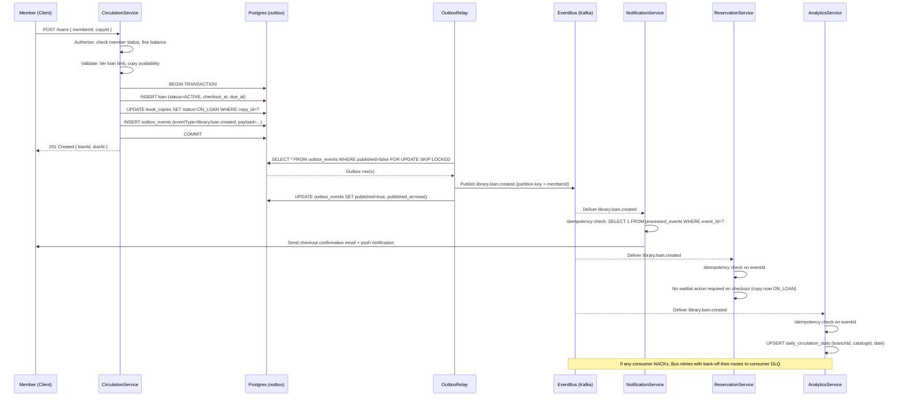

# Event Catalog

This catalog is the authoritative contract reference for all domain events published by the **Library Management System (LMS)**. Consumers must treat this document as the sole source of truth for event schemas, versioning, delivery semantics, and SLO obligations. Any changes to event schemas must be reviewed and merged through the schema registry pull-request process before deployment.

---

## Contract Conventions

### Event Envelope

Every event is serialised as a JSON object conforming to the envelope schema below. All outer fields are mandatory. The `payload` field carries event-specific data defined per event in the Domain Events section.

```json
{
  "eventId": "01HQ3V5M7KW2RVBNE8XD60PQTZ",
  "eventType": "library.loan.created",
  "version": "1.0.0",
  "occurredAt": "2024-06-15T09:30:00.000Z",
  "correlationId": "550e8400-e29b-41d4-a716-446655440000",
  "causationId": "01HQ3V5M6ABC1234DEFG567890",
  "producerService": "circulation-service",
  "schemaUrl": "https://schemas.library.internal/events/library.loan.created/1.0.0.json",
  "payload": {}
}
```

| Field | Type | Required | Description |
|---|---|---|---|
| `eventId` | ULID (string) | Yes | Globally unique event identifier. Used as the idempotency key by all consumers. Generated by the producer at the moment of outbox row insertion. |
| `eventType` | string | Yes | Fully qualified event name following the naming convention defined below. |
| `version` | semver string | Yes | Schema version (MAJOR.MINOR.PATCH). Consumers must validate `version` before deserialising `payload`. |
| `occurredAt` | ISO-8601 UTC | Yes | Wall-clock timestamp at which the domain fact occurred. Set to the database transaction commit time for outbox-produced events. |
| `correlationId` | UUID | Yes | Traces all events that belong to the same top-level user request or saga. Passed through from the originating HTTP request `X-Correlation-ID` header. |
| `causationId` | ULID (string) | Yes | The `eventId` of the preceding event that directly caused this event. For command-originated events, use the command's request ID. |
| `producerService` | string | Yes | Logical service name as registered in the internal service registry (e.g., `circulation-service`, `fine-service`). |
| `schemaUrl` | URI | Yes | Resolvable URI to the JSON Schema document for this event version. Used by consumers for runtime validation and schema evolution checks. |
| `payload` | object | Yes | Event-specific fields as defined per event in the Domain Events table below. |

### Naming Convention

Events follow the pattern `library.<aggregate>.<past-tense-verb>` using lowercase kebab-case segments:

- **Domain prefix**: always `library` — identifies the system of origin.
- **Aggregate**: singular root aggregate name (e.g., `loan`, `member`, `reservation`, `fine`, `digital`, `catalog`, `acquisition`).
- **Verb**: past tense describing the immutable fact that occurred (e.g., `created`, `returned`, `assessed`, `issued`).

**Valid examples**: `library.loan.created`, `library.fine.assessed`, `library.member.registered`, `library.digital.token-issued`

**Invalid examples**: `LoanCreated`, `library.loans.create`, `lib.loan.new`, `LIBRARY_LOAN_CREATED`

### Schema Versioning

Schemas follow **Semantic Versioning** (semver `MAJOR.MINOR.PATCH`):

- **PATCH** increments: documentation-only changes, no structural mutation. No consumer action required.
- **MINOR** increments: backward-compatible additions — new optional payload fields appended. Consumers must tolerate unknown fields.
- **MAJOR** increments: breaking changes (field removal, type change, field rename, mandatory field addition). A new Kafka topic is provisioned for the new major version. The previous topic version is deprecated with a 30-day advance notice to all registered consumers, then retired after 90 days.

Consumers must never set `additionalProperties: false` in their consumer-side validation schemas, as this breaks forward compatibility with MINOR additions.

### Delivery Guarantees

- **At-least-once delivery** is the contractual baseline. Every consumer must implement idempotency keyed on `eventId` using an upsert or deduplication table.
- Events are produced via the **transactional outbox pattern**: the outbox row and the corresponding domain state mutation are committed in the same database transaction, preventing silent event loss.
- An **outbox relay** process polls committed outbox rows and publishes to the event bus using exponential back-off with jitter (initial interval 100 ms, maximum interval 30 s, maximum 10 attempts).
- Consumers acknowledge events only after successful, idempotent processing. A NACK triggers exponential retry with the same back-off profile as the relay.
- **Ordering guarantee**: per partition key (typically `aggregateId`). No global cross-aggregate ordering is assumed or guaranteed.
- **Duplicate delivery**: consumers must handle duplicate delivery gracefully. Processing an event with a previously seen `eventId` must produce no additional side effects.

### Dead Letter Queue (DLQ) Policy

- Events that exhaust consumer retry limits are routed to a per-consumer DLQ topic: `<consumer-service>.dlq`.
- DLQ messages retain the original envelope plus the following enrichment fields: `dlqReason`, `dlqTimestamp`, `retryCount`, `lastError`.
- On-call engineers must acknowledge DLQ messages within the SLO window defined in the Operational SLOs section of this document.
- DLQ replay is performed via the `dlq-replayer` CLI tool. Replayed events are published to the original topic with a freshly generated `eventId` and the original `correlationId` preserved to maintain traceability.
- DLQ messages are retained for **30 days** in hot storage. After expiry, messages are archived to cold storage (S3 Glacier) for the retention window applicable to the event tier.

---

## Domain Events

| Event Name | Version | Producer | Consumers | Trigger | Payload Fields |
|---|---|---|---|---|---|
| `library.catalog.item-cataloged` | 1.0.0 | `catalog-service` | `search-service`, `analytics-service`, `acquisition-service` | New bibliographic record persisted after MARC validation and deduplication | `catalogId`, `isbn13`, `title`, `format`, `deweyCode`, `authorIds[]`, `publisherId`, `language`, `publicationYear`, `addedBy` |
| `library.loan.created` | 1.0.0 | `circulation-service` | `notification-service`, `reservation-service`, `analytics-service`, `fine-service` | Member checks out a physical copy or digital resource; loan record committed to the database | `loanId`, `memberId`, `copyId` (nullable), `resourceId` (nullable), `branchId`, `checkoutAt`, `dueAt`, `renewalCount`, `membershipTier` |
| `library.loan.returned` | 1.0.0 | `circulation-service` | `notification-service`, `reservation-service`, `fine-service`, `analytics-service` | Member returns a physical copy or digital session ends; loan status set to RETURNED | `loanId`, `memberId`, `copyId` (nullable), `resourceId` (nullable), `returnedAt`, `daysOverdue`, `conditionOnReturn`, `processedBy` |
| `library.loan.overdue` | 1.0.0 | `fine-service` (scheduled) | `notification-service`, `member-service`, `analytics-service` | Scheduled job detects `due_at < now()` and `status = ACTIVE`; emitted once per overdue loan per day | `loanId`, `memberId`, `copyId` (nullable), `resourceId` (nullable), `dueAt`, `daysOverdue`, `accruedFineAmount`, `currency` |
| `library.loan.renewed` | 1.0.0 | `circulation-service` | `notification-service`, `analytics-service` | Member or staff extends the due date of an active loan within the renewal ceiling | `loanId`, `memberId`, `previousDueAt`, `newDueAt`, `renewalCount`, `renewedBy`, `renewalSource` (`PATRON`, `STAFF`, `AUTO`) |
| `library.fine.assessed` | 1.0.0 | `fine-service` | `notification-service`, `member-service`, `analytics-service`, `payment-service` | Fine record created for an overdue, damaged, or lost item | `fineId`, `memberId`, `loanId`, `reason`, `amount`, `currency`, `accruedAt`, `daysOverdue` (nullable), `conditionNote` (nullable) |
| `library.fine.paid` | 1.0.0 | `payment-service` | `notification-service`, `member-service`, `fine-service`, `analytics-service` | Payment settled against a fine record; `Fine.status` set to PAID | `fineId`, `memberId`, `amountPaid`, `currency`, `paymentMethod`, `transactionRef`, `paidAt` |
| `library.reservation.created` | 1.0.0 | `reservation-service` | `notification-service`, `circulation-service`, `analytics-service` | Member places a hold on a catalog item when no copy is immediately available; WaitList entry created | `reservationId`, `memberId`, `catalogId`, `preferredBranchId` (nullable), `requestedAt`, `expiresAt`, `waitlistPosition`, `priority` |
| `library.reservation.fulfilled` | 1.0.0 | `reservation-service` | `notification-service`, `circulation-service`, `analytics-service` | A copy is returned and allocated to the next eligible member on the waitlist; copy moved to RESERVED | `reservationId`, `memberId`, `catalogId`, `copyId`, `branchId`, `notifiedAt`, `pickupDeadline` |
| `library.reservation.expired` | 1.0.0 | `reservation-service` (scheduled) | `notification-service`, `analytics-service`, `circulation-service` | Member did not collect the reserved copy within the pickup window; copy returned to AVAILABLE | `reservationId`, `memberId`, `catalogId`, `copyId`, `expiredAt`, `daysHeld` |
| `library.digital.token-issued` | 1.0.0 | `digital-access-service` | `notification-service`, `analytics-service`, `drm-provider` | DRM access token generated for a digital loan; available_seats decremented | `loanId`, `memberId`, `resourceId`, `issuedAt`, `expiresAt`, `drmProvider`, `platform`, `format` |
| `library.digital.token-revoked` | 1.0.0 | `digital-access-service` | `notification-service`, `analytics-service`, `drm-provider` | Digital loan token revoked due to return, expiry, or account suspension; available_seats incremented | `loanId`, `memberId`, `resourceId`, `revokedAt`, `reason` (`RETURNED`, `EXPIRED`, `SUSPENDED`, `ADMIN_ACTION`) |
| `library.acquisition.approved` | 1.0.0 | `acquisition-service` | `catalog-service`, `analytics-service`, `vendor-service` | Acquisitions manager approves a draft purchase order; status set to APPROVED | `acquisitionId`, `vendorId`, `catalogId` (nullable), `approvedBy`, `approvedAt`, `quantity`, `unitCost`, `currency`, `expectedDelivery` |
| `library.acquisition.received` | 1.0.0 | `acquisition-service` | `catalog-service`, `inventory-service`, `analytics-service` | Physical items or digital licenses arrive and are checked in; copy records created | `acquisitionId`, `vendorId`, `receivedAt`, `receivedQuantity`, `copyIds[]`, `receivedBy`, `conditionSummary` |
| `library.member.registered` | 1.0.0 | `member-service` | `notification-service`, `analytics-service`, `search-service` | New patron account created after identity verification; membership record activated | `memberId`, `membershipNumber`, `tierId`, `libraryId`, `registeredAt`, `verificationMethod` (`EMAIL`, `IN_PERSON`, `OAUTH`) |
| `library.member.suspended` | 1.0.0 | `member-service` | `notification-service`, `circulation-service`, `digital-access-service`, `analytics-service` | Member account suspended due to unpaid fines or policy violation; all active digital tokens revoked | `memberId`, `suspendedAt`, `reason` (`UNPAID_FINES`, `POLICY_VIOLATION`, `ADMIN_ACTION`), `suspendedBy`, `outstandingFineAmount` (nullable), `currency` (nullable), `reinstateAfter` (nullable) |

---

## Publish and Consumption Sequence

The diagram below illustrates the end-to-end flow when a member checks out a physical copy — from the inbound HTTP command through atomic database commit, outbox relay, and downstream consumer processing.



---

## Operational SLOs

### Publish Latency Targets

Events are assigned to one of three tiers based on business criticality. Latency is measured from the database transaction commit timestamp (`occurredAt`) to confirmed delivery at the consumer.

| Tier | Description | Example Events | P95 Commit-to-Bus Latency | P95 End-to-End Consumer Delivery |
|---|---|---|---|---|
| Tier 1 – Critical | Patron-facing, real-time impact; failure causes visible service degradation or patron data inconsistency | `library.loan.created`, `library.fine.paid`, `library.digital.token-issued`, `library.digital.token-revoked`, `library.member.suspended` | < 2 seconds | < 5 seconds |
| Tier 2 – Operational | Workflow coordination between services; delayed delivery causes staff friction but no direct patron-facing failure | `library.reservation.fulfilled`, `library.loan.returned`, `library.loan.renewed`, `library.acquisition.approved`, `library.reservation.created` | < 10 seconds | < 30 seconds |
| Tier 3 – Analytics | Reporting and offline analytics pipelines; batch tolerant; short delays do not affect patron experience | `library.catalog.item-cataloged`, `library.acquisition.received`, `library.loan.overdue`, `library.reservation.expired`, `library.member.registered` | < 60 seconds | < 5 minutes |

### DLQ Processing SLOs

| Severity | Triggering Condition | Acknowledgement SLO | Resolution SLO | Escalation Path |
|---|---|---|---|---|
| P1 | Tier 1 event in DLQ causing active patron session failure (e.g., digital token not issued) | 5 minutes | 30 minutes | Immediate page to on-call engineer + engineering lead |
| P2 | Tier 1 or Tier 2 event in DLQ; no immediate patron-facing impact but workflow stalled | 15 minutes | 2 hours | Page to on-call engineer; notify service owner |
| P3 | Tier 3 analytics event in DLQ; no real-time impact | 2 hours | Next business day | Slack alert to analytics team channel |

### Schema Compatibility Requirements

- All MINOR version changes must pass automated backward-compatibility validation in CI using `json-schema-compatibility-checker` before the pull request can be merged to `main`.
- Consumer-side validation schemas must never specify `additionalProperties: false`; doing so is treated as a consumer bug and blocks deployment.
- MAJOR version changes require a migration runbook entry, a schema registry entry for the new version, and 30-day deprecation notice issued to all registered consumers via the schema registry API before the old topic is retired.
- Schema registry URL: `https://schemas.library.internal` (internal network only). External integrations use the published OpenAPI export available at `https://api.library.external/schemas`.
- All event schemas are stored as versioned JSON Schema files in the `schemas/` directory of the `lms-event-schemas` repository and are the canonical source of truth. Prose descriptions in this document are supplementary.

### Event Retention Windows

| Topic Tier | Hot Retention (Kafka) | Warm Retention (S3 Standard) | Cold Retention (S3 Glacier) |
|---|---|---|---|
| Tier 1 – Critical | 7 days | 90 days | 7 years |
| Tier 2 – Operational | 7 days | 60 days | 3 years |
| Tier 3 – Analytics | 3 days | 30 days | 1 year |
| DLQ (all tiers) | 30 days | 90 days | 1 year |

Retention windows are subject to legal hold override. A legal hold flag applied to any Kafka topic or S3 prefix suspends all TTL-based deletion regardless of the windows above, until the hold is explicitly lifted by the Data Protection Officer with documented justification.
