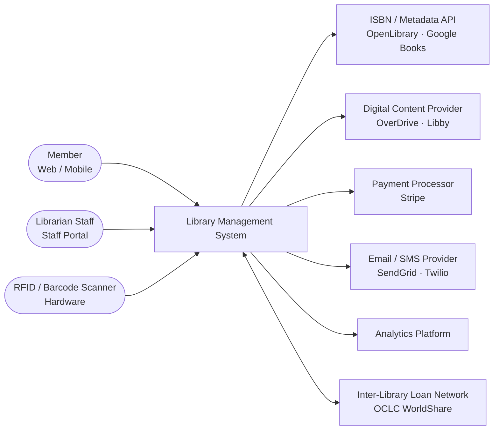

# System Context Diagram — Library Management System

## 1. Purpose

This document presents the **C4 Level-1 System Context** for the Library Management System (LMS). At this level the diagram shows the LMS as a single black-box system, the human roles that interact with it directly, and the external systems it depends on or integrates with. Internal architecture is not exposed here; refer to the Container Diagram and Component Diagrams for lower-level decomposition.

---

## 2. Context Diagram

The diagram below uses a `flowchart LR` layout to represent the C4 context boundary. Arrows indicate the primary direction of data or request flow; bidirectional arrows are shown where both parties initiate communication.

---

## 3. System Description

| Attribute | Value |
|-----------|-------|
| **System Name** | Library Management System (LMS) |
| **System Type** | Integrated library system — web application with REST API back-end |
| **Primary Language** | English (multi-locale capable) |
| **Deployment Model** | Cloud-hosted SaaS with optional on-premises RFID gateway |
| **Data Classification** | Personally Identifiable Information (PII), financial transaction data |
| **Availability Target** | 99.5 % monthly uptime during operating hours |

The LMS is the central system of record for all library operations. It manages the bibliographic catalog, physical and digital loans, member accounts, reservations, fines, acquisitions, and inter-library loan requests. All external integrations are mediated through internal APIs; no external system writes directly to the LMS database.

---

## 4. Human Actors

### 4.1 Member (Web / Mobile)

Library patrons interact with the LMS through two channels:

- **Public OPAC (web):** A browser-based interface for catalog search, account management, holds, renewals, fine payment, and digital content access.
- **Mobile App:** A native or progressive-web application offering barcode-scan search, push notifications for hold readiness, and loan due-date reminders.

Members authenticate via the integrated OAuth 2.0 / OIDC identity provider. Anonymous users may search the catalog but cannot perform transactional operations.

### 4.2 Librarian Staff (Staff Portal)

Library employees access the LMS through a staff-only web portal that provides:

- **Circulation desk:** Checkout, return, renewal, fine collection, and account management.
- **Cataloging workstation:** Bibliographic record creation, import, and item management.
- **Acquisitions module:** Purchase orders, vendor management, and receiving.
- **Reporting dashboard:** Operational, financial, and collection-usage reports.

Staff authenticate against the same identity provider as members but receive role-based permission sets that grant access to staff-only functions.

### 4.3 RFID / Barcode Scanner Hardware

Self-checkout kiosks and RFID-enabled circulation desks communicate with the LMS via a local hardware gateway that translates scanner events (item scan, RFID read) into LMS API calls. The gateway runs on the branch local network and connects to the LMS over HTTPS. No member or item data is persisted on the scanner hardware.

---

## 5. External Systems

### 5.1 ISBN / Metadata API — OpenLibrary · Google Books

**Purpose:** Enriches bibliographic records with title, author, publisher, subject headings, cover art, and classification data during cataloging and acquisitions workflows.

**Integration pattern:** Outbound REST API call, triggered on-demand when a staff member enters an ISBN or imports a batch of titles. Responses are cached for 30 days to reduce external API dependency. Failures are non-blocking; the system allows manual record entry if the API is unavailable.

**Data flow:** LMS sends ISBN → API returns JSON bibliographic record → LMS maps fields to internal schema → record saved.

### 5.2 Digital Content Provider — OverDrive · Libby

**Purpose:** Manages DRM licences and fulfilment for e-books and audiobooks. The LMS holds metadata about digital titles (title, licence count, availability) and delegates checkout and return operations to the OverDrive REST API.

**Integration pattern:** Outbound REST API calls for checkout, return, hold placement, and availability queries. Webhook callbacks from OverDrive update licence availability counters in near real time.

**Data flow (checkout):** Member requests loan → LMS calls OverDrive checkout endpoint with library card number → OverDrive responds with download URL and expiry → LMS records digital loan and presents link to member.

**Failure handling:** If the OverDrive API is unavailable, the LMS queues the request with a 5-minute retry window. After three failed attempts, the system informs the member of a temporary service disruption; no loan record is created.

### 5.3 Payment Processor — Stripe

**Purpose:** Processes credit and debit card payments for library fines. The LMS uses Stripe Elements (client-side tokenisation) to avoid storing raw card data; only Stripe charge IDs and status codes are persisted in the LMS.

**Integration pattern:** Outbound Stripe REST API call from the LMS back-end. Payment intents are created server-side; the client completes 3DS confirmation where required.

**Data flow:** Fine payment initiated → LMS creates Stripe PaymentIntent → Member completes card entry in Stripe Elements → Stripe confirms charge → LMS webhook receives `payment_intent.succeeded` → LMS marks fine as Paid.

**Failure handling:** Declined payments are surfaced to the member with the Stripe decline code. The LMS does not retry card payments automatically. Fine records remain outstanding until payment is confirmed.

### 5.4 Email / SMS Provider — SendGrid · Twilio

**Purpose:** Delivers transactional notifications to members including:
- Loan due-date reminders (3 days before due date, day of due date)
- Overdue notices (day 1, day 14, day 30)
- Hold-ready notifications
- Fine payment receipts
- Registration welcome emails and card-verification links

**Integration pattern:** Outbound HTTP calls from the LMS notification service to SendGrid (email) and Twilio (SMS). The LMS uses an outbox pattern: notification records are written atomically with domain events, and a background worker delivers them asynchronously to avoid blocking transactional flows.

**Failure handling:** Delivery failures are retried with exponential back-off (3 attempts over 15 minutes). Persistent failures are logged; staff are alerted for overdue notices that cannot be delivered.

### 5.5 Analytics Platform

**Purpose:** Receives aggregated, anonymised usage events from the LMS for collection-development and operational analytics. Examples include checkout events, search queries (without member IDs), branch visit patterns, and overdue rates by material type.

**Integration pattern:** Outbound event stream (Kafka topic or webhook sink, configurable). Events are anonymised by the LMS before transmission; no PII is sent to the analytics platform. The analytics platform is read-only with respect to the LMS; it does not send data back.

**Data flow:** LMS emits domain events → anonymisation filter removes member IDs → enriched events forwarded to analytics sink → dashboards updated in near real time.

### 5.6 Inter-Library Loan Network — OCLC WorldShare

**Purpose:** Enables the LMS to request items from, and lend items to, partner libraries in the ILL network when a patron needs a title not held locally.

**Integration pattern:** Bidirectional. The LMS sends outbound ILL requests using the OCLC WorldShare ILL REST API and receives inbound status updates (accepted, shipped, received, returned) as webhook callbacks or polling responses.

**Data flow:** ILL request created in LMS → transmitted to OCLC WorldShare → partner library responds → status callbacks update the ILL request record in LMS → member notified at each transition.

---

## 6. Integration Summary Table

| External System | Protocol | Direction | Criticality | Failure Mode |
|-----------------|----------|-----------|-------------|--------------|
| OpenLibrary / Google Books | HTTPS REST | Outbound | Low — metadata enrichment only | Graceful degradation; manual entry permitted |
| OverDrive / Libby | HTTPS REST + Webhooks | Bidirectional | High — digital loans unavailable | Queue with retry; member notified after 3 failures |
| Stripe | HTTPS REST + Webhooks | Outbound | Medium — card payments unavailable | Cash payment fallback at desk |
| SendGrid / Twilio | HTTPS REST | Outbound | Medium — notifications delayed | Outbox retry; staff alert for persistent failures |
| Analytics Platform | Kafka / HTTPS | Outbound | Low — analytics delayed | Events buffered; no impact on core operations |
| OCLC WorldShare ILL | HTTPS REST + Webhooks | Bidirectional | Medium — ILL workflows manual | Manual ILL coordination as fallback |
| RFID / Barcode Gateway | TCP / USB | Inbound | High — self-checkout affected | Staff desk fallback with manual barcode entry |

---

## 7. Security and Trust Boundaries

- **Identity boundary:** All human actors authenticate through the OAuth 2.0 / OIDC identity provider. Access tokens are validated by the LMS API on every request. Staff roles are enforced at the API layer.
- **Payment boundary:** Card data never enters the LMS. Stripe Elements tokenises card data client-side. The LMS holds only Stripe charge IDs.
- **PII boundary:** Member PII is stored within the LMS database (name, email, address). PII is never transmitted to the analytics platform or ISBN metadata APIs.
- **Network boundary:** RFID gateways communicate with the LMS API over HTTPS with mutual TLS certificate pinning. No scanner hardware accesses the database directly.
- **Outbound dependency isolation:** All outbound integrations are mediated by the LMS API layer. A failure in any single external system does not cascade to unrelated LMS functions.
