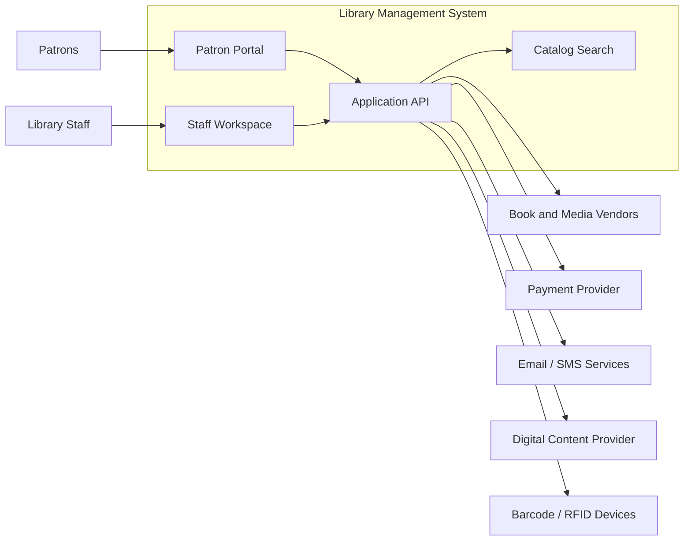

# System Context Diagram - Library Management System

## Context Notes

- Patrons mainly interact through discovery, holds, and account-management workflows.
- Staff use operational tools for circulation, cataloging, acquisitions, inventory, and reporting.
- The platform may integrate with payments, notifications, RFID/barcode tooling, and digital-content vendors.
