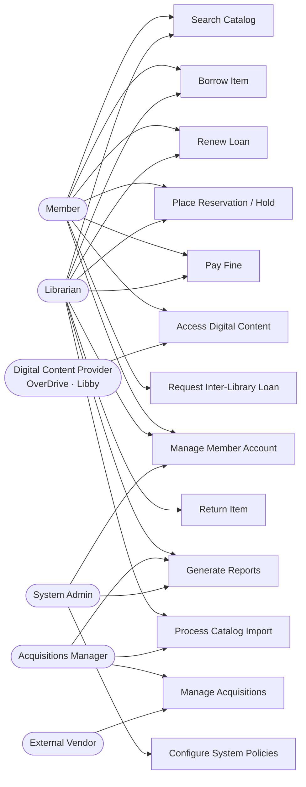

# Use Case Diagram — Library Management System

## 1. Introduction

This document presents the Level-1 use case model for the **Library Management System (LMS)**. It identifies all primary and secondary actors together with the functional capabilities each actor exercises. The diagram and accompanying tables serve as the baseline requirements-traceability artifact, linking stakeholder roles to system behaviour and providing hooks for downstream implementation work items.

### 1.1 Scope

The LMS covers the full lifecycle of physical and digital library materials across one or more branches: catalog discovery, borrowing, reservation, returns, fine management, acquisitions, cataloging, inter-library lending, and system administration.

**In scope:** Public OPAC, staff circulation desk, self-checkout kiosk, acquisitions module, cataloging module, reporting module, digital-content integration, ILL integration, payment integration, and notification delivery.

**Out of scope:** OverDrive/Libby DRM platform internals, external financial or ERP systems, identity provider (OAuth 2.0/OIDC is consumed, not hosted), and physical RFID reader firmware.

---

## 2. Actors

| Actor | Type | Description |
|-------|------|-------------|
| **Member** | Primary | Registered library patron. Interacts via the public OPAC web interface or mobile app to search, borrow, place holds, pay fines, and request inter-library loans. Anonymous users may search the catalog but cannot borrow or place holds. |
| **Librarian** | Primary | Circulation and reference staff. Processes checkouts, returns, renewals, and member account operations at the staff portal or self-checkout kiosk. May override certain policy decisions with a full audit trail. |
| **Acquisitions Manager** | Primary | Responsible for collection development. Creates selection lists, raises purchase orders, tracks receipts from vendors, and routes new materials to the cataloging workflow. |
| **System Admin** | Primary | Configures system-wide policies (loan periods, fine rates, hold limits), manages branch calendars, defines roles, and generates administrative reports. Does not perform day-to-day circulation. |
| **External Vendor** | Secondary | Book and AV suppliers that receive purchase orders and ship materials to branch receiving departments. Interacts with the LMS via EDI or manual invoice reconciliation. |
| **Digital Content Provider** | Secondary | OverDrive / Libby platform. Fulfils digital checkout, return, and hold requests for e-books and audiobooks under DRM licence agreements with configurable concurrent-user limits. |

---

## 3. Use Case Diagram

---

## 4. Use Case Summary Table

| ID | Use Case | Primary Actor(s) | Brief Description |
|----|----------|------------------|-------------------|
| UC-001 | Search Catalog | Member, Librarian | Full-text and faceted search across bibliographic records; returns real-time availability by branch, format, and copy status. |
| UC-002 | Borrow Item | Member, Librarian | Issues a physical copy to a member after validating eligibility, calculates due date by material type, and emits `LoanCreated`. |
| UC-003 | Return Item | Librarian | Closes an active loan, assesses overdue fines, and triggers hold-queue allocation for the returned copy. |
| UC-004 | Renew Loan | Member, Librarian | Extends the due date of an active loan subject to renewal-count limits and the absence of pending holds on the title. |
| UC-005 | Place Reservation / Hold | Member, Librarian | Queues a member for the next available copy at a selected pickup branch; notifies the member when the item is ready. |
| UC-006 | Pay Fine | Member, Librarian | Accepts payment for outstanding fines via Stripe; clears borrowing block when the balance drops below the configured threshold. |
| UC-007 | Access Digital Content | Member, DCP | Initiates a DRM-controlled e-book or audiobook loan through OverDrive/Libby; enforces concurrent-licence limits. |
| UC-008 | Request Inter-Library Loan | Member | Submits an ILL request for titles absent from the local collection; tracks request status through partner fulfilment. |
| UC-009 | Manage Acquisitions | Acquisitions Manager, External Vendor | Creates, approves, and tracks purchase orders; records receipt of materials and routes items to the cataloging workflow. |
| UC-010 | Generate Reports | Librarian, Acquisitions Manager, System Admin | Produces circulation, collection-usage, overdue, and financial reports for specified date ranges and branches. |
| UC-011 | Manage Member Account | Member, Librarian, System Admin | Creates, updates, suspends, and expires member records; manages contact details, notification preferences, and borrower categories. |
| UC-012 | Configure System Policies | System Admin | Defines and versions loan periods, fine rates, hold-queue limits, branch calendars, and material-type rules. |
| UC-013 | Process Catalog Import | Librarian, Acquisitions Manager | Imports MARC/ISBN metadata from OpenLibrary or Google Books; deduplicates against existing records and merges enriched data. |

---

## 5. Include and Extend Relationships

| Base Use Case | Relationship | Extension / Inclusion | Notes |
|---------------|--------------|----------------------|-------|
| Borrow Item | **includes** | Search Catalog | Staff must locate and confirm item identity before issuing. |
| Place Reservation | **includes** | Search Catalog | Member selects a title as the precondition for placing a hold. |
| Return Item | **extends** | Pay Fine | Overdue fine is assessed at return when applicable. |
| Renew Loan | **extends** | Pay Fine | Renewal is blocked and payment is offered when balance ≥ fine-block threshold. |
| Manage Acquisitions | **includes** | Process Catalog Import | Received items trigger an automatic ISBN metadata lookup to seed catalog records. |
| Access Digital Content | **includes** | Manage Member Account | Licence assignment requires a verified, active member ID from the LMS. |

---

## 6. System Boundary

The LMS system boundary encompasses all components deployed and operated by the library organisation:

- **Public OPAC** — web and mobile endpoints for member-facing discovery and account management.
- **Staff Portal** — circulation, cataloging, acquisitions, and reporting workstations.
- **Background Jobs** — fine accrual scheduler, hold-expiry processor, overdue notice dispatcher, and report generator.
- **Internal APIs** — REST/JSON services consumed by the OPAC, staff portal, and background jobs.

**Outside the boundary (integration points only):**

| External System | Protocol / Standard | Direction |
|-----------------|--------------------|-----------| 
| OverDrive / Libby | OverDrive REST API | Outbound |
| Stripe | Stripe REST API | Outbound |
| SendGrid / Twilio | HTTP webhook | Outbound |
| OAuth 2.0 / OIDC Identity Provider | OpenID Connect | Inbound |
| OCLC WorldCat / ILL network | ISO 10160 / NCIP | Bidirectional |
| RFID reader hardware | USB / TCP driver | Inbound |
| OpenLibrary / Google Books | REST API | Outbound |

---

## 7. Traceability Matrix

| Use Case | Domain Events | Business Rules |
|----------|---------------|----------------|
| UC-001 | — | BR-01, BR-08 |
| UC-002 | `LoanCreated` | BR-02, BR-03, BR-04 |
| UC-003 | `LoanClosed`, `FineAssessed`, `HoldAllocated` | BR-05, BR-06 |
| UC-004 | `LoanRenewed` | BR-07, BR-08 |
| UC-005 | `HoldPlaced`, `HoldFulfilled`, `HoldExpired` | BR-09, BR-10 |
| UC-006 | `FinePaymentReceived`, `BorrowingBlockCleared` | BR-11, BR-12 |
| UC-007 | `DigitalLoanCreated`, `DigitalLoanReturned` | BR-13, BR-14 |
| UC-008 | `ILLRequestSubmitted`, `ILLItemReceived` | BR-15 |
| UC-009 | `PurchaseOrderCreated`, `ItemReceived`, `ItemCataloged` | BR-16, BR-17 |
| UC-010 | — | BR-18 |
| UC-011 | `MemberCreated`, `MemberSuspended` | BR-19, BR-20 |
| UC-012 | `PolicyUpdated` | BR-21 |
| UC-013 | `CatalogRecordImported` | BR-22 |
