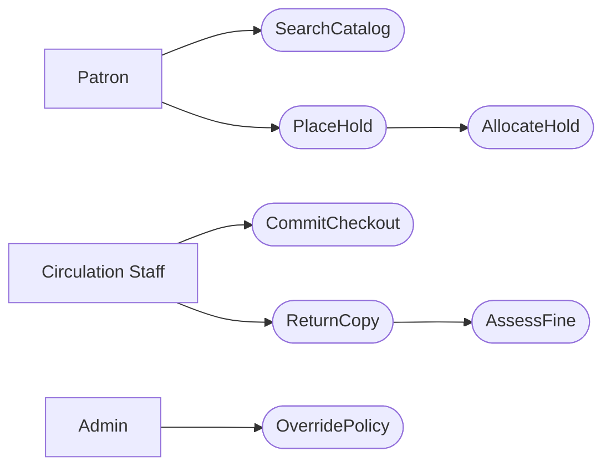

# Use Case Diagram - Library Management System

## Borrowing & Reservation Lifecycle, Consistency, Penalties, and Exception Patterns

### Artifact focus: Actor-to-capability map with implementation hooks

This section is intentionally tailored for this specific document so implementation teams can convert architecture and analysis into build-ready tasks.

### Implementation directives for this artifact
- Label use cases with command names and map to owning service/component.
- Identify include/extend relationships for renewal, recall, and fee-waive flows.
- Add notes for asynchronous follow-up processes triggered by each use case.

### Lifecycle controls that must be reflected here
- Borrowing must always enforce policy pre-checks, deterministic copy selection, and atomic loan/copy updates.
- Reservation behavior must define queue ordering, allocation eligibility re-checks, and pickup expiry/no-show outcomes.
- Fine and penalty flows must define accrual formula, cap behavior, and lost/damage adjudication paths.
- Exception handling must define idempotency, conflict semantics, outbox reliability, and operator recovery procedures.

### Traceability requirements
- Every major rule in this document should map to at least one API contract, domain event, or database constraint.
- Include policy decision codes and audit expectations wherever staff override or monetary adjustment is possible.

### Mermaid implementation reference

### Definition of done for this artifact
- Content is specific to this artifact type and not a generic duplicate.
- Rules are testable (unit/integration/contract) and reference concrete data/events/errors.
- Diagram semantics (if present) are consistent with textual constraints and lifecycle behavior.
