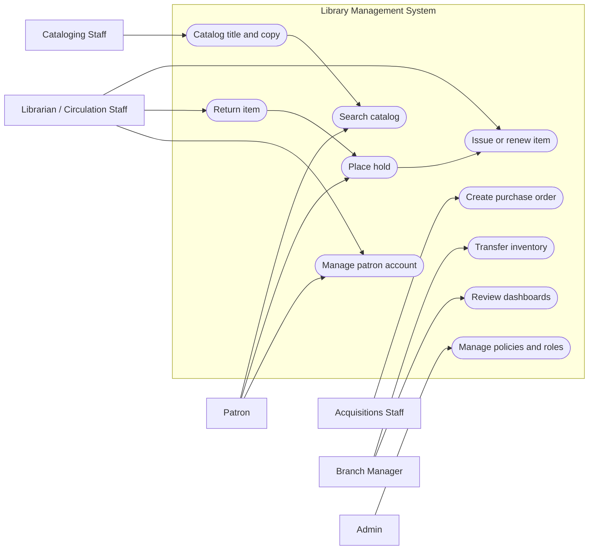

# Use Case Diagram - Library Management System

```mermaid
flowchart LR
    patron[Patron]
    librarian[Librarian / Circulation Staff]
    cataloger[Cataloging Staff]
    acq[Acquisitions Staff]
    manager[Branch Manager]
    admin[Admin]

    subgraph system[Library Management System]
        uc1([Search catalog])
        uc2([Place hold])
        uc3([Issue or renew item])
        uc4([Return item])
        uc5([Manage patron account])
        uc6([Catalog title and copy])
        uc7([Create purchase order])
        uc8([Transfer inventory])
        uc9([Review dashboards])
        uc10([Manage policies and roles])
    end

    patron --> uc1
    patron --> uc2
    patron --> uc5
    librarian --> uc3
    librarian --> uc4
    librarian --> uc5
    cataloger --> uc6
    acq --> uc7
    manager --> uc8
    manager --> uc9
    admin --> uc10
    uc6 --> uc1
    uc2 --> uc3
    uc4 --> uc2
```
