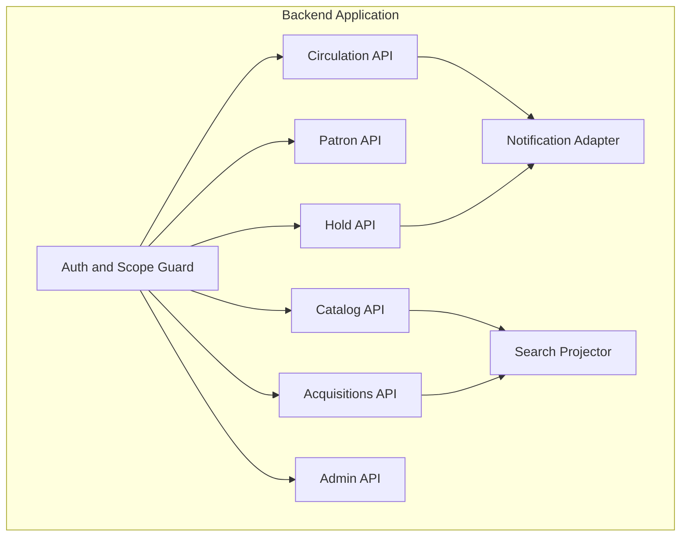

# C4 Component Diagram - Library Management System

```mermaid
flowchart TB
    subgraph backend[Backend Application]
        auth[Auth and Scope Guard]
        catalogApi[Catalog API]
        patronApi[Patron API]
        circulationApi[Circulation API]
        holdApi[Hold API]
        acquisitionsApi[Acquisitions API]
        adminApi[Admin API]
        projector[Search Projector]
        notifier[Notification Adapter]
    end

    auth --> catalogApi
    auth --> patronApi
    auth --> circulationApi
    auth --> holdApi
    auth --> acquisitionsApi
    auth --> adminApi
    circulationApi --> notifier
    holdApi --> notifier
    catalogApi --> projector
    acquisitionsApi --> projector
```
