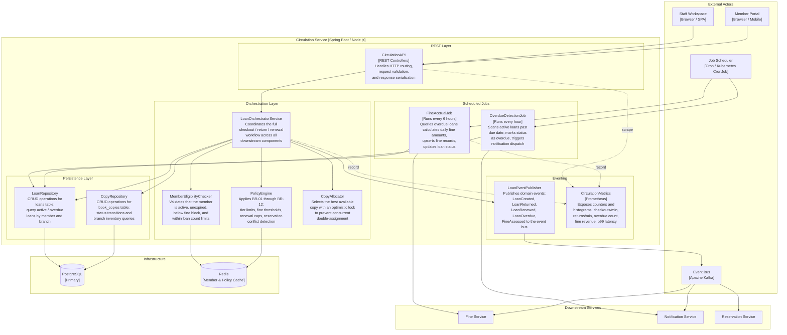

# C4 Level 3 — Component Diagram: Circulation Service

This document describes the internal architecture of the **Circulation Service** at C4 Level 3.
It details every component, its responsibility, and how components interact during the
checkout, return, renewal, and scheduled overdue-processing workflows.

---

## Diagram

---

## Component Reference

| Component                 | Responsibility                                                                                                                                                                           | Dependencies                                        | Exposes / Consumes                                                       |
|---------------------------|------------------------------------------------------------------------------------------------------------------------------------------------------------------------------------------|-----------------------------------------------------|--------------------------------------------------------------------------|
| **CirculationAPI**        | Exposes all circulation REST endpoints. Performs schema validation (JSON Schema / Zod) and converts HTTP requests to internal command objects. Returns structured success or error envelopes. | `LoanOrchestratorService`                           | `POST /loans`, `PUT /loans/{id}/return`, `PUT /loans/{id}/renew`, `GET /loans` |
| **LoanOrchestratorService**| Coordinates the full checkout, return, and renewal workflows. Invokes eligibility, policy, and copy selection in sequence. Rolls back partial state on failure. Publishes domain events on success. | `MemberEligibilityChecker`, `PolicyEngine`, `CopyAllocator`, `LoanRepository`, `CopyRepository`, `LoanEventPublisher` | Internal service; called by `CirculationAPI`                              |
| **MemberEligibilityChecker**| Confirms the member account is `active`, membership has not expired, current loan count is below the tier ceiling, and outstanding fines are below the block threshold. Uses Redis cache for hot member state (TTL 60 s). | Redis cache, `LoanRepository`                       | `checkEligibility(memberId)` → `EligibilityResult`                       |
| **PolicyEngine**          | Evaluates the full rule set for a proposed loan action. Rules include: BR-01 concurrent loan limits, BR-02 fine block, BR-03 membership expiry, BR-04 renewal cap, BR-05 reservation conflict, BR-06 digital loan limits. Rules are loaded from configuration at startup and cached in memory. | Redis cache (fine totals, loan counts), config store | `evaluate(context: PolicyContext)` → `PolicyDecision`                    |
| **CopyAllocator**         | Selects the best available copy for a catalog item at a preferred branch. Priority: (1) same branch and `available`, (2) in-transit to branch, (3) any branch with `available`. Acquires an optimistic lock (version column) to prevent concurrent double-allocation. | `CopyRepository`                                    | `allocate(catalogItemId, branchId)` → `BookCopy`                         |
| **LoanRepository**        | Provides transactional CRUD for the `loans` table. Queries: active loans by member, overdue loans, loan history. Participates in the unit-of-work transaction managed by `LoanOrchestratorService`. | PostgreSQL                                          | `create`, `findById`, `findActiveByMember`, `findOverdue`, `update`      |
| **CopyRepository**        | Provides transactional CRUD for the `book_copies` table. Status transition methods enforce valid state-machine paths (`available → checked_out`, `checked_out → available`, etc.). | PostgreSQL                                          | `findByBarcode`, `findAvailable`, `updateStatus`, `lockForUpdate`        |
| **FineAccrualJob**        | Scheduled every 6 hours. Queries loans where `status = 'overdue'` and `returned_at IS NULL`. For each, calculates the incremental fine amount using the tier-specific daily rate and upserts the `fines` record. Calls Fine Service for persistence outside the Circulation DB transaction boundary. | `LoanRepository`, Fine Service                      | Triggered by scheduler; no REST exposure                                 |
| **OverdueDetectionJob**   | Scheduled every hour. Identifies active loans where `due_at < now()` and `status != 'overdue'`. Transitions loan status to `overdue` and invokes Notification Service to send the first overdue notice. Idempotent — sets `overdue_notified_at` to prevent duplicate notifications. | `LoanRepository`, Notification Service              | Triggered by scheduler; no REST exposure                                 |
| **LoanEventPublisher**    | Serialises internal domain events (`LoanCreated`, `LoanReturned`, `LoanRenewed`, `LoanOverdue`, `FineAssessed`) to JSON and publishes them to the Kafka event bus. Uses outbox pattern: events are first written to the `outbox` table in the same DB transaction, then relayed by a relay process. | Kafka (event bus), PostgreSQL outbox table          | Internal; called by `LoanOrchestratorService` and `FineAccrualJob`       |
| **CirculationMetrics**    | Instruments the service with Prometheus counters and histograms. Tracks: `loans_created_total`, `loans_returned_total`, `renewals_total`, `overdue_loans_current`, `fine_revenue_total`, `checkout_latency_seconds` (p50/p95/p99). | Prometheus scrape endpoint (`/metrics`)             | `GET /metrics` (internal scrape only, not exposed through API Gateway)   |

---

## Workflow Sequence Notes

### Checkout

1. `CirculationAPI` validates the request and constructs a `CheckoutCommand`.
2. `LoanOrchestratorService` calls `MemberEligibilityChecker` — fails fast on suspended, expired, or blocked accounts.
3. `PolicyEngine` re-evaluates the full rule set (BR-01 through BR-06).
4. `CopyAllocator` locks the selected copy row for update, verifies `status = 'available'`, and transitions it to `checked_out`.
5. `LoanRepository` creates the loan record inside the same database transaction.
6. On commit, `LoanEventPublisher` writes a `LoanCreated` event to the outbox table.
7. The outbox relay asynchronously publishes the event to Kafka, where `ReservationService` and `NotificationService` consume it.

### Return

1. `CirculationAPI` routes the return request to `LoanOrchestratorService`.
2. `LoanRepository` closes the loan (`returned_at`, `status = 'returned'`).
3. `CopyRepository` transitions the copy back to `available`.
4. If the loan is overdue, `FineAccrualJob` will reconcile the final fine amount on its next run.
5. `LoanEventPublisher` emits `LoanReturned`; `ReservationService` advances the waitlist if a reservation exists.

### Renewal

1. `PolicyEngine` checks BR-04 (renewal count vs. tier limit) and BR-05 (active reservation conflict).
2. On success, `LoanRepository` increments `renewal_count` and extends `due_at` by the tier's `loan_period_days`.
3. `LoanEventPublisher` emits `LoanRenewed`.
