# Class Diagram — Library Management System

## Overview

This document defines the full domain object model for the Library Management System. Classes are organized across five bounded contexts: **Member & Membership**, **Catalog & Collection**, **Circulation**, **Fines & Payments**, and **Acquisitions**. All monetary values use `Decimal` with two-decimal-place precision. All identifiers are `UUID` (v4). Timestamps are `DateTime` in UTC; calendar dates are `Date` in ISO-8601.

---

## Domain Class Diagram

```mermaid
classDiagram
    direction TB

    %% --- Enumerations ---

    class MemberStatus {
        <<enumeration>>
        ACTIVE
        EXPIRED
        SUSPENDED
        DECEASED
    }

    class CopyStatus {
        <<enumeration>>
        AVAILABLE
        CHECKED_OUT
        RESERVED
        LOST
        DAMAGED
        IN_REPAIR
        WITHDRAWN
    }

    class LoanStatus {
        <<enumeration>>
        ACTIVE
        RENEWED
        OVERDUE
        RETURNED
        LOST
    }

    class ReservationStatus {
        <<enumeration>>
        PENDING
        NOTIFICATION_SENT
        FULFILLED
        EXPIRED
        CANCELLED
    }

    class FineStatus {
        <<enumeration>>
        OUTSTANDING
        PARTIALLY_PAID
        PAID
        WAIVED
    }

    class FineType {
        <<enumeration>>
        OVERDUE
        LOST
        DAMAGED
    }

    class MaterialFormat {
        <<enumeration>>
        BOOK
        DVD
        PERIODICAL
        REFERENCE
        MAP
        AUDIO
    }

    class DigitalFormat {
        <<enumeration>>
        EPUB
        PDF
        MP3
        MP4
    }

    class AcquisitionStatus {
        <<enumeration>>
        REQUESTED
        PENDING_APPROVAL
        APPROVED
        ORDERED
        PARTIALLY_RECEIVED
        RECEIVED
        REJECTED
        CANCELLED
    }

    class ItemCondition {
        <<enumeration>>
        NEW
        GOOD
        FAIR
        POOR
        DAMAGED
    }

    class CatalogItemStatus {
        <<enumeration>>
        DRAFT
        ACTIVE
        SUPPRESSED
        WITHDRAWN
    }

    %% --- Member & Membership ---

    class Member {
        +UUID memberId
        +String email
        +String firstName
        +String lastName
        +String phone
        +UUID membershipTierId
        +MemberStatus status
        +DateTime registeredAt
        +DateTime expiresAt
        +hasActiveFineBlock() Boolean
        +getActiveLoansCount() Integer
        +isEligibleToBorrow() Boolean
    }

    class MembershipTier {
        +UUID tierId
        +String name
        +Integer maxConcurrentLoans
        +Integer loanPeriodDays
        +Integer renewalLimit
        +Integer digitalLoanLimit
        +Decimal fineBlockThreshold
        +Boolean canAccessDigital
    }

    %% --- Catalog & Collection ---

    class CatalogItem {
        +UUID catalogItemId
        +String isbn
        +String title
        +List~UUID~ authorIds
        +UUID publisherId
        +UUID deweyClassId
        +MaterialFormat format
        +String language
        +Integer publicationYear
        +String description
        +CatalogItemStatus status
        +getAvailableCopies() List~BookCopy~
        +getTotalCopies() Integer
    }

    class BookCopy {
        +UUID copyId
        +UUID catalogItemId
        +UUID branchId
        +String barcode
        +String rfidTag
        +CopyStatus status
        +String shelfLocation
        +ItemCondition condition
        +Date acquisitionDate
        +Decimal replacementCost
        +isAvailableForLoan() Boolean
        +markAsCheckedOut() void
        +markAsReturned() void
    }

    class DigitalResource {
        +UUID resourceId
        +UUID catalogItemId
        +DigitalFormat format
        +String drmProvider
        +Integer totalLicenses
        +Integer availableCount
        +String contentUrl
        +Long fileSize
        +isAvailable() Boolean
        +issueToken(UUID memberId) DRMToken
        +revokeToken(UUID tokenId) void
    }

    class DRMToken {
        +UUID tokenId
        +UUID resourceId
        +UUID memberId
        +String tokenValue
        +String downloadUrl
        +DateTime issuedAt
        +DateTime expiresAt
        +Boolean revoked
    }

    class Author {
        +UUID authorId
        +String name
        +String biography
        +String nationality
        +Integer birthYear
        +getWorks() List~CatalogItem~
    }

    class Publisher {
        +UUID publisherId
        +String name
        +String country
        +String website
        +String contactEmail
    }

    class DeweyClassification {
        +UUID deweyId
        +String number
        +String description
        +UUID parentId
        +Integer level
        +getChildren() List~DeweyClassification~
    }

    class Branch {
        +UUID branchId
        +String name
        +String code
        +String address
        +Boolean isActive
    }

    %% --- Circulation ---

    class Loan {
        +UUID loanId
        +UUID memberId
        +UUID copyId
        +DateTime checkoutAt
        +DateTime dueAt
        +DateTime returnedAt
        +Integer renewalCount
        +LoanStatus status
        +DateTime overdueNotificationSentAt
        +isOverdue() Boolean
        +canRenew() Boolean
        +calculateFine() Decimal
        +renew(DateTime newDueDate) void
    }

    class Reservation {
        +UUID reservationId
        +UUID memberId
        +UUID catalogItemId
        +UUID branchId
        +DateTime createdAt
        +DateTime notifiedAt
        +DateTime expiresAt
        +ReservationStatus status
        +notifyMember() void
        +fulfill(UUID copyId) Loan
        +cancel() void
        +expire() void
    }

    class WaitList {
        +UUID waitlistId
        +UUID catalogItemId
        +UUID branchId
        +List~WaitListEntry~ entries
        +addEntry(UUID memberId) void
        +removeEntry(UUID memberId) void
        +promoteNext() Reservation
        +getPosition(UUID memberId) Integer
    }

    class WaitListEntry {
        +UUID entryId
        +UUID waitlistId
        +UUID memberId
        +Integer position
        +DateTime addedAt
        +Boolean isEligible
    }

    %% --- Fines & Payments ---

    class Fine {
        +UUID fineId
        +UUID loanId
        +UUID memberId
        +Decimal amount
        +Decimal amountPaid
        +FineType type
        +FineStatus status
        +DateTime assessedAt
        +DateTime paidAt
        +DateTime waivedAt
        +UUID waivedBy
        +pay(Decimal amount) void
        +waive(UUID staffId, String reason) void
    }

    %% --- Acquisitions ---

    class Acquisition {
        +UUID acquisitionId
        +UUID catalogItemId
        +UUID vendorId
        +UUID requestedBy
        +Integer quantity
        +Decimal unitCost
        +Decimal totalCost
        +AcquisitionStatus status
        +UUID approvedBy
        +DateTime approvedAt
        +DateTime receivedAt
        +approve(UUID managerId) void
        +receive(Integer quantity) void
        +cancel(String reason) void
    }

    class Vendor {
        +UUID vendorId
        +String name
        +String contactEmail
        +String phone
        +String address
        +String paymentTerms
        +Boolean isActive
        +String preferredFormat
    }

    %% --- Relationships ---

    Member "many" --> "1" MembershipTier : subscribes to
    Member "1" --> "0..*" Loan : holds
    Member "1" --> "0..*" Reservation : places
    Member "1" --> "0..*" Fine : charged

    CatalogItem "many" --> "1" Publisher : published by
    CatalogItem "many" --> "1" DeweyClassification : classified under
    CatalogItem "1" *-- "1..*" BookCopy : physical copies
    CatalogItem "1" o-- "0..*" DigitalResource : digital resources
    CatalogItem "many" --> "many" Author : authored by

    BookCopy "many" --> "1" Branch : housed at
    BookCopy --> CopyStatus : status
    BookCopy --> ItemCondition : condition

    DigitalResource "1" *-- "0..*" DRMToken : issues
    DigitalResource --> DigitalFormat : format

    DeweyClassification "0..*" --> "0..1" DeweyClassification : child of

    Loan "many" --> "1" BookCopy : checks out
    Loan --> LoanStatus : status
    Fine "many" --> "1" Loan : assessed on
    Fine --> FineType : type
    Fine --> FineStatus : status

    Reservation "many" --> "1" CatalogItem : reserves
    Reservation "many" --> "1" Branch : pickup branch
    Reservation --> ReservationStatus : status
    Reservation ..> Loan : fulfills into

    WaitList "1" --> "1" CatalogItem : queue for
    WaitList "1" *-- "0..*" WaitListEntry : contains
    WaitListEntry "many" --> "1" Member : for

    Acquisition "many" --> "1" CatalogItem : procures
    Acquisition "many" --> "1" Vendor : sourced from
    Acquisition --> AcquisitionStatus : status

    Member --> MemberStatus : status
    CatalogItem --> MaterialFormat : format
    CatalogItem --> CatalogItemStatus : lifecycle
```

---

## Bounded Contexts

### Member & Membership

Manages patron identity, tier entitlements, and eligibility enforcement. `Member.isEligibleToBorrow()` evaluates three conditions in order: membership not expired (`status == ACTIVE`), no active fine block (total `OUTSTANDING` fine balance is below `MembershipTier.fineBlockThreshold`), and active loan count below `MembershipTier.maxConcurrentLoans`. `MembershipTier` is a reference entity; changes to tier limits take effect immediately for all members in that tier.

### Catalog & Collection

Represents intellectual content (`CatalogItem`) and its physical manifestations (`BookCopy`) or digital manifestations (`DigitalResource`). A single `CatalogItem` may have copies across multiple branches in multiple formats. `DeweyClassification` forms a tree; leaf nodes are assigned to catalog items. A `CatalogItem` remains in the catalog as `SUPPRESSED` when temporarily unavailable for public search, and as `WITHDRAWN` when permanently deaccessioned. `Author` and `CatalogItem` share a many-to-many association stored as `authorIds` on the catalog item.

### Circulation

Governs the movement of physical items through checkout, renewal, and return (`Loan`), and manages patron demand via `Reservation` and `WaitList`. A `WaitList` is scoped to a `(catalogItemId, branchId)` pair. When a `Loan` is returned, the `WaitListService` promotes the next eligible `WaitListEntry` into a `Reservation` with a 7-day collection window.

### Fines & Payments

`Fine` records are created automatically on overdue return, item loss declaration, or damage assessment. A `Fine` accumulates daily until marked `PAID` or `WAIVED`. Staff with the `FINE_WAIVER` permission role may waive fines; the `waivedBy` field captures the staff UUID for audit purposes. A member's total `OUTSTANDING` fine balance is re-evaluated at every borrowing eligibility check.

### Acquisitions

Manages the procurement lifecycle from budget request through physical receipt. `Acquisition.totalCost` equals `quantity x unitCost` and is recomputed on any quantity amendment prior to approval. `Vendor` records are shared across acquisitions; marking a vendor `isActive = false` prevents new purchase orders but does not affect in-flight acquisitions. Partial receipt is supported: a `PARTIALLY_RECEIVED` acquisition remains open until cumulative received quantity equals ordered quantity.

---

## Relationship Summary

| Relationship | Cardinality | Nature |
|---|---|---|
| Member to MembershipTier | Many to One | Association |
| Member to Loan | One to Zero-or-More | Association |
| Member to Reservation | One to Zero-or-More | Association |
| Member to Fine | One to Zero-or-More | Association |
| CatalogItem to BookCopy | One to One-or-More | Composition |
| CatalogItem to DigitalResource | One to Zero-or-More | Aggregation |
| CatalogItem to Author | Many to Many | Association |
| CatalogItem to Publisher | Many to One | Association |
| CatalogItem to DeweyClassification | Many to One | Association |
| BookCopy to Branch | Many to One | Association |
| Loan to BookCopy | Many to One | Association |
| Fine to Loan | Many to One | Association |
| Reservation to CatalogItem | Many to One | Association |
| Reservation to Branch | Many to One | Association |
| WaitList to CatalogItem | One to One | Association |
| WaitList to WaitListEntry | One to Zero-or-More | Composition |
| WaitListEntry to Member | Many to One | Association |
| Acquisition to CatalogItem | Many to One | Association |
| Acquisition to Vendor | Many to One | Association |
| DeweyClassification to DeweyClassification | Zero-or-More to Zero-or-One | Self-association |
| DigitalResource to DRMToken | One to Zero-or-More | Composition |

---

## Design Decisions

**UUID Primary Keys.** All identifiers are UUID v4, enabling distributed generation without a central sequence, simplifying multi-branch replication, and eliminating integer-overflow risk as the collection scales.

**Soft Deletes Everywhere.** No domain class has a hard-delete path. `BookCopy` is marked `WITHDRAWN`; `CatalogItem` moves to `WITHDRAWN` status; `Vendor` is marked `isActive = false`. Loan, fine, and acquisition records are never deleted, preserving a complete audit history.

**No Embedded Collections on Aggregate Roots.** `WaitList.entries` is modelled as a composition of `WaitListEntry` rows rather than an embedded JSON array. This enables indexed lookups by `memberId`, atomic position reassignment, and efficient promotion queries without loading the entire list into memory.

**Fine Calculation Ownership.** `Loan.calculateFine()` encapsulates overdue-fine logic: `max(0, daysBetween(dueAt, returnedAt) x dailyRate)`. The `dailyRate` is resolved from `MembershipTier` at fine assessment time and stored immutably on the `Fine` record, so subsequent tier changes do not retroactively alter assessed amounts.

**Digital Loans Are a Separate Aggregate.** `DigitalResource` and `DRMToken` are decoupled from the physical `Loan` aggregate to accommodate different license pools, multiple DRM providers (OverDrive, Adobe ACS), and distinct return mechanics — automatic expiry via scheduler rather than manual return at the desk.

**Immutable `totalCost` After Approval.** Once an `Acquisition` reaches `APPROVED` status, `quantity` and `unitCost` become read-only. Any change requires cancellation and re-submission, creating an unambiguous audit record of approved budget commitments.
