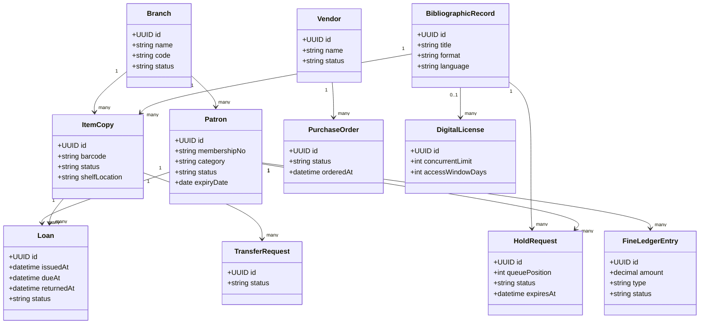

# Class Diagram - Library Management System

```mermaid
classDiagram
    class Branch {
      +UUID id
      +string name
      +string code
      +string status
    }
    class Patron {
      +UUID id
      +string membershipNo
      +string category
      +string status
      +date expiryDate
    }
    class BibliographicRecord {
      +UUID id
      +string title
      +string format
      +string language
    }
    class ItemCopy {
      +UUID id
      +string barcode
      +string status
      +string shelfLocation
    }
    class Loan {
      +UUID id
      +datetime issuedAt
      +datetime dueAt
      +datetime returnedAt
      +string status
    }
    class HoldRequest {
      +UUID id
      +int queuePosition
      +string status
      +datetime expiresAt
    }
    class FineLedgerEntry {
      +UUID id
      +decimal amount
      +string type
      +string status
    }
    class Vendor {
      +UUID id
      +string name
      +string status
    }
    class PurchaseOrder {
      +UUID id
      +string status
      +datetime orderedAt
    }
    class TransferRequest {
      +UUID id
      +string status
    }
    class DigitalLicense {
      +UUID id
      +int concurrentLimit
      +int accessWindowDays
    }

    Branch "1" --> "many" ItemCopy
    Branch "1" --> "many" Patron
    BibliographicRecord "1" --> "many" ItemCopy
    BibliographicRecord "1" --> "many" HoldRequest
    BibliographicRecord "0..1" --> "many" DigitalLicense
    Patron "1" --> "many" Loan
    Patron "1" --> "many" HoldRequest
    Patron "1" --> "many" FineLedgerEntry
    ItemCopy "1" --> "many" Loan
    ItemCopy "1" --> "many" TransferRequest
    Vendor "1" --> "many" PurchaseOrder
```
