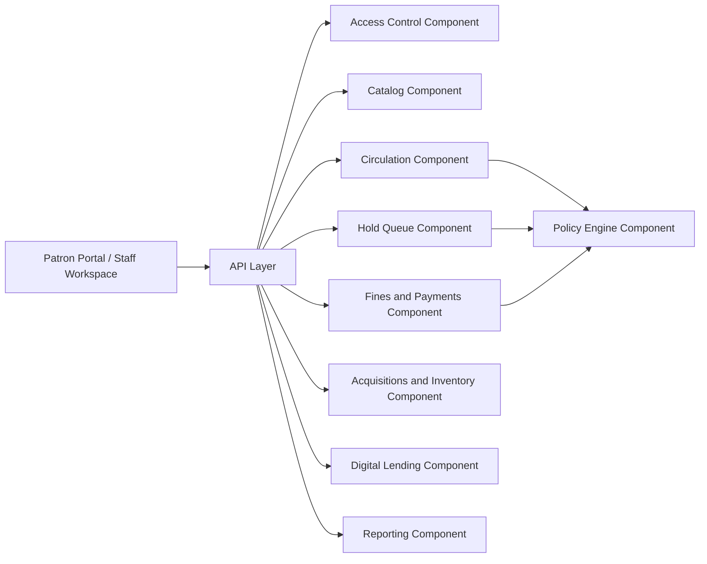

# Component Diagram - Library Management System

## Component Responsibilities

| Component | Responsibility |
|-----------|----------------|
| Access Control | Authentication, branch scoping, role evaluation |
| Catalog | Title metadata, search feeds, duplicate handling |
| Circulation | Loans, returns, renewals, copy states |
| Hold Queue | Reservations, pickup windows, queue transitions |
| Fines and Payments | Charges, waivers, payments, restrictions |
| Acquisitions and Inventory | Vendors, purchase orders, receiving, transfers, audits |
| Digital Lending | Provider integrations, digital loans, entitlement limits |
| Reporting | Dashboards, exports, operational metrics |
