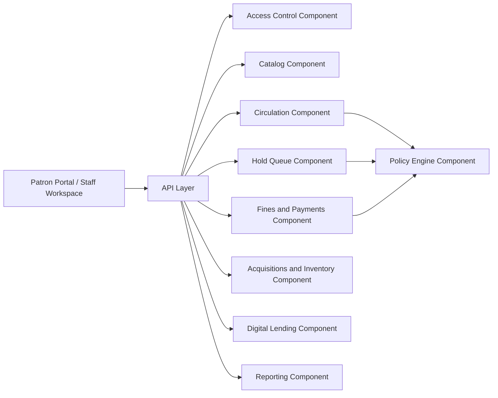

# Component Diagram - Library Management System

## Component Responsibilities

| Component | Responsibility |
|-----------|----------------|
| Access Control | Authentication, branch scoping, role evaluation |
| Catalog | Title metadata, search feeds, duplicate handling |
| Circulation | Loans, returns, renewals, copy states |
| Hold Queue | Reservations, pickup windows, queue transitions |
| Fines and Payments | Charges, waivers, payments, restrictions |
| Acquisitions and Inventory | Vendors, purchase orders, receiving, transfers, audits |
| Digital Lending | Provider integrations, digital loans, entitlement limits |
| Reporting | Dashboards, exports, operational metrics |

## Borrowing & Reservation Lifecycle, Consistency, Penalties, and Exception Patterns

### Artifact focus: Runtime component interaction plan

This section is intentionally tailored for this specific document so implementation teams can convert architecture and analysis into build-ready tasks.

### Implementation directives for this artifact
- Clarify write-path components versus read-model projections and their consistency expectations.
- Define deployment-time scaling unit for allocator and fine-processor workers.
- Annotate component dependencies with failure mode and fallback strategy.

### Lifecycle controls that must be reflected here
- Borrowing must always enforce policy pre-checks, deterministic copy selection, and atomic loan/copy updates.
- Reservation behavior must define queue ordering, allocation eligibility re-checks, and pickup expiry/no-show outcomes.
- Fine and penalty flows must define accrual formula, cap behavior, and lost/damage adjudication paths.
- Exception handling must define idempotency, conflict semantics, outbox reliability, and operator recovery procedures.

### Traceability requirements
- Every major rule in this document should map to at least one API contract, domain event, or database constraint.
- Include policy decision codes and audit expectations wherever staff override or monetary adjustment is possible.

### Definition of done for this artifact
- Content is specific to this artifact type and not a generic duplicate.
- Rules are testable (unit/integration/contract) and reference concrete data/events/errors.
- Diagram semantics (if present) are consistent with textual constraints and lifecycle behavior.
