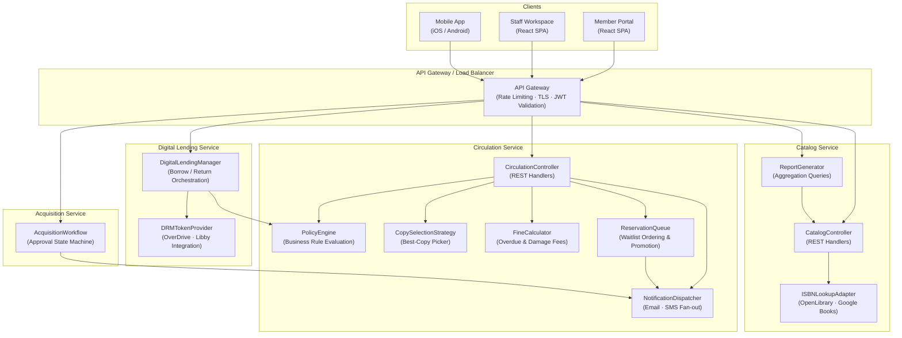
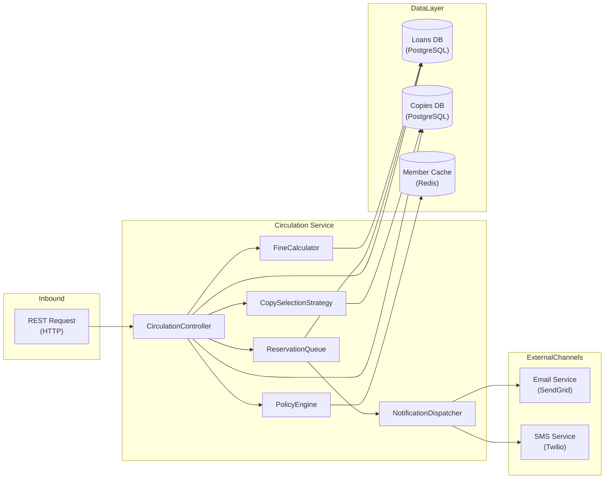

# Component Diagram — Library Management System

This document describes the internal component structure of the Library Management System backend,
showing responsibilities, inter-component dependencies, and exposed interfaces.

---

## System-Level Component Diagram



---

## Circulation Service — Internal Component Detail



---

## Component Descriptions

| Component                | Responsibility                                                                                                                  | Dependencies                                          | Exposes                                                                |
|--------------------------|---------------------------------------------------------------------------------------------------------------------------------|-------------------------------------------------------|------------------------------------------------------------------------|
| **CatalogController**    | Handles all catalog REST requests: search, CRUD, ISBN import, bulk CSV import. Delegates enrichment to `ISBNLookupAdapter`.     | `ISBNLookupAdapter`, Catalog DB                       | `GET/POST/PUT/DELETE /catalog/items`, `/copies`                        |
| **CirculationController**| Entry point for checkout, return, and renewal requests. Orchestrates policy checks, copy selection, and fine assessment.        | `PolicyEngine`, `CopySelectionStrategy`, `FineCalculator`, `ReservationQueue`, `NotificationDispatcher`, Loan DB, Copy DB | `POST /loans`, `PUT /loans/{id}/return`, `PUT /loans/{id}/renew` |
| **DigitalLendingManager**| Orchestrates the digital borrow/return lifecycle: checks member eligibility, decrements license counters, and requests DRM tokens. | `PolicyEngine`, `DRMTokenProvider`, Digital Loan DB   | `POST /digital-lending/borrow`, `PUT /digital-lending/{id}/return`     |
| **ReservationQueue**     | Maintains per-item waitlists ordered by creation timestamp. Promotes the next eligible member when a copy is returned or received. | Reservation DB, `NotificationDispatcher`              | Internal service API consumed by `CirculationController`               |
| **FineCalculator**       | Computes overdue fines based on material type, membership tier, and days elapsed. Applies daily rate schedules and maximum fine caps. | Fine rate configuration, Loan DB                      | `calculateFine(loanId, returnDate)` → Fine record                      |
| **AcquisitionWorkflow**  | Implements the acquisition state machine (`requested → approved → ordered → received → cancelled`). Validates budget and sends approval notifications. | Acquisition DB, `NotificationDispatcher`, Budget config | `POST/PUT /acquisitions`, approval and receive transitions             |
| **NotificationDispatcher**| Fan-out service that routes notification events to the appropriate channel (email or SMS) based on member preferences. Retries on transient failures with exponential back-off. | Email Service (SendGrid), SMS Service (Twilio), Member DB | `dispatch(event: NotificationEvent)` — internal only                  |
| **ISBNLookupAdapter**    | Calls OpenLibrary and Google Books REST APIs to fetch title metadata by ISBN. Normalises responses to the internal `CatalogItem` schema. | OpenLibrary API, Google Books API                     | `lookupByISBN(isbn)` → `CatalogItemDraft`                              |
| **DRMTokenProvider**     | Interfaces with OverDrive/Libby to issue, validate, and revoke DRM tokens for digital checkouts. Abstracts provider-specific token formats behind a single interface. | OverDrive API / Libby API                             | `issueToken(resourceId, memberId)`, `revokeToken(drmToken)`            |
| **ReportGenerator**      | Aggregates circulation, fine, and acquisition data into report payloads. Executes read-optimised SQL queries against the reporting replica. | Reporting replica (PostgreSQL read replica)           | `GET /reports/*`                                                        |
| **PolicyEngine**         | Evaluates the full set of business rules (BR-01 through BR-12) for loan eligibility: tier limits, fine blocks, membership expiry, item availability, and renewal conditions. | Member cache (Redis), Fine DB, Loan DB                | `checkEligibility(memberId, copyId)` → `EligibilityResult`             |
| **CopySelectionStrategy**| Given a catalog item and preferred branch, selects the single best available copy using priority ordering: same-branch first, then shortest transit, then any branch. Applies an optimistic lock to prevent double-assignment. | Copy DB                                               | `selectCopy(catalogItemId, branchId)` → `BookCopy`                     |

---

## Key Data Flows

### Checkout Flow

```
Client → Gateway → CirculationController
  → PolicyEngine          (validate member eligibility)
  → CopySelectionStrategy (select and lock available copy)
  → Loan DB               (create loan record)
  → Copy DB               (set copy status = checked_out)
  → ReservationQueue      (skip — no reservation for this copy)
  → NotificationDispatcher (send checkout confirmation via email)
```

### Return Flow

```
Client → Gateway → CirculationController
  → Copy DB               (set copy status = available)
  → FineCalculator        (assess overdue fine if applicable)
  → Loan DB               (close loan record)
  → ReservationQueue      (check if copy satisfies a pending reservation)
    → NotificationDispatcher (notify next member in queue if reservation promoted)
```

### Overdue Detection (Scheduled — runs every 6 hours)

```
Scheduler → FineCalculator
  → Loan DB               (query active loans where due_at < now())
  → Fine DB               (insert or update overdue fine)
  → Loan DB               (update loan status = overdue)
  → NotificationDispatcher (send overdue notice if not already sent)
```
