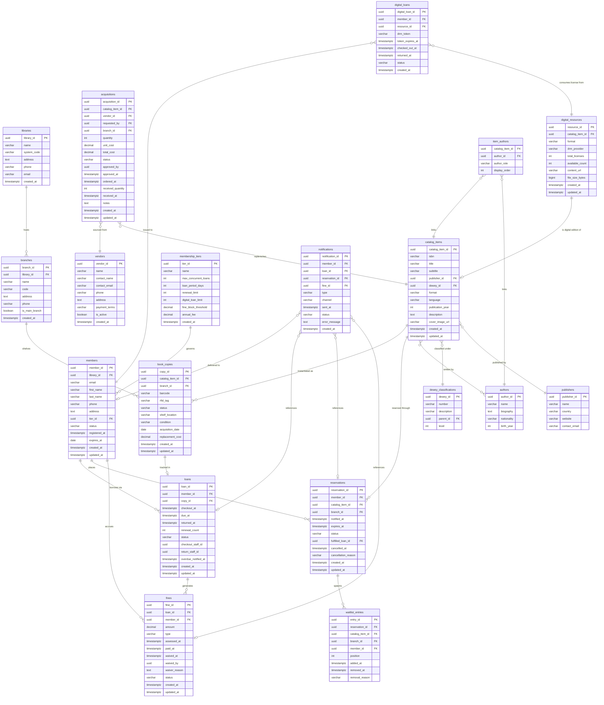
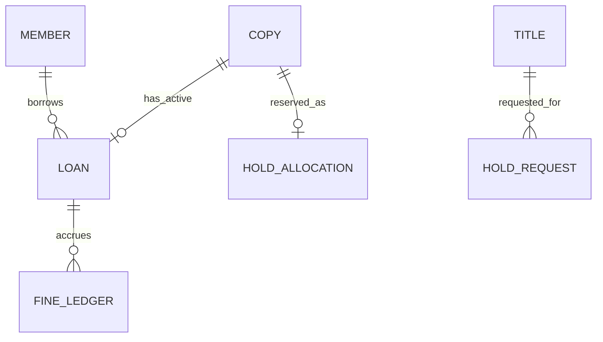

# ERD and Database Schema — Library Management System

## Entity-Relationship Diagram



---

## SQL Table Definitions

### Core Infrastructure

```sql
CREATE TABLE libraries (
    library_id      UUID                     PRIMARY KEY DEFAULT gen_random_uuid(),
    name            VARCHAR(200)             NOT NULL,
    system_code     VARCHAR(20)              NOT NULL UNIQUE,
    address         TEXT                     NOT NULL,
    phone           VARCHAR(30),
    email           VARCHAR(255),
    created_at      TIMESTAMP WITH TIME ZONE NOT NULL DEFAULT now()
);

CREATE TABLE branches (
    branch_id       UUID                     PRIMARY KEY DEFAULT gen_random_uuid(),
    library_id      UUID                     NOT NULL REFERENCES libraries(library_id) ON DELETE RESTRICT,
    name            VARCHAR(200)             NOT NULL,
    code            VARCHAR(20)              NOT NULL,
    address         TEXT                     NOT NULL,
    phone           VARCHAR(30),
    is_main_branch  BOOLEAN                  NOT NULL DEFAULT false,
    created_at      TIMESTAMP WITH TIME ZONE NOT NULL DEFAULT now(),
    UNIQUE (library_id, code)
);
```

### Membership

```sql
CREATE TABLE membership_tiers (
    tier_id                 UUID                     PRIMARY KEY DEFAULT gen_random_uuid(),
    name                    VARCHAR(100)             NOT NULL UNIQUE,
    max_concurrent_loans    INTEGER                  NOT NULL CHECK (max_concurrent_loans > 0),
    loan_period_days        INTEGER                  NOT NULL CHECK (loan_period_days > 0),
    renewal_limit           INTEGER                  NOT NULL DEFAULT 2 CHECK (renewal_limit >= 0),
    digital_loan_limit      INTEGER                  NOT NULL DEFAULT 3 CHECK (digital_loan_limit >= 0),
    fine_block_threshold    DECIMAL(10, 2)           NOT NULL DEFAULT 25.00 CHECK (fine_block_threshold >= 0),
    annual_fee              DECIMAL(10, 2)           NOT NULL DEFAULT 0.00 CHECK (annual_fee >= 0),
    created_at              TIMESTAMP WITH TIME ZONE NOT NULL DEFAULT now()
);

CREATE TABLE members (
    member_id       UUID                     PRIMARY KEY DEFAULT gen_random_uuid(),
    library_id      UUID                     NOT NULL REFERENCES libraries(library_id) ON DELETE RESTRICT,
    email           VARCHAR(255)             NOT NULL,
    first_name      VARCHAR(100)             NOT NULL,
    last_name       VARCHAR(100)             NOT NULL,
    phone           VARCHAR(30),
    address         TEXT,
    tier_id         UUID                     NOT NULL REFERENCES membership_tiers(tier_id) ON DELETE RESTRICT,
    status          VARCHAR(20)              NOT NULL DEFAULT 'active'
                        CHECK (status IN ('active', 'suspended', 'expired', 'closed')),
    registered_at   TIMESTAMP WITH TIME ZONE NOT NULL DEFAULT now(),
    expires_at      DATE                     NOT NULL,
    created_at      TIMESTAMP WITH TIME ZONE NOT NULL DEFAULT now(),
    updated_at      TIMESTAMP WITH TIME ZONE NOT NULL DEFAULT now(),
    UNIQUE (library_id, email)
);
```

### Catalog

```sql
CREATE TABLE dewey_classifications (
    dewey_id    UUID         PRIMARY KEY DEFAULT gen_random_uuid(),
    number      VARCHAR(20)  NOT NULL UNIQUE,
    description VARCHAR(300) NOT NULL,
    parent_id   UUID         REFERENCES dewey_classifications(dewey_id) ON DELETE RESTRICT,
    level       INTEGER      NOT NULL CHECK (level BETWEEN 1 AND 5)
);

CREATE TABLE publishers (
    publisher_id    UUID         PRIMARY KEY DEFAULT gen_random_uuid(),
    name            VARCHAR(300) NOT NULL,
    country         VARCHAR(100),
    website         VARCHAR(500),
    contact_email   VARCHAR(255)
);

CREATE TABLE authors (
    author_id   UUID         PRIMARY KEY DEFAULT gen_random_uuid(),
    name        VARCHAR(300) NOT NULL,
    biography   TEXT,
    nationality VARCHAR(100),
    birth_year  INTEGER      CHECK (birth_year BETWEEN 1000 AND EXTRACT(YEAR FROM now())::INTEGER)
);

CREATE TABLE catalog_items (
    catalog_item_id UUID                     PRIMARY KEY DEFAULT gen_random_uuid(),
    isbn            VARCHAR(20)              UNIQUE,
    title           VARCHAR(500)             NOT NULL,
    subtitle        VARCHAR(500),
    publisher_id    UUID                     REFERENCES publishers(publisher_id) ON DELETE SET NULL,
    dewey_id        UUID                     REFERENCES dewey_classifications(dewey_id) ON DELETE SET NULL,
    format          VARCHAR(50)              NOT NULL DEFAULT 'book'
                        CHECK (format IN ('book', 'ebook', 'audiobook', 'dvd', 'periodical', 'map', 'manuscript')),
    language        VARCHAR(10)              NOT NULL DEFAULT 'en',
    publication_year INTEGER                 CHECK (publication_year BETWEEN 1000 AND 2100),
    description     TEXT,
    cover_image_url VARCHAR(1000),
    created_at      TIMESTAMP WITH TIME ZONE NOT NULL DEFAULT now(),
    updated_at      TIMESTAMP WITH TIME ZONE NOT NULL DEFAULT now()
);

CREATE TABLE item_authors (
    catalog_item_id UUID         NOT NULL REFERENCES catalog_items(catalog_item_id) ON DELETE CASCADE,
    author_id       UUID         NOT NULL REFERENCES authors(author_id) ON DELETE RESTRICT,
    author_role     VARCHAR(50)  NOT NULL DEFAULT 'author'
                        CHECK (author_role IN ('author', 'editor', 'illustrator', 'translator', 'contributor')),
    display_order   INTEGER      NOT NULL DEFAULT 1 CHECK (display_order > 0),
    PRIMARY KEY (catalog_item_id, author_id)
);
```

### Physical Inventory

```sql
CREATE TABLE book_copies (
    copy_id          UUID                     PRIMARY KEY DEFAULT gen_random_uuid(),
    catalog_item_id  UUID                     NOT NULL REFERENCES catalog_items(catalog_item_id) ON DELETE RESTRICT,
    branch_id        UUID                     NOT NULL REFERENCES branches(branch_id) ON DELETE RESTRICT,
    barcode          VARCHAR(100)             NOT NULL UNIQUE,
    rfid_tag         VARCHAR(100)             UNIQUE,
    status           VARCHAR(30)              NOT NULL DEFAULT 'available'
                         CHECK (status IN ('available', 'checked_out', 'reserved', 'on_hold', 'in_transit',
                                           'lost', 'damaged', 'withdrawn', 'in_repair')),
    shelf_location   VARCHAR(100),
    condition        VARCHAR(20)              NOT NULL DEFAULT 'good'
                         CHECK (condition IN ('new', 'good', 'fair', 'poor', 'damaged')),
    acquisition_date DATE,
    replacement_cost DECIMAL(10, 2)           CHECK (replacement_cost >= 0),
    created_at       TIMESTAMP WITH TIME ZONE NOT NULL DEFAULT now(),
    updated_at       TIMESTAMP WITH TIME ZONE NOT NULL DEFAULT now()
);
```

### Digital Lending

```sql
CREATE TABLE digital_resources (
    resource_id      UUID                     PRIMARY KEY DEFAULT gen_random_uuid(),
    catalog_item_id  UUID                     NOT NULL REFERENCES catalog_items(catalog_item_id) ON DELETE RESTRICT,
    format           VARCHAR(50)              NOT NULL
                         CHECK (format IN ('epub', 'pdf', 'mp3', 'mp4', 'streaming')),
    drm_provider     VARCHAR(100)             NOT NULL,
    total_licenses   INTEGER                  NOT NULL CHECK (total_licenses > 0),
    available_count  INTEGER                  NOT NULL CHECK (available_count >= 0),
    content_url      VARCHAR(1000)            NOT NULL,
    file_size_bytes  BIGINT                   CHECK (file_size_bytes > 0),
    created_at       TIMESTAMP WITH TIME ZONE NOT NULL DEFAULT now(),
    updated_at       TIMESTAMP WITH TIME ZONE NOT NULL DEFAULT now(),
    CONSTRAINT chk_licenses CHECK (available_count <= total_licenses)
);

CREATE TABLE digital_loans (
    digital_loan_id UUID                     PRIMARY KEY DEFAULT gen_random_uuid(),
    member_id       UUID                     NOT NULL REFERENCES members(member_id) ON DELETE RESTRICT,
    resource_id     UUID                     NOT NULL REFERENCES digital_resources(resource_id) ON DELETE RESTRICT,
    drm_token       VARCHAR(1000)            NOT NULL,
    token_expires_at TIMESTAMP WITH TIME ZONE NOT NULL,
    checked_out_at  TIMESTAMP WITH TIME ZONE NOT NULL DEFAULT now(),
    returned_at     TIMESTAMP WITH TIME ZONE,
    status          VARCHAR(20)              NOT NULL DEFAULT 'active'
                        CHECK (status IN ('active', 'returned', 'expired', 'revoked')),
    created_at      TIMESTAMP WITH TIME ZONE NOT NULL DEFAULT now()
);
```

### Circulation

```sql
CREATE TABLE loans (
    loan_id              UUID                     PRIMARY KEY DEFAULT gen_random_uuid(),
    member_id            UUID                     NOT NULL REFERENCES members(member_id) ON DELETE RESTRICT,
    copy_id              UUID                     NOT NULL REFERENCES book_copies(copy_id) ON DELETE RESTRICT,
    checkout_at          TIMESTAMP WITH TIME ZONE NOT NULL DEFAULT now(),
    due_at               TIMESTAMP WITH TIME ZONE NOT NULL,
    returned_at          TIMESTAMP WITH TIME ZONE,
    renewal_count        INTEGER                  NOT NULL DEFAULT 0 CHECK (renewal_count >= 0),
    status               VARCHAR(20)              NOT NULL DEFAULT 'active'
                             CHECK (status IN ('active', 'returned', 'overdue', 'lost', 'claimed_returned')),
    checkout_staff_id    UUID,
    return_staff_id      UUID,
    overdue_notified_at  TIMESTAMP WITH TIME ZONE,
    created_at           TIMESTAMP WITH TIME ZONE NOT NULL DEFAULT now(),
    updated_at           TIMESTAMP WITH TIME ZONE NOT NULL DEFAULT now(),
    CONSTRAINT chk_due_after_checkout CHECK (due_at > checkout_at),
    CONSTRAINT chk_returned_after_checkout CHECK (returned_at IS NULL OR returned_at >= checkout_at)
);

CREATE TABLE reservations (
    reservation_id      UUID                     PRIMARY KEY DEFAULT gen_random_uuid(),
    member_id           UUID                     NOT NULL REFERENCES members(member_id) ON DELETE RESTRICT,
    catalog_item_id     UUID                     NOT NULL REFERENCES catalog_items(catalog_item_id) ON DELETE RESTRICT,
    branch_id           UUID                     REFERENCES branches(branch_id) ON DELETE SET NULL,
    notified_at         TIMESTAMP WITH TIME ZONE,
    expires_at          TIMESTAMP WITH TIME ZONE,
    status              VARCHAR(30)              NOT NULL DEFAULT 'pending'
                            CHECK (status IN ('pending', 'ready', 'fulfilled', 'expired', 'cancelled')),
    fulfilled_loan_id   UUID                     REFERENCES loans(loan_id) ON DELETE SET NULL,
    cancelled_at        TIMESTAMP WITH TIME ZONE,
    cancellation_reason VARCHAR(500),
    created_at          TIMESTAMP WITH TIME ZONE NOT NULL DEFAULT now(),
    updated_at          TIMESTAMP WITH TIME ZONE NOT NULL DEFAULT now()
);

CREATE TABLE waitlist_entries (
    entry_id        UUID                     PRIMARY KEY DEFAULT gen_random_uuid(),
    reservation_id  UUID                     NOT NULL REFERENCES reservations(reservation_id) ON DELETE CASCADE,
    catalog_item_id UUID                     NOT NULL REFERENCES catalog_items(catalog_item_id) ON DELETE RESTRICT,
    branch_id       UUID                     REFERENCES branches(branch_id) ON DELETE SET NULL,
    member_id       UUID                     NOT NULL REFERENCES members(member_id) ON DELETE RESTRICT,
    position        INTEGER                  NOT NULL CHECK (position > 0),
    added_at        TIMESTAMP WITH TIME ZONE NOT NULL DEFAULT now(),
    removed_at      TIMESTAMP WITH TIME ZONE,
    removal_reason  VARCHAR(100)
                        CHECK (removal_reason IN ('fulfilled', 'cancelled', 'expired', 'skipped'))
);
```

### Finance

```sql
CREATE TABLE fines (
    fine_id         UUID                     PRIMARY KEY DEFAULT gen_random_uuid(),
    loan_id         UUID                     REFERENCES loans(loan_id) ON DELETE SET NULL,
    member_id       UUID                     NOT NULL REFERENCES members(member_id) ON DELETE RESTRICT,
    amount          DECIMAL(10, 2)           NOT NULL CHECK (amount > 0),
    type            VARCHAR(30)              NOT NULL
                        CHECK (type IN ('overdue', 'lost_item', 'damaged_item', 'processing_fee')),
    assessed_at     TIMESTAMP WITH TIME ZONE NOT NULL DEFAULT now(),
    paid_at         TIMESTAMP WITH TIME ZONE,
    waived_at       TIMESTAMP WITH TIME ZONE,
    waived_by       UUID,
    waiver_reason   TEXT,
    status          VARCHAR(20)              NOT NULL DEFAULT 'outstanding'
                        CHECK (status IN ('outstanding', 'paid', 'waived', 'partially_paid')),
    created_at      TIMESTAMP WITH TIME ZONE NOT NULL DEFAULT now(),
    updated_at      TIMESTAMP WITH TIME ZONE NOT NULL DEFAULT now()
);
```

### Acquisitions

```sql
CREATE TABLE vendors (
    vendor_id       UUID                     PRIMARY KEY DEFAULT gen_random_uuid(),
    name            VARCHAR(300)             NOT NULL,
    contact_name    VARCHAR(200),
    contact_email   VARCHAR(255),
    phone           VARCHAR(30),
    address         TEXT,
    payment_terms   VARCHAR(100),
    is_active       BOOLEAN                  NOT NULL DEFAULT true,
    created_at      TIMESTAMP WITH TIME ZONE NOT NULL DEFAULT now()
);

CREATE TABLE acquisitions (
    acquisition_id      UUID                     PRIMARY KEY DEFAULT gen_random_uuid(),
    catalog_item_id     UUID                     NOT NULL REFERENCES catalog_items(catalog_item_id) ON DELETE RESTRICT,
    vendor_id           UUID                     NOT NULL REFERENCES vendors(vendor_id) ON DELETE RESTRICT,
    requested_by        UUID                     NOT NULL REFERENCES members(member_id) ON DELETE RESTRICT,
    branch_id           UUID                     NOT NULL REFERENCES branches(branch_id) ON DELETE RESTRICT,
    quantity            INTEGER                  NOT NULL CHECK (quantity > 0),
    unit_cost           DECIMAL(10, 2)           NOT NULL CHECK (unit_cost >= 0),
    total_cost          DECIMAL(10, 2)           NOT NULL CHECK (total_cost >= 0),
    status              VARCHAR(30)              NOT NULL DEFAULT 'requested'
                            CHECK (status IN ('requested', 'approved', 'ordered', 'partially_received',
                                              'received', 'cancelled', 'rejected')),
    approved_by         UUID,
    approved_at         TIMESTAMP WITH TIME ZONE,
    ordered_at          TIMESTAMP WITH TIME ZONE,
    received_quantity   INTEGER                  NOT NULL DEFAULT 0 CHECK (received_quantity >= 0),
    received_at         TIMESTAMP WITH TIME ZONE,
    notes               TEXT,
    created_at          TIMESTAMP WITH TIME ZONE NOT NULL DEFAULT now(),
    updated_at          TIMESTAMP WITH TIME ZONE NOT NULL DEFAULT now(),
    CONSTRAINT chk_received_lte_ordered CHECK (received_quantity <= quantity)
);
```

### Notifications

```sql
CREATE TABLE notifications (
    notification_id UUID                     PRIMARY KEY DEFAULT gen_random_uuid(),
    member_id       UUID                     NOT NULL REFERENCES members(member_id) ON DELETE CASCADE,
    loan_id         UUID                     REFERENCES loans(loan_id) ON DELETE SET NULL,
    reservation_id  UUID                     REFERENCES reservations(reservation_id) ON DELETE SET NULL,
    fine_id         UUID                     REFERENCES fines(fine_id) ON DELETE SET NULL,
    type            VARCHAR(50)              NOT NULL
                        CHECK (type IN ('due_reminder', 'overdue_notice', 'reservation_ready',
                                        'reservation_expiring', 'fine_assessed', 'fine_block',
                                        'membership_expiring', 'account_suspended')),
    channel         VARCHAR(20)              NOT NULL
                        CHECK (channel IN ('email', 'sms', 'push', 'in_app')),
    sent_at         TIMESTAMP WITH TIME ZONE,
    status          VARCHAR(20)              NOT NULL DEFAULT 'pending'
                        CHECK (status IN ('pending', 'sent', 'delivered', 'failed', 'bounced')),
    error_message   TEXT,
    created_at      TIMESTAMP WITH TIME ZONE NOT NULL DEFAULT now()
);
```

---

## Indexes

```sql
-- members
CREATE INDEX idx_members_email        ON members (email);
CREATE INDEX idx_members_status       ON members (status);
CREATE INDEX idx_members_tier_id      ON members (tier_id);
CREATE INDEX idx_members_library_id   ON members (library_id);
CREATE INDEX idx_members_expires_at   ON members (expires_at) WHERE status = 'active';

-- book_copies
CREATE INDEX idx_copies_barcode         ON book_copies (barcode);
CREATE INDEX idx_copies_rfid_tag        ON book_copies (rfid_tag) WHERE rfid_tag IS NOT NULL;
CREATE INDEX idx_copies_catalog_item_id ON book_copies (catalog_item_id);
CREATE INDEX idx_copies_branch_id       ON book_copies (branch_id);
CREATE INDEX idx_copies_status          ON book_copies (status);
CREATE INDEX idx_copies_available       ON book_copies (catalog_item_id, branch_id) WHERE status = 'available';

-- loans
CREATE INDEX idx_loans_member_id ON loans (member_id);
CREATE INDEX idx_loans_copy_id   ON loans (copy_id);
CREATE INDEX idx_loans_status    ON loans (status);
CREATE INDEX idx_loans_due_at    ON loans (due_at) WHERE status IN ('active', 'overdue');
CREATE INDEX idx_loans_active    ON loans (member_id, status) WHERE status = 'active';

-- reservations
CREATE INDEX idx_reservations_member_id       ON reservations (member_id);
CREATE INDEX idx_reservations_catalog_item_id ON reservations (catalog_item_id);
CREATE INDEX idx_reservations_status          ON reservations (status);
CREATE INDEX idx_reservations_pending         ON reservations (catalog_item_id, created_at)
    WHERE status IN ('pending', 'ready');

-- fines
CREATE INDEX idx_fines_member_id    ON fines (member_id);
CREATE INDEX idx_fines_status       ON fines (status);
CREATE INDEX idx_fines_outstanding  ON fines (member_id, amount) WHERE status = 'outstanding';

-- catalog_items
CREATE INDEX idx_catalog_isbn         ON catalog_items (isbn) WHERE isbn IS NOT NULL;
CREATE INDEX idx_catalog_format       ON catalog_items (format);
CREATE INDEX idx_catalog_publisher_id ON catalog_items (publisher_id);
CREATE INDEX idx_catalog_dewey_id     ON catalog_items (dewey_id);
CREATE INDEX idx_catalog_title_fts    ON catalog_items USING gin(to_tsvector('english', title));

-- digital_resources
CREATE INDEX idx_digital_resources_catalog ON digital_resources (catalog_item_id);
CREATE INDEX idx_digital_resources_avail   ON digital_resources (catalog_item_id) WHERE available_count > 0;

-- digital_loans
CREATE INDEX idx_digital_loans_member   ON digital_loans (member_id);
CREATE INDEX idx_digital_loans_resource ON digital_loans (resource_id);
CREATE INDEX idx_digital_loans_active   ON digital_loans (member_id) WHERE status = 'active';

-- waitlist_entries
CREATE INDEX idx_waitlist_catalog_position ON waitlist_entries (catalog_item_id, position)
    WHERE removed_at IS NULL;

-- notifications
CREATE INDEX idx_notifications_member  ON notifications (member_id);
CREATE INDEX idx_notifications_status  ON notifications (status) WHERE status = 'pending';

-- acquisitions
CREATE INDEX idx_acquisitions_status     ON acquisitions (status);
CREATE INDEX idx_acquisitions_vendor     ON acquisitions (vendor_id);
CREATE INDEX idx_acquisitions_catalog    ON acquisitions (catalog_item_id);
CREATE INDEX idx_acquisitions_branch     ON acquisitions (branch_id);
```
| transfer_requests | Inter-branch movement chain of custody |
| inventory_audits | Shelf counts and discrepancy sessions |
| digital_licenses | Optional digital lending rights and caps |
| audit_logs | Immutable operational history |

## Borrowing & Reservation Lifecycle, Consistency, Penalties, and Exception Patterns

### Artifact focus: Relational schema implementation guidance

This section is intentionally tailored for this specific document so implementation teams can convert architecture and analysis into build-ready tasks.

### Implementation directives for this artifact
- Include keys, foreign keys, partial indexes, and check constraints needed for lifecycle invariants.
- Provide migration sequencing notes to avoid locking hot tables during rollout.
- Specify archival strategy for closed loans and historical fee ledger entries.

### Lifecycle controls that must be reflected here
- Borrowing must always enforce policy pre-checks, deterministic copy selection, and atomic loan/copy updates.
- Reservation behavior must define queue ordering, allocation eligibility re-checks, and pickup expiry/no-show outcomes.
- Fine and penalty flows must define accrual formula, cap behavior, and lost/damage adjudication paths.
- Exception handling must define idempotency, conflict semantics, outbox reliability, and operator recovery procedures.

### Traceability requirements
- Every major rule in this document should map to at least one API contract, domain event, or database constraint.
- Include policy decision codes and audit expectations wherever staff override or monetary adjustment is possible.

### Mermaid implementation reference


### Definition of done for this artifact
- Content is specific to this artifact type and not a generic duplicate.
- Rules are testable (unit/integration/contract) and reference concrete data/events/errors.
- Diagram semantics (if present) are consistent with textual constraints and lifecycle behavior.
