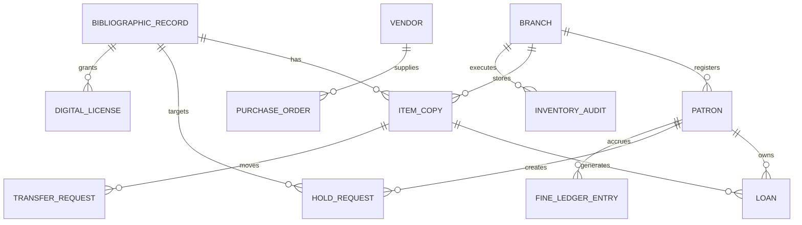
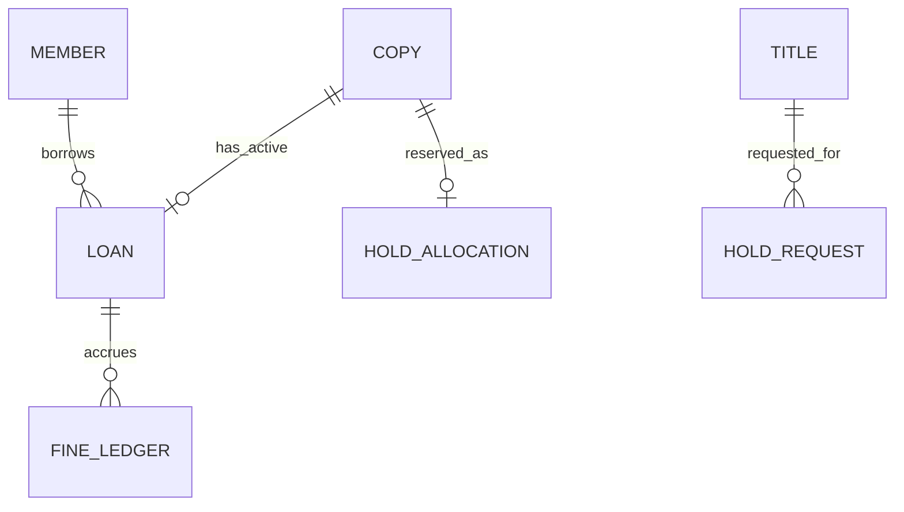

# ERD and Database Schema - Library Management System

## Table Notes

| Table | Notes |
|-------|-------|
| branches | Operational branches and calendars |
| patrons | Patron identity, category, status, home branch |
| bibliographic_records | Title-level catalog metadata |
| item_copies | Branch-level physical inventory |
| loans | Circulation history and active borrowing state |
| hold_requests | Waitlist and pickup workflow |
| fine_ledger_entries | Financial events, waivers, and adjustments |
| purchase_orders | Acquisition process tracking |
| transfer_requests | Inter-branch movement chain of custody |
| inventory_audits | Shelf counts and discrepancy sessions |
| digital_licenses | Optional digital lending rights and caps |
| audit_logs | Immutable operational history |

## Borrowing & Reservation Lifecycle, Consistency, Penalties, and Exception Patterns

### Artifact focus: Relational schema implementation guidance

This section is intentionally tailored for this specific document so implementation teams can convert architecture and analysis into build-ready tasks.

### Implementation directives for this artifact
- Include keys, foreign keys, partial indexes, and check constraints needed for lifecycle invariants.
- Provide migration sequencing notes to avoid locking hot tables during rollout.
- Specify archival strategy for closed loans and historical fee ledger entries.

### Lifecycle controls that must be reflected here
- Borrowing must always enforce policy pre-checks, deterministic copy selection, and atomic loan/copy updates.
- Reservation behavior must define queue ordering, allocation eligibility re-checks, and pickup expiry/no-show outcomes.
- Fine and penalty flows must define accrual formula, cap behavior, and lost/damage adjudication paths.
- Exception handling must define idempotency, conflict semantics, outbox reliability, and operator recovery procedures.

### Traceability requirements
- Every major rule in this document should map to at least one API contract, domain event, or database constraint.
- Include policy decision codes and audit expectations wherever staff override or monetary adjustment is possible.

### Mermaid implementation reference

### Definition of done for this artifact
- Content is specific to this artifact type and not a generic duplicate.
- Rules are testable (unit/integration/contract) and reference concrete data/events/errors.
- Diagram semantics (if present) are consistent with textual constraints and lifecycle behavior.
