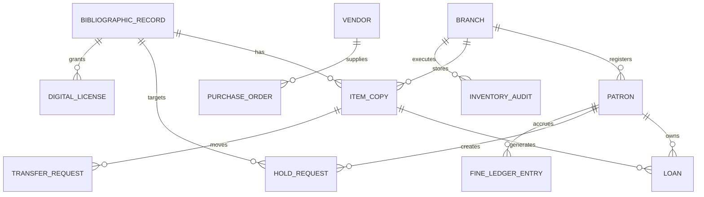

# ERD and Database Schema - Library Management System

## Table Notes

| Table | Notes |
|-------|-------|
| branches | Operational branches and calendars |
| patrons | Patron identity, category, status, home branch |
| bibliographic_records | Title-level catalog metadata |
| item_copies | Branch-level physical inventory |
| loans | Circulation history and active borrowing state |
| hold_requests | Waitlist and pickup workflow |
| fine_ledger_entries | Financial events, waivers, and adjustments |
| purchase_orders | Acquisition process tracking |
| transfer_requests | Inter-branch movement chain of custody |
| inventory_audits | Shelf counts and discrepancy sessions |
| digital_licenses | Optional digital lending rights and caps |
| audit_logs | Immutable operational history |
